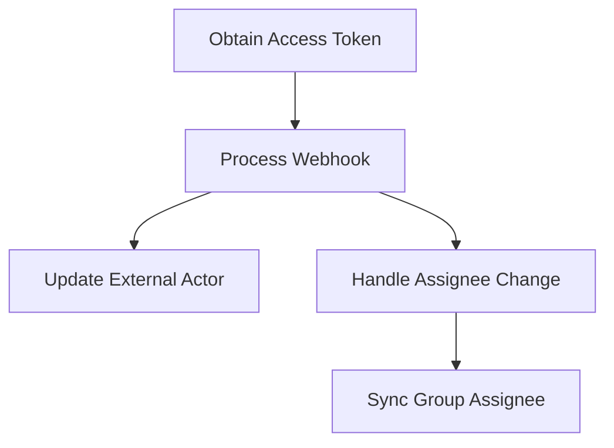

This document will cover the Access Token and Webhook Processing Flow, which includes:

1. Obtaining an Access Token
2. Processing Webhooks
3. Updating External Actors
4. Handling Assignee Changes
5. Synchronizing Group Assignees.

Technical document: <SwmLink doc-title="Access Token and Webhook Processing Flow">[Access Token and Webhook Processing Flow](/.swm/access-token-and-webhook-processing-flow.vmo6ffib.sw.md)</SwmLink>

# [Obtaining an Access Token](https://app.swimm.io/repos/Z2l0aHViJTNBJTNBc2VudHJ5LWRlbW8tMSUzQSUzQVN3aW1tLURlbW8=/docs/vmo6ffib#obtaining-access-token)

The process begins with obtaining an access token using OAuth credentials. This token is essential for authenticating subsequent API requests. The user provides their OAuth verifier and request token, which are then used to generate the access token. This token allows the system to securely communicate with external services on behalf of the user.

# [Processing Webhooks](https://app.swimm.io/repos/Z2l0aHViJTNBJTNBc2VudHJ5LWRlbW8tMSUzQSUzQVN3aW1tLURlbW8=/docs/vmo6ffib#processing-webhooks)

When a webhook is received, the system first validates the token to ensure it is legitimate. If the token is valid, the system processes the data contained in the webhook. This data can trigger various actions, such as updating external actors or handling changes in assignees. This ensures that the system remains synchronized with any changes occurring in external services.

# [Updating External Actors](https://app.swimm.io/repos/Z2l0aHViJTNBJTNBc2VudHJ5LWRlbW8tMSUzQSUzQVN3aW1tLURlbW8=/docs/vmo6ffib#updating-external-actor)

Once the webhook data is processed, the system may need to update external actors. This involves modifying the details of an external actor instance based on the validated data received. The system ensures that the instance is correctly updated and saved, maintaining accurate and up-to-date information about external actors.

# [Handling Assignee Changes](https://app.swimm.io/repos/Z2l0aHViJTNBJTNBc2VudHJ5LWRlbW8tMSUzQSUzQVN3aW1tLURlbW8=/docs/vmo6ffib#handling-assignee-change)

If the webhook data indicates a change in the assignee, the system checks if the assignee has indeed changed. If there is a change, the system triggers the synchronization of the assignee information. This step ensures that any changes in assignee details are accurately reflected in the system.

# [Synchronizing Group Assignees](https://app.swimm.io/repos/Z2l0aHViJTNBJTNBc2VudHJ5LWRlbW8tMSUzQSUzQVN3aW1tLURlbW8=/docs/vmo6ffib#synchronizing-group-assignee)

The final step involves synchronizing group assignees. Based on the assignee information from the webhook data, the system assigns or deassigns users to groups. This ensures that group assignments are always up-to-date, reflecting the latest changes in assignee information.

&nbsp;

*This is an auto-generated document by Swimm AI 🌊 and has not yet been verified by a human*

<SwmMeta version="3.0.0" repo-id="Z2l0aHViJTNBJTNBc2VudHJ5LWRlbW8tMSUzQSUzQVN3aW1tLURlbW8=" repo-name="sentry-demo-1" doc-type="product-flows">Powered by [Swimm](/)</SwmMeta>
