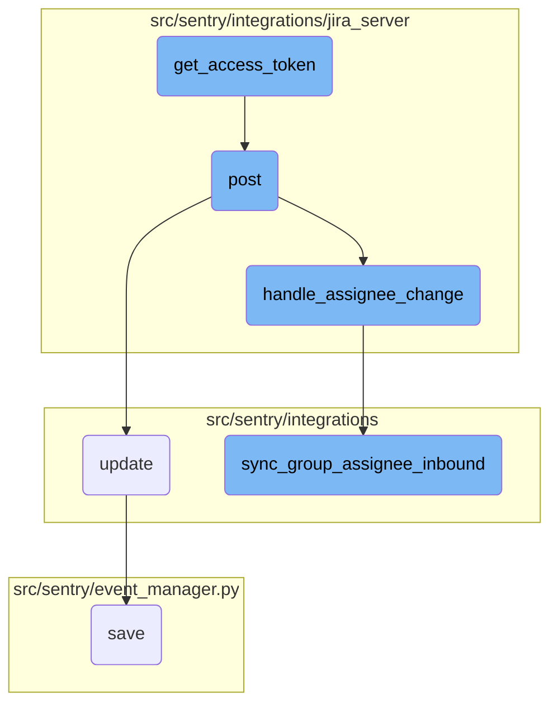

In this document, we will explain the process of obtaining an access token and how it integrates with other functionalities such as processing webhooks, updating external actors, handling assignee changes, and synchronizing group assignees.

The flow starts with obtaining an access token using <SwmToken path="src/sentry/integrations/jira_server/client.py" pos="264:8:8" line-data="            raise ApiError(&quot;Missing OAuth token verifier&quot;)">`OAuth`</SwmToken> credentials. Once the token is obtained, it is used to authenticate API requests. When a webhook is received, it validates the token and processes the data, triggering actions like updating external actors or handling assignee changes. These actions ensure that the system remains synchronized with external changes.

# Flow drill down



<SwmSnippet path="/src/sentry/integrations/jira_server/client.py" line="263">

---

## Obtaining Access Token

The <SwmToken path="src/sentry/integrations/jira_server/client.py" pos="258:3:3" line-data="    def get_access_token(self, request_token, verifier):">`get_access_token`</SwmToken> function uses the <SwmToken path="src/sentry/integrations/jira_server/client.py" pos="264:8:8" line-data="            raise ApiError(&quot;Missing OAuth token verifier&quot;)">`OAuth`</SwmToken> verifier and request token to obtain an access token. This token is essential for authenticating subsequent API requests.

```python
        if not verifier:
            raise ApiError("Missing OAuth token verifier")
        auth = OAuth1(
            client_key=self.consumer_key,
            resource_owner_key=request_token["oauth_token"],
            resource_owner_secret=request_token["oauth_token_secret"],
            verifier=verifier,
            rsa_key=self.private_key,
            signature_method=SIGNATURE_RSA,
            signature_type="auth_header",
            decoding=None,
        )
        url = self.access_token_url.format(self.base_url)
        resp = self.post(url, auth=auth, allow_text=True)
        return dict(parse_qsl(resp.text))
```

---

</SwmSnippet>

<SwmSnippet path="/src/sentry/integrations/jira_server/webhooks.py" line="64">

---

## Processing Webhooks

The <SwmToken path="src/sentry/integrations/jira_server/webhooks.py" pos="64:3:3" line-data="    def post(self, request: Request, token, *args, **kwargs) -&gt; Response:">`post`</SwmToken> function processes incoming webhooks, validates the token, and triggers actions like <SwmToken path="src/sentry/integrations/jira_server/utils/api.py" pos="25:2:2" line-data="def handle_assignee_change(">`handle_assignee_change`</SwmToken> if the webhook data contains a changelog.

```python
    def post(self, request: Request, token, *args, **kwargs) -> Response:
        clear_tags_and_context()
        extra: dict[str, object] = {}
        try:
            integration = get_integration_from_token(token)
            extra["integration_id"] = integration.id
        except ValueError as err:
            extra.update({"token": token, "error": str(err)})
            logger.warning("token-validation-error", extra=extra)
            metrics.incr("jira_server.webhook.invalid_token")
            return self.respond(status=400)

        data = request.data

        # Note: If we ever process more webhooks from jira server
        # we also need to update JiraServerRequestParser
        if not data.get("changelog"):
            logger.info("missing-changelog", extra=extra)
            return self.respond()

        try:
```

---

</SwmSnippet>

<SwmSnippet path="/src/sentry/integrations/api/bases/external_actor.py" line="102">

---

## Updating External Actor

The <SwmToken path="src/sentry/integrations/api/bases/external_actor.py" pos="102:3:3" line-data="    def update(">`update`</SwmToken> function updates an <SwmToken path="src/sentry/integrations/api/bases/external_actor.py" pos="103:7:7" line-data="        self, instance: ExternalActor, validated_data: MutableMapping[str, Any]">`ExternalActor`</SwmToken> instance with validated data, ensuring the instance is correctly modified and saved.

```python
    def update(
        self, instance: ExternalActor, validated_data: MutableMapping[str, Any]
    ) -> ExternalActor:
        # Discard the object ID passed by the API.
        if "id" in validated_data:
            validated_data.pop("id")

        if self._actor_key in validated_data:
            validated_data.update(self.get_actor_params({**validated_data}))

        for key, value in validated_data.items():
            setattr(self.instance, key, value)
        try:
            assert type(self.instance) is ExternalActor, "Instance type must be ExternalActor"
            self.instance.save()
            return self.instance
        except IntegrityError:
            raise serializers.ValidationError(
                "There already exists an external association with this external_name and provider."
            )
```

---

</SwmSnippet>

<SwmSnippet path="/src/sentry/integrations/jira_server/utils/api.py" line="25">

---

## Handling Assignee Change

The <SwmToken path="src/sentry/integrations/jira_server/utils/api.py" pos="25:2:2" line-data="def handle_assignee_change(">`handle_assignee_change`</SwmToken> function checks if the assignee has changed in the webhook data and triggers <SwmToken path="src/sentry/integrations/jira_server/utils/api.py" pos="42:1:1" line-data="        sync_group_assignee_inbound(integration, None, issue_key, assign=False)">`sync_group_assignee_inbound`</SwmToken> to synchronize the assignee information.

```python
def handle_assignee_change(
    integration: RpcIntegration | Integration,
    data: Mapping[str, Any],
) -> None:
    assignee_changed = any(
        item for item in data["changelog"]["items"] if item["field"] == "assignee"
    )
    if not assignee_changed:
        return

    fields = data["issue"]["fields"]

    # If there is no assignee, assume it was unassigned.
    assignee = fields.get("assignee")
    issue_key = data["issue"]["key"]

    if assignee is None:
        sync_group_assignee_inbound(integration, None, issue_key, assign=False)
        return

    email = get_assignee_email(integration, assignee)
```

---

</SwmSnippet>

<SwmSnippet path="/src/sentry/integrations/utils/sync.py" line="64">

---

## Synchronizing Group Assignee

The <SwmToken path="src/sentry/integrations/utils/sync.py" pos="64:2:2" line-data="def sync_group_assignee_inbound(">`sync_group_assignee_inbound`</SwmToken> function assigns or deassigns users to groups based on the assignee information from the webhook data, ensuring group assignments are up-to-date.

```python
def sync_group_assignee_inbound(
    integration: RpcIntegration,
    email: str | None,
    external_issue_key: str,
    assign: bool = True,
) -> Sequence[Group]:
    """
    Given an integration, user email address and an external issue key,
    assign linked groups to matching users. Checks project membership.
    Returns a list of groups that were successfully assigned.
    """

    logger = logging.getLogger(f"sentry.integrations.{integration.provider}")

    orgs_with_sync_enabled = where_should_sync(integration, "inbound_assignee")
    affected_groups = Group.objects.get_groups_by_external_issue(
        integration,
        orgs_with_sync_enabled,
        external_issue_key,
    )
    log_context = {
```

---

</SwmSnippet>

<SwmSnippet path="/src/sentry/event_manager.py" line="448">

---

## Saving Events

The <SwmToken path="src/sentry/event_manager.py" pos="448:3:3" line-data="    def save(">`save`</SwmToken> function processes and saves events, ensuring they are normalized and stored correctly in the event stream for further processing.

```python
    def save(
        self,
        project_id: int | None,
        raw: bool = False,
        assume_normalized: bool = False,
        start_time: float | None = None,
        cache_key: str | None = None,
        skip_send_first_transaction: bool = False,
        has_attachments: bool = False,
    ) -> Event:
        """
        After normalizing and processing an event, save adjacent models such as
        releases and environments to postgres and write the event into
        eventstream. From there it will be picked up by Snuba and
        post-processing.

        We re-insert events with duplicate IDs into Snuba, which is responsible
        for deduplicating events. Since deduplication in Snuba is on the primary
        key (based on event ID, project ID and day), events with same IDs are only
        deduplicated if their timestamps fall on the same day. The latest event
        always wins and overwrites the value of events received earlier in that day.
```

---

</SwmSnippet>

&nbsp;

*This is an auto-generated document by Swimm AI 🌊 and has not yet been verified by a human*

<SwmMeta version="3.0.0" repo-id="Z2l0aHViJTNBJTNBc2VudHJ5LWRlbW8tMSUzQSUzQVN3aW1tLURlbW8=" repo-name="sentry-demo-1" doc-type="flows"><sup>Powered by [Swimm](/)</sup></SwmMeta>
