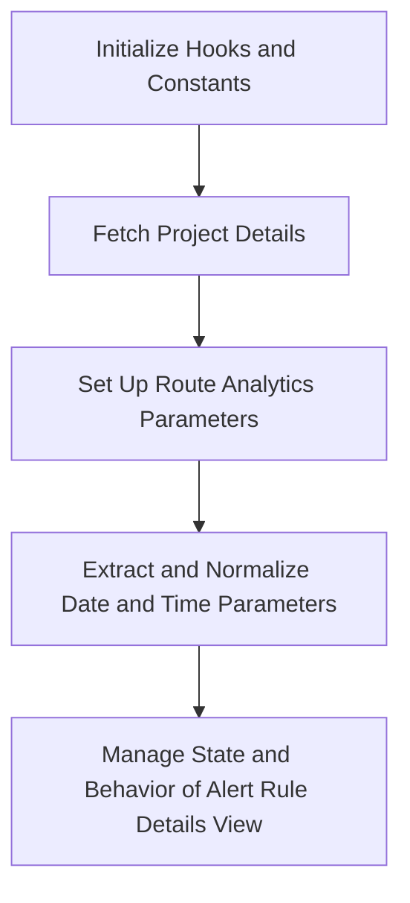

This document will cover the Alert Rule Details Flow, which includes:

1. Initializing hooks and constants
2. Fetching project details
3. Setting up route analytics parameters
4. Extracting and normalizing date and time parameters
5. Managing the state and behavior of the alert rule details view.

Technical document: <SwmLink doc-title="Alert Rule Details Flow">[Alert Rule Details Flow](/.swm/alert-rule-details-flow.hheakc1d.sw.md)</SwmLink>

# [Initializing Hooks and Constants](https://app.swimm.io/repos/Z2l0aHViJTNBJTNBc2VudHJ5LWRlbW8tMSUzQSUzQVN3aW1tLURlbW8=/docs/hheakc1d#alertruledetails)

The AlertRuleDetails component begins by initializing various hooks and constants. These include `queryClient`, `organization`, and `api`. These hooks and constants are essential for managing the state and making API calls within the component. For example, `queryClient` is used to manage server state, `organization` provides organizational context, and `api` is used for making API requests.

# [Fetching Project Details](https://app.swimm.io/repos/Z2l0aHViJTNBJTNBc2VudHJ5LWRlbW8tMSUzQSUzQVN3aW1tLURlbW8=/docs/hheakc1d#alertruledetails)

The component fetches project details to ensure that the correct project information is available. This involves retrieving a list of projects and identifying the specific project based on the `projectId` parameter. This step is crucial for displaying relevant alert rule details specific to the selected project.

# [Setting Up Route Analytics Parameters](https://app.swimm.io/repos/Z2l0aHViJTNBJTNBc2VudHJ5LWRlbW8tMSUzQSUzQVN3aW1tLURlbW8=/docs/hheakc1d#alertruledetails)

Route analytics parameters are set up to track user interactions and navigation within the alert rule details view. This helps in understanding user behavior and improving the user experience by analyzing how users interact with the alert rule details page.

# [Extracting and Normalizing Date and Time Parameters](https://app.swimm.io/repos/Z2l0aHViJTNBJTNBc2VudHJ5LWRlbW8tMSUzQSUzQVN3aW1tLURlbW8=/docs/hheakc1d#getdatadatetime)

The `getDataDatetime` function is used to extract and normalize date and time parameters from the URL query. This involves parsing the query parameters to retrieve `start`, `end`, `statsPeriod`, and `utc`. These parameters are then normalized to ensure they are in a consistent format. This step is important for displaying the correct time-based data in the alert rule details view.

# [Managing the State and Behavior of the Alert Rule Details View](https://app.swimm.io/repos/Z2l0aHViJTNBJTNBc2VudHJ5LWRlbW8tMSUzQSUzQVN3aW1tLURlbW8=/docs/hheakc1d#using-getdatadatetime-in-alertruledetails)

The extracted and normalized date and time parameters are used to manage the state and behavior of the alert rule details view. This includes setting the appropriate time range for displaying alert data and ensuring that the view is updated correctly based on user interactions and query parameters. This step ensures that users see the most relevant and accurate data for their alert rules.

&nbsp;

*This is an auto-generated document by Swimm AI 🌊 and has not yet been verified by a human*

<SwmMeta version="3.0.0" repo-id="Z2l0aHViJTNBJTNBc2VudHJ5LWRlbW8tMSUzQSUzQVN3aW1tLURlbW8=" repo-name="sentry-demo-1" doc-type="product-flows">Powered by [Swimm](/)</SwmMeta>
