This document explains the <SwmToken path="static/app/views/alerts/rules/issue/details/ruleDetails.tsx" pos="73:2:2" line-data="function AlertRuleDetails({params, location, router}: AlertRuleDetailsProps) {">`AlertRuleDetails`</SwmToken> component, which is responsible for initializing various hooks and constants, fetching project details, and setting up route analytics parameters. It also describes the flow of data and functions involved in managing the state and behavior of the alert rule details view.

The <SwmToken path="static/app/views/alerts/rules/issue/details/ruleDetails.tsx" pos="73:2:2" line-data="function AlertRuleDetails({params, location, router}: AlertRuleDetailsProps) {">`AlertRuleDetails`</SwmToken> component starts by initializing hooks and constants like <SwmToken path="static/app/views/alerts/rules/issue/details/ruleDetails.tsx" pos="74:3:3" line-data="  const queryClient = useQueryClient();">`queryClient`</SwmToken>, <SwmToken path="static/app/views/alerts/rules/issue/details/ruleDetails.tsx" pos="75:3:3" line-data="  const organization = useOrganization();">`organization`</SwmToken>, and <SwmToken path="static/app/views/alerts/rules/issue/details/ruleDetails.tsx" pos="76:3:3" line-data="  const api = useApi();">`api`</SwmToken>. It then fetches project details and sets up route analytics parameters. The component uses the <SwmToken path="static/app/views/alerts/rules/issue/details/ruleDetails.tsx" pos="94:3:3" line-data="  function getDataDatetime(): DateTimeObject {">`getDataDatetime`</SwmToken> function to extract and normalize date and time parameters from the URL query. These parameters are then used to manage the state and behavior of the alert rule details view, ensuring that the correct data is displayed to the user.

# Flow drill down

```mermaid
graph TD;
      subgraph static/app
d69796f9e67bc0ba33ac2771cee329e79cc678cfa368f9b2c6a91de1479babeb(AlertRuleDetails):::mainFlowStyle --> 29fc6db0f362c265f41834c43b9753c54c5f4986b1610b0baa793211705afe70(getDataDatetime):::mainFlowStyle
end

subgraph static/app
29fc6db0f362c265f41834c43b9753c54c5f4986b1610b0baa793211705afe70(getDataDatetime):::mainFlowStyle --> dd09d1045b339398768aa6f76827316d3fa8380e24530b6b67f0321d75289553(format):::mainFlowStyle
end

subgraph static/app
dd09d1045b339398768aa6f76827316d3fa8380e24530b6b67f0321d75289553(format):::mainFlowStyle --> ef0b886072fa59aad6c16d4de0feec4e8cdfa895a30b3be7b4f34c7704b78ca4(formatForReact):::mainFlowStyle
end

subgraph static/app
ef0b886072fa59aad6c16d4de0feec4e8cdfa895a30b3be7b4f34c7704b78ca4(formatForReact):::mainFlowStyle --> 4b2faee236c2e651d9932fa234f72966df49f7aa0f85eb9909d65f4b6d8ce1a6(parse):::mainFlowStyle
end

subgraph static/app
4b2faee236c2e651d9932fa234f72966df49f7aa0f85eb9909d65f4b6d8ce1a6(parse):::mainFlowStyle --> b2b47f6077e96a1ff47606d77c3fe70b18a84edc0ab0fa1349f7face4165d2ea(parseWidget):::mainFlowStyle
end

subgraph static/app
b2b47f6077e96a1ff47606d77c3fe70b18a84edc0ab0fa1349f7face4165d2ea(parseWidget):::mainFlowStyle --> 05bf2ddeab316943d2187e10bc3886949b4b03ae946f68d4f27a5bfc0025e132(mapToMetricsQuery):::mainFlowStyle
end

subgraph static/app
05bf2ddeab316943d2187e10bc3886949b4b03ae946f68d4f27a5bfc0025e132(mapToMetricsQuery):::mainFlowStyle --> 635bb507b11255a8fd7c2375dac3b6c46b736470cf89007061c6861fc973e73b(fetchAvailableTags):::mainFlowStyle
end

subgraph static/app
635bb507b11255a8fd7c2375dac3b6c46b736470cf89007061c6861fc973e73b(fetchAvailableTags):::mainFlowStyle --> 1025c11ff078741e3a52849e4dc81510d630800b045c60aea951683433a1c993(requestPromise):::mainFlowStyle
end

subgraph static/app
1025c11ff078741e3a52849e4dc81510d630800b045c60aea951683433a1c993(requestPromise):::mainFlowStyle --> 4f5a67a71dfb71654db327ed24d5e8187187a49b58963a473eec18ecb0aef026(request):::mainFlowStyle
end

subgraph static/app
4f5a67a71dfb71654db327ed24d5e8187187a49b58963a473eec18ecb0aef026(request):::mainFlowStyle --> 2cd409575454572c7b228bde73d6eb55227f3d7b14d37cc7ca5415bbcb81e4e5(handler):::mainFlowStyle
end

subgraph static/app
2cd409575454572c7b228bde73d6eb55227f3d7b14d37cc7ca5415bbcb81e4e5(handler):::mainFlowStyle --> 559bfddfedaeb6eedd4a2b9c4af59508927a1a6190c13b585781a179d22a07a1(processEvent):::mainFlowStyle
end

subgraph src/sentry/utils
559bfddfedaeb6eedd4a2b9c4af59508927a1a6190c13b585781a179d22a07a1(processEvent):::mainFlowStyle --> f4806fbc42267a83efc17e560b73c8335a116a7d12accc0ce1b678112e33fa25(increment):::mainFlowStyle
end

subgraph src/sentry/utils
f4806fbc42267a83efc17e560b73c8335a116a7d12accc0ce1b678112e33fa25(increment):::mainFlowStyle --> 411e09b2a8fb05fb965aa689da087a4eb0afb53a22d1a0177a8dfd222ea23bac(incr):::mainFlowStyle
end

subgraph src/sentry/api/client.py
411e09b2a8fb05fb965aa689da087a4eb0afb53a22d1a0177a8dfd222ea23bac(incr):::mainFlowStyle --> 560768831e5caae094d399ce451ab0489318662774e26c007cf59ac610285662(put):::mainFlowStyle
end

subgraph src/sentry/api/client.py
560768831e5caae094d399ce451ab0489318662774e26c007cf59ac610285662(put):::mainFlowStyle --> f9a76a621506843e728c753bbfd65f5dee5fa0fc21993c46938d555bf01dd967(request):::mainFlowStyle
end


      classDef mainFlowStyle color:#000000,fill:#7CB9F4
classDef rootsStyle color:#000000,fill:#00FFF4
classDef Style1 color:#000000,fill:#00FFAA
classDef Style2 color:#000000,fill:#FFFF00
classDef Style3 color:#000000,fill:#AA7CB9

%% Swimm:
%% graph TD;
%%       subgraph <SwmPath>[static/app/](static/app/)</SwmPath>
%% d69796f9e67bc0ba33ac2771cee329e79cc678cfa368f9b2c6a91de1479babeb(AlertRuleDetails):::mainFlowStyle --> 29fc6db0f362c265f41834c43b9753c54c5f4986b1610b0baa793211705afe70(getDataDatetime):::mainFlowStyle
%% end
%% 
%% subgraph <SwmPath>[static/app/](static/app/)</SwmPath>
%% 29fc6db0f362c265f41834c43b9753c54c5f4986b1610b0baa793211705afe70(getDataDatetime):::mainFlowStyle --> dd09d1045b339398768aa6f76827316d3fa8380e24530b6b67f0321d75289553(format):::mainFlowStyle
%% end
%% 
%% subgraph <SwmPath>[static/app/](static/app/)</SwmPath>
%% dd09d1045b339398768aa6f76827316d3fa8380e24530b6b67f0321d75289553(format):::mainFlowStyle --> ef0b886072fa59aad6c16d4de0feec4e8cdfa895a30b3be7b4f34c7704b78ca4(formatForReact):::mainFlowStyle
%% end
%% 
%% subgraph <SwmPath>[static/app/](static/app/)</SwmPath>
%% ef0b886072fa59aad6c16d4de0feec4e8cdfa895a30b3be7b4f34c7704b78ca4(formatForReact):::mainFlowStyle --> 4b2faee236c2e651d9932fa234f72966df49f7aa0f85eb9909d65f4b6d8ce1a6(parse):::mainFlowStyle
%% end
%% 
%% subgraph <SwmPath>[static/app/](static/app/)</SwmPath>
%% 4b2faee236c2e651d9932fa234f72966df49f7aa0f85eb9909d65f4b6d8ce1a6(parse):::mainFlowStyle --> b2b47f6077e96a1ff47606d77c3fe70b18a84edc0ab0fa1349f7face4165d2ea(parseWidget):::mainFlowStyle
%% end
%% 
%% subgraph <SwmPath>[static/app/](static/app/)</SwmPath>
%% b2b47f6077e96a1ff47606d77c3fe70b18a84edc0ab0fa1349f7face4165d2ea(parseWidget):::mainFlowStyle --> 05bf2ddeab316943d2187e10bc3886949b4b03ae946f68d4f27a5bfc0025e132(mapToMetricsQuery):::mainFlowStyle
%% end
%% 
%% subgraph <SwmPath>[static/app/](static/app/)</SwmPath>
%% 05bf2ddeab316943d2187e10bc3886949b4b03ae946f68d4f27a5bfc0025e132(mapToMetricsQuery):::mainFlowStyle --> 635bb507b11255a8fd7c2375dac3b6c46b736470cf89007061c6861fc973e73b(fetchAvailableTags):::mainFlowStyle
%% end
%% 
%% subgraph <SwmPath>[static/app/](static/app/)</SwmPath>
%% 635bb507b11255a8fd7c2375dac3b6c46b736470cf89007061c6861fc973e73b(fetchAvailableTags):::mainFlowStyle --> 1025c11ff078741e3a52849e4dc81510d630800b045c60aea951683433a1c993(requestPromise):::mainFlowStyle
%% end
%% 
%% subgraph <SwmPath>[static/app/](static/app/)</SwmPath>
%% 1025c11ff078741e3a52849e4dc81510d630800b045c60aea951683433a1c993(requestPromise):::mainFlowStyle --> 4f5a67a71dfb71654db327ed24d5e8187187a49b58963a473eec18ecb0aef026(request):::mainFlowStyle
%% end
%% 
%% subgraph <SwmPath>[static/app/](static/app/)</SwmPath>
%% 4f5a67a71dfb71654db327ed24d5e8187187a49b58963a473eec18ecb0aef026(request):::mainFlowStyle --> 2cd409575454572c7b228bde73d6eb55227f3d7b14d37cc7ca5415bbcb81e4e5(handler):::mainFlowStyle
%% end
%% 
%% subgraph <SwmPath>[static/app/](static/app/)</SwmPath>
%% 2cd409575454572c7b228bde73d6eb55227f3d7b14d37cc7ca5415bbcb81e4e5(handler):::mainFlowStyle --> 559bfddfedaeb6eedd4a2b9c4af59508927a1a6190c13b585781a179d22a07a1(processEvent):::mainFlowStyle
%% end
%% 
%% subgraph <SwmPath>[src/sentry/utils/](src/sentry/utils/)</SwmPath>
%% 559bfddfedaeb6eedd4a2b9c4af59508927a1a6190c13b585781a179d22a07a1(processEvent):::mainFlowStyle --> f4806fbc42267a83efc17e560b73c8335a116a7d12accc0ce1b678112e33fa25(increment):::mainFlowStyle
%% end
%% 
%% subgraph <SwmPath>[src/sentry/utils/](src/sentry/utils/)</SwmPath>
%% f4806fbc42267a83efc17e560b73c8335a116a7d12accc0ce1b678112e33fa25(increment):::mainFlowStyle --> 411e09b2a8fb05fb965aa689da087a4eb0afb53a22d1a0177a8dfd222ea23bac(incr):::mainFlowStyle
%% end
%% 
%% subgraph <SwmPath>[src/sentry/api/client.py](src/sentry/api/client.py)</SwmPath>
%% 411e09b2a8fb05fb965aa689da087a4eb0afb53a22d1a0177a8dfd222ea23bac(incr):::mainFlowStyle --> 560768831e5caae094d399ce451ab0489318662774e26c007cf59ac610285662(put):::mainFlowStyle
%% end
%% 
%% subgraph <SwmPath>[src/sentry/api/client.py](src/sentry/api/client.py)</SwmPath>
%% 560768831e5caae094d399ce451ab0489318662774e26c007cf59ac610285662(put):::mainFlowStyle --> f9a76a621506843e728c753bbfd65f5dee5fa0fc21993c46938d555bf01dd967(request):::mainFlowStyle
%% end
%% 
%% 
%%       classDef mainFlowStyle color:#000000,fill:#7CB9F4
%% classDef rootsStyle color:#000000,fill:#00FFF4
%% classDef Style1 color:#000000,fill:#00FFAA
%% classDef Style2 color:#000000,fill:#FFFF00
%% classDef Style3 color:#000000,fill:#AA7CB9
```



<SwmSnippet path="/static/app/views/alerts/rules/issue/details/ruleDetails.tsx" line="73">

---

## <SwmToken path="static/app/views/alerts/rules/issue/details/ruleDetails.tsx" pos="73:2:2" line-data="function AlertRuleDetails({params, location, router}: AlertRuleDetailsProps) {">`AlertRuleDetails`</SwmToken>

The <SwmToken path="static/app/views/alerts/rules/issue/details/ruleDetails.tsx" pos="73:2:2" line-data="function AlertRuleDetails({params, location, router}: AlertRuleDetailsProps) {">`AlertRuleDetails`</SwmToken> function initializes various hooks and constants such as <SwmToken path="static/app/views/alerts/rules/issue/details/ruleDetails.tsx" pos="74:3:3" line-data="  const queryClient = useQueryClient();">`queryClient`</SwmToken>, <SwmToken path="static/app/views/alerts/rules/issue/details/ruleDetails.tsx" pos="75:3:3" line-data="  const organization = useOrganization();">`organization`</SwmToken>, and <SwmToken path="static/app/views/alerts/rules/issue/details/ruleDetails.tsx" pos="76:3:3" line-data="  const api = useApi();">`api`</SwmToken>. It also fetches project details and sets up route analytics parameters.

```tsx
function AlertRuleDetails({params, location, router}: AlertRuleDetailsProps) {
  const queryClient = useQueryClient();
  const organization = useOrganization();
  const api = useApi();
  const {projects, fetching: projectIsLoading} = useProjects();
  const project = projects.find(({slug}) => slug === params.projectId);
  const {projectId: projectSlug, ruleId} = params;
  const {
    data: rule,
    isPending,
    isError,
```

---

</SwmSnippet>

<SwmSnippet path="/static/app/views/alerts/rules/issue/details/ruleDetails.tsx" line="94">

---

### <SwmToken path="static/app/views/alerts/rules/issue/details/ruleDetails.tsx" pos="94:3:3" line-data="  function getDataDatetime(): DateTimeObject {">`getDataDatetime`</SwmToken>

The <SwmToken path="static/app/views/alerts/rules/issue/details/ruleDetails.tsx" pos="94:3:3" line-data="  function getDataDatetime(): DateTimeObject {">`getDataDatetime`</SwmToken> function extracts date and time parameters from the URL query, normalizes them, and returns a <SwmToken path="static/app/views/alerts/rules/issue/details/ruleDetails.tsx" pos="94:8:8" line-data="  function getDataDatetime(): DateTimeObject {">`DateTimeObject`</SwmToken> containing either a period or start and end dates.

```tsx
  function getDataDatetime(): DateTimeObject {
    const query = location?.query ?? {};

    const {
      start,
      end,
      statsPeriod,
      utc: utcString,
    } = normalizeDateTimeParams(query, {
      allowEmptyPeriod: true,
      allowAbsoluteDatetime: true,
      allowAbsolutePageDatetime: true,
    });

    if (!statsPeriod && !start && !end) {
      return {period: ALERT_DEFAULT_CHART_PERIOD};
    }

    // Following getParams, statsPeriod will take priority over start/end
    if (statsPeriod) {
      return {period: statsPeriod};
```

---

</SwmSnippet>

<SwmSnippet path="/static/app/views/alerts/rules/issue/details/ruleDetails.tsx" line="361">

---

### Using <SwmToken path="static/app/views/alerts/rules/issue/details/ruleDetails.tsx" pos="361:18:18" line-data="  const {period, start, end, utc} = getDataDatetime();">`getDataDatetime`</SwmToken> in <SwmToken path="static/app/views/alerts/rules/issue/details/ruleDetails.tsx" pos="73:2:2" line-data="function AlertRuleDetails({params, location, router}: AlertRuleDetailsProps) {">`AlertRuleDetails`</SwmToken>

The <SwmToken path="static/app/views/alerts/rules/issue/details/ruleDetails.tsx" pos="361:18:18" line-data="  const {period, start, end, utc} = getDataDatetime();">`getDataDatetime`</SwmToken> function is called within <SwmToken path="static/app/views/alerts/rules/issue/details/ruleDetails.tsx" pos="73:2:2" line-data="function AlertRuleDetails({params, location, router}: AlertRuleDetailsProps) {">`AlertRuleDetails`</SwmToken> to retrieve date and time parameters, which are then used to manage the state and behavior of the alert rule details view.

```tsx
  const {period, start, end, utc} = getDataDatetime();
  const {cursor} = location.query;
```

---

</SwmSnippet>

&nbsp;

*This is an auto-generated document by Swimm AI 🌊 and has not yet been verified by a human*

<SwmMeta version="3.0.0" repo-id="Z2l0aHViJTNBJTNBc2VudHJ5LWRlbW8tMSUzQSUzQVN3aW1tLURlbW8=" repo-name="sentry-demo-1" doc-type="flows"><sup>Powered by [Swimm](/)</sup></SwmMeta>
