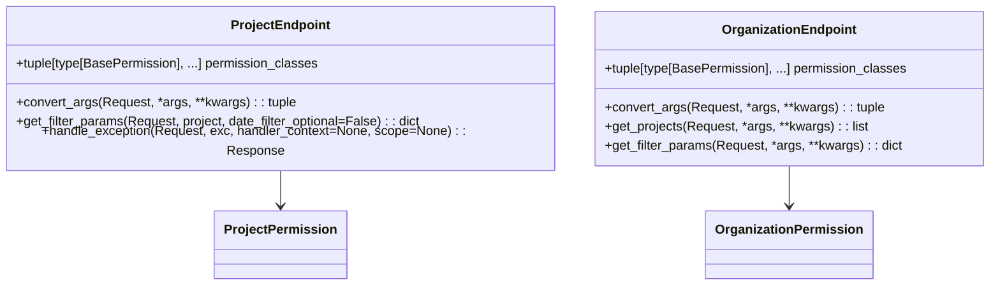

# Overview

Bases in the API directory refer to foundational classes and permissions used to structure and secure various endpoints. These base classes include permissions like <SwmToken path="src/sentry/api/bases/organization.py" pos="323:18:18" line-data="    permission_classes: tuple[type[BasePermission], ...] = (OrganizationPermission,)">`OrganizationPermission`</SwmToken> and <SwmToken path="src/sentry/api/bases/project.py" pos="117:18:18" line-data="    permission_classes: tuple[type[BasePermission], ...] = (ProjectPermission,)">`ProjectPermission`</SwmToken>, which define access control rules for different HTTP methods.

# <SwmToken path="src/sentry/api/bases/organization_events.py" pos="18:12:12" line-data="from sentry.api.bases.organization import OrganizationEndpoint">`OrganizationEndpoint`</SwmToken>

The <SwmToken path="src/sentry/api/bases/organization_events.py" pos="18:12:12" line-data="from sentry.api.bases.organization import OrganizationEndpoint">`OrganizationEndpoint`</SwmToken> class is a base for endpoints that require organization-level scoping and permissions. It ensures that only users with the appropriate organization permissions can access these endpoints.

<SwmSnippet path="/src/sentry/api/bases/organization_events.py" line="18">

---

The <SwmToken path="src/sentry/api/bases/organization_events.py" pos="18:12:12" line-data="from sentry.api.bases.organization import OrganizationEndpoint">`OrganizationEndpoint`</SwmToken> class is imported from <SwmToken path="src/sentry/api/bases/organization_events.py" pos="18:2:8" line-data="from sentry.api.bases.organization import OrganizationEndpoint">`sentry.api.bases.organization`</SwmToken>.

```python
from sentry.api.bases.organization import OrganizationEndpoint
```

---

</SwmSnippet>

# Importing Base Classes

The <SwmToken path="src/sentry/api/bases/organization_events.py" pos="17:10:10" line-data="from sentry.api.bases import NoProjects">`NoProjects`</SwmToken> class is imported from <SwmToken path="src/sentry/api/bases/organization_events.py" pos="17:2:6" line-data="from sentry.api.bases import NoProjects">`sentry.api.bases`</SwmToken> and is used to handle cases where no projects are found for a given organization.

<SwmSnippet path="/src/sentry/api/bases/organization_events.py" line="17">

---

The <SwmToken path="src/sentry/api/bases/organization_events.py" pos="17:10:10" line-data="from sentry.api.bases import NoProjects">`NoProjects`</SwmToken> class is imported from <SwmToken path="src/sentry/api/bases/organization_events.py" pos="17:2:6" line-data="from sentry.api.bases import NoProjects">`sentry.api.bases`</SwmToken>.

```python
from sentry.api.bases import NoProjects
```

---

</SwmSnippet>

# <SwmToken path="src/sentry/api/bases/project.py" pos="116:2:2" line-data="class ProjectEndpoint(Endpoint):">`ProjectEndpoint`</SwmToken>

The <SwmToken path="src/sentry/api/bases/project.py" pos="116:2:2" line-data="class ProjectEndpoint(Endpoint):">`ProjectEndpoint`</SwmToken> class is a base class for endpoints that require project-level scoping and permissions. It uses <SwmToken path="src/sentry/api/bases/project.py" pos="117:18:18" line-data="    permission_classes: tuple[type[BasePermission], ...] = (ProjectPermission,)">`ProjectPermission`</SwmToken> to enforce access control rules. The <SwmToken path="src/sentry/api/bases/project.py" pos="119:3:3" line-data="    def convert_args(">`convert_args`</SwmToken> method is used to convert and validate the arguments passed to the endpoint, ensuring that the project exists and the user has the necessary permissions.

<SwmSnippet path="/src/sentry/api/bases/project.py" line="116">

---

The <SwmToken path="src/sentry/api/bases/project.py" pos="116:2:2" line-data="class ProjectEndpoint(Endpoint):">`ProjectEndpoint`</SwmToken> class defines the <SwmToken path="src/sentry/api/bases/project.py" pos="119:3:3" line-data="    def convert_args(">`convert_args`</SwmToken> method to handle argument conversion and validation.

```python
class ProjectEndpoint(Endpoint):
    permission_classes: tuple[type[BasePermission], ...] = (ProjectPermission,)

    def convert_args(
        self,
        request: Request,
        *args,
        **kwargs,
    ):
        if args and args[0] is not None:
            organization_id_or_slug: int | str = args[0]
            # Required so it behaves like the original convert_args, where organization_id_or_slug was another parameter
            # TODO: Remove this once we remove the old `organization_slug` parameter from getsentry
            args = args[1:]
        else:
            organization_id_or_slug = kwargs.pop("organization_id_or_slug", None) or kwargs.pop(
                "organization_slug"
            )

        if args and args[0] is not None:
            project_id_or_slug: int | str = args[0]
```

---

</SwmSnippet>

# <SwmToken path="src/sentry/api/bases/organization_events.py" pos="18:12:12" line-data="from sentry.api.bases.organization import OrganizationEndpoint">`OrganizationEndpoint`</SwmToken> Methods

The <SwmToken path="src/sentry/api/bases/organization_events.py" pos="18:12:12" line-data="from sentry.api.bases.organization import OrganizationEndpoint">`OrganizationEndpoint`</SwmToken> class also includes methods like <SwmToken path="src/sentry/api/bases/organization.py" pos="325:3:3" line-data="    def get_projects(">`get_projects`</SwmToken>, which determines which project <SwmToken path="src/sentry/api/bases/organization.py" pos="335:7:7" line-data="        Determines which project ids to filter the endpoint by. If a list of">`ids`</SwmToken> to filter the endpoint by. It validates the projects that can be accessed based on the user's permissions within the organization.

<SwmSnippet path="/src/sentry/api/bases/organization.py" line="322">

---

The <SwmToken path="src/sentry/api/bases/organization.py" pos="322:2:2" line-data="class OrganizationEndpoint(Endpoint):">`OrganizationEndpoint`</SwmToken> class defines the <SwmToken path="src/sentry/api/bases/organization.py" pos="325:3:3" line-data="    def get_projects(">`get_projects`</SwmToken> method to fetch and validate project <SwmToken path="src/sentry/api/bases/organization.py" pos="335:7:7" line-data="        Determines which project ids to filter the endpoint by. If a list of">`ids`</SwmToken>.

```python
class OrganizationEndpoint(Endpoint):
    permission_classes: tuple[type[BasePermission], ...] = (OrganizationPermission,)

    def get_projects(
        self,
        request: HttpRequest,
        organization: Organization | RpcOrganization,
        force_global_perms: bool = False,
        include_all_accessible: bool = False,
        project_ids: set[int] | None = None,
        project_slugs: set[str] | None = None,
    ) -> list[Project]:
        """
        Determines which project ids to filter the endpoint by. If a list of
        project ids is passed in via the `project` querystring argument then
        validate that these projects can be accessed. If not passed, then
        return all project ids that the user can access within this
        organization.

        :param request:
```

---

</SwmSnippet>

&nbsp;

*This is an auto-generated document by Swimm AI 🌊 and has not yet been verified by a human*

<SwmMeta version="3.0.0" repo-id="Z2l0aHViJTNBJTNBc2VudHJ5LWRlbW8tMSUzQSUzQVN3aW1tLURlbW8=" repo-name="sentry-demo-1" doc-type="overview"><sup>Powered by [Swimm](/)</sup></SwmMeta>
