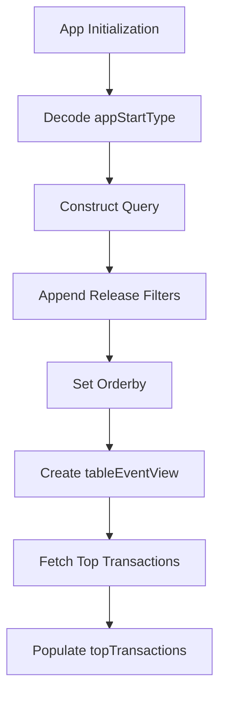

# Overview

App initialization events refer to the process of starting a mobile application, focusing on cold starts and warm starts. This document explains the steps involved in determining the type of app start, constructing the query, appending release filters, sorting results, fetching top transactions, and populating the top transactions array.

# App Start Type

The <SwmToken path="static/app/views/insights/mobile/appStarts/components/appStartup.tsx" pos="63:3:3" line-data="  const appStartType =">`appStartType`</SwmToken> constant determines whether the app start is a cold start or a warm start by decoding the query parameter from the location.

<SwmSnippet path="/static/app/views/insights/mobile/appStarts/components/appStartup.tsx" line="63">

---

The <SwmToken path="static/app/views/insights/mobile/appStarts/components/appStartup.tsx" pos="63:3:3" line-data="  const appStartType =">`appStartType`</SwmToken> is decoded from the location query parameter using the <SwmToken path="static/app/views/insights/mobile/appStarts/components/appStartup.tsx" pos="64:1:1" line-data="    decodeScalar(location.query[SpanMetricsField.APP_START_TYPE]) ?? COLD_START_TYPE;">`decodeScalar`</SwmToken> function.

```tsx
  const appStartType =
    decodeScalar(location.query[SpanMetricsField.APP_START_TYPE]) ?? COLD_START_TYPE;
```

---

</SwmSnippet>

# Query Construction

The <SwmToken path="static/app/views/insights/mobile/appStarts/components/appStartup.tsx" pos="64:5:5" line-data="    decodeScalar(location.query[SpanMetricsField.APP_START_TYPE]) ?? COLD_START_TYPE;">`query`</SwmToken> object is constructed to filter events of type transaction and operation <SwmToken path="static/app/views/insights/mobile/appStarts/components/appStartup.tsx" pos="68:6:8" line-data="    &#39;transaction.op:ui.load&#39;,">`ui.load`</SwmToken>. It includes a condition to count the starts of the app based on the <SwmToken path="static/app/views/insights/mobile/appStarts/components/appStartup.tsx" pos="63:3:3" line-data="  const appStartType =">`appStartType`</SwmToken>.

<SwmSnippet path="/static/app/views/insights/mobile/appStarts/components/appStartup.tsx" line="66">

---

The <SwmToken path="static/app/views/insights/mobile/appStarts/components/appStartup.tsx" pos="66:3:3" line-data="  const query = new MutableSearch([">`query`</SwmToken> object is created using <SwmToken path="static/app/views/insights/mobile/appStarts/components/appStartup.tsx" pos="66:9:9" line-data="  const query = new MutableSearch([">`MutableSearch`</SwmToken> to filter events and count app starts.

```tsx
  const query = new MutableSearch([
    'event.type:transaction',
    'transaction.op:ui.load',
    `count_starts(measurements.app_start_${appStartType}):>0`,
    ...(additionalFilters ?? []),
  ]);
```

---

</SwmSnippet>

# Appending Release Filters

The <SwmToken path="static/app/views/insights/mobile/appStarts/components/appStartup.tsx" pos="82:3:3" line-data="  const queryString = appendReleaseFilters(query, primaryRelease, secondaryRelease);">`queryString`</SwmToken> is appended with release filters using the <SwmToken path="static/app/views/insights/mobile/appStarts/components/appStartup.tsx" pos="82:12:12" line-data="  const queryString = appendReleaseFilters(query, primaryRelease, secondaryRelease);">`primaryRelease`</SwmToken> and <SwmToken path="static/app/views/insights/mobile/appStarts/components/appStartup.tsx" pos="82:15:15" line-data="  const queryString = appendReleaseFilters(query, primaryRelease, secondaryRelease);">`secondaryRelease`</SwmToken> constants to refine the search query.

<SwmSnippet path="/static/app/views/insights/mobile/appStarts/components/appStartup.tsx" line="82">

---

The <SwmToken path="static/app/views/insights/mobile/appStarts/components/appStartup.tsx" pos="82:7:7" line-data="  const queryString = appendReleaseFilters(query, primaryRelease, secondaryRelease);">`appendReleaseFilters`</SwmToken> function is used to add release filters to the <SwmToken path="static/app/views/insights/mobile/appStarts/components/appStartup.tsx" pos="82:3:3" line-data="  const queryString = appendReleaseFilters(query, primaryRelease, secondaryRelease);">`queryString`</SwmToken>.

```tsx
  const queryString = appendReleaseFilters(query, primaryRelease, secondaryRelease);
```

---

</SwmSnippet>

# Sorting Results

The <SwmToken path="static/app/views/insights/mobile/appStarts/components/appStartup.tsx" pos="85:3:3" line-data="  const orderby = decodeScalar(locationQuery.sort, `-${sortCountField}`);">`orderby`</SwmToken> constant is set to sort the results based on the count of app starts, either in ascending or descending order, as specified in the location query.

<SwmSnippet path="/static/app/views/insights/mobile/appStarts/components/appStartup.tsx" line="84">

---

The <SwmToken path="static/app/views/insights/mobile/appStarts/components/appStartup.tsx" pos="85:3:3" line-data="  const orderby = decodeScalar(locationQuery.sort, `-${sortCountField}`);">`orderby`</SwmToken> constant is determined by decoding the location query's sort parameter.

```tsx
  const sortCountField = `count_starts_measurements_app_start_${appStartType}`;
  const orderby = decodeScalar(locationQuery.sort, `-${sortCountField}`);
```

---

</SwmSnippet>

# Fetching Top Transactions

The <SwmToken path="static/app/views/insights/mobile/appStarts/components/appStartup.tsx" pos="103:3:3" line-data="  const tableEventView = EventView.fromNewQueryWithLocation(newQuery, location);">`tableEventView`</SwmToken> object is created from the new query and location, which is then used to fetch the top transactions data.

<SwmSnippet path="/static/app/views/insights/mobile/appStarts/components/appStartup.tsx" line="103">

---

The <SwmToken path="static/app/views/insights/mobile/appStarts/components/appStartup.tsx" pos="103:3:3" line-data="  const tableEventView = EventView.fromNewQueryWithLocation(newQuery, location);">`tableEventView`</SwmToken> is created using <SwmToken path="static/app/views/insights/mobile/appStarts/components/appStartup.tsx" pos="103:7:9" line-data="  const tableEventView = EventView.fromNewQueryWithLocation(newQuery, location);">`EventView.fromNewQueryWithLocation`</SwmToken>.

```tsx
  const tableEventView = EventView.fromNewQueryWithLocation(newQuery, location);
```

---

</SwmSnippet>

# Populating Top Transactions

The <SwmToken path="static/app/views/insights/mobile/appStarts/components/appStartup.tsx" pos="115:3:3" line-data="  const topTransactions =">`topTransactions`</SwmToken> array is populated with the top five transactions from the fetched data, which are then used for further analysis.

<SwmSnippet path="/static/app/views/insights/mobile/appStarts/components/appStartup.tsx" line="115">

---

The <SwmToken path="static/app/views/insights/mobile/appStarts/components/appStartup.tsx" pos="115:3:3" line-data="  const topTransactions =">`topTransactions`</SwmToken> array is populated by slicing the top five transactions from the fetched data.

```tsx
  const topTransactions =
    topTransactionsData?.data?.slice(0, 5).map(datum => datum.transaction as string) ??
    [];
```

---

</SwmSnippet>

# App Start Endpoints

Endpoints are used to fetch events related to app starts for a specific organization. These endpoints are mocked in test files to simulate API responses.

<SwmSnippet path="/static/app/views/insights/mobile/appStarts/views/screenSummaryPage.spec.tsx" line="74">

---

This endpoint fetches events related to app starts for a specific organization.

```tsx
        url: `/organizations/${organization.slug}/events/`,
      });
```

---

</SwmSnippet>

<SwmSnippet path="/static/app/views/insights/mobile/appStarts/components/tables/spanOperationTable.spec.tsx" line="42">

---

This endpoint fetches span operation data for app starts.

```tsx
      url: `/organizations/${organization.slug}/events/`,
      body: {
```

---

</SwmSnippet>

&nbsp;

*This is an auto-generated document by Swimm AI 🌊 and has not yet been verified by a human*

<SwmMeta version="3.0.0" repo-id="Z2l0aHViJTNBJTNBc2VudHJ5LWRlbW8tMSUzQSUzQVN3aW1tLURlbW8=" repo-name="sentry-demo-1" doc-type="overview"><sup>Powered by [Swimm](/)</sup></SwmMeta>
