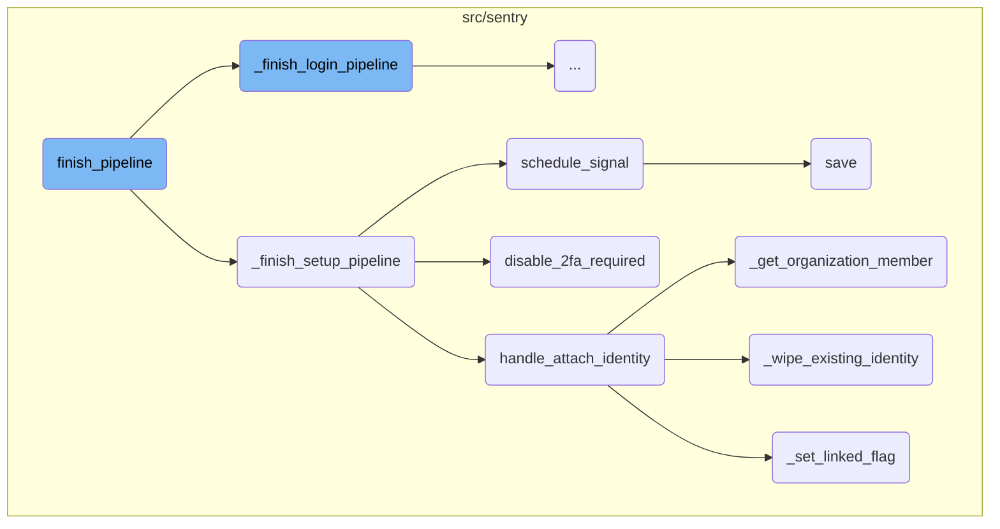
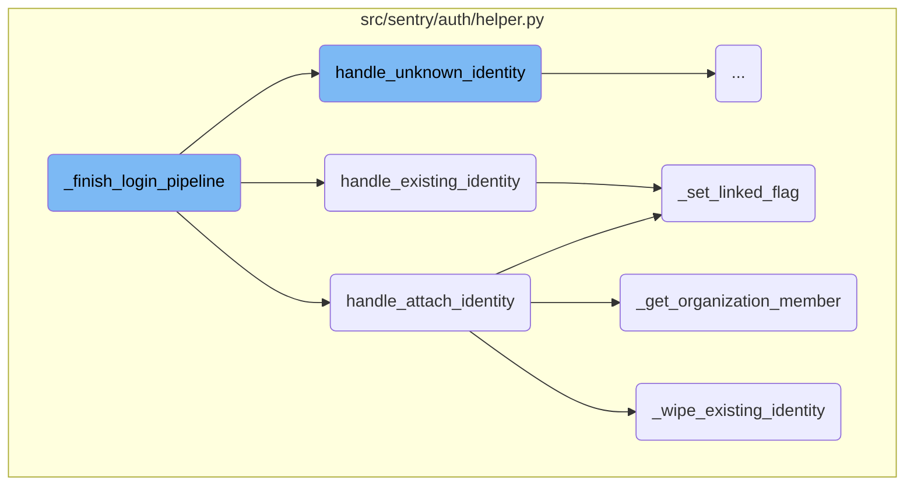
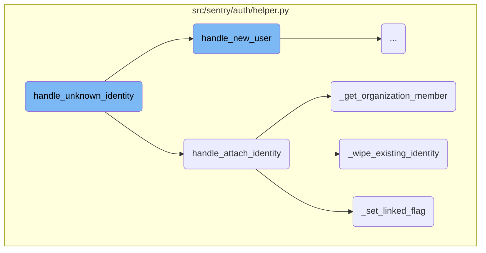

```mermaid
graph TD;
      subgraph src/sentry
cfd649877c4ced476b8fbf7e5606e2cad2c7a964814530211b5a0e5e0a5d4a22(handle_new_user):::mainFlowStyle --> 491201fb48ed6b9782cd7aebe831047d5a66f69111ffeae67921c2a0c2c68d69(_handle_new_membership):::mainFlowStyle
end

subgraph src/sentry
491201fb48ed6b9782cd7aebe831047d5a66f69111ffeae67921c2a0c2c68d69(_handle_new_membership):::mainFlowStyle --> 3941abdaeccb6c44e4a387e32c946377b4258e406f0c7c26590b0890ae3ed62d(_handle_membership):::mainFlowStyle
end

subgraph src/sentry
3941abdaeccb6c44e4a387e32c946377b4258e406f0c7c26590b0890ae3ed62d(_handle_membership):::mainFlowStyle --> bad70fd4c50a8bc45d1a75219b5ec4a4d71d23a6a7b2f868cbac851cb371bf1b(accept_invite):::mainFlowStyle
end


      classDef mainFlowStyle color:#000000,fill:#7CB9F4
classDef rootsStyle color:#000000,fill:#00FFF4
classDef Style1 color:#000000,fill:#00FFAA
classDef Style2 color:#000000,fill:#FFFF00
classDef Style3 color:#000000,fill:#AA7CB9

%% Swimm:
%% graph TD;
%%       subgraph <SwmPath>[src/sentry/](src/sentry/)</SwmPath>
%% cfd649877c4ced476b8fbf7e5606e2cad2c7a964814530211b5a0e5e0a5d4a22(handle_new_user):::mainFlowStyle --> 491201fb48ed6b9782cd7aebe831047d5a66f69111ffeae67921c2a0c2c68d69(_handle_new_membership):::mainFlowStyle
%% end
%% 
%% subgraph <SwmPath>[src/sentry/](src/sentry/)</SwmPath>
%% 491201fb48ed6b9782cd7aebe831047d5a66f69111ffeae67921c2a0c2c68d69(_handle_new_membership):::mainFlowStyle --> 3941abdaeccb6c44e4a387e32c946377b4258e406f0c7c26590b0890ae3ed62d(_handle_membership):::mainFlowStyle
%% end
%% 
%% subgraph <SwmPath>[src/sentry/](src/sentry/)</SwmPath>
%% 3941abdaeccb6c44e4a387e32c946377b4258e406f0c7c26590b0890ae3ed62d(_handle_membership):::mainFlowStyle --> bad70fd4c50a8bc45d1a75219b5ec4a4d71d23a6a7b2f868cbac851cb371bf1b(accept_invite):::mainFlowStyle
%% end
%% 
%% 
%%       classDef mainFlowStyle color:#000000,fill:#7CB9F4
%% classDef rootsStyle color:#000000,fill:#00FFF4
%% classDef Style1 color:#000000,fill:#00FFAA
%% classDef Style2 color:#000000,fill:#FFFF00
%% classDef Style3 color:#000000,fill:#AA7CB9
```

This document provides an overview of the <SwmToken path="src/sentry/auth/helper.py" pos="761:3:3" line-data="    def finish_pipeline(self) -&gt; HttpResponseBase:">`finish_pipeline`</SwmToken> function, which is responsible for completing the authentication pipeline. It includes the steps involved in fetching state data, building the identity, and determining the flow type to proceed accordingly.

The <SwmToken path="src/sentry/auth/helper.py" pos="761:3:3" line-data="    def finish_pipeline(self) -&gt; HttpResponseBase:">`finish_pipeline`</SwmToken> function is like the final step in a login or setup process. It first gathers some saved information, then creates an identity based on that information. Depending on whether the user is logging in or setting up a new account, it follows different paths to complete the process. If logging in, it attaches the identity to the user and logs them in. If setting up, it configures the necessary settings for the new account.

Here is a high level diagram of the flow, showing only the most important functions:

```mermaid
graph TD;
      subgraph src/sentry
c5579675e2340a8473bd38af607d5dd381f3d37d714aa9f6f1cb7131ee56d4f2(finish_pipeline):::mainFlowStyle --> 12a5dc1cf3f30bb5974dbc86e2deeb2f04a13016bceb126f14f79400509d74e6(_finish_setup_pipeline)
end

subgraph src/sentry
c5579675e2340a8473bd38af607d5dd381f3d37d714aa9f6f1cb7131ee56d4f2(finish_pipeline):::mainFlowStyle --> d0a57a6634b23b7a4dccbdf092a9e6ac4d530811a4335744e0c058732ff0701c(_finish_login_pipeline):::mainFlowStyle
end

subgraph src/sentry
d0a57a6634b23b7a4dccbdf092a9e6ac4d530811a4335744e0c058732ff0701c(_finish_login_pipeline):::mainFlowStyle --> 6f93f374d8f1404e8a25f2413cc002a83b1ddbc8a4542da08d32dccffdf77588(handle_attach_identity)
end

subgraph src/sentry
d0a57a6634b23b7a4dccbdf092a9e6ac4d530811a4335744e0c058732ff0701c(_finish_login_pipeline):::mainFlowStyle --> 422a04a7bee77669b33febc34342c524a2271d942dd2e9ad9a1a295b6fbca00f(handle_existing_identity)
end

subgraph src/sentry
d0a57a6634b23b7a4dccbdf092a9e6ac4d530811a4335744e0c058732ff0701c(_finish_login_pipeline):::mainFlowStyle --> b57da65401fb94068176c37267fdcba04187a4c4a9bd7c24bb4ff18cb1d65b1e(handle_unknown_identity):::mainFlowStyle
end

subgraph src/sentry
b57da65401fb94068176c37267fdcba04187a4c4a9bd7c24bb4ff18cb1d65b1e(handle_unknown_identity):::mainFlowStyle --> 6f93f374d8f1404e8a25f2413cc002a83b1ddbc8a4542da08d32dccffdf77588(handle_attach_identity)
end

subgraph src/sentry
b57da65401fb94068176c37267fdcba04187a4c4a9bd7c24bb4ff18cb1d65b1e(handle_unknown_identity):::mainFlowStyle --> cfd649877c4ced476b8fbf7e5606e2cad2c7a964814530211b5a0e5e0a5d4a22(handle_new_user):::mainFlowStyle
end

subgraph src/sentry
cfd649877c4ced476b8fbf7e5606e2cad2c7a964814530211b5a0e5e0a5d4a22(handle_new_user):::mainFlowStyle --> 491201fb48ed6b9782cd7aebe831047d5a66f69111ffeae67921c2a0c2c68d69(_handle_new_membership):::mainFlowStyle
end

subgraph src/sentry
491201fb48ed6b9782cd7aebe831047d5a66f69111ffeae67921c2a0c2c68d69(_handle_new_membership):::mainFlowStyle --> 3941abdaeccb6c44e4a387e32c946377b4258e406f0c7c26590b0890ae3ed62d(_handle_membership):::mainFlowStyle
end

subgraph src/sentry
3941abdaeccb6c44e4a387e32c946377b4258e406f0c7c26590b0890ae3ed62d(_handle_membership):::mainFlowStyle --> bad70fd4c50a8bc45d1a75219b5ec4a4d71d23a6a7b2f868cbac851cb371bf1b(accept_invite):::mainFlowStyle
end

subgraph src/sentry
bad70fd4c50a8bc45d1a75219b5ec4a4d71d23a6a7b2f868cbac851cb371bf1b(accept_invite):::mainFlowStyle --> 88afa16f8fa3988124ee58fa20e0964b75044e9b24527e6e7d4bb4a48df7de8d(schedule_signal)
end

subgraph src/sentry
bad70fd4c50a8bc45d1a75219b5ec4a4d71d23a6a7b2f868cbac851cb371bf1b(accept_invite):::mainFlowStyle --> bc87669032632d4996f25434dfb2f3d3d8f7b2034e0b0980f52bae70d8f7eef7(set_user_for_organization_member)
end


      classDef mainFlowStyle color:#000000,fill:#7CB9F4
classDef rootsStyle color:#000000,fill:#00FFF4
classDef Style1 color:#000000,fill:#00FFAA
classDef Style2 color:#000000,fill:#FFFF00
classDef Style3 color:#000000,fill:#AA7CB9

%% Swimm:
%% graph TD;
%%       subgraph <SwmPath>[src/sentry/](src/sentry/)</SwmPath>
%% c5579675e2340a8473bd38af607d5dd381f3d37d714aa9f6f1cb7131ee56d4f2(finish_pipeline):::mainFlowStyle --> 12a5dc1cf3f30bb5974dbc86e2deeb2f04a13016bceb126f14f79400509d74e6(_finish_setup_pipeline)
%% end
%% 
%% subgraph <SwmPath>[src/sentry/](src/sentry/)</SwmPath>
%% c5579675e2340a8473bd38af607d5dd381f3d37d714aa9f6f1cb7131ee56d4f2(finish_pipeline):::mainFlowStyle --> d0a57a6634b23b7a4dccbdf092a9e6ac4d530811a4335744e0c058732ff0701c(_finish_login_pipeline):::mainFlowStyle
%% end
%% 
%% subgraph <SwmPath>[src/sentry/](src/sentry/)</SwmPath>
%% d0a57a6634b23b7a4dccbdf092a9e6ac4d530811a4335744e0c058732ff0701c(_finish_login_pipeline):::mainFlowStyle --> 6f93f374d8f1404e8a25f2413cc002a83b1ddbc8a4542da08d32dccffdf77588(handle_attach_identity)
%% end
%% 
%% subgraph <SwmPath>[src/sentry/](src/sentry/)</SwmPath>
%% d0a57a6634b23b7a4dccbdf092a9e6ac4d530811a4335744e0c058732ff0701c(_finish_login_pipeline):::mainFlowStyle --> 422a04a7bee77669b33febc34342c524a2271d942dd2e9ad9a1a295b6fbca00f(handle_existing_identity)
%% end
%% 
%% subgraph <SwmPath>[src/sentry/](src/sentry/)</SwmPath>
%% d0a57a6634b23b7a4dccbdf092a9e6ac4d530811a4335744e0c058732ff0701c(_finish_login_pipeline):::mainFlowStyle --> b57da65401fb94068176c37267fdcba04187a4c4a9bd7c24bb4ff18cb1d65b1e(handle_unknown_identity):::mainFlowStyle
%% end
%% 
%% subgraph <SwmPath>[src/sentry/](src/sentry/)</SwmPath>
%% b57da65401fb94068176c37267fdcba04187a4c4a9bd7c24bb4ff18cb1d65b1e(handle_unknown_identity):::mainFlowStyle --> 6f93f374d8f1404e8a25f2413cc002a83b1ddbc8a4542da08d32dccffdf77588(handle_attach_identity)
%% end
%% 
%% subgraph <SwmPath>[src/sentry/](src/sentry/)</SwmPath>
%% b57da65401fb94068176c37267fdcba04187a4c4a9bd7c24bb4ff18cb1d65b1e(handle_unknown_identity):::mainFlowStyle --> cfd649877c4ced476b8fbf7e5606e2cad2c7a964814530211b5a0e5e0a5d4a22(handle_new_user):::mainFlowStyle
%% end
%% 
%% subgraph <SwmPath>[src/sentry/](src/sentry/)</SwmPath>
%% cfd649877c4ced476b8fbf7e5606e2cad2c7a964814530211b5a0e5e0a5d4a22(handle_new_user):::mainFlowStyle --> 491201fb48ed6b9782cd7aebe831047d5a66f69111ffeae67921c2a0c2c68d69(_handle_new_membership):::mainFlowStyle
%% end
%% 
%% subgraph <SwmPath>[src/sentry/](src/sentry/)</SwmPath>
%% 491201fb48ed6b9782cd7aebe831047d5a66f69111ffeae67921c2a0c2c68d69(_handle_new_membership):::mainFlowStyle --> 3941abdaeccb6c44e4a387e32c946377b4258e406f0c7c26590b0890ae3ed62d(_handle_membership):::mainFlowStyle
%% end
%% 
%% subgraph <SwmPath>[src/sentry/](src/sentry/)</SwmPath>
%% 3941abdaeccb6c44e4a387e32c946377b4258e406f0c7c26590b0890ae3ed62d(_handle_membership):::mainFlowStyle --> bad70fd4c50a8bc45d1a75219b5ec4a4d71d23a6a7b2f868cbac851cb371bf1b(accept_invite):::mainFlowStyle
%% end
%% 
%% subgraph <SwmPath>[src/sentry/](src/sentry/)</SwmPath>
%% bad70fd4c50a8bc45d1a75219b5ec4a4d71d23a6a7b2f868cbac851cb371bf1b(accept_invite):::mainFlowStyle --> 88afa16f8fa3988124ee58fa20e0964b75044e9b24527e6e7d4bb4a48df7de8d(schedule_signal)
%% end
%% 
%% subgraph <SwmPath>[src/sentry/](src/sentry/)</SwmPath>
%% bad70fd4c50a8bc45d1a75219b5ec4a4d71d23a6a7b2f868cbac851cb371bf1b(accept_invite):::mainFlowStyle --> bc87669032632d4996f25434dfb2f3d3d8f7b2034e0b0980f52bae70d8f7eef7(set_user_for_organization_member)
%% end
%% 
%% 
%%       classDef mainFlowStyle color:#000000,fill:#7CB9F4
%% classDef rootsStyle color:#000000,fill:#00FFF4
%% classDef Style1 color:#000000,fill:#00FFAA
%% classDef Style2 color:#000000,fill:#FFFF00
%% classDef Style3 color:#000000,fill:#AA7CB9
```



# Flow drill down

First, we'll zoom into this section of the flow:



<SwmSnippet path="/src/sentry/auth/helper.py" line="761">

---

## <SwmToken path="src/sentry/auth/helper.py" pos="761:3:3" line-data="    def finish_pipeline(self) -&gt; HttpResponseBase:">`finish_pipeline`</SwmToken>

The <SwmToken path="src/sentry/auth/helper.py" pos="761:3:3" line-data="    def finish_pipeline(self) -&gt; HttpResponseBase:">`finish_pipeline`</SwmToken> function is responsible for completing the authentication pipeline. It fetches the state data, builds the identity, and then determines the flow type (either login or setup) to proceed accordingly.

```python
    def finish_pipeline(self) -> HttpResponseBase:
        data = self.fetch_state()

        # The state data may have expired, in which case the state data will
        # simply be None.
        if not data:
            return self.error(ERR_INVALID_IDENTITY)

        try:
            identity = self.provider.build_identity(data)
        except IdentityNotValid as error:
            return self.error(str(error) or ERR_INVALID_IDENTITY)

        if self.state.flow == self.FLOW_LOGIN:
            # create identity and authenticate the user
            response = self._finish_login_pipeline(identity)
        elif self.state.flow == self.FLOW_SETUP_PROVIDER:
            # Configuring the SSO Auth provider
            response = self._finish_setup_pipeline(identity)
        else:
            raise Exception(f"Unrecognized flow value: {self.state.flow}")
```

---

</SwmSnippet>

<SwmSnippet path="/src/sentry/auth/helper.py" line="856">

---

## <SwmToken path="src/sentry/auth/helper.py" pos="856:3:3" line-data="    def _finish_setup_pipeline(self, identity: Mapping[str, Any]) -&gt; HttpResponseRedirect:">`_finish_setup_pipeline`</SwmToken>

The <SwmToken path="src/sentry/auth/helper.py" pos="856:3:3" line-data="    def _finish_setup_pipeline(self, identity: Mapping[str, Any]) -&gt; HttpResponseRedirect:">`_finish_setup_pipeline`</SwmToken> function configures Single Sign-On (SSO) for an organization. It creates the auth provider, links the identity to the user, disables <SwmToken path="src/sentry/auth/helper.py" pos="532:5:5" line-data="                    # to 2fa when the user migrates their idp but has 2fa enabled,">`2fa`</SwmToken> if necessary, and schedules a signal to indicate that SSO has been enabled.

```python
    def _finish_setup_pipeline(self, identity: Mapping[str, Any]) -> HttpResponseRedirect:
        """
        the setup flow here is configuring SSO for an organization.
        It does that by creating the auth provider as well as an OrgMember identity linked to the active user
        """
        request = self.request
        if not request.user.is_authenticated:
            return self.error(ERR_NOT_AUTHED)

        if request.user.id != self.state.uid:
            return self.error(ERR_UID_MISMATCH)

        data = self.fetch_state()
        config = self.provider.build_config(state=data)

        om = organization_service.check_membership_by_id(
            organization_id=self.organization.id, user_id=request.user.id
        )
        if om is None:
            return self.error(ERR_UID_MISMATCH)

```

---

</SwmSnippet>

<SwmSnippet path="/src/sentry/auth/helper.py" line="311">

---

## <SwmToken path="src/sentry/auth/helper.py" pos="311:3:3" line-data="    def handle_attach_identity(self, member: RpcOrganizationMember | None = None) -&gt; AuthIdentity:">`handle_attach_identity`</SwmToken>

The <SwmToken path="src/sentry/auth/helper.py" pos="311:3:3" line-data="    def handle_attach_identity(self, member: RpcOrganizationMember | None = None) -&gt; AuthIdentity:">`handle_attach_identity`</SwmToken> function attaches or re-attaches an identity to an authenticated user. It ensures that the identity is correctly linked and updates the identity data.

```python
    def handle_attach_identity(self, member: RpcOrganizationMember | None = None) -> AuthIdentity:
        """
        Given an already authenticated user, attach or re-attach an identity.
        """
        # prioritize identifying by the SSO provider's user ID
        with transaction.atomic(router.db_for_write(AuthIdentity)):
            auth_identity = self._get_auth_identity(ident=self.identity["id"])
            if auth_identity is None:
                # otherwise look for an already attached identity
                # this can happen if the SSO provider's internal ID changes
                auth_identity = self._get_auth_identity(user_id=self.user.id)

            if auth_identity is None:
                auth_is_new = True
                auth_identity = AuthIdentity.objects.create(
                    auth_provider=self.auth_provider,
                    user_id=self.user.id,
                    ident=self.identity["id"],
                    data=self.identity.get("data", {}),
                )
            else:
```

---

</SwmSnippet>

<SwmSnippet path="/src/sentry/auth/helper.py" line="967">

---

## <SwmToken path="src/sentry/auth/helper.py" pos="967:3:3" line-data="    def disable_2fa_required(self) -&gt; None:">`disable_2fa_required`</SwmToken>

The <SwmToken path="src/sentry/auth/helper.py" pos="967:3:3" line-data="    def disable_2fa_required(self) -&gt; None:">`disable_2fa_required`</SwmToken> function disables the requirement for <SwmToken path="src/sentry/auth/helper.py" pos="979:4:4" line-data="            &quot;Require 2fa disabled during sso setup&quot;, extra={&quot;organization_id&quot;: self.organization.id}">`2fa`</SwmToken> in the organization when SSO is being set up, as both cannot be enabled simultaneously.

```python
    def disable_2fa_required(self) -> None:
        require_2fa = self.organization.flags.require_2fa

        if not require_2fa:
            return

        organization_service.update_flags(
            organization_id=self.organization.id,
            flags=RpcOrganizationFlagsUpdate(require_2fa=False),
        )

        logger.info(
            "Require 2fa disabled during sso setup", extra={"organization_id": self.organization.id}
        )
        create_audit_entry(
            request=self.request,
            organization=self.organization,
            target_object=self.organization.id,
            event=audit_log.get_event_id("ORG_EDIT"),
            data={"require_2fa": "to False when enabling SSO"},
        )
```

---

</SwmSnippet>

<SwmSnippet path="/src/sentry/organizations/services/organization/impl.py" line="797">

---

## <SwmToken path="src/sentry/organizations/services/organization/impl.py" pos="797:3:3" line-data="    def schedule_signal(">`schedule_signal`</SwmToken>

The <SwmToken path="src/sentry/organizations/services/organization/impl.py" pos="797:3:3" line-data="    def schedule_signal(">`schedule_signal`</SwmToken> function schedules a signal to be sent, indicating that SSO has been enabled for the organization. This involves creating a payload and saving it to the outbox.

```python
    def schedule_signal(
        self, signal: Signal, organization_id: int, args: Mapping[str, str | int | None]
    ) -> None:
        with outbox_context(flush=False):
            payload: Any = {
                "args": args,
                "signal": int(RpcOrganizationSignal.from_signal(signal)),
            }
            for region_name in find_regions_for_orgs([organization_id]):
                ControlOutbox(
                    shard_scope=OutboxScope.ORGANIZATION_SCOPE,
                    shard_identifier=organization_id,
                    region_name=region_name,
                    category=OutboxCategory.SEND_SIGNAL,
                    object_identifier=ControlOutbox.next_object_identifier(),
                    payload=payload,
                ).save()
```

---

</SwmSnippet>

<SwmSnippet path="/src/sentry/event_manager.py" line="448">

---

## save

The <SwmToken path="src/sentry/event_manager.py" pos="448:3:3" line-data="    def save(">`save`</SwmToken> function processes and saves events, ensuring that all related models are updated and the event is written into the event stream for further processing.

```python
    def save(
        self,
        project_id: int | None,
        raw: bool = False,
        assume_normalized: bool = False,
        start_time: float | None = None,
        cache_key: str | None = None,
        skip_send_first_transaction: bool = False,
        has_attachments: bool = False,
    ) -> Event:
        """
        After normalizing and processing an event, save adjacent models such as
        releases and environments to postgres and write the event into
        eventstream. From there it will be picked up by Snuba and
        post-processing.

        We re-insert events with duplicate IDs into Snuba, which is responsible
        for deduplicating events. Since deduplication in Snuba is on the primary
        key (based on event ID, project ID and day), events with same IDs are only
        deduplicated if their timestamps fall on the same day. The latest event
        always wins and overwrites the value of events received earlier in that day.
```

---

</SwmSnippet>

<SwmSnippet path="/src/sentry/auth/helper.py" line="407">

---

## <SwmToken path="src/sentry/auth/helper.py" pos="407:3:3" line-data="    def _get_organization_member(self, auth_identity: AuthIdentity) -&gt; RpcOrganizationMember:">`_get_organization_member`</SwmToken>

The <SwmToken path="src/sentry/auth/helper.py" pos="407:3:3" line-data="    def _get_organization_member(self, auth_identity: AuthIdentity) -&gt; RpcOrganizationMember:">`_get_organization_member`</SwmToken> function checks if the user is already a member of the organization. If not, it creates a new membership based on the auth identity email.

```python
    def _get_organization_member(self, auth_identity: AuthIdentity) -> RpcOrganizationMember:
        """
        Check to see if the user has a member associated, if not, create a new membership
        based on the auth_identity email.
        """
        member = organization_service.check_membership_by_id(
            organization_id=self.organization.id, user_id=self.user.id
        )
        if member is None:
            return self._handle_new_membership(auth_identity)
        return member
```

---

</SwmSnippet>

<SwmSnippet path="/src/sentry/auth/helper.py" line="390">

---

## <SwmToken path="src/sentry/auth/helper.py" pos="390:3:3" line-data="    def _wipe_existing_identity(self, auth_identity: AuthIdentity) -&gt; Any:">`_wipe_existing_identity`</SwmToken>

The <SwmToken path="src/sentry/auth/helper.py" pos="390:3:3" line-data="    def _wipe_existing_identity(self, auth_identity: AuthIdentity) -&gt; Any:">`_wipe_existing_identity`</SwmToken> function removes any existing identity for the user to avoid conflicts with the new identity being attached.

```python
    def _wipe_existing_identity(self, auth_identity: AuthIdentity) -> Any:
        # it's possible the user has an existing identity, let's wipe it out
        # so that the new identifier gets used (other we'll hit a constraint)
        # violation since one might exist for (provider, user) as well as
        # (provider, ident)
        with outbox_context(transaction.atomic(router.db_for_write(AuthIdentity))):
            deletion_result = (
                AuthIdentity.objects.exclude(id=auth_identity.id)
                .filter(auth_provider=self.auth_provider, user_id=self.user.id)
                .delete()
            )

            for outbox in self.auth_provider.outboxes_for_mark_invalid_sso(auth_identity.user_id):
                outbox.save()

        return deletion_result
```

---

</SwmSnippet>

<SwmSnippet path="/src/sentry/auth/helper.py" line="175">

---

## <SwmToken path="src/sentry/auth/helper.py" pos="175:3:3" line-data="    def _set_linked_flag(member: RpcOrganizationMember) -&gt; None:">`_set_linked_flag`</SwmToken>

The <SwmToken path="src/sentry/auth/helper.py" pos="175:3:3" line-data="    def _set_linked_flag(member: RpcOrganizationMember) -&gt; None:">`_set_linked_flag`</SwmToken> function sets the SSO linked flag for the organization member, indicating that the member is now linked to the SSO provider.

```python
    def _set_linked_flag(member: RpcOrganizationMember) -> None:
        if member.flags.sso__invalid or not member.flags.sso__linked:
            member.flags.sso__invalid = False
            member.flags.sso__linked = True

            organization_service.update_membership_flags(organization_member=member)
```

---

</SwmSnippet>

Now, lets zoom into this section of the flow:



<SwmSnippet path="/src/sentry/auth/helper.py" line="795">

---

## <SwmToken path="src/sentry/auth/helper.py" pos="795:3:3" line-data="    def _finish_login_pipeline(self, identity: Mapping[str, Any]) -&gt; HttpResponse:">`_finish_login_pipeline`</SwmToken>

The <SwmToken path="src/sentry/auth/helper.py" pos="795:3:3" line-data="    def _finish_login_pipeline(self, identity: Mapping[str, Any]) -&gt; HttpResponse:">`_finish_login_pipeline`</SwmToken> function is responsible for completing the login process. It first attempts to retrieve an existing <SwmToken path="src/sentry/auth/helper.py" pos="185:4:4" line-data="        auth_identity: AuthIdentity,">`AuthIdentity`</SwmToken> using the provided identity information. If no such identity exists, it handles the migration of identity keys, which is crucial for scenarios where the user's email domain has changed. Depending on whether the <SwmToken path="src/sentry/auth/helper.py" pos="185:4:4" line-data="        auth_identity: AuthIdentity,">`AuthIdentity`</SwmToken> is found and whether the associated user is active, it either attaches the identity to the current user or handles the identity as unknown.

```python
    def _finish_login_pipeline(self, identity: Mapping[str, Any]) -> HttpResponse:
        """
        The login flow executes both with anonymous and authenticated users.

        Upon completion a few branches exist:

        If the identity is already linked, the user should be logged in
        and redirected immediately.

        Otherwise, the user is presented with a confirmation window. That window
        will show them the new account that will be created, and if they're
        already authenticated an optional button to associate the identity with
        their account.
        """
        auth_provider = self.provider_model
        assert auth_provider is not None
        user_id = identity["id"]

        lock = locks.get(
            f"sso:auth:{auth_provider.id}:{md5_text(user_id).hexdigest()}",
            duration=5,
```

---

</SwmSnippet>

<SwmSnippet path="/src/sentry/auth/helper.py" line="182">

---

## <SwmToken path="src/sentry/auth/helper.py" pos="182:3:3" line-data="    def handle_existing_identity(">`handle_existing_identity`</SwmToken>

The <SwmToken path="src/sentry/auth/helper.py" pos="182:3:3" line-data="    def handle_existing_identity(">`handle_existing_identity`</SwmToken> function updates the existing <SwmToken path="src/sentry/auth/helper.py" pos="185:4:4" line-data="        auth_identity: AuthIdentity,">`AuthIdentity`</SwmToken> with new data and timestamps. It then checks if the user is a member of the organization. If not, it handles new membership; otherwise, it sets a linked flag. The function proceeds to log in the user and clear the session state, ensuring the user is redirected appropriately based on their organization and superuser status.

```python
    def handle_existing_identity(
        self,
        state: AuthHelperSessionStore,
        auth_identity: AuthIdentity,
    ) -> HttpResponseRedirect:
        # TODO(dcramer): this is very similar to attach
        now = timezone.now()
        auth_identity.update(
            data=self.provider.update_identity(
                new_data=self.identity.get("data", {}), current_data=auth_identity.data
            ),
            last_verified=now,
            last_synced=now,
        )

        member = organization_service.check_membership_by_id(
            organization_id=self.organization.id, user_id=auth_identity.user.id
        )
        if member is None:
            # this is likely the case when someone was removed from the org
            # but still has access to rejoin
```

---

</SwmSnippet>

Now, lets zoom into this section of the flow:



<SwmSnippet path="/src/sentry/auth/helper.py" line="490">

---

## Handling Unknown Identity

The function <SwmToken path="src/sentry/auth/helper.py" pos="490:3:3" line-data="    def handle_unknown_identity(">`handle_unknown_identity`</SwmToken> is responsible for managing the scenario where a user logs in without an existing <SwmToken path="src/sentry/auth/helper.py" pos="495:23:23" line-data="        Flow is activated upon a user logging in to where an AuthIdentity is">`AuthIdentity`</SwmToken>. It determines whether to merge with an existing user, create a new user, or attach the identity to an authenticated user. This decision is based on factors like email verification and membership status.

```python
    def handle_unknown_identity(
        self,
        state: AuthHelperSessionStore,
    ) -> HttpResponse:
        """
        Flow is activated upon a user logging in to where an AuthIdentity is
        not present.

        XXX(dcramer): this docstring is out of date

        The flow will attempt to answer the following:

        - Is there an existing user with the same email address? Should they be
          merged?

        - Is there an existing user (via authentication) that should be merged?

        - Should I create a new user based on this identity?
        """
        op = self.request.POST.get("op")

```

---

</SwmSnippet>

<SwmSnippet path="/src/sentry/auth/helper.py" line="511">

---

### Checking Account Verification

The function checks if the account is verified by looking for a session key <SwmToken path="src/sentry/auth/helper.py" pos="513:12:12" line-data="        if self.request.session.get(&quot;confirm_account_verification_key&quot;):">`confirm_account_verification_key`</SwmToken> and validating it. This step ensures that the email verification process is robust and prevents unauthorized access.

```python
        # we don't trust all IDP email verification, so users can also confirm via one time email link
        is_account_verified = False
        if self.request.session.get("confirm_account_verification_key"):
            verification_key = self.request.session["confirm_account_verification_key"]
            verification_value = get_verification_value_from_key(verification_key)
            if verification_value:
                is_account_verified = self.has_verified_account(verification_value)
```

---

</SwmSnippet>

<SwmSnippet path="/src/sentry/auth/helper.py" line="519">

---

### Determining New Account Status

The function determines if the user should be treated as a new account. It checks if the user is authenticated, if the email is verified, and if the user has a usable password. Based on these checks, it sets the <SwmToken path="src/sentry/auth/helper.py" pos="519:1:1" line-data="        is_new_account = not self.user.is_authenticated  # stateful">`is_new_account`</SwmToken> flag accordingly.

```python
        is_new_account = not self.user.is_authenticated  # stateful
        if self._app_user and (self.identity.get("email_verified") or is_account_verified):
            # we only allow this flow to happen if the existing user has
            # membership, otherwise we short circuit because it might be
            # an attempt to hijack membership of another organization
            membership = organization_service.check_membership_by_id(
                user_id=self._app_user.id, organization_id=self.organization.id
            )
            if membership is not None:
                try:
                    self._login(self.user)
                except self._NotCompletedSecurityChecks:
                    # adding is_account_verified to the check below in order to redirect
                    # to 2fa when the user migrates their idp but has 2fa enabled,
                    # otherwise it would stop them from linking their sso provider
                    if self._has_usable_password() or is_account_verified:
                        return self._post_login_redirect()
                    else:
                        is_new_account = True
                else:
                    # assume they've confirmed they want to attach the identity
```

---

</SwmSnippet>

<SwmSnippet path="/src/sentry/auth/helper.py" line="550">

---

### Handling User Actions

Depending on the operation (<SwmToken path="src/sentry/auth/helper.py" pos="550:3:3" line-data="        if op == &quot;confirm&quot; and self.user.is_authenticated or is_account_verified:">`op`</SwmToken>) derived from the POST request, the function decides whether to attach the identity (<SwmToken path="src/sentry/auth/helper.py" pos="551:7:7" line-data="            auth_identity = self.handle_attach_identity()">`handle_attach_identity`</SwmToken>), create a new user (<SwmToken path="src/sentry/auth/helper.py" pos="553:7:7" line-data="            auth_identity = self.handle_new_user()">`handle_new_user`</SwmToken>), or log in the user. This step is crucial for directing the user to the appropriate next action.

```python
        if op == "confirm" and self.user.is_authenticated or is_account_verified:
            auth_identity = self.handle_attach_identity()
        elif op == "newuser":
            auth_identity = self.handle_new_user()
        elif op == "login" and not self._logged_in_user:
            # confirm authentication, login
            if self._login_form.is_valid():
                # This flow is special.  If we are going through a 2FA
                # flow here (login returns False) we want to instruct the
                # system to return upon completion of the 2fa flow to the
                # current URL and continue with the dialog.
                #
                # If there is no 2fa we don't need to do this and can just
                # go on.
                try:
                    self._login(self._login_form.get_user())
                except self._NotCompletedSecurityChecks:
                    return self._post_login_redirect()
            else:
                auth.log_auth_failure(self.request, self.request.POST.get("username"))
            return self._build_confirmation_response(is_new_account)
```

---

</SwmSnippet>

<SwmSnippet path="/src/sentry/auth/helper.py" line="574">

---

### Finalizing Login

After handling the identity, the function logs in the user and clears the session state. It also sets the active organization and redirects the user to the appropriate post-login URL. This final step ensures a smooth transition for the user after the identity handling process.

```python
        user = auth_identity.user
        user.backend = settings.AUTHENTICATION_BACKENDS[0]

        # XXX(dcramer): this is repeated from above
        try:
            self._login(user)
        except self._NotCompletedSecurityChecks:
            return self._post_login_redirect()

        state.clear()

        if not is_active_superuser(self.request):
            auth.set_active_org(self.request, self.organization.slug)
        return self._post_login_redirect()
```

---

</SwmSnippet>

Now, lets zoom into this section of the flow:



<SwmSnippet path="/src/sentry/auth/helper.py" line="615">

---

## Creating a New User

The <SwmToken path="src/sentry/auth/helper.py" pos="553:7:7" line-data="            auth_identity = self.handle_new_user()">`handle_new_user`</SwmToken> function creates a new user using the provided identity information. This includes generating a unique username and setting the email and name.

```python
        user = User.objects.create(
            username=uuid4().hex,
            email=self.identity["email"],
            name=self.identity.get("name", "")[:200],
        )
```

---

</SwmSnippet>

<SwmSnippet path="/src/sentry/auth/helper.py" line="636">

---

### Sending Confirmation Emails

After creating the user, a confirmation email is sent to the new user to verify their email address.

```python
        user.send_confirm_emails(is_new_user=True)
```

---

</SwmSnippet>

<SwmSnippet path="/src/sentry/auth/helper.py" line="282">

---

## Handling New Membership

The <SwmToken path="src/sentry/auth/helper.py" pos="282:3:3" line-data="    def _handle_new_membership(self, auth_identity: AuthIdentity) -&gt; RpcOrganizationMember:">`_handle_new_membership`</SwmToken> function handles the membership process for the newly created user. It calls <SwmToken path="src/sentry/auth/helper.py" pos="283:10:10" line-data="        user, om = self._handle_membership(">`_handle_membership`</SwmToken> to manage the membership details.

```python
    def _handle_new_membership(self, auth_identity: AuthIdentity) -> RpcOrganizationMember:
        user, om = self._handle_membership(
            request=self.request,
            organization=self.organization,
            auth_identity=auth_identity,
        )
```

---

</SwmSnippet>

<SwmSnippet path="/src/sentry/auth/helper.py" line="289">

---

### Logging Membership Events

An audit log entry is created to record the membership event, including details such as the organization ID, user ID, and IP address.

```python
        log_service.record_audit_log(
            event=AuditLogEvent(
                organization_id=self.organization.id,
                date_added=timezone.now(),
                event_id=audit_log.get_event_id("MEMBER_ADD"),
                actor_user_id=user.id,
                actor_label=user.username,
                ip_address=self.request.META["REMOTE_ADDR"],
                target_object_id=om.id,
                data=om.get_audit_log_metadata(user.email),
                target_user_id=user.id,
            )
        )
```

---

</SwmSnippet>

<SwmSnippet path="/src/sentry/api/invite_helper.py" line="214">

---

## Accepting Invites

The <SwmToken path="src/sentry/api/invite_helper.py" pos="214:3:3" line-data="    def accept_invite(self, user: User | None = None) -&gt; RpcOrganizationMember | None:">`accept_invite`</SwmToken> function handles the acceptance of an invite for a user. It verifies the invite, checks for any existing memberships, and creates a new membership if necessary. It also logs the event and schedules a signal for the member joining.

```python
    def accept_invite(self, user: User | None = None) -> RpcOrganizationMember | None:
        member = self.invite_context.member
        assert member

        if user is None:
            user = self.request.user

        if self.member_already_exists:
            self.handle_member_already_exists()
            if self.invite_context.invite_organization_member_id is not None:
                organization_service.delete_organization_member(
                    organization_member_id=self.invite_context.invite_organization_member_id,
                    organization_id=self.invite_context.organization.id,
                )
            return None

        try:
            provider = AuthProvider.objects.get(organization_id=self.invite_context.organization.id)
        except AuthProvider.DoesNotExist:
            provider = None

```

---

</SwmSnippet>

&nbsp;

*This is an auto-generated document by Swimm AI 🌊 and has not yet been verified by a human*

<SwmMeta version="3.0.0" repo-id="Z2l0aHViJTNBJTNBc2VudHJ5LWRlbW8tMSUzQSUzQVN3aW1tLURlbW8=" repo-name="sentry-demo-1" doc-type="flows"><sup>Powered by [Swimm](/)</sup></SwmMeta>
