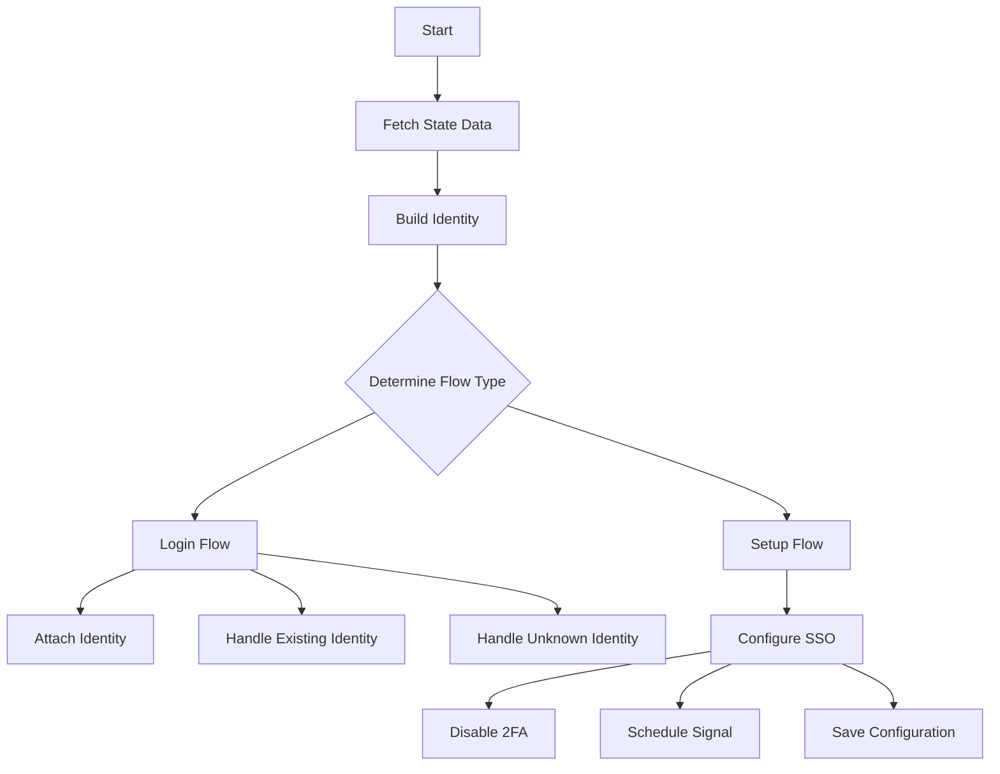

This document will cover the Authentication Pipeline Completion process, which includes:

1. Fetching state data
2. Building the identity
3. Determining the flow type (login or setup)
4. Completing the login or setup process.

Technical document: <SwmLink doc-title="Authentication Pipeline Completion">[Authentication Pipeline Completion](/.swm/authentication-pipeline-completion.ozfsihpj.sw.md)</SwmLink>

# [Fetching State Data](https://app.swimm.io/repos/Z2l0aHViJTNBJTNBc2VudHJ5LWRlbW8tMSUzQSUzQVN3aW1tLURlbW8=/docs/ozfsihpj#finish_pipeline)

The first step in completing the authentication pipeline is to fetch the state data. This data contains information saved during the initial steps of the authentication process. If the state data has expired or is missing, the process cannot continue, and an error is returned to the user.

# [Building the Identity](https://app.swimm.io/repos/Z2l0aHViJTNBJTNBc2VudHJ5LWRlbW8tMSUzQSUzQVN3aW1tLURlbW8=/docs/ozfsihpj#finish_pipeline)

Once the state data is successfully fetched, the next step is to build the user's identity. This involves creating a representation of the user based on the information provided by the authentication provider. If the identity cannot be built due to invalid data, an error is returned.

# [Determining the Flow Type](https://app.swimm.io/repos/Z2l0aHViJTNBJTNBc2VudHJ5LWRlbW8tMSUzQSUzQVN3aW1tLURlbW8=/docs/ozfsihpj#finish_pipeline)

The process then determines whether the user is logging in or setting up a new account. This decision is based on the flow type saved in the state data. If the flow type is unrecognized, an exception is raised.

# [Completing the Login Process](https://app.swimm.io/repos/Z2l0aHViJTNBJTNBc2VudHJ5LWRlbW8tMSUzQSUzQVN3aW1tLURlbW8=/docs/ozfsihpj#_finish_login_pipeline)

If the user is logging in, the system attempts to attach the identity to the user. If the identity is already linked, the user is logged in immediately. If the identity is new or unknown, the system handles it accordingly by either attaching it to the user, creating a new user, or merging it with an existing user.

# [Completing the Setup Process](https://app.swimm.io/repos/Z2l0aHViJTNBJTNBc2VudHJ5LWRlbW8tMSUzQSUzQVN3aW1tLURlbW8=/docs/ozfsihpj#_finish_setup_pipeline)

If the user is setting up a new account, the system configures Single Sign-On (SSO) for the organization. This involves creating the authentication provider, linking the identity to the user, disabling two-factor authentication if necessary, and scheduling a signal to indicate that SSO has been enabled.

# [Disabling Two-Factor Authentication](https://app.swimm.io/repos/Z2l0aHViJTNBJTNBc2VudHJ5LWRlbW8tMSUzQSUzQVN3aW1tLURlbW8=/docs/ozfsihpj#disable_2fa_required)

During the setup process, if two-factor authentication (2FA) is required by the organization, it is disabled to allow SSO to be enabled. This step ensures that both 2FA and SSO are not enabled simultaneously, which could cause conflicts.

# [Scheduling a Signal](https://app.swimm.io/repos/Z2l0aHViJTNBJTNBc2VudHJ5LWRlbW8tMSUzQSUzQVN3aW1tLURlbW8=/docs/ozfsihpj#schedule_signal)

After configuring SSO, a signal is scheduled to notify the system that SSO has been enabled for the organization. This involves creating a payload with the necessary information and saving it to the outbox for further processing.

# [Saving the Configuration](https://app.swimm.io/repos/Z2l0aHViJTNBJTNBc2VudHJ5LWRlbW8tMSUzQSUzQVN3aW1tLURlbW8=/docs/ozfsihpj#save)

The final step in the setup process is to save the configuration. This ensures that all related models are updated and the configuration is written into the event stream for further processing.

&nbsp;

*This is an auto-generated document by Swimm AI 🌊 and has not yet been verified by a human*

<SwmMeta version="3.0.0" repo-id="Z2l0aHViJTNBJTNBc2VudHJ5LWRlbW8tMSUzQSUzQVN3aW1tLURlbW8=" repo-name="sentry-demo-1" doc-type="product-flows">Powered by [Swimm](/)</SwmMeta>
