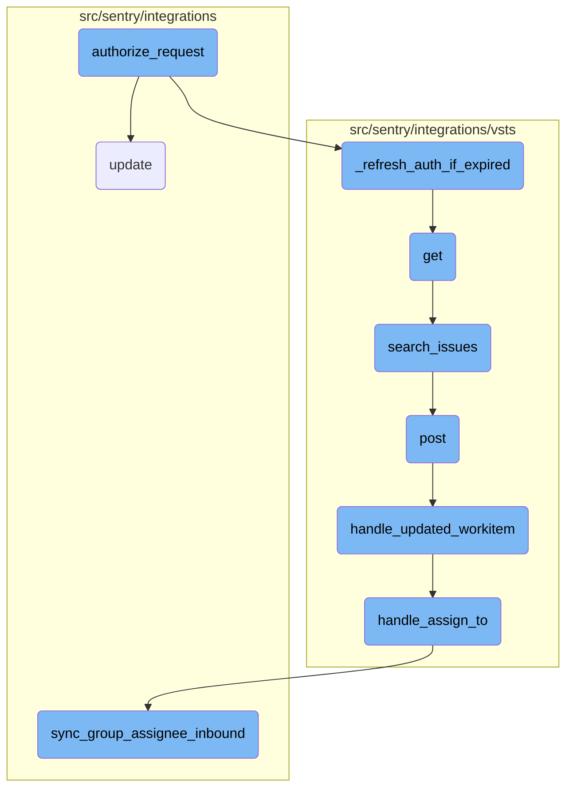
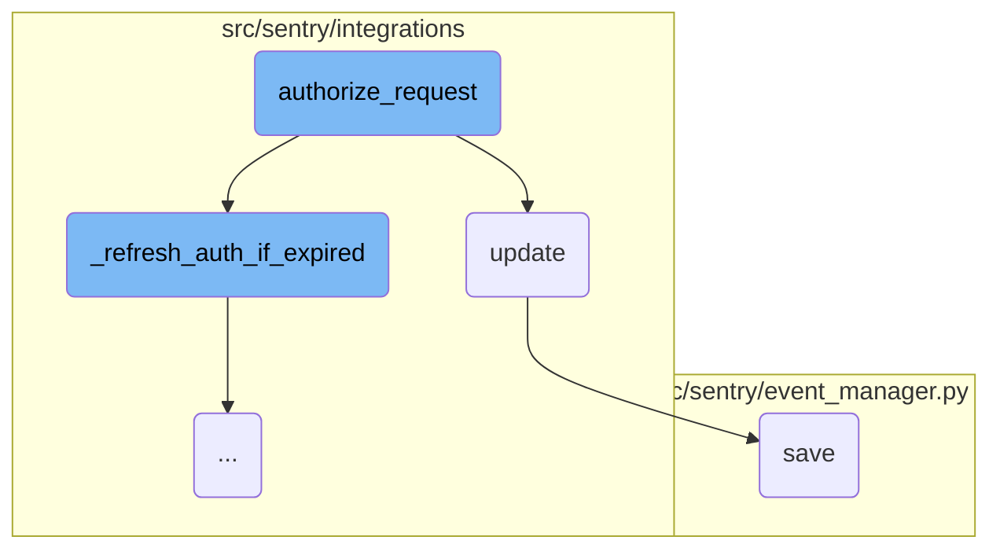
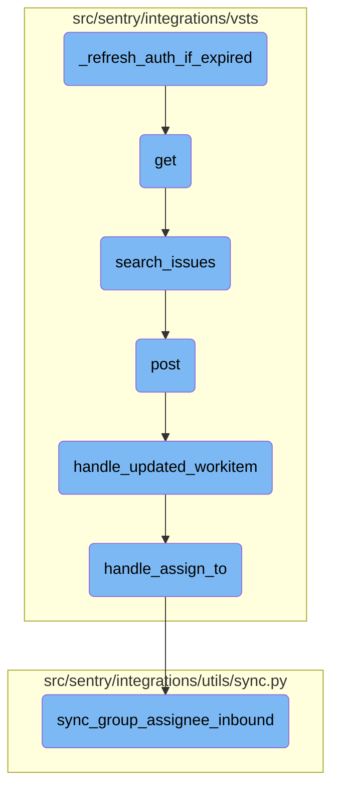

In this document, we will explain the process of authorizing a request. The process involves checking and refreshing the authentication token if necessary, retrieving the access token, preparing the authorization header, and updating the request headers.

The flow starts with checking if the authentication token has expired. If it has, the token is refreshed. Next, the access token is retrieved from the identity data. An authorization header is then prepared using this access token. Finally, the headers of the request are updated with the authorization header to ensure the request is properly authenticated.

Here is a high level diagram of the flow, showing only the most important functions:



# Flow drill down

First, we'll zoom into this section of the flow:



<SwmSnippet path="/src/sentry/integrations/vsts/client.py" line="211">

---

## Authorizing the Request

The function <SwmToken path="src/sentry/integrations/vsts/client.py" pos="207:3:3" line-data="    def authorize_request(">`authorize_request`</SwmToken> is responsible for ensuring that the request has a valid authorization token. It first calls <SwmToken path="src/sentry/integrations/vsts/client.py" pos="211:3:3" line-data="        self._refresh_auth_if_expired()">`_refresh_auth_if_expired`</SwmToken> to refresh the token if it has expired. Then, it retrieves the access token from the identity data and prepares the authorization header. Finally, it updates the headers of the prepared request with the authorization header.

```python
        self._refresh_auth_if_expired()
        access_token = self.identity.data["access_token"]
        headers = prepare_auth_header(
            access_token=access_token,
        )
        prepared_request.headers.update(headers)
        return prepared_request
```

---

</SwmSnippet>

<SwmSnippet path="/src/sentry/integrations/api/bases/external_actor.py" line="109">

---

## Updating the External Actor

The function <SwmToken path="src/sentry/integrations/api/bases/external_actor.py" pos="110:3:3" line-data="            validated_data.update(self.get_actor_params({**validated_data}))">`update`</SwmToken> is used to update the attributes of an <SwmToken path="src/sentry/integrations/api/bases/external_actor.py" pos="115:12:12" line-data="            assert type(self.instance) is ExternalActor, &quot;Instance type must be ExternalActor&quot;">`ExternalActor`</SwmToken> instance. It first removes the <SwmToken path="src/sentry/integrations/vsts/client.py" pos="72:16:16" line-data="    work_items = &quot;{instance}_apis/wit/workitems/{id}&quot;">`id`</SwmToken> from the validated data if it exists. Then, it updates the validated data with actor parameters if the actor key is present. The function iterates over the validated data and sets the corresponding attributes on the instance. Finally, it saves the instance and returns it.

```python
        if self._actor_key in validated_data:
            validated_data.update(self.get_actor_params({**validated_data}))

        for key, value in validated_data.items():
            setattr(self.instance, key, value)
        try:
            assert type(self.instance) is ExternalActor, "Instance type must be ExternalActor"
            self.instance.save()
            return self.instance
```

---

</SwmSnippet>

<SwmSnippet path="/src/sentry/event_manager.py" line="476">

---

## Saving the Event

The function <SwmToken path="src/sentry/integrations/api/bases/external_actor.py" pos="116:5:5" line-data="            self.instance.save()">`save`</SwmToken> is responsible for normalizing and processing an event before saving it. If the event is not already normalized, it calls the <SwmToken path="src/sentry/event_manager.py" pos="476:3:3" line-data="        # Normalize if needed">`Normalize`</SwmToken> method to normalize it. This step ensures that the event data is in the correct format before proceeding with further processing.

```python
        # Normalize if needed
        if not self._normalized:
            if not assume_normalized:
                self.normalize(project_id=project_id)
            self._normalized = True
```

---

</SwmSnippet>

Now, lets zoom into this section of the flow:



<SwmSnippet path="/src/sentry/integrations/vsts/client.py" line="198">

---

## Refreshing Authentication

The function <SwmToken path="src/sentry/integrations/vsts/client.py" pos="211:3:3" line-data="        self._refresh_auth_if_expired()">`_refresh_auth_if_expired`</SwmToken> checks if the authentication token has expired and refreshes it if necessary. This ensures that subsequent API requests are authenticated properly. If the token is expired, it calls the <SwmToken path="src/sentry/integrations/vsts/client.py" pos="202:9:9" line-data="            self.identity.get_provider().refresh_identity(">`refresh_identity`</SwmToken> method of the identity provider to obtain a new token.

```python
        time_expires = self.identity.data.get("expires")
        if time_expires is None:
            raise InvalidIdentity("VstsApiClient requires identity with specified expired time")
        if int(time_expires) <= int(time()):
            self.identity.get_provider().refresh_identity(
                self.identity, redirect_url=self.oauth_redirect_url
            )
```

---

</SwmSnippet>

&nbsp;

*This is an auto-generated document by Swimm AI 🌊 and has not yet been verified by a human*

<SwmMeta version="3.0.0" repo-id="Z2l0aHViJTNBJTNBc2VudHJ5LWRlbW8tMSUzQSUzQVN3aW1tLURlbW8=" repo-name="sentry-demo-1" doc-type="flows"><sup>Powered by [Swimm](/)</sup></SwmMeta>
