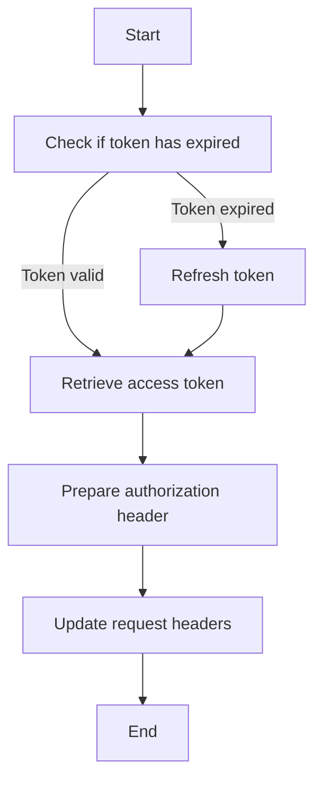

This document will cover the process of authorizing a request, which includes:

1. Checking if the authentication token has expired
2. Refreshing the token if necessary
3. Retrieving the access token
4. Preparing the authorization header
5. Updating the request headers.

Technical document: <SwmLink doc-title="Authorizing a Request">[Authorizing a Request](/.swm/authorizing-a-request.6z884pwm.sw.md)</SwmLink>

# [Checking if the authentication token has expired](https://app.swimm.io/repos/Z2l0aHViJTNBJTNBc2VudHJ5LWRlbW8tMSUzQSUzQVN3aW1tLURlbW8=/docs/6z884pwm#checking-if-the-authentication-token-has-expired)

The first step in authorizing a request is to check if the authentication token has expired. This is crucial because an expired token cannot be used to authenticate a request. If the token is expired, it needs to be refreshed to ensure that the request can be properly authenticated.

# [Refreshing the token if necessary](https://app.swimm.io/repos/Z2l0aHViJTNBJTNBc2VudHJ5LWRlbW8tMSUzQSUzQVN3aW1tLURlbW8=/docs/6z884pwm#refreshing-authentication)

If the authentication token has expired, the system will refresh it. This involves calling the identity provider to obtain a new token. This step ensures that the system always has a valid token for authenticating requests, which is essential for maintaining secure and uninterrupted access to the service.

# [Retrieving the access token](https://app.swimm.io/repos/Z2l0aHViJTNBJTNBc2VudHJ5LWRlbW8tMSUzQSUzQVN3aW1tLURlbW8=/docs/6z884pwm#authorizing-the-request)

Once the token is confirmed to be valid (either it was already valid or it has been refreshed), the next step is to retrieve the access token from the identity data. The access token is a key piece of information that will be used to prepare the authorization header.

# [Preparing the authorization header](https://app.swimm.io/repos/Z2l0aHViJTNBJTNBc2VudHJ5LWRlbW8tMSUzQSUzQVN3aW1tLURlbW8=/docs/6z884pwm#authorizing-the-request)

With the access token in hand, the system prepares the authorization header. This header includes the access token and is used to authenticate the request. The authorization header is a standard way to include credentials in a request, ensuring that the server can verify the identity of the requester.

# [Updating the request headers](https://app.swimm.io/repos/Z2l0aHViJTNBJTNBc2VudHJ5LWRlbW8tMSUzQSUzQVN3aW1tLURlbW8=/docs/6z884pwm#authorizing-the-request)

The final step in the process is to update the headers of the request with the newly prepared authorization header. This step ensures that the request is properly authenticated before it is sent to the server. By updating the request headers, the system guarantees that the server will recognize and accept the request as coming from an authenticated source.

&nbsp;

*This is an auto-generated document by Swimm AI 🌊 and has not yet been verified by a human*

<SwmMeta version="3.0.0" repo-id="Z2l0aHViJTNBJTNBc2VudHJ5LWRlbW8tMSUzQSUzQVN3aW1tLURlbW8=" repo-name="sentry-demo-1" doc-type="product-flows">Powered by [Swimm](/)</SwmMeta>
