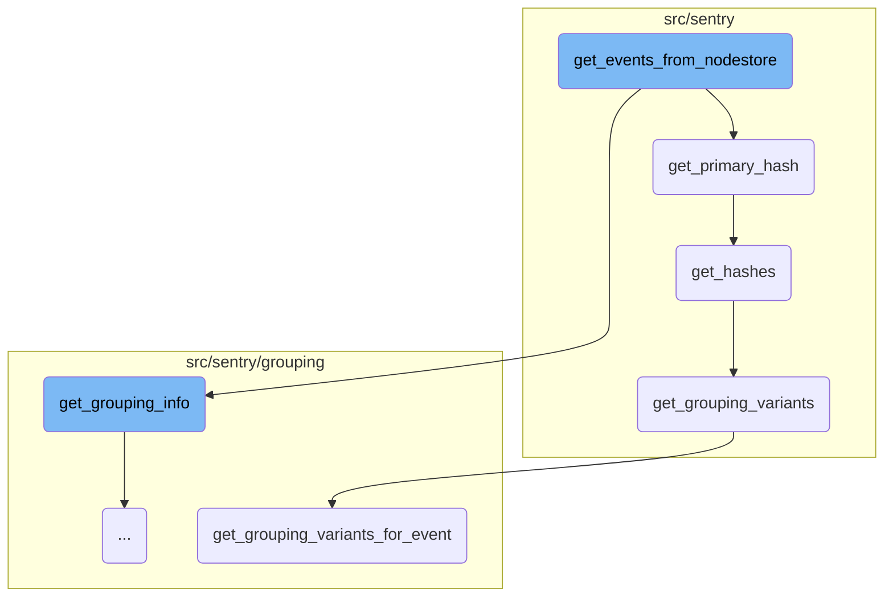
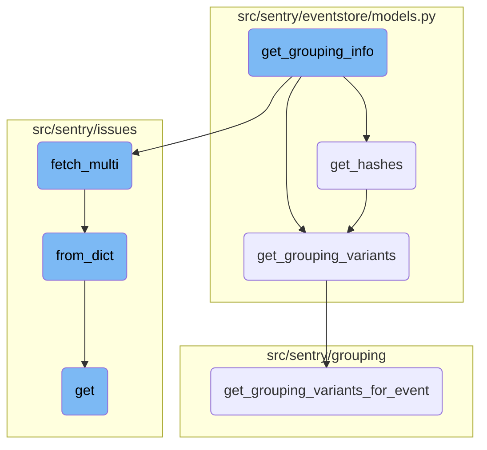

This document explains the process of backfilling Seer grouping records for a project. The process involves initializing the backfill, updating groups with similarity data, deleting old Seer grouping records, and extracting event data from the nodestore.

The flow starts with initializing the backfill process, which sets up the necessary project and group information. Next, it updates the groups with new similarity data received from Seer. After updating, it deletes old Seer grouping records to ensure data consistency. Finally, it extracts event data from the nodestore, processes it to generate grouping records, and updates the project's metadata accordingly.

Here is a high level diagram of the flow, showing only the most important functions:

```mermaid
graph TD;
      subgraph src/sentry/tasks/embeddings_grouping
de04bcdfb4faf2fbf11ded4e5df169f9c2d5fa05d94013f92c6800d113c4bc90(backfill_seer_grouping_records_for_project):::mainFlowStyle --> 0d1ef396ae553adf1cac839e22c501fab9380c77db8194b35bd74cad36356d17(initialize_backfill)
end

subgraph src/sentry/tasks/embeddings_grouping
de04bcdfb4faf2fbf11ded4e5df169f9c2d5fa05d94013f92c6800d113c4bc90(backfill_seer_grouping_records_for_project):::mainFlowStyle --> 71722fff24d1c8fdf34d86c29f2cf9fc68cb2dca3d069641bfa5b7a823bd5c2c(update_groups)
end

subgraph src/sentry/tasks/embeddings_grouping
de04bcdfb4faf2fbf11ded4e5df169f9c2d5fa05d94013f92c6800d113c4bc90(backfill_seer_grouping_records_for_project):::mainFlowStyle --> a58a55f24ba10c62db67c38102155b34244e01cf32ff19e3338a24c66ff8648e(delete_seer_grouping_records)
end

subgraph src/sentry/tasks/embeddings_grouping
de04bcdfb4faf2fbf11ded4e5df169f9c2d5fa05d94013f92c6800d113c4bc90(backfill_seer_grouping_records_for_project):::mainFlowStyle --> 5aa6b4e03a29e571feec6b7dac13d034d18a44a3b4946dda63e8fa854e26d329(get_events_from_nodestore):::mainFlowStyle
end

subgraph src/sentry
5aa6b4e03a29e571feec6b7dac13d034d18a44a3b4946dda63e8fa854e26d329(get_events_from_nodestore):::mainFlowStyle --> 3d67eb8f6b38b3926fd664ab032ca18fe16bd49b50ac20acbbbebd2f1dc6a863(get_primary_hash)
end

subgraph src/sentry
5aa6b4e03a29e571feec6b7dac13d034d18a44a3b4946dda63e8fa854e26d329(get_events_from_nodestore):::mainFlowStyle --> 85d5d6330d99a3e417f5d86fbf723df96e56265fe7c7d4bbb779f0444356c549(get_grouping_info):::mainFlowStyle
end

subgraph src/sentry
85d5d6330d99a3e417f5d86fbf723df96e56265fe7c7d4bbb779f0444356c549(get_grouping_info):::mainFlowStyle --> 977f0af0138e9de0824c410a079c3152fef0522c0fc38f712988bbe969b39dc1(get_hashes)
end

subgraph src/sentry
85d5d6330d99a3e417f5d86fbf723df96e56265fe7c7d4bbb779f0444356c549(get_grouping_info):::mainFlowStyle --> a4b8da644b44f7024e8a45f19d1c57afd487d75d9aa202ece2e034f444b582b9(get_grouping_variants)
end

subgraph src/sentry/issues
85d5d6330d99a3e417f5d86fbf723df96e56265fe7c7d4bbb779f0444356c549(get_grouping_info):::mainFlowStyle --> 5463d9c7f22de30a02d48b89affe8e15db78e49c3e6f1f4071aaaf84e7553f50(fetch_multi):::mainFlowStyle
end

subgraph src/sentry/issues
5463d9c7f22de30a02d48b89affe8e15db78e49c3e6f1f4071aaaf84e7553f50(fetch_multi):::mainFlowStyle --> c8e85daa51c49087672be6efc928d2b7dc55d6dee90fec10e7c79ea946903677(from_dict):::mainFlowStyle
end

subgraph src/sentry/issues
c8e85daa51c49087672be6efc928d2b7dc55d6dee90fec10e7c79ea946903677(from_dict):::mainFlowStyle --> 5704f148003ca0752928d33326944fba91b6a46fe504b14e7b3d7b4b49d7ed78(get):::mainFlowStyle
end


      classDef mainFlowStyle color:#000000,fill:#7CB9F4
classDef rootsStyle color:#000000,fill:#00FFF4
classDef Style1 color:#000000,fill:#00FFAA
classDef Style2 color:#000000,fill:#FFFF00
classDef Style3 color:#000000,fill:#AA7CB9

%% Swimm:
%% graph TD;
%%       subgraph <SwmPath>[src/sentry/tasks/embeddings_grouping/](src/sentry/tasks/embeddings_grouping/)</SwmPath>
%% de04bcdfb4faf2fbf11ded4e5df169f9c2d5fa05d94013f92c6800d113c4bc90(backfill_seer_grouping_records_for_project):::mainFlowStyle --> 0d1ef396ae553adf1cac839e22c501fab9380c77db8194b35bd74cad36356d17(initialize_backfill)
%% end
%% 
%% subgraph <SwmPath>[src/sentry/tasks/embeddings_grouping/](src/sentry/tasks/embeddings_grouping/)</SwmPath>
%% de04bcdfb4faf2fbf11ded4e5df169f9c2d5fa05d94013f92c6800d113c4bc90(backfill_seer_grouping_records_for_project):::mainFlowStyle --> 71722fff24d1c8fdf34d86c29f2cf9fc68cb2dca3d069641bfa5b7a823bd5c2c(update_groups)
%% end
%% 
%% subgraph <SwmPath>[src/sentry/tasks/embeddings_grouping/](src/sentry/tasks/embeddings_grouping/)</SwmPath>
%% de04bcdfb4faf2fbf11ded4e5df169f9c2d5fa05d94013f92c6800d113c4bc90(backfill_seer_grouping_records_for_project):::mainFlowStyle --> a58a55f24ba10c62db67c38102155b34244e01cf32ff19e3338a24c66ff8648e(delete_seer_grouping_records)
%% end
%% 
%% subgraph <SwmPath>[src/sentry/tasks/embeddings_grouping/](src/sentry/tasks/embeddings_grouping/)</SwmPath>
%% de04bcdfb4faf2fbf11ded4e5df169f9c2d5fa05d94013f92c6800d113c4bc90(backfill_seer_grouping_records_for_project):::mainFlowStyle --> 5aa6b4e03a29e571feec6b7dac13d034d18a44a3b4946dda63e8fa854e26d329(get_events_from_nodestore):::mainFlowStyle
%% end
%% 
%% subgraph <SwmPath>[src/sentry/](src/sentry/)</SwmPath>
%% 5aa6b4e03a29e571feec6b7dac13d034d18a44a3b4946dda63e8fa854e26d329(get_events_from_nodestore):::mainFlowStyle --> 3d67eb8f6b38b3926fd664ab032ca18fe16bd49b50ac20acbbbebd2f1dc6a863(get_primary_hash)
%% end
%% 
%% subgraph <SwmPath>[src/sentry/](src/sentry/)</SwmPath>
%% 5aa6b4e03a29e571feec6b7dac13d034d18a44a3b4946dda63e8fa854e26d329(get_events_from_nodestore):::mainFlowStyle --> 85d5d6330d99a3e417f5d86fbf723df96e56265fe7c7d4bbb779f0444356c549(get_grouping_info):::mainFlowStyle
%% end
%% 
%% subgraph <SwmPath>[src/sentry/](src/sentry/)</SwmPath>
%% 85d5d6330d99a3e417f5d86fbf723df96e56265fe7c7d4bbb779f0444356c549(get_grouping_info):::mainFlowStyle --> 977f0af0138e9de0824c410a079c3152fef0522c0fc38f712988bbe969b39dc1(get_hashes)
%% end
%% 
%% subgraph <SwmPath>[src/sentry/](src/sentry/)</SwmPath>
%% 85d5d6330d99a3e417f5d86fbf723df96e56265fe7c7d4bbb779f0444356c549(get_grouping_info):::mainFlowStyle --> a4b8da644b44f7024e8a45f19d1c57afd487d75d9aa202ece2e034f444b582b9(get_grouping_variants)
%% end
%% 
%% subgraph <SwmPath>[src/sentry/issues/](src/sentry/issues/)</SwmPath>
%% 85d5d6330d99a3e417f5d86fbf723df96e56265fe7c7d4bbb779f0444356c549(get_grouping_info):::mainFlowStyle --> 5463d9c7f22de30a02d48b89affe8e15db78e49c3e6f1f4071aaaf84e7553f50(fetch_multi):::mainFlowStyle
%% end
%% 
%% subgraph <SwmPath>[src/sentry/issues/](src/sentry/issues/)</SwmPath>
%% 5463d9c7f22de30a02d48b89affe8e15db78e49c3e6f1f4071aaaf84e7553f50(fetch_multi):::mainFlowStyle --> c8e85daa51c49087672be6efc928d2b7dc55d6dee90fec10e7c79ea946903677(from_dict):::mainFlowStyle
%% end
%% 
%% subgraph <SwmPath>[src/sentry/issues/](src/sentry/issues/)</SwmPath>
%% c8e85daa51c49087672be6efc928d2b7dc55d6dee90fec10e7c79ea946903677(from_dict):::mainFlowStyle --> 5704f148003ca0752928d33326944fba91b6a46fe504b14e7b3d7b4b49d7ed78(get):::mainFlowStyle
%% end
%% 
%% 
%%       classDef mainFlowStyle color:#000000,fill:#7CB9F4
%% classDef rootsStyle color:#000000,fill:#00FFF4
%% classDef Style1 color:#000000,fill:#00FFAA
%% classDef Style2 color:#000000,fill:#FFFF00
%% classDef Style3 color:#000000,fill:#AA7CB9
```



# Flow drill down

First, we'll zoom into this section of the flow:

```mermaid
graph TD;
      subgraph src/sentry/tasks/embeddings_grouping
de04bcdfb4faf2fbf11ded4e5df169f9c2d5fa05d94013f92c6800d113c4bc90(backfill_seer_grouping_records_for_project):::mainFlowStyle --> 0d1ef396ae553adf1cac839e22c501fab9380c77db8194b35bd74cad36356d17(initialize_backfill)
end

subgraph src/sentry/tasks/embeddings_grouping
de04bcdfb4faf2fbf11ded4e5df169f9c2d5fa05d94013f92c6800d113c4bc90(backfill_seer_grouping_records_for_project):::mainFlowStyle --> 71722fff24d1c8fdf34d86c29f2cf9fc68cb2dca3d069641bfa5b7a823bd5c2c(update_groups)
end

subgraph src/sentry/tasks/embeddings_grouping
de04bcdfb4faf2fbf11ded4e5df169f9c2d5fa05d94013f92c6800d113c4bc90(backfill_seer_grouping_records_for_project):::mainFlowStyle --> a58a55f24ba10c62db67c38102155b34244e01cf32ff19e3338a24c66ff8648e(delete_seer_grouping_records)
end

subgraph src/sentry/tasks/embeddings_grouping
de04bcdfb4faf2fbf11ded4e5df169f9c2d5fa05d94013f92c6800d113c4bc90(backfill_seer_grouping_records_for_project):::mainFlowStyle --> 5aa6b4e03a29e571feec6b7dac13d034d18a44a3b4946dda63e8fa854e26d329(get_events_from_nodestore):::mainFlowStyle
end

subgraph src/sentry/tasks/embeddings_grouping
5aa6b4e03a29e571feec6b7dac13d034d18a44a3b4946dda63e8fa854e26d329(get_events_from_nodestore):::mainFlowStyle --> gmetx(...)
end

subgraph src/sentry
a58a55f24ba10c62db67c38102155b34244e01cf32ff19e3338a24c66ff8648e(delete_seer_grouping_records) --> 77c6d5edfb782925458de98d1e5b6ebb3fa3ab09fb9394a3981741e6d65a6422(bulk_update)
end

subgraph src/sentry
71722fff24d1c8fdf34d86c29f2cf9fc68cb2dca3d069641bfa5b7a823bd5c2c(update_groups) --> 77c6d5edfb782925458de98d1e5b6ebb3fa3ab09fb9394a3981741e6d65a6422(bulk_update)
end

subgraph src/sentry
0d1ef396ae553adf1cac839e22c501fab9380c77db8194b35bd74cad36356d17(initialize_backfill) --> a8f139852fe3ed48053d1b13a24ee9c9177172b61f302d5f73308ffc5dda6813(get_from_cache)
end


      classDef mainFlowStyle color:#000000,fill:#7CB9F4
classDef rootsStyle color:#000000,fill:#00FFF4
classDef Style1 color:#000000,fill:#00FFAA
classDef Style2 color:#000000,fill:#FFFF00
classDef Style3 color:#000000,fill:#AA7CB9

%% Swimm:
%% graph TD;
%%       subgraph <SwmPath>[src/sentry/tasks/embeddings_grouping/](src/sentry/tasks/embeddings_grouping/)</SwmPath>
%% de04bcdfb4faf2fbf11ded4e5df169f9c2d5fa05d94013f92c6800d113c4bc90(backfill_seer_grouping_records_for_project):::mainFlowStyle --> 0d1ef396ae553adf1cac839e22c501fab9380c77db8194b35bd74cad36356d17(initialize_backfill)
%% end
%% 
%% subgraph <SwmPath>[src/sentry/tasks/embeddings_grouping/](src/sentry/tasks/embeddings_grouping/)</SwmPath>
%% de04bcdfb4faf2fbf11ded4e5df169f9c2d5fa05d94013f92c6800d113c4bc90(backfill_seer_grouping_records_for_project):::mainFlowStyle --> 71722fff24d1c8fdf34d86c29f2cf9fc68cb2dca3d069641bfa5b7a823bd5c2c(update_groups)
%% end
%% 
%% subgraph <SwmPath>[src/sentry/tasks/embeddings_grouping/](src/sentry/tasks/embeddings_grouping/)</SwmPath>
%% de04bcdfb4faf2fbf11ded4e5df169f9c2d5fa05d94013f92c6800d113c4bc90(backfill_seer_grouping_records_for_project):::mainFlowStyle --> a58a55f24ba10c62db67c38102155b34244e01cf32ff19e3338a24c66ff8648e(delete_seer_grouping_records)
%% end
%% 
%% subgraph <SwmPath>[src/sentry/tasks/embeddings_grouping/](src/sentry/tasks/embeddings_grouping/)</SwmPath>
%% de04bcdfb4faf2fbf11ded4e5df169f9c2d5fa05d94013f92c6800d113c4bc90(backfill_seer_grouping_records_for_project):::mainFlowStyle --> 5aa6b4e03a29e571feec6b7dac13d034d18a44a3b4946dda63e8fa854e26d329(get_events_from_nodestore):::mainFlowStyle
%% end
%% 
%% subgraph <SwmPath>[src/sentry/tasks/embeddings_grouping/](src/sentry/tasks/embeddings_grouping/)</SwmPath>
%% 5aa6b4e03a29e571feec6b7dac13d034d18a44a3b4946dda63e8fa854e26d329(get_events_from_nodestore):::mainFlowStyle --> gmetx(...)
%% end
%% 
%% subgraph <SwmPath>[src/sentry/](src/sentry/)</SwmPath>
%% a58a55f24ba10c62db67c38102155b34244e01cf32ff19e3338a24c66ff8648e(delete_seer_grouping_records) --> 77c6d5edfb782925458de98d1e5b6ebb3fa3ab09fb9394a3981741e6d65a6422(bulk_update)
%% end
%% 
%% subgraph <SwmPath>[src/sentry/](src/sentry/)</SwmPath>
%% 71722fff24d1c8fdf34d86c29f2cf9fc68cb2dca3d069641bfa5b7a823bd5c2c(update_groups) --> 77c6d5edfb782925458de98d1e5b6ebb3fa3ab09fb9394a3981741e6d65a6422(bulk_update)
%% end
%% 
%% subgraph <SwmPath>[src/sentry/](src/sentry/)</SwmPath>
%% 0d1ef396ae553adf1cac839e22c501fab9380c77db8194b35bd74cad36356d17(initialize_backfill) --> a8f139852fe3ed48053d1b13a24ee9c9177172b61f302d5f73308ffc5dda6813(get_from_cache)
%% end
%% 
%% 
%%       classDef mainFlowStyle color:#000000,fill:#7CB9F4
%% classDef rootsStyle color:#000000,fill:#00FFF4
%% classDef Style1 color:#000000,fill:#00FFAA
%% classDef Style2 color:#000000,fill:#FFFF00
%% classDef Style3 color:#000000,fill:#AA7CB9
```



<SwmSnippet path="/src/sentry/tasks/embeddings_grouping/backfill_seer_grouping_records_for_project.py" line="77">

---

## Initialization Process

The <SwmToken path="src/sentry/tasks/embeddings_grouping/backfill_seer_grouping_records_for_project.py" pos="78:14:14" line-data="        (project, last_processed_group_id, last_processed_project_index,) = initialize_backfill(">`initialize_backfill`</SwmToken> function is called to set up the backfill process. It retrieves the project and initializes the last processed group and project indices.

```python
    try:
        (project, last_processed_group_id, last_processed_project_index,) = initialize_backfill(
            current_project_id,
            last_processed_group_id_input,
            last_processed_project_index_input,
        )
```

---

</SwmSnippet>

<SwmSnippet path="/src/sentry/tasks/embeddings_grouping/utils.py" line="492">

---

## Updating Groups

The <SwmToken path="src/sentry/tasks/embeddings_grouping/utils.py" pos="492:2:2" line-data="def update_groups(project, seer_response, group_id_batch_filtered, group_hashes_dict):">`update_groups`</SwmToken> function updates the groups with the similarity data received from Seer. It filters the groups and updates their metadata with the new similarity information.

```python
def update_groups(project, seer_response, group_id_batch_filtered, group_hashes_dict):
    groups_with_neighbor = seer_response["groups_with_neighbor"]
    groups = Group.objects.filter(project_id=project.id, id__in=group_id_batch_filtered)
    for group in groups:
        seer_similarity: dict[str, Any] = {
            "similarity_model_version": SEER_SIMILARITY_MODEL_VERSION,
            "request_hash": group_hashes_dict[group.id],
        }
        if str(group.id) in groups_with_neighbor:
            logger.info(
                "backfill_seer_grouping_records.found_neighbor",
                extra={
                    "project_id": project.id,
                    "group_id": group.id,
                },
            )
            # TODO: remove this try catch once the helper is made
            try:
                seer_similarity["results"] = [
                    asdict(
                        SeerSimilarIssueData.from_raw(
```

---

</SwmSnippet>

<SwmSnippet path="/src/sentry/tasks/embeddings_grouping/utils.py" line="696">

---

## Deleting Seer Grouping Records

The <SwmToken path="src/sentry/tasks/embeddings_grouping/utils.py" pos="696:2:2" line-data="def delete_seer_grouping_records(">`delete_seer_grouping_records`</SwmToken> function deletes all Seer grouping records for a given project. It also removes the Seer similarity data from the project's group metadata.

```python
def delete_seer_grouping_records(
    project_id: int,
):
    """
    Delete seer grouping records for the project_id.
    Delete seer_similarity from the project's groups metadata.
    """
    logger.info(
        "backfill_seer_grouping_records.delete_all_seer_records",
        extra={"project_id": project_id},
    )
    delete_project_grouping_records(project_id)

    for groups in chunked(
        RangeQuerySetWrapper(
            Group.objects.filter(project_id=project_id, type=ErrorGroupType.type_id)
        ),
        BULK_DELETE_METADATA_CHUNK_SIZE,
    ):
        groups_with_seer_metadata = [
            group
```

---

</SwmSnippet>

<SwmSnippet path="/src/sentry/hybridcloud/outbox/base.py" line="115">

---

## Bulk Update

The <SwmToken path="src/sentry/hybridcloud/outbox/base.py" pos="115:3:3" line-data="    def bulk_update(">`bulk_update`</SwmToken> function is used to update multiple objects in the database efficiently. It ensures that the updates are performed within a transactional context.

```python
    def bulk_update(
        self, objs: Iterable[_RM], fields: Sequence[str], *args: Any, **kwds: Any
    ) -> Any:
        from sentry.hybridcloud.models.outbox import outbox_context

        tuple_of_objs: tuple[_RM, ...] = tuple(objs)
        if not tuple_of_objs:
            return super().bulk_update(tuple_of_objs, fields, *args, **kwds)

        model: type[_RM] = type(tuple_of_objs[0])
        using = router.db_for_write(model)
        with outbox_context(transaction.atomic(using=using), flush=False):
            outboxes: list[RegionOutboxBase] = []
            for obj in tuple_of_objs:
                outboxes.append(obj.outbox_for_update())

            type(outboxes[0]).objects.bulk_create(outboxes)
            return super().bulk_update(tuple_of_objs, fields, *args, **kwds)
```

---

</SwmSnippet>

<SwmSnippet path="/src/sentry/db/models/manager/base.py" line="284">

---

## Fetching from Cache

The <SwmToken path="src/sentry/db/models/manager/base.py" pos="284:3:3" line-data="    def get_from_cache(">`get_from_cache`</SwmToken> function retrieves objects from the cache to avoid hitting the database repeatedly. It ensures that the cache is validated and updated as needed.

```python
    def get_from_cache(
        self, use_replica: bool = settings.SENTRY_MODEL_CACHE_USE_REPLICA, **kwargs: Any
    ) -> M:
        """
        Wrapper around QuerySet.get which supports caching of the
        intermediate value.  Callee is responsible for making sure
        the cache key is cleared on save.
        """
        if not self.cache_fields:
            raise ValueError("We cannot cache this query. Just hit the database.")

        key, pk_name, value = self._get_cacheable_kv_from_kwargs(kwargs)
        if key not in self.cache_fields and key != pk_name:
            raise ValueError("We cannot cache this query. Just hit the database.")

        cache_key = self.__get_lookup_cache_key(**{key: value})
        local_cache = self._get_local_cache()

        def validate_result(inst: Any) -> M:
            if isinstance(inst, self.model) and (key != pk_name or int(value) == inst.pk):
                return inst
```

---

</SwmSnippet>

Now, lets zoom into this section of the flow:



<SwmSnippet path="/src/sentry/tasks/embeddings_grouping/utils.py" line="305">

---

## Extracting and processing event data

The function <SwmToken path="src/sentry/tasks/embeddings_grouping/utils.py" pos="305:2:2" line-data="def get_events_from_nodestore(">`get_events_from_nodestore`</SwmToken> is responsible for extracting event data from the nodestore and processing it to generate grouping records. It first retrieves the event data using <SwmToken path="src/sentry/tasks/embeddings_grouping/utils.py" pos="308:5:5" line-data="    nodestore_events = lookup_group_data_stacktrace_bulk(project, snuba_results)">`lookup_group_data_stacktrace_bulk`</SwmToken>. If no data is found, it logs the information and returns empty results. For each event, it checks if the event contains stacktrace information and processes it to generate grouping information and primary hashes. Invalid events are logged, and valid events are used to create <SwmToken path="src/sentry/tasks/embeddings_grouping/utils.py" pos="23:1:1" line-data="    CreateGroupingRecordData,">`CreateGroupingRecordData`</SwmToken> objects, which are then returned along with a dictionary of group hashes.

```python
def get_events_from_nodestore(
    project, snuba_results, groups_to_backfill_with_no_embedding_has_snuba_row
):
    nodestore_events = lookup_group_data_stacktrace_bulk(project, snuba_results)
    # If nodestore returns no data
    if len(nodestore_events) == 0:
        logger.info(
            "tasks.backfill_seer_grouping_records.no_data",
            extra={
                "project_id": project.id,
                "group_id_batch": json.dumps(groups_to_backfill_with_no_embedding_has_snuba_row),
            },
        )
        return (
            GroupStacktraceData(data=[], stacktrace_list=[]),
            {},
        )

    group_data = []
    stacktrace_strings = []
    invalid_event_group_ids = []
```

---

</SwmSnippet>

<SwmSnippet path="/src/sentry/eventstore/models.py" line="476">

---

### Retrieving primary hash

The function <SwmToken path="src/sentry/eventstore/models.py" pos="476:3:3" line-data="    def get_primary_hash(self) -&gt; str | None:">`get_primary_hash`</SwmToken> retrieves the primary hash of an event. It first attempts to get hierarchical hashes and returns the first one if available. If not, it falls back to flat hashes. If no hashes are found, it logs an event indicating that no primary hash was found and returns `None`.

```python
    def get_primary_hash(self) -> str | None:
        hashes = self.get_hashes()

        if hashes.hierarchical_hashes:
            return hashes.hierarchical_hashes[0]

        if hashes.hashes:
            return hashes.hashes[0]

        # Temporary investigative measure, to try to figure out when this would happen
        logger.info(
            "Event with no primary hash",
            stack_info=True,
            extra={
                "event_id": self.event_id,
                "event_type": type(self),
                "group_id": getattr(self, "group_id", None),
                "project_id": self.project_id,
            },
        )
        return None
```

---

</SwmSnippet>

<SwmSnippet path="/src/sentry/eventstore/models.py" line="336">

---

### Calculating event hashes

The function <SwmToken path="src/sentry/eventstore/models.py" pos="336:3:3" line-data="    def get_hashes(self, force_config: StrategyConfiguration | None = None) -&gt; CalculatedHashes:">`get_hashes`</SwmToken> calculates all necessary hashes for grouping an event into issues. It returns two lists of hashes: <SwmToken path="src/sentry/eventstore/models.py" pos="339:19:19" line-data="        issues. It returns two lists of hashes, `(flat_hashes, hierarchical_hashes)`:">`flat_hashes`</SwmToken> and <SwmToken path="src/sentry/eventstore/models.py" pos="339:22:22" line-data="        issues. It returns two lists of hashes, `(flat_hashes, hierarchical_hashes)`:">`hierarchical_hashes`</SwmToken>. The function first checks if hashes are already stored in the event data and uses them if available. Otherwise, it generates new hashes from the event data, taking SDK fingerprints and checksums into consideration.

```python
    def get_hashes(self, force_config: StrategyConfiguration | None = None) -> CalculatedHashes:
        """
        Returns _all_ information that is necessary to group an event into
        issues. It returns two lists of hashes, `(flat_hashes, hierarchical_hashes)`:

        1. First, `hierarchical_hashes` is walked
           *backwards* (end to start) until one hash has been found that matches
           an existing group. Only *that* hash gets a GroupHash instance that is
           associated with the group.

        2. If no group was found, an event should be sorted into a group X, if
           there is a GroupHash matching *any* of `flat_hashes`. Hashes that do
           not yet have a GroupHash model get one and are associated with the same
           group (unless they already belong to another group).

           This is how regular grouping works.

        Whichever group the event lands in is associated with exactly one
        GroupHash corresponding to an entry in `hierarchical_hashes`, and an
        arbitrary amount of hashes from `flat_hashes` depending on whether some
        of those hashes have GroupHashes already assigned to other groups (and
```

---

</SwmSnippet>

<SwmSnippet path="/src/sentry/eventstore/models.py" line="424">

---

### Generating grouping variants

The function <SwmToken path="src/sentry/eventstore/models.py" pos="424:3:3" line-data="    def get_grouping_variants(">`get_grouping_variants`</SwmToken> returns the grouping components for each variant in a dictionary. It can optionally normalize stacktraces before generating the variants. The function loads the appropriate grouping configuration and calls <SwmToken path="src/sentry/eventstore/models.py" pos="438:11:11" line-data="        from sentry.grouping.api import get_grouping_variants_for_event, load_grouping_config">`get_grouping_variants_for_event`</SwmToken> to generate the variants.

```python
    def get_grouping_variants(
        self,
        force_config: StrategyConfiguration | GroupingConfig | str | None = None,
        normalize_stacktraces: bool = False,
    ) -> dict[str, BaseVariant]:
        """
        This is similar to `get_hashes` but will instead return the
        grouping components for each variant in a dictionary.

        If `normalize_stacktraces` is set to `True` then the event data will be
        modified for `in_app` in addition to event variants being created.  This
        means that after calling that function the event data has been modified
        in place.
        """
        from sentry.grouping.api import get_grouping_variants_for_event, load_grouping_config

        # Forcing configs has two separate modes.  One is where just the
        # config ID is given in which case it's merged with the stored or
        # default config dictionary
        if force_config is not None:
            from sentry.grouping.strategies.base import StrategyConfiguration
```

---

</SwmSnippet>

<SwmSnippet path="/src/sentry/grouping/api.py" line="321">

---

### Grouping variants for an event

The function <SwmToken path="src/sentry/grouping/api.py" pos="321:2:2" line-data="def get_grouping_variants_for_event(">`get_grouping_variants_for_event`</SwmToken> returns a dictionary of all grouping variants for a given event. It handles checksums, fingerprints, and default grouping configurations to generate the appropriate variants. The function ensures that a fallback variant is provided if no other variants contribute to the grouping.

```python
def get_grouping_variants_for_event(
    event: Event, config: StrategyConfiguration | None = None
) -> dict[str, BaseVariant]:
    """Returns a dict of all grouping variants for this event."""
    # If a checksum is set the only variant that comes back from this
    # event is the checksum variant.
    checksum = event.data.get("checksum")
    if checksum:
        if HASH_RE.match(checksum):
            return {"checksum": ChecksumVariant(checksum)}

        rv: dict[str, BaseVariant] = {
            "hashed-checksum": ChecksumVariant(hash_from_values(checksum), hashed=True),
        }

        # The legacy code path also supported arbitrary values here but
        # it will blow up if it results in more than 32 bytes of data
        # as this cannot be inserted into the database.  (See GroupHash.hash)
        if len(checksum) <= 32:
            rv["checksum"] = ChecksumVariant(checksum)

```

---

</SwmSnippet>

Now, lets zoom into this section of the flow:



<SwmSnippet path="/src/sentry/grouping/grouping_info.py" line="15">

---

## Gathering Grouping Information

The function <SwmToken path="src/sentry/grouping/grouping_info.py" pos="15:2:2" line-data="def get_grouping_info(">`get_grouping_info`</SwmToken> is responsible for gathering and processing grouping information for events. It first fetches stored hashes from the event, then determines the type of event and processes it accordingly. For transaction events, it fetches performance problems and creates variants for each problem. For other events, it retrieves grouping variants based on the provided configuration. The function also checks for mismatched hashes to ensure consistency and returns the processed grouping information.

```python
def get_grouping_info(
    config_name: str | None, project: Project, event: Event | GroupEvent
) -> dict[str, dict[str, Any]]:
    # We always fetch the stored hashes here.  The reason for this is
    # that we want to show in the UI if the forced grouping algorithm
    # produced hashes that would normally also appear in the event.
    hashes = event.get_hashes()

    try:
        if event.get_event_type() == "transaction":
            # Transactions events are grouped using performance detection. They
            # are not subject to grouping configs, and the only relevant
            # grouping variant is `PerformanceProblemVariant`.

            problems = EventPerformanceProblem.fetch_multi([(event, h) for h in hashes.hashes])

            # Create a variant for every problem associated with the event
            # TODO: Generate more unique keys, in case this event has more than
            # one problem of a given type
            variants: dict[str, BaseVariant] = {
                problem.problem.type.slug: PerformanceProblemVariant(problem)
```

---

</SwmSnippet>

<SwmSnippet path="/src/sentry/issues/issue_occurrence.py" line="207">

---

## Fetching Multiple Issue Occurrences

The function <SwmToken path="src/sentry/issues/issue_occurrence.py" pos="207:3:3" line-data="    def fetch_multi(cls, ids: Sequence[str], project_id: int) -&gt; list[IssueOccurrence | None]:">`fetch_multi`</SwmToken> retrieves multiple issue occurrences from the nodestore. It builds storage identifiers for each issue occurrence, fetches the data from the nodestore, and converts the results into <SwmToken path="src/sentry/issues/issue_occurrence.py" pos="207:27:27" line-data="    def fetch_multi(cls, ids: Sequence[str], project_id: int) -&gt; list[IssueOccurrence | None]:">`IssueOccurrence`</SwmToken> objects using the <SwmToken path="src/sentry/issues/issue_occurrence.py" pos="214:7:7" line-data="                ret.append(IssueOccurrence.from_dict(result))">`from_dict`</SwmToken> method.

```python
    def fetch_multi(cls, ids: Sequence[str], project_id: int) -> list[IssueOccurrence | None]:
        ids = [cls.build_storage_identifier(id, project_id) for id in ids]
        results = nodestore.backend.get_multi(ids)
        ret: list[IssueOccurrence | None] = []
        for _id in ids:
            result = results.get(_id)
            if result:
                ret.append(IssueOccurrence.from_dict(result))
            else:
                ret.append(None)
        return ret
```

---

</SwmSnippet>

<SwmSnippet path="/src/sentry/issues/issue_occurrence.py" line="126">

---

### Converting Data to <SwmToken path="src/sentry/issues/issue_occurrence.py" pos="126:16:16" line-data="    def from_dict(cls, data: IssueOccurrenceData) -&gt; IssueOccurrence:">`IssueOccurrence`</SwmToken>

The function <SwmToken path="src/sentry/issues/issue_occurrence.py" pos="126:3:3" line-data="    def from_dict(cls, data: IssueOccurrenceData) -&gt; IssueOccurrence:">`from_dict`</SwmToken> converts raw data into an <SwmToken path="src/sentry/issues/issue_occurrence.py" pos="126:16:16" line-data="    def from_dict(cls, data: IssueOccurrenceData) -&gt; IssueOccurrence:">`IssueOccurrence`</SwmToken> object. It ensures backward compatibility by setting default values for missing fields and handles potential errors during the conversion process. This function is crucial for transforming stored data into usable objects within the application.

```python
    def from_dict(cls, data: IssueOccurrenceData) -> IssueOccurrence:
        from sentry.api.serializers.rest_framework import ValidationError

        # Backwards compatibility - we used to not require this field, so set a default when `None`
        level = data.get("level")
        if not level:
            level = DEFAULT_LEVEL
        culprit = data.get("culprit")
        if not culprit:
            culprit = ""

        assignee = None
        try:
            # Note that this can cause IO, but in practice this will happen only the first time that
            # the occurrence is sent to the issue platform. We then translate to the id and store
            # that, so subsequent fetches won't cause IO.
            assignee = Actor.from_identifier(data.get("assignee"))
        except ValidationError:
            logging.exception("Failed to parse assignee actor identifier")
        except Exception:
            # We never want this to cause parsing an occurrence to fail
```

---

</SwmSnippet>

<SwmSnippet path="/src/sentry/issues/endpoints/project_stacktrace_link.py" line="122">

---

## Handling Stacktrace Link Requests

The function <SwmToken path="src/sentry/issues/endpoints/project_stacktrace_link.py" pos="122:3:3" line-data="    def get(self, request: Request, project: Project) -&gt; Response:">`get`</SwmToken> handles requests for stacktrace links. It generates the context from the request, retrieves integrations, and sorts code mapping configurations. It then attempts to get the stacktrace configuration and processes the result, including setting tags and recording analytics. The function returns a response containing the error status, configuration, source URL, attempted URL, and integrations.

```python
    def get(self, request: Request, project: Project) -> Response:
        ctx = generate_context(request.GET)
        filepath = ctx["file"]
        if not filepath:
            return Response({"detail": "Filepath is required"}, status=400)

        integrations = integration_service.get_integrations(organization_id=project.organization_id)
        # TODO(meredith): should use get_provider.has_feature() instead once this is
        # no longer feature gated and is added as an IntegrationFeature
        serializer = IntegrationSerializer()
        serialized_integrations = [
            serialize(i, request.user, serializer)
            for i in integrations
            if i.has_feature(IntegrationFeatures.STACKTRACE_LINK)
        ]

        configs = get_sorted_code_mapping_configs(project)
        if not configs:
            return Response(
                {
                    "config": None,
```

---

</SwmSnippet>

&nbsp;

*This is an auto-generated document by Swimm AI 🌊 and has not yet been verified by a human*

<SwmMeta version="3.0.0" repo-id="Z2l0aHViJTNBJTNBc2VudHJ5LWRlbW8tMSUzQSUzQVN3aW1tLURlbW8=" repo-name="sentry-demo-1" doc-type="flows"><sup>Powered by [Swimm](/)</sup></SwmMeta>
