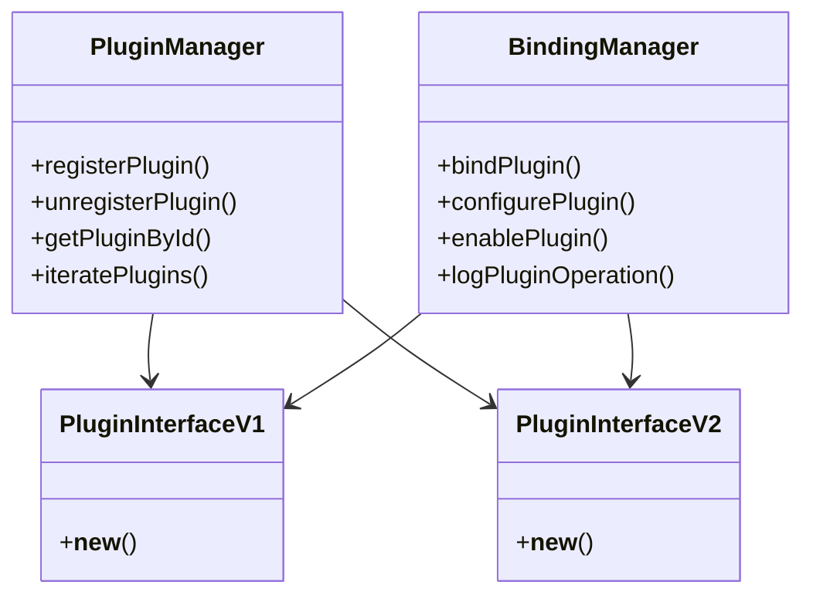

# Overview

Base refers to the foundational components and utilities used to manage and configure plugins. It includes definitions for plugin management, such as the `PluginManager` and `BindingManager` classes, which are responsible for registering and unregistering plugins. The <SwmToken path="src/sentry/plugins/base/v1.py" pos="16:6:6" line-data="from sentry.plugins.base.configuration import default_plugin_config, default_plugin_options">`base`</SwmToken> module also contains configuration settings and response handling mechanisms that plugins can utilize. Additionally, it provides versioned plugin interfaces (`v1` and <SwmToken path="src/sentry/plugins/base/v2.py" pos="49:11:11" line-data="    &gt;&gt;&gt; from sentry.plugins.base.v2 import Plugin2">`v2`</SwmToken>) that define how plugins should be enabled, configured, and managed.

# Configuration and Response Handling

The <SwmToken path="src/sentry/plugins/base/v1.py" pos="16:6:6" line-data="from sentry.plugins.base.configuration import default_plugin_config, default_plugin_options">`base`</SwmToken> module also contains configuration settings and response handling mechanisms that plugins can utilize. This allows plugins to be configured in a standardized way and ensures that they can handle responses appropriately.

# Versioned Plugin Interfaces

Base provides versioned plugin interfaces (`v1` and <SwmToken path="src/sentry/plugins/base/v2.py" pos="49:11:11" line-data="    &gt;&gt;&gt; from sentry.plugins.base.v2 import Plugin2">`v2`</SwmToken>) that define how plugins should be enabled, configured, and managed. These interfaces ensure backward compatibility and provide a clear contract for plugin developers.

<SwmSnippet path="/src/sentry/plugins/base/v1.py" line="29">

---

The <SwmToken path="src/sentry/plugins/base/v1.py" pos="29:3:3" line-data="    def __new__(cls, name, bases, attrs):">`__new__`</SwmToken> function in `v1` ensures that new plugin classes have a <SwmToken path="src/sentry/plugins/base/v1.py" pos="33:11:11" line-data="        if not hasattr(new_cls, &quot;title&quot;):">`title`</SwmToken>, <SwmToken path="src/sentry/plugins/base/v1.py" pos="35:11:11" line-data="        if not hasattr(new_cls, &quot;slug&quot;):">`slug`</SwmToken>, and <SwmToken path="src/sentry/plugins/base/v1.py" pos="37:4:4" line-data="        if &quot;logger&quot; not in attrs:">`logger`</SwmToken> attribute, providing a consistent structure for all plugins.

```python
    def __new__(cls, name, bases, attrs):
        new_cls: type[IPlugin] = type.__new__(cls, name, bases, attrs)  # type: ignore[assignment]
        if IPlugin in bases:
            return new_cls
        if not hasattr(new_cls, "title"):
            new_cls.title = new_cls.__name__
        if not hasattr(new_cls, "slug"):
            new_cls.slug = new_cls.title.replace(" ", "-").lower()
        if "logger" not in attrs:
            new_cls.logger = logging.getLogger(f"sentry.plugins.{new_cls.slug}")
        return new_cls
```

---

</SwmSnippet>

<SwmSnippet path="/src/sentry/plugins/base/v2.py" line="28">

---

Similarly, the <SwmToken path="src/sentry/plugins/base/v2.py" pos="28:3:3" line-data="    def __new__(cls, name, bases, attrs):">`__new__`</SwmToken> function in <SwmToken path="src/sentry/plugins/base/v2.py" pos="49:11:11" line-data="    &gt;&gt;&gt; from sentry.plugins.base.v2 import Plugin2">`v2`</SwmToken> ensures that new plugin classes adhere to the same structure, maintaining consistency across different versions of the plugin interface.

```python
    def __new__(cls, name, bases, attrs):
        new_cls: type[IPlugin2] = type.__new__(cls, name, bases, attrs)  # type: ignore[assignment]
        if IPlugin2 in bases:
            return new_cls
        if not hasattr(new_cls, "title"):
            new_cls.title = new_cls.__name__
        if not hasattr(new_cls, "slug"):
            new_cls.slug = new_cls.title.replace(" ", "-").lower()
        if not hasattr(new_cls, "logger"):
            new_cls.logger = logging.getLogger(f"sentry.plugins.{new_cls.slug}")
        return new_cls
```

---

</SwmSnippet>

# Main Functions

There are several main functions in this folder. Some of them are `PluginManager`, `BindingManager`, and <SwmToken path="src/sentry/plugins/base/v2.py" pos="339:9:9" line-data="        An example of an annotation might be &quot;Needs Fix&quot; or &quot;Task #123&quot;.">`annotation`</SwmToken>. We will dive a little into `PluginManager` and `BindingManager`.

## PluginManager

The `PluginManager` class is responsible for managing the lifecycle of plugins. It handles the registration and unregistration of plugins, ensuring that they are properly initialized and cleaned up. This class also provides methods for retrieving plugins by their identifiers and for iterating over all registered plugins.

## BindingManager

The `BindingManager` class manages the bindings between plugins and the application. It ensures that plugins are correctly bound to the application context and provides methods for configuring and enabling plugins. This class also handles the logging and error reporting for plugin operations, making it easier to diagnose issues with plugin integration.

# Base Endpoints

Base Endpoints

## <SwmToken path="src/sentry/plugins/base/configuration.py" pos="15:2:2" line-data="def react_plugin_config(plugin, project, request):">`react_plugin_config`</SwmToken>

The <SwmToken path="src/sentry/plugins/base/configuration.py" pos="15:2:2" line-data="def react_plugin_config(plugin, project, request):">`react_plugin_config`</SwmToken> function is an endpoint that retrieves the configuration for a specific plugin associated with a project. It constructs a URL using the project's organization slug, project slug, and plugin slug, and makes a GET request to fetch the plugin configuration. The response data is then used to render a script that initializes the plugin configuration in the frontend.

<SwmSnippet path="/src/sentry/plugins/base/configuration.py" line="15">

---

The <SwmToken path="src/sentry/plugins/base/configuration.py" pos="15:2:2" line-data="def react_plugin_config(plugin, project, request):">`react_plugin_config`</SwmToken> function constructs a URL using the project's organization slug, project slug, and plugin slug, and makes a GET request to fetch the plugin configuration.

```python
def react_plugin_config(plugin, project, request):
    response = client.get(
        f"/projects/{project.organization.slug}/{project.slug}/plugins/{plugin.slug}/",
        request=request,
    )
    nonce = ""
    if hasattr(request, "csp_nonce"):
        nonce = f' nonce="{request.csp_nonce}"'

    # Pretty sure this is not in use, and if it is, it has been broken since
    # https://github.com/getsentry/sentry/pull/13578/files#diff-d17d91cc629f5f2e4582adb6e52d426f654452b751da97bafa25160b78566438L206
    return mark_safe(
        """
    <div id="ref-plugin-config"></div>
    <script%s>
      window.__onSentryInit = window.__onSentryInit || [];
      window.__onSentryInit.push({
        name: 'renderReact',
        component: 'PluginConfig',
        container: '#ref-plugin-config',
        props: {
```

---

</SwmSnippet>

## <SwmToken path="src/sentry/plugins/base/configuration.py" pos="52:2:2" line-data="def default_plugin_config(plugin, project, request):">`default_plugin_config`</SwmToken>

The <SwmToken path="src/sentry/plugins/base/configuration.py" pos="52:2:2" line-data="def default_plugin_config(plugin, project, request):">`default_plugin_config`</SwmToken> function is an endpoint that handles the default configuration for a plugin. It checks if the plugin can be enabled for projects and if it can be configured for the given project. If the plugin has a configuration form, it processes the form data and saves the configuration options. The function also renders the plugin configuration template with the form and other relevant data.

<SwmSnippet path="/src/sentry/plugins/base/configuration.py" line="52">

---

The <SwmToken path="src/sentry/plugins/base/configuration.py" pos="52:2:2" line-data="def default_plugin_config(plugin, project, request):">`default_plugin_config`</SwmToken> function checks if the plugin can be enabled for projects and if it can be configured for the given project. If the plugin has a configuration form, it processes the form data and saves the configuration options.

```python
def default_plugin_config(plugin, project, request):
    if plugin.can_enable_for_projects() and not plugin.can_configure_for_project(project):
        raise Http404()

    plugin_key = plugin.get_conf_key()
    form_class = plugin.get_conf_form(project)
    template = plugin.get_conf_template(project)

    if form_class is None:
        return HttpResponseRedirect(
            reverse("sentry-manage-project", args=[project.organization.slug, project.slug])
        )

    test_results = None

    form = form_class(
        request.POST if request.POST.get("plugin") == plugin.slug else None,
        initial=plugin.get_conf_options(project),
        prefix=plugin_key,
    )
    if form.is_valid():
```

---

</SwmSnippet>

&nbsp;

*This is an auto-generated document by Swimm AI 🌊 and has not yet been verified by a human*

<SwmMeta version="3.0.0" repo-id="Z2l0aHViJTNBJTNBc2VudHJ5LWRlbW8tMSUzQSUzQVN3aW1tLURlbW8=" repo-name="sentry-demo-1" doc-type="overview"><sup>Powered by [Swimm](/)</sup></SwmMeta>
