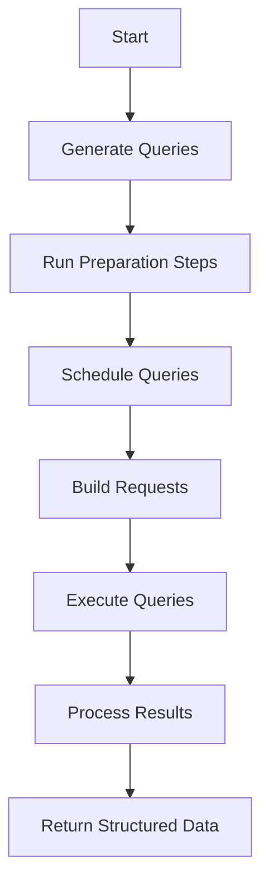

# Basic Concepts of Data in Querying

Data refers to the information that is processed and queried within the system. It includes metrics and other relevant information that needs to be analyzed. Data is used in querying to generate multiple queries based on a base query. This involves compiling the queries, parsing them, and applying various transformations and validations.

# How Data is Queried

The function <SwmToken path="src/sentry/sentry_metrics/querying/data/api.py" pos="29:2:2" line-data="def run_queries(">`run_queries`</SwmToken> demonstrates how data is queried by generating multiple queries, running preparation steps, scheduling the queries for execution, and processing the results.

<SwmSnippet path="/src/sentry/sentry_metrics/querying/data/api.py" line="29">

---

The <SwmToken path="src/sentry/sentry_metrics/querying/data/api.py" pos="29:2:2" line-data="def run_queries(">`run_queries`</SwmToken> function runs a list of <SwmToken path="src/sentry/sentry_metrics/querying/data/api.py" pos="30:6:6" line-data="    mql_queries: Sequence[MQLQuery],">`MQLQuery`</SwmToken> objects that are executed in Snuba. It builds a basic query, parses the query plan, runs preparation steps, schedules the queries for execution, and processes the results.

```python
def run_queries(
    mql_queries: Sequence[MQLQuery],
    start: datetime,
    end: datetime,
    interval: int,
    organization: Organization,
    projects: Sequence[Project],
    environments: Sequence[Environment],
    referrer: str,
    query_type: QueryType = QueryType.TOTALS_AND_SERIES,
) -> MQLQueriesResult:
    """
    Runs a list of MQLQuery(s) that are executed in Snuba.

    Returns:
        A MQLQueriesResult object which encapsulates the results of the plan and allows a QueryTransformer
        to be run on the data.
    """
    # We build the basic query that contains the metadata which will be shared across all queries.
    base_query = MetricsQuery(
        start=start,
```

---

</SwmSnippet>

# Generating Queries

The function <SwmToken path="src/sentry/sentry_metrics/querying/data/parsing.py" pos="62:3:3" line-data="    def generate_queries(">`generate_queries`</SwmToken> is responsible for generating multiple queries from a base query, compiling them, and applying various transformations and validations.

<SwmSnippet path="/src/sentry/sentry_metrics/querying/data/parsing.py" line="62">

---

The <SwmToken path="src/sentry/sentry_metrics/querying/data/parsing.py" pos="62:3:3" line-data="    def generate_queries(">`generate_queries`</SwmToken> function in the <SwmToken path="src/sentry/sentry_metrics/querying/data/api.py" pos="12:14:14" line-data="from sentry.sentry_metrics.querying.data.parsing import QueryParser">`QueryParser`</SwmToken> class generates multiple queries based on a base query. It compiles the queries, parses them, and applies various transformations and validations.

```python
    def generate_queries(
        self,
    ) -> Generator[tuple[QueryExpression, QueryOrder | None, int | None], None, None]:
        """
        Generates multiple queries given a base query.

        Returns:
            A generator which can be used to obtain a query to execute and its details.
        """
        for mql_query in self._mql_queries:
            compiled_mql_query = mql_query.compile()

            query_expression = (
                self._parse_mql(compiled_mql_query.mql)
                # We validate the query.
                .add_visitor(QueryValidationV2Visitor())
                # We inject the environment filter in each timeseries.
                .add_visitor(EnvironmentsInjectionVisitor(self._environments))
                # We transform all `release:latest` filters into the actual latest releases.
                .add_visitor(
                    QueryConditionsCompositeVisitor(
```

---

</SwmSnippet>

# Running Preparation Steps

The function <SwmToken path="src/sentry/sentry_metrics/querying/data/preparation/base.py" pos="53:2:2" line-data="def run_preparation_steps(">`run_preparation_steps`</SwmToken> takes a series of intermediate queries and runs them through preparation steps, modifying them as needed.

<SwmSnippet path="/src/sentry/sentry_metrics/querying/data/preparation/base.py" line="53">

---

The <SwmToken path="src/sentry/sentry_metrics/querying/data/preparation/base.py" pos="53:2:2" line-data="def run_preparation_steps(">`run_preparation_steps`</SwmToken> function takes a series of intermediate queries and steps and runs those intermediate queries on the supplied steps in an accumulating way.

```python
def run_preparation_steps(
    intermediate_queries: list[IntermediateQuery], *steps
) -> list[IntermediateQuery]:
    """
    Takes a series of intermediate queries and steps and runs those intermediate queries on the supplied steps in an
    accumulating way.

    Returns:
        A list of intermediate queries after running the preparation steps.
    """
    for step in steps:
        if isinstance(step, PreparationStep):
            intermediate_queries = step.run(intermediate_queries=intermediate_queries)

    return intermediate_queries
```

---

</SwmSnippet>

# Scheduling Queries

The function <SwmToken path="src/sentry/sentry_metrics/querying/data/execution.py" pos="821:3:3" line-data="    def schedule(self, intermediate_query: IntermediateQuery, query_type: QueryType):">`schedule`</SwmToken> schedules an <SwmToken path="src/sentry/sentry_metrics/querying/data/preparation/base.py" pos="54:6:6" line-data="    intermediate_queries: list[IntermediateQuery], *steps">`IntermediateQuery`</SwmToken> for execution, initializing it and preparing it for correct execution.

<SwmSnippet path="/src/sentry/sentry_metrics/querying/data/execution.py" line="821">

---

The <SwmToken path="src/sentry/sentry_metrics/querying/data/execution.py" pos="821:3:3" line-data="    def schedule(self, intermediate_query: IntermediateQuery, query_type: QueryType):">`schedule`</SwmToken> function lazily schedules an <SwmToken path="src/sentry/sentry_metrics/querying/data/execution.py" pos="821:11:11" line-data="    def schedule(self, intermediate_query: IntermediateQuery, query_type: QueryType):">`IntermediateQuery`</SwmToken> for execution and runs initialization code for each <SwmToken path="src/sentry/sentry_metrics/querying/data/execution.py" pos="823:25:25" line-data="        Lazily schedules an IntermediateQuery for execution and runs initialization code for each ScheduledQuery.">`ScheduledQuery`</SwmToken>.

```python
    def schedule(self, intermediate_query: IntermediateQuery, query_type: QueryType):
        """
        Lazily schedules an IntermediateQuery for execution and runs initialization code for each ScheduledQuery.
        """
        # By default, we always want to have a totals query.
        totals_query = ScheduledQuery(
            type=ScheduledQueryType.TOTALS,
            metrics_query=intermediate_query.metrics_query,
            order=intermediate_query.order,
            limit=intermediate_query.limit,
            unit_family=intermediate_query.unit_family,
            unit=intermediate_query.unit,
            scaling_factor=intermediate_query.scaling_factor,
            mappers=intermediate_query.mappers,
        )

        # In case the user chooses to run also a series query, we will duplicate the query and chain it after totals.
        series_query = None
        if query_type == QueryType.TOTALS_AND_SERIES:
            series_query = replace(totals_query, type=ScheduledQueryType.SERIES)
```

---

</SwmSnippet>

# Building Requests

The function <SwmToken path="src/sentry/sentry_metrics/querying/data/execution.py" pos="640:3:3" line-data="    def _build_request(self, query: MetricsQuery) -&gt; Request:">`_build_request`</SwmToken> builds a Snuba <SwmToken path="src/sentry/sentry_metrics/querying/data/execution.py" pos="640:16:16" line-data="    def _build_request(self, query: MetricsQuery) -&gt; Request:">`Request`</SwmToken> object from a <SwmToken path="src/sentry/sentry_metrics/querying/data/api.py" pos="48:5:5" line-data="    base_query = MetricsQuery(">`MetricsQuery`</SwmToken>, which is then used to execute the query.

<SwmSnippet path="/src/sentry/sentry_metrics/querying/data/execution.py" line="640">

---

The <SwmToken path="src/sentry/sentry_metrics/querying/data/execution.py" pos="640:3:3" line-data="    def _build_request(self, query: MetricsQuery) -&gt; Request:">`_build_request`</SwmToken> function builds a Snuba Request given a <SwmToken path="src/sentry/sentry_metrics/querying/data/execution.py" pos="640:11:11" line-data="    def _build_request(self, query: MetricsQuery) -&gt; Request:">`MetricsQuery`</SwmToken> to execute.

```python
    def _build_request(self, query: MetricsQuery) -> Request:
        """
        Builds a Snuba Request given a MetricsQuery to execute.

        Returns:
            A Snuba Request object which contains the query to execute.
        """
        return Request(
            # The dataset used here is arbitrary, since the `run_query` function will infer it internally.
            dataset=Dataset.Metrics.value,
            query=query,
            app_id="default",
            tenant_ids={"referrer": self._referrer, "organization_id": self._organization.id},
        )
```

---

</SwmSnippet>

# Main Functions

There are several main functions related to data. Some of them are <SwmToken path="src/sentry/sentry_metrics/querying/data/execution.py" pos="345:3:3" line-data="    def empty_from(cls, scheduled_query: ScheduledQuery) -&gt; &quot;QueryResult&quot;:">`empty_from`</SwmToken>, <SwmToken path="src/sentry/sentry_metrics/querying/data/execution.py" pos="523:3:3" line-data="    def align_series_to_totals(self, organization: Organization) -&gt; &quot;QueryResult&quot;:">`align_series_to_totals`</SwmToken>, and <SwmToken path="src/sentry/sentry_metrics/querying/data/api.py" pos="29:2:2" line-data="def run_queries(">`run_queries`</SwmToken>. We will dive a little into <SwmToken path="src/sentry/sentry_metrics/querying/data/execution.py" pos="345:3:3" line-data="    def empty_from(cls, scheduled_query: ScheduledQuery) -&gt; &quot;QueryResult&quot;:">`empty_from`</SwmToken> and <SwmToken path="src/sentry/sentry_metrics/querying/data/execution.py" pos="523:3:3" line-data="    def align_series_to_totals(self, organization: Organization) -&gt; &quot;QueryResult&quot;:">`align_series_to_totals`</SwmToken>.

## <SwmToken path="src/sentry/sentry_metrics/querying/data/execution.py" pos="345:3:3" line-data="    def empty_from(cls, scheduled_query: ScheduledQuery) -&gt; &quot;QueryResult&quot;:">`empty_from`</SwmToken>

The <SwmToken path="src/sentry/sentry_metrics/querying/data/execution.py" pos="345:3:3" line-data="    def empty_from(cls, scheduled_query: ScheduledQuery) -&gt; &quot;QueryResult&quot;:">`empty_from`</SwmToken> function creates a new empty <SwmToken path="src/sentry/sentry_metrics/querying/data/execution.py" pos="345:17:17" line-data="    def empty_from(cls, scheduled_query: ScheduledQuery) -&gt; &quot;QueryResult&quot;:">`QueryResult`</SwmToken> from a <SwmToken path="src/sentry/sentry_metrics/querying/data/execution.py" pos="345:11:11" line-data="    def empty_from(cls, scheduled_query: ScheduledQuery) -&gt; &quot;QueryResult&quot;:">`ScheduledQuery`</SwmToken>. This is useful for representing queries that are not run by the executor, simplifying the downstream code.

<SwmSnippet path="/src/sentry/sentry_metrics/querying/data/execution.py" line="345">

---

The <SwmToken path="src/sentry/sentry_metrics/querying/data/execution.py" pos="345:3:3" line-data="    def empty_from(cls, scheduled_query: ScheduledQuery) -&gt; &quot;QueryResult&quot;:">`empty_from`</SwmToken> function creates a new empty <SwmToken path="src/sentry/sentry_metrics/querying/data/execution.py" pos="345:17:17" line-data="    def empty_from(cls, scheduled_query: ScheduledQuery) -&gt; &quot;QueryResult&quot;:">`QueryResult`</SwmToken> from a <SwmToken path="src/sentry/sentry_metrics/querying/data/execution.py" pos="345:11:11" line-data="    def empty_from(cls, scheduled_query: ScheduledQuery) -&gt; &quot;QueryResult&quot;:">`ScheduledQuery`</SwmToken>, representing queries that are not run by the executor.

```python
    def empty_from(cls, scheduled_query: ScheduledQuery) -> "QueryResult":
        """
        Creates a new empty QueryResult from a ScheduledQuery.

        The idea behind using an empty query result is to be able to represent the values of queries that are not run
        by the executor (for example because they are empty). Representing such queries as empty results in a cleaner
        implementation of the downstream code since no modifications need to be done. It's not ideal but it simplifies
        the code quite a bit.

        Returns:
            An empty QueryResult which contains no data.
        """
        series_query = None
        totals_query = None

        # For now, we naively assume that if a query has a next, the first is a totals query and the second is a series
        # query.
        if scheduled_query.next is not None:
            totals_query = scheduled_query
            series_query = scheduled_query.next
        else:
```

---

</SwmSnippet>

## <SwmToken path="src/sentry/sentry_metrics/querying/data/execution.py" pos="523:3:3" line-data="    def align_series_to_totals(self, organization: Organization) -&gt; &quot;QueryResult&quot;:">`align_series_to_totals`</SwmToken>

The <SwmToken path="src/sentry/sentry_metrics/querying/data/execution.py" pos="523:3:3" line-data="    def align_series_to_totals(self, organization: Organization) -&gt; &quot;QueryResult&quot;:">`align_series_to_totals`</SwmToken> function aligns the series to the totals of the same query. This process places values belonging to the same groups in the same order, ensuring consistency between series and totals.

<SwmSnippet path="/src/sentry/sentry_metrics/querying/data/execution.py" line="523">

---

The <SwmToken path="src/sentry/sentry_metrics/querying/data/execution.py" pos="523:3:3" line-data="    def align_series_to_totals(self, organization: Organization) -&gt; &quot;QueryResult&quot;:">`align_series_to_totals`</SwmToken> function aligns the series to the totals of the same query, ensuring consistency between series and totals.

```python
    def align_series_to_totals(self, organization: Organization) -> "QueryResult":
        """
        Aligns the series to the totals of the same query.

        The alignment process just tries to place values belonging to the same groups in the same order.

        Returns:
            A mutated QueryResult objects with the aligned series to totals.
        """
        alignment_keys = self.group_bys
        if not alignment_keys:
            return self

        indexed_series: dict[tuple[tuple[str, str], ...], list[int]] = {}
        for index, data in enumerate(self.series):
            composite_key = _build_composite_key_from_dict(data, alignment_keys)
            # Since serieses have also the time component, we store multiple indexes of multiple times for the same
            # group.
            indexed_series.setdefault(composite_key, []).append(index)

        aligned_series = []
```

---

</SwmSnippet>

<SwmSnippet path="/src/sentry/sentry_metrics/querying/data/api.py" line="29">

---

The <SwmToken path="src/sentry/sentry_metrics/querying/data/api.py" pos="29:2:2" line-data="def run_queries(">`run_queries`</SwmToken> function runs a list of <SwmToken path="src/sentry/sentry_metrics/querying/data/api.py" pos="30:6:6" line-data="    mql_queries: Sequence[MQLQuery],">`MQLQuery`</SwmToken> objects that are executed in Snuba, building a basic query and processing the results.

```python
def run_queries(
    mql_queries: Sequence[MQLQuery],
    start: datetime,
    end: datetime,
    interval: int,
    organization: Organization,
    projects: Sequence[Project],
    environments: Sequence[Environment],
    referrer: str,
    query_type: QueryType = QueryType.TOTALS_AND_SERIES,
) -> MQLQueriesResult:
    """
    Runs a list of MQLQuery(s) that are executed in Snuba.

    Returns:
        A MQLQueriesResult object which encapsulates the results of the plan and allows a QueryTransformer
        to be run on the data.
    """
    # We build the basic query that contains the metadata which will be shared across all queries.
    base_query = MetricsQuery(
        start=start,
```

---

</SwmSnippet>

# Data Endpoints

Data Endpoints

<SwmSnippet path="/src/sentry/sentry_metrics/querying/data/__init__.py" line="1">

---

The <SwmToken path="src/sentry/sentry_metrics/querying/data/__init__.py" pos="1:7:7" line-data="from .api import run_queries">`run_queries`</SwmToken> function is part of the data querying API, responsible for executing the queries that have been defined and compiled.

```python
from .api import run_queries
from .query import MQLQueriesResult, MQLQuery
from .transformation.metrics_api import MetricsAPIQueryResultsTransformer

__all__ = [
    "run_queries",
    "MQLQuery",
    "MQLQueriesResult",
    "MetricsAPIQueryResultsTransformer",
]
```

---

</SwmSnippet>

## <SwmToken path="src/sentry/sentry_metrics/querying/data/parsing.py" pos="62:3:3" line-data="    def generate_queries(">`generate_queries`</SwmToken>

The <SwmToken path="src/sentry/sentry_metrics/querying/data/parsing.py" pos="62:3:3" line-data="    def generate_queries(">`generate_queries`</SwmToken> function in the <SwmToken path="src/sentry/sentry_metrics/querying/data/api.py" pos="12:14:14" line-data="from sentry.sentry_metrics.querying.data.parsing import QueryParser">`QueryParser`</SwmToken> class generates multiple queries based on a base query. It compiles the queries, parses them, and applies various transformations and validations. This function is crucial for preparing the data queries that will be executed.

<SwmSnippet path="/src/sentry/sentry_metrics/querying/data/parsing.py" line="62">

---

The <SwmToken path="src/sentry/sentry_metrics/querying/data/parsing.py" pos="62:3:3" line-data="    def generate_queries(">`generate_queries`</SwmToken> function in the <SwmToken path="src/sentry/sentry_metrics/querying/data/api.py" pos="12:14:14" line-data="from sentry.sentry_metrics.querying.data.parsing import QueryParser">`QueryParser`</SwmToken> class generates multiple queries based on a base query, compiling and validating them.

```python
    def generate_queries(
        self,
    ) -> Generator[tuple[QueryExpression, QueryOrder | None, int | None], None, None]:
        """
        Generates multiple queries given a base query.

        Returns:
            A generator which can be used to obtain a query to execute and its details.
        """
        for mql_query in self._mql_queries:
            compiled_mql_query = mql_query.compile()

            query_expression = (
                self._parse_mql(compiled_mql_query.mql)
                # We validate the query.
                .add_visitor(QueryValidationV2Visitor())
                # We inject the environment filter in each timeseries.
                .add_visitor(EnvironmentsInjectionVisitor(self._environments))
                # We transform all `release:latest` filters into the actual latest releases.
                .add_visitor(
                    QueryConditionsCompositeVisitor(
```

---

</SwmSnippet>

&nbsp;

*This is an auto-generated document by Swimm AI 🌊 and has not yet been verified by a human*

<SwmMeta version="3.0.0" repo-id="Z2l0aHViJTNBJTNBc2VudHJ5LWRlbW8tMSUzQSUzQVN3aW1tLURlbW8=" repo-name="sentry-demo-1" doc-type="overview"><sup>Powered by [Swimm](/)</sup></SwmMeta>
