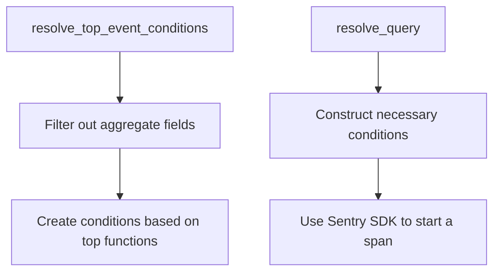

# Introduction

Events are structured logs that capture specific actions or occurrences within the system. They provide detailed information about what happened, why it happened, and the context in which it occurred. In the search functionality, events are utilized to filter and retrieve relevant data based on specific criteria.

# Filtering Events

The <SwmToken path="src/sentry/search/events/builder/discover.py" pos="102:3:3" line-data="    def format_search_filter(self, term: event_search.SearchFilter) -&gt; WhereType | None:">`format_search_filter`</SwmToken> function is responsible for converting search filters into conditions that can be used to query events. This function ensures that the search filters are properly formatted and compatible with the underlying data structure.

<SwmSnippet path="/src/sentry/search/events/builder/discover.py" line="331">

---

The <SwmToken path="src/sentry/search/events/builder/discover.py" pos="331:3:3" line-data="    def resolve_top_event_conditions(">`resolve_top_event_conditions`</SwmToken> function constructs conditions based on a list of top events, allowing for precise filtering of event data. It iterates through the existing conditions to find the project one and limits results by project to avoid hitting the result limit.

```python
    def resolve_top_event_conditions(
        self, top_events: list[dict[str, Any]], other: bool
    ) -> WhereType | None:
        """Given a list of top events construct the conditions"""
        conditions = []
        for field in self.fields:
            # If we have a project field, we need to limit results by project so we don't hit the result limit
            if field in ["project", "project.id", "project.name"] and top_events:
                # Iterate through the existing conditions to find the project one
                # the project condition is a requirement of queries so there should always be one
                project_condition = [
                    condition
                    for condition in self.where
                    if isinstance(condition, Condition)
                    and condition.lhs == self.column("project_id")
                ][0]
                self.where.remove(project_condition)
                if field in ["project", "project.name"]:
                    projects = list(
                        {self.params.project_slug_map[event[field]] for event in top_events}
                    )
```

---

</SwmSnippet>

# Querying Events

Metrics querying is moved to a span-based system backed by `eap_spans`, which is part of the Events Analytics Platform work.

<SwmSnippet path="/src/sentry/search/events/builder/base.py" line="311">

---

The <SwmToken path="src/sentry/search/events/builder/base.py" pos="311:3:3" line-data="    def resolve_query(">`resolve_query`</SwmToken> method resolves the query by constructing the necessary conditions and parameters. It uses Sentry SDK to start a span for the query resolution process.

```python
    def resolve_query(
        self,
        query: str | None = None,
        selected_columns: list[str] | None = None,
        groupby_columns: list[str] | None = None,
        equations: list[str] | None = None,
        orderby: list[str] | str | None = None,
    ) -> None:
```

---

</SwmSnippet>

&nbsp;

*This is an auto-generated document by Swimm AI 🌊 and has not yet been verified by a human*

<SwmMeta version="3.0.0" repo-id="Z2l0aHViJTNBJTNBc2VudHJ5LWRlbW8tMSUzQSUzQVN3aW1tLURlbW8=" repo-name="sentry-demo-1" doc-type="overview"><sup>Powered by [Swimm](/)</sup></SwmMeta>
