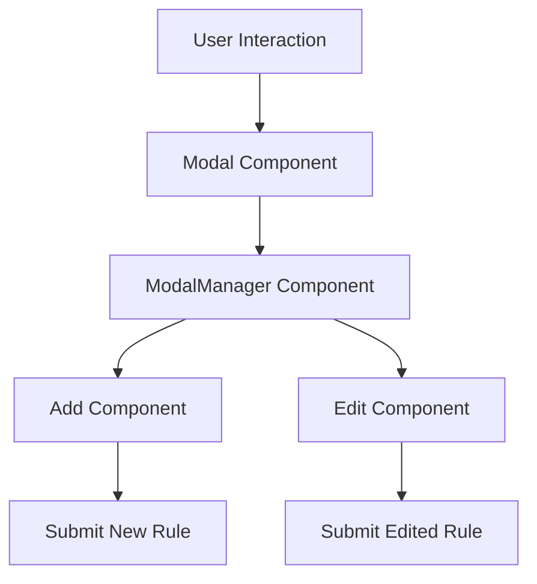

## Overview

Modals are used to manage user interactions for adding and editing data scrubbing rules. They provide a structured layout with a header, body, and footer, allowing users to input and save data scrubbing rules.

## Modal Component

The <SwmToken path="static/app/views/settings/components/dataScrubbing/modals/modalManager.tsx" pos="6:15:15" line-data="import type {ModalRenderProps} from &#39;sentry/actionCreators/modal&#39;;">`modal`</SwmToken> component provides a structured layout with a header, body, and footer. It allows users to input and save data scrubbing rules. The function takes in properties such as title, <SwmToken path="static/app/views/settings/components/dataScrubbing/modals/modalManager.tsx" pos="280:1:1" line-data="        onSave={this.handleSave}">`onSave`</SwmToken>, content, and disabled, and renders a modal dialog with these elements.

## <SwmToken path="static/app/views/settings/components/dataScrubbing/modals/modalManager.tsx" pos="48:2:2" line-data="class ModalManager extends Component&lt;Props, State&gt; {">`ModalManager`</SwmToken> Component

The <SwmToken path="static/app/views/settings/components/dataScrubbing/modals/modalManager.tsx" pos="48:2:2" line-data="class ModalManager extends Component&lt;Props, State&gt; {">`ModalManager`</SwmToken> component handles the state and logic for the modals. It includes methods for form validation, loading source suggestions, and managing the submission of new or edited rules. The class maintains the state of the form, including values, errors, and validation status, and provides methods to handle changes and save the form data.

<SwmSnippet path="/static/app/views/settings/components/dataScrubbing/modals/modalManager.tsx" line="48">

---

The <SwmToken path="static/app/views/settings/components/dataScrubbing/modals/modalManager.tsx" pos="48:2:2" line-data="class ModalManager extends Component&lt;Props, State&gt; {">`ModalManager`</SwmToken> class manages the state and logic for the modal, including form validation and loading source suggestions.

```tsx
class ModalManager extends Component<Props, State> {
  state = this.getDefaultState();

  componentDidMount() {
    this.handleValidateForm();
  }

  componentDidUpdate(_prevProps: Props, prevState: State) {
    if (!isEqual(prevState.values, this.state.values)) {
      this.handleValidateForm();
    }

    if (prevState.eventId.value !== this.state.eventId.value) {
      this.loadSourceSuggestions();
    }
    if (prevState.eventId.status !== this.state.eventId.status) {
      saveToSourceGroupData(this.state.eventId, this.state.sourceSuggestions);
    }
  }

  getDefaultState(): Readonly<State> {
```

---

</SwmSnippet>

<SwmSnippet path="/static/app/views/settings/components/dataScrubbing/modals/add.tsx" line="5">

---

The <SwmToken path="static/app/views/settings/components/dataScrubbing/modals/add.tsx" pos="10:2:2" line-data="function Add({savedRules, ...props}: Props) {">`Add`</SwmToken> component defines the behavior for adding new data scrubbing rules, extending the functionality of the <SwmToken path="static/app/views/settings/components/dataScrubbing/modals/add.tsx" pos="5:2:2" line-data="import ModalManager from &#39;./modalManager&#39;;">`ModalManager`</SwmToken>.

```tsx
import ModalManager from './modalManager';

type ModalManagerProps = ModalManager['props'];
type Props = Omit<ModalManagerProps, 'title' | 'initialValues' | 'onGetNewRules'>;

function Add({savedRules, ...props}: Props) {
  const handleGetNewRules = (
    values: Parameters<ModalManagerProps['onGetNewRules']>[0]
  ) => {
    return [...savedRules, {...values, id: savedRules.length}] as Array<Rule>;
  };

  return (
    <ModalManager
      {...props}
```

---

</SwmSnippet>

## Edit Component

The <SwmToken path="static/app/views/settings/components/dataScrubbing/modals/edit.tsx" pos="12:2:2" line-data="function Edit({savedRules, rule, ...props}: Props) {">`Edit`</SwmToken> component extends the <SwmToken path="static/app/views/settings/components/dataScrubbing/modals/modalManager.tsx" pos="48:2:2" line-data="class ModalManager extends Component&lt;Props, State&gt; {">`ModalManager`</SwmToken> to provide specific functionality for editing existing rules. It handles the modification of existing data scrubbing rules and integrates with the <SwmToken path="static/app/views/settings/components/dataScrubbing/modals/modalManager.tsx" pos="48:2:2" line-data="class ModalManager extends Component&lt;Props, State&gt; {">`ModalManager`</SwmToken> for state management and form validation.

<SwmSnippet path="/static/app/views/settings/components/dataScrubbing/modals/edit.tsx" line="5">

---

The <SwmToken path="static/app/views/settings/components/dataScrubbing/modals/edit.tsx" pos="12:2:2" line-data="function Edit({savedRules, rule, ...props}: Props) {">`Edit`</SwmToken> component defines the behavior for editing existing data scrubbing rules, extending the functionality of the <SwmToken path="static/app/views/settings/components/dataScrubbing/modals/edit.tsx" pos="5:2:2" line-data="import ModalManager from &#39;./modalManager&#39;;">`ModalManager`</SwmToken>.

```tsx
import ModalManager from './modalManager';

type ModalManagerProps = ModalManager['props'];
type Props = Omit<ModalManagerProps, 'title' | 'initialValues' | 'onGetNewRules'> & {
  rule: Rule;
};

function Edit({savedRules, rule, ...props}: Props) {
  const handleGetNewRules = (
    values: Parameters<ModalManagerProps['onGetNewRules']>[0]
  ) => {
    const updatedRule = {...values, id: rule.id};

    const newRules = savedRules.map(savedRule => {
      if (savedRule.id === updatedRule.id) {
        return updatedRule;
      }
      return savedRule;
    }) as Array<Rule>;

    return newRules;
```

---

</SwmSnippet>

## Modals Endpoints

Modals use specific endpoints to interact with the backend. These endpoints are used to specify the project context for adding or editing data scrubbing rules.

### Add Modal Endpoint

The endpoint `/projects/${organizationSlug}/${projectId}/` is used in the <SwmToken path="static/app/views/settings/components/dataScrubbing/modals/add.tsx" pos="10:2:2" line-data="function Add({savedRules, ...props}: Props) {">`Add`</SwmToken> modal to specify the project context for adding data scrubbing rules. This endpoint is passed to the <SwmToken path="static/app/views/settings/components/dataScrubbing/modals/add.tsx" pos="10:2:2" line-data="function Add({savedRules, ...props}: Props) {">`Add`</SwmToken> component as a prop and is used when submitting new rules.

<SwmSnippet path="/static/app/views/settings/components/dataScrubbing/modals/add.spec.tsx" line="25">

---

The <SwmToken path="static/app/views/settings/components/dataScrubbing/modals/add.tsx" pos="10:2:2" line-data="function Add({savedRules, ...props}: Props) {">`Add`</SwmToken> component uses the endpoint to submit new data scrubbing rules.

```tsx
const endpoint = `/projects/${organizationSlug}/${projectId}/`;
```

---

</SwmSnippet>

### Edit Modal Endpoint

The endpoint `/projects/${organizationSlug}/${projectId}/` is also used in the <SwmToken path="static/app/views/settings/components/dataScrubbing/modals/edit.tsx" pos="12:2:2" line-data="function Edit({savedRules, rule, ...props}: Props) {">`Edit`</SwmToken> modal to specify the project context for editing existing data scrubbing rules. This endpoint is passed to the <SwmToken path="static/app/views/settings/components/dataScrubbing/modals/edit.tsx" pos="12:2:2" line-data="function Edit({savedRules, rule, ...props}: Props) {">`Edit`</SwmToken> component as a prop and is used when submitting edited rules.

<SwmSnippet path="/static/app/views/settings/components/dataScrubbing/modals/edit.spec.tsx" line="29">

---

The <SwmToken path="static/app/views/settings/components/dataScrubbing/modals/edit.tsx" pos="12:2:2" line-data="function Edit({savedRules, rule, ...props}: Props) {">`Edit`</SwmToken> component uses the endpoint to submit edited data scrubbing rules.

```tsx
const endpoint = `/projects/${organizationSlug}/${projectId}/`;
```

---

</SwmSnippet>

&nbsp;

*This is an auto-generated document by Swimm AI 🌊 and has not yet been verified by a human*

<SwmMeta version="3.0.0" repo-id="Z2l0aHViJTNBJTNBc2VudHJ5LWRlbW8tMSUzQSUzQVN3aW1tLURlbW8=" repo-name="sentry-demo-1" doc-type="overview"><sup>Powered by [Swimm](/)</sup></SwmMeta>
