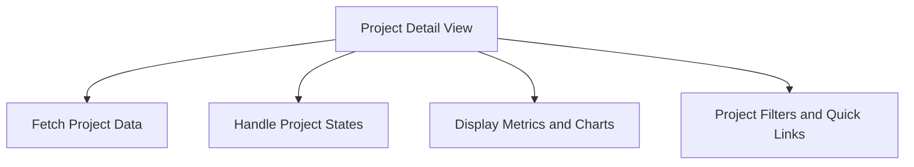

# Overview

The Project Detail view is responsible for displaying detailed information about a specific project within the organization. It fetches and displays various metrics and charts related to the project's performance, sessions, and transactions. The view also includes features like project filters, quick links, and access control for team members. It handles different states such as loading, error, and access control to ensure a smooth user experience.

<SwmSnippet path="/static/app/views/projectDetail/projectDetail.tsx" line="54">

---

# Fetching Project Data

The Project Detail view fetches project data using the <SwmToken path="static/app/views/projectDetail/projectDetail.tsx" pos="57:15:15" line-data="  const {projects, fetching: loadingProjects} = useProjects();">`useProjects`</SwmToken> hook and finds the specific project by its slug.

```tsx
export default function ProjectDetail({router, location, organization}: Props) {
  const api = useApi();
  const params = useParams();
  const {projects, fetching: loadingProjects} = useProjects();
  const {selection} = usePageFilters();
  const project = projects.find(p => p.slug === params.projectId);
  const {query} = location.query;
```

---

</SwmSnippet>

<SwmSnippet path="/static/app/views/projectDetail/projectDetail.tsx" line="65">

---

# Handling Project States

The view handles different states such as loading, error, and access control to ensure a smooth user experience.

```tsx
  const isProjectStabilized =
    defined(project?.id) &&
    project.id === location.query.project &&
    project.id === String(selection.projects[0]);
  const hasSessions = project?.hasSessions ?? null;
  const hasOnlyBasicChart = !hasPerformance && !hasDiscover && !hasSessions;
```

---

</SwmSnippet>

<SwmSnippet path="/static/app/views/projectDetail/projectDetail.tsx" line="77">

---

# Displaying Metrics and Charts

The view uses the <SwmToken path="static/app/views/projectDetail/projectDetail.tsx" pos="77:7:7" line-data="  const visibleCharts = useMemo(() =&gt; {">`useMemo`</SwmToken> hook to determine which charts to display based on the project's transactions and sessions.

```tsx
  const visibleCharts = useMemo(() => {
    if (hasTransactions || hasSessions) {
      return ['chart1', 'chart2'];
    }
    return ['chart1'];
  }, [hasTransactions, hasSessions]);
```

---

</SwmSnippet>

<SwmSnippet path="/static/app/views/projectDetail/projectDetail.tsx" line="293">

---

# Project Filters and Quick Links

The view includes features like project filters and quick links to enhance user navigation and interaction.

```tsx
const ProjectFiltersWrapper = styled('div')`
  margin-bottom: ${space(2)};
`;

const StyledGlobalEventProcessingAlert = styled(GlobalEventProcessingAlert)`
  @media (min-width: ${p => p.theme.breakpoints.medium}) {
    margin-bottom: 0;
  }
`;
```

---

</SwmSnippet>

# Main Functions

There are several main functions in this folder. Some of them are <SwmToken path="static/app/views/projectDetail/projectDetail.tsx" pos="54:6:6" line-data="export default function ProjectDetail({router, location, organization}: Props) {">`ProjectDetail`</SwmToken>, <SwmToken path="static/app/views/projectDetail/index.tsx" pos="7:2:2" line-data="function ProjectDetailContainer(">`ProjectDetailContainer`</SwmToken>, <SwmToken path="static/app/views/projectDetail/projectDetail.tsx" pos="57:15:15" line-data="  const {projects, fetching: loadingProjects} = useProjects();">`useProjects`</SwmToken>, and <SwmToken path="static/app/views/projectDetail/index.tsx" pos="15:1:1" line-data="  useRouteAnalyticsParams(">`useRouteAnalyticsParams`</SwmToken>. We will dive a little into <SwmToken path="static/app/views/projectDetail/projectDetail.tsx" pos="54:6:6" line-data="export default function ProjectDetail({router, location, organization}: Props) {">`ProjectDetail`</SwmToken> and <SwmToken path="static/app/views/projectDetail/index.tsx" pos="7:2:2" line-data="function ProjectDetailContainer(">`ProjectDetailContainer`</SwmToken>.

<SwmSnippet path="/static/app/views/projectDetail/projectDetail.tsx" line="54">

---

## <SwmToken path="static/app/views/projectDetail/projectDetail.tsx" pos="54:6:6" line-data="export default function ProjectDetail({router, location, organization}: Props) {">`ProjectDetail`</SwmToken>

The <SwmToken path="static/app/views/projectDetail/projectDetail.tsx" pos="54:6:6" line-data="export default function ProjectDetail({router, location, organization}: Props) {">`ProjectDetail`</SwmToken> function is responsible for fetching and displaying detailed information about a specific project. It uses hooks like <SwmToken path="static/app/views/projectDetail/projectDetail.tsx" pos="55:7:7" line-data="  const api = useApi();">`useApi`</SwmToken>, <SwmToken path="static/app/views/projectDetail/projectDetail.tsx" pos="56:7:7" line-data="  const params = useParams();">`useParams`</SwmToken>, and <SwmToken path="static/app/views/projectDetail/projectDetail.tsx" pos="57:15:15" line-data="  const {projects, fetching: loadingProjects} = useProjects();">`useProjects`</SwmToken> to fetch data and manage state. It also includes various constants and callbacks to handle different states and actions within the project detail view.

```tsx
export default function ProjectDetail({router, location, organization}: Props) {
  const api = useApi();
  const params = useParams();
  const {projects, fetching: loadingProjects} = useProjects();
  const {selection} = usePageFilters();
  const project = projects.find(p => p.slug === params.projectId);
  const {query} = location.query;
  const hasPerformance = organization.features.includes('performance-view');
  const hasDiscover = organization.features.includes('discover-basic');
  const hasTransactions = hasPerformance && project?.firstTransactionEvent;
  const projectId = project?.id;
  const isProjectStabilized =
    defined(project?.id) &&
    project.id === location.query.project &&
    project.id === String(selection.projects[0]);
  const hasSessions = project?.hasSessions ?? null;
  const hasOnlyBasicChart = !hasPerformance && !hasDiscover && !hasSessions;
  const title = routeTitleGen(
    t('Project %s', params.projectId),
    organization.slug,
    false
```

---

</SwmSnippet>

<SwmSnippet path="/static/app/views/projectDetail/index.tsx" line="7">

---

## <SwmToken path="static/app/views/projectDetail/index.tsx" pos="7:2:2" line-data="function ProjectDetailContainer(">`ProjectDetailContainer`</SwmToken>

The <SwmToken path="static/app/views/projectDetail/index.tsx" pos="7:2:2" line-data="function ProjectDetailContainer(">`ProjectDetailContainer`</SwmToken> function acts as a wrapper for the <SwmToken path="static/app/views/projectDetail/index.tsx" pos="9:7:7" line-data="    React.ComponentProps&lt;typeof ProjectDetail&gt;,">`ProjectDetail`</SwmToken> component. It uses the <SwmToken path="static/app/views/projectDetail/index.tsx" pos="13:9:9" line-data="  const {projects} = useProjects();">`useProjects`</SwmToken> hook to fetch project data and the <SwmToken path="static/app/views/projectDetail/index.tsx" pos="15:1:1" line-data="  useRouteAnalyticsParams(">`useRouteAnalyticsParams`</SwmToken> hook to set analytics parameters. It then renders the <SwmToken path="static/app/views/projectDetail/index.tsx" pos="9:7:7" line-data="    React.ComponentProps&lt;typeof ProjectDetail&gt;,">`ProjectDetail`</SwmToken> component with the fetched data.

```tsx
function ProjectDetailContainer(
  props: Omit<
    React.ComponentProps<typeof ProjectDetail>,
    'projects' | 'loadingProjects' | 'selection'
  >
) {
  const {projects} = useProjects();
  const project = projects.find(p => p.slug === props.params.projectId);
  useRouteAnalyticsParams(
    project
      ? {
          project_id: project.id,
          project_platform: project.platform,
        }
      : {}
  );
  return <ProjectDetail {...props} />;
}

export default withOrganization(ProjectDetailContainer);
```

---

</SwmSnippet>

# Project Detail Endpoints

The Project Detail view includes several endpoints to fetch data related to the project.

<SwmSnippet path="/static/app/views/projectDetail/projectScoreCards/projectAnrScoreCard.tsx" line="149">

---

## Project ANR Score Card

The <SwmToken path="static/app/views/projectDetail/projectScoreCards/projectAnrScoreCard.tsx" pos="35:4:4" line-data="export function ProjectAnrScoreCard({">`ProjectAnrScoreCard`</SwmToken> component defines an endpoint to fetch issues related to ANR (Application Not Responding) rates. The endpoint path is <SwmPath>[src/sentry/api/endpoints/issues/](src/sentry/api/endpoints/issues/)</SwmPath>, and it constructs a query to filter issues by the ANR mechanism and other parameters.

```tsx
  const endpointPath = `/organizations/${organization.slug}/issues/`;

  const issueQuery = ['mechanism:[ANR,AppExitInfo]', query].join(' ').trim();

  const queryParams = {
    ...normalizeDateTimeParams(pick(location.query, [...Object.values(URL_PARAM)])),
    query: issueQuery,
    sort: 'freq',
  };

  const issueSearch = {
    pathname: endpointPath,
    query: queryParams,
  };
```

---

</SwmSnippet>

<SwmSnippet path="/static/app/views/projectDetail/projectIssues.tsx" line="164">

---

## Project Issues

The <SwmToken path="static/app/views/projectDetail/projectDetail.tsx" pos="39:2:2" line-data="import ProjectIssues from &#39;./projectIssues&#39;;">`ProjectIssues`</SwmToken> component defines an endpoint to fetch issues for a project. The endpoint path is <SwmPath>[src/sentry/api/endpoints/issues/](src/sentry/api/endpoints/issues/)</SwmPath>, and it constructs a query to filter issues based on various criteria such as issue type, environment, and time period.

```tsx
  const endpointPath = `/organizations/${organization.slug}/issues/`;

  const issueQuery = (Object.values(IssuesType) as string[]).includes(issuesType)
    ? [`${IssuesQuery[issuesType.toUpperCase()]}`, query].join(' ').trim()
    : [`${IssuesQuery.ALL}`, query].join(' ').trim();

  const queryParams = {
    limit: '5',
    ...normalizeDateTimeParams(
      pick(location.query, [...Object.values(URL_PARAM), 'cursor'])
    ),
    query: issueQuery,
    sort: 'freq',
  };

  const issueSearch = {
    pathname: endpointPath,
    query: queryParams,
  };
```

---

</SwmSnippet>

&nbsp;

*This is an auto-generated document by Swimm AI 🌊 and has not yet been verified by a human*

<SwmMeta version="3.0.0" repo-id="Z2l0aHViJTNBJTNBc2VudHJ5LWRlbW8tMSUzQSUzQVN3aW1tLURlbW8=" repo-name="sentry-demo-1" doc-type="overview"><sup>Powered by [Swimm](/)</sup></SwmMeta>
