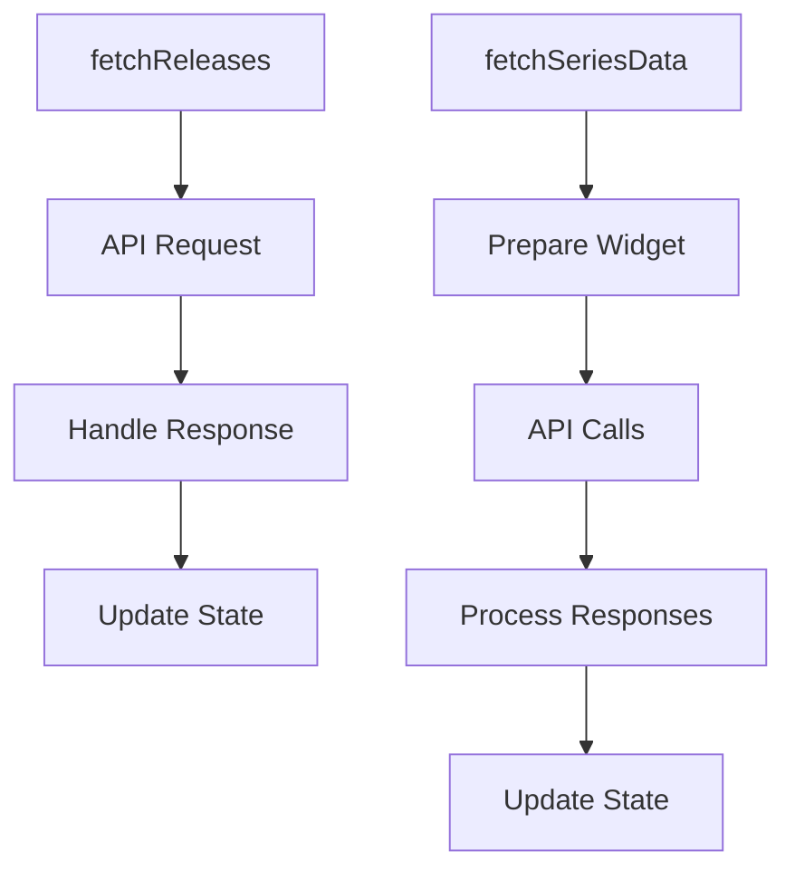

# Overview

A Widget Card is a component used to display individual widgets within a dashboard. It is responsible for rendering the widget's content, including its title, description, and any associated data visualizations or tables. The Widget Card also handles various states such as loading, error, and empty states to provide feedback to the user. Additionally, it includes functionality for editing, duplicating, and deleting widgets, as well as managing widget-specific settings and interactions.

# Widget Card Props

The <SwmToken path="static/app/views/dashboards/widgetCard/issueWidgetCard.tsx" pos="19:2:2" line-data="type Props = {">`Props`</SwmToken> type defines the properties that need to be passed to the <SwmToken path="static/app/views/dashboards/widgetCard/issueWidgetCard.tsx" pos="28:4:4" line-data="export function IssueWidgetCard({">`IssueWidgetCard`</SwmToken> component. These properties include <SwmToken path="static/app/views/dashboards/widgetCard/issueWidgetCard.tsx" pos="20:1:1" line-data="  loading: boolean;">`loading`</SwmToken>, <SwmToken path="static/app/views/dashboards/widgetCard/issueWidgetCard.tsx" pos="21:1:1" line-data="  location: Location;">`location`</SwmToken>, <SwmToken path="static/app/views/dashboards/widgetCard/issueWidgetCard.tsx" pos="22:1:1" line-data="  selection: PageFilters;">`selection`</SwmToken>, <SwmToken path="static/app/views/dashboards/widgetCard/issueWidgetCard.tsx" pos="23:1:1" line-data="  transformedResults: TableDataRow[];">`transformedResults`</SwmToken>, <SwmToken path="static/app/views/dashboards/widgetCard/issueWidgetCard.tsx" pos="24:1:1" line-data="  widget: Widget;">`widget`</SwmToken>, and <SwmToken path="static/app/views/dashboards/widgetCard/issueWidgetCard.tsx" pos="25:1:1" line-data="  errorMessage?: string;">`errorMessage`</SwmToken>.

<SwmSnippet path="/static/app/views/dashboards/widgetCard/issueWidgetCard.tsx" line="19">

---

The <SwmToken path="static/app/views/dashboards/widgetCard/issueWidgetCard.tsx" pos="19:2:2" line-data="type Props = {">`Props`</SwmToken> type defines the properties that need to be passed to the <SwmToken path="static/app/views/dashboards/widgetCard/issueWidgetCard.tsx" pos="28:4:4" line-data="export function IssueWidgetCard({">`IssueWidgetCard`</SwmToken> component.

```tsx
type Props = {
  loading: boolean;
  location: Location;
  selection: PageFilters;
  transformedResults: TableDataRow[];
  widget: Widget;
  errorMessage?: string;
};
```

---

</SwmSnippet>

# Rendering the Widget Card

The <SwmToken path="static/app/views/dashboards/widgetCard/issueWidgetCard.tsx" pos="28:4:4" line-data="export function IssueWidgetCard({">`IssueWidgetCard`</SwmToken> function renders the widget card based on the provided props. It handles different states such as error and loading, and renders the appropriate content using components like <SwmToken path="static/app/views/dashboards/widgetCard/issueWidgetCard.tsx" pos="40:2:2" line-data="      &lt;ErrorPanel&gt;">`ErrorPanel`</SwmToken> and <SwmToken path="static/app/views/dashboards/widgetCard/issueWidgetCard.tsx" pos="59:2:2" line-data="    &lt;StyledSimpleTableChart">`StyledSimpleTableChart`</SwmToken>.

<SwmSnippet path="/static/app/views/dashboards/widgetCard/issueWidgetCard.tsx" line="28">

---

The <SwmToken path="static/app/views/dashboards/widgetCard/issueWidgetCard.tsx" pos="28:4:4" line-data="export function IssueWidgetCard({">`IssueWidgetCard`</SwmToken> function handles different states such as error and loading, and renders the appropriate content.

```tsx
export function IssueWidgetCard({
  selection,
  widget,
  errorMessage,
  loading,
  transformedResults,
  location,
}: Props) {
  const datasetConfig = getDatasetConfig(WidgetType.ISSUE);

  if (errorMessage) {
    return (
      <ErrorPanel>
        <IconWarning color="gray500" size="lg" />
      </ErrorPanel>
    );
  }

  if (loading) {
    // Align height to other charts.
    return <LoadingPlaceholder height="200px" />;
```

---

</SwmSnippet>

# Handling Widget Queries

The <SwmToken path="static/app/views/dashboards/widgetCard/issueWidgetCard.tsx" pos="51:3:3" line-data="  const query = widget.queries[0];">`query`</SwmToken> constant extracts the first query from the widget's queries and determines the fields to be displayed. It also creates an <SwmToken path="static/app/views/dashboards/widgetCard/issueWidgetCard.tsx" pos="56:3:3" line-data="  const eventView = eventViewFromWidget(widget.title, widget.queries[0], selection);">`eventView`</SwmToken> object using the <SwmToken path="static/app/views/dashboards/widgetCard/issueWidgetCard.tsx" pos="56:7:7" line-data="  const eventView = eventViewFromWidget(widget.title, widget.queries[0], selection);">`eventViewFromWidget`</SwmToken> function.

<SwmSnippet path="/static/app/views/dashboards/widgetCard/issueWidgetCard.tsx" line="51">

---

The <SwmToken path="static/app/views/dashboards/widgetCard/issueWidgetCard.tsx" pos="51:3:3" line-data="  const query = widget.queries[0];">`query`</SwmToken> constant extracts the first query from the widget's queries and determines the fields to be displayed.

```tsx
  const query = widget.queries[0];
  const queryFields = defined(query.fields)
    ? query.fields
    : [...query.columns, ...query.aggregates];
  const fieldAliases = query.fieldAliases ?? [];
  const eventView = eventViewFromWidget(widget.title, widget.queries[0], selection);
```

---

</SwmSnippet>

# Main Functions

There are several main functions in this folder. Some of them are <SwmToken path="static/app/views/dashboards/widgetCard/issueWidgetCard.tsx" pos="28:4:4" line-data="export function IssueWidgetCard({">`IssueWidgetCard`</SwmToken>, <SwmToken path="static/app/views/dashboards/widgetCard/widgetCardContextMenu.tsx" pos="58:2:2" line-data="function WidgetCardContextMenu({">`WidgetCardContextMenu`</SwmToken>, and <SwmToken path="static/app/views/dashboards/widgetCard/widgetCardChartContainer.tsx" pos="61:4:4" line-data="export function WidgetCardChartContainer({">`WidgetCardChartContainer`</SwmToken>. We will dive a little into <SwmToken path="static/app/views/dashboards/widgetCard/issueWidgetCard.tsx" pos="28:4:4" line-data="export function IssueWidgetCard({">`IssueWidgetCard`</SwmToken> and <SwmToken path="static/app/views/dashboards/widgetCard/widgetCardContextMenu.tsx" pos="58:2:2" line-data="function WidgetCardContextMenu({">`WidgetCardContextMenu`</SwmToken>.

## <SwmToken path="static/app/views/dashboards/widgetCard/issueWidgetCard.tsx" pos="28:4:4" line-data="export function IssueWidgetCard({">`IssueWidgetCard`</SwmToken>

The <SwmToken path="static/app/views/dashboards/widgetCard/issueWidgetCard.tsx" pos="28:4:4" line-data="export function IssueWidgetCard({">`IssueWidgetCard`</SwmToken> function is responsible for rendering the issue widget card. It handles different states such as loading and error, and it uses the <SwmToken path="static/app/views/dashboards/widgetCard/issueWidgetCard.tsx" pos="36:7:7" line-data="  const datasetConfig = getDatasetConfig(WidgetType.ISSUE);">`getDatasetConfig`</SwmToken> and <SwmToken path="static/app/views/dashboards/widgetCard/issueWidgetCard.tsx" pos="56:7:7" line-data="  const eventView = eventViewFromWidget(widget.title, widget.queries[0], selection);">`eventViewFromWidget`</SwmToken> functions to configure the dataset and event view respectively. The function returns a styled table chart with the transformed results.

<SwmSnippet path="/static/app/views/dashboards/widgetCard/issueWidgetCard.tsx" line="28">

---

The <SwmToken path="static/app/views/dashboards/widgetCard/issueWidgetCard.tsx" pos="28:4:4" line-data="export function IssueWidgetCard({">`IssueWidgetCard`</SwmToken> function handles different states such as loading and error, and it uses the <SwmToken path="static/app/views/dashboards/widgetCard/issueWidgetCard.tsx" pos="36:7:7" line-data="  const datasetConfig = getDatasetConfig(WidgetType.ISSUE);">`getDatasetConfig`</SwmToken> and <SwmToken path="static/app/views/dashboards/widgetCard/issueWidgetCard.tsx" pos="56:7:7" line-data="  const eventView = eventViewFromWidget(widget.title, widget.queries[0], selection);">`eventViewFromWidget`</SwmToken> functions to configure the dataset and event view respectively.

```tsx
export function IssueWidgetCard({
  selection,
  widget,
  errorMessage,
  loading,
  transformedResults,
  location,
}: Props) {
  const datasetConfig = getDatasetConfig(WidgetType.ISSUE);

  if (errorMessage) {
    return (
      <ErrorPanel>
        <IconWarning color="gray500" size="lg" />
      </ErrorPanel>
    );
  }

  if (loading) {
    // Align height to other charts.
    return <LoadingPlaceholder height="200px" />;
```

---

</SwmSnippet>

## <SwmToken path="static/app/views/dashboards/widgetCard/widgetCardContextMenu.tsx" pos="58:2:2" line-data="function WidgetCardContextMenu({">`WidgetCardContextMenu`</SwmToken>

The <SwmToken path="static/app/views/dashboards/widgetCard/widgetCardContextMenu.tsx" pos="58:2:2" line-data="function WidgetCardContextMenu({">`WidgetCardContextMenu`</SwmToken> function provides the context menu for widget cards. It includes options for editing, duplicating, and deleting widgets. The function also handles opening the widget in different views such as Discover and Issues. It uses various utility functions like <SwmToken path="static/app/views/dashboards/widgetCard/widgetCardContextMenu.tsx" pos="11:3:3" line-data="import {isWidgetViewerPath} from &#39;sentry/components/modals/widgetViewerModal/utils&#39;;">`isWidgetViewerPath`</SwmToken> and <SwmToken path="static/app/views/dashboards/widgetCard/widgetCardContextMenu.tsx" pos="26:1:1" line-data="  getWidgetDiscoverUrl,">`getWidgetDiscoverUrl`</SwmToken> to manage these actions.

<SwmSnippet path="/static/app/views/dashboards/widgetCard/widgetCardContextMenu.tsx" line="58">

---

The <SwmToken path="static/app/views/dashboards/widgetCard/widgetCardContextMenu.tsx" pos="58:2:2" line-data="function WidgetCardContextMenu({">`WidgetCardContextMenu`</SwmToken> function provides the context menu for widget cards and includes options for editing, duplicating, and deleting widgets.

```tsx
function WidgetCardContextMenu({
  organization,
  selection,
  widget,
  widgetLimitReached,
  onDelete,
  onDuplicate,
  onEdit,
  showContextMenu,
  isPreview,
  router,
  location,
  index,
  seriesData,
  tableData,
  pageLinks,
  totalIssuesCount,
  seriesResultsType,
}: Props) {
  const {isMetricsData} = useDashboardsMEPContext();
```

---

</SwmSnippet>

## <SwmToken path="static/app/views/dashboards/widgetCard/widgetCardChartContainer.tsx" pos="61:4:4" line-data="export function WidgetCardChartContainer({">`WidgetCardChartContainer`</SwmToken>

The <SwmToken path="static/app/views/dashboards/widgetCard/widgetCardChartContainer.tsx" pos="61:4:4" line-data="export function WidgetCardChartContainer({">`WidgetCardChartContainer`</SwmToken> function is responsible for rendering the chart container for widget cards. It handles different widget types such as ISSUE and RELEASE, and it uses the <SwmToken path="static/app/views/dashboards/widgetCard/widgetCardChartContainer.tsx" pos="23:2:2" line-data="import IssueWidgetQueries from &#39;./issueWidgetQueries&#39;;">`IssueWidgetQueries`</SwmToken> and <SwmToken path="static/app/views/dashboards/widgetCard/widgetCardChartContainer.tsx" pos="102:2:2" line-data="              &lt;LoadingScreen loading={loading} /&gt;">`LoadingScreen`</SwmToken> components to manage the data fetching and loading states. The function also includes error handling and data transformation logic.

<SwmSnippet path="/static/app/views/dashboards/widgetCard/widgetCardChartContainer.tsx" line="61">

---

The <SwmToken path="static/app/views/dashboards/widgetCard/widgetCardChartContainer.tsx" pos="61:4:4" line-data="export function WidgetCardChartContainer({">`WidgetCardChartContainer`</SwmToken> function handles different widget types such as ISSUE and RELEASE, and it uses the <SwmToken path="static/app/views/dashboards/widgetCard/widgetCardChartContainer.tsx" pos="23:2:2" line-data="import IssueWidgetQueries from &#39;./issueWidgetQueries&#39;;">`IssueWidgetQueries`</SwmToken> and <SwmToken path="static/app/views/dashboards/widgetCard/widgetCardChartContainer.tsx" pos="102:2:2" line-data="              &lt;LoadingScreen loading={loading} /&gt;">`LoadingScreen`</SwmToken> components to manage the data fetching and loading states.

```tsx
export function WidgetCardChartContainer({
  api,
  organization,
  selection,
  widget,
  dashboardFilters,
  isMobile,
  renderErrorMessage,
  tableItemLimit,
  windowWidth,
  onZoom,
  onLegendSelectChanged,
  legendOptions,
  expandNumbers,
  onDataFetched,
  showSlider,
  noPadding,
  chartZoomOptions,
  onWidgetSplitDecision,
  chartGroup,
  shouldResize,
```

---

</SwmSnippet>

# Widget Card Endpoints

Widget Card Endpoints are used to fetch data for the widget. Two main endpoints are <SwmToken path="static/app/views/dashboards/widgetCard/releaseWidgetQueries.tsx" pos="169:1:1" line-data="  fetchReleases = async () =&gt; {">`fetchReleases`</SwmToken> and `fetchSeriesData`.

## <SwmToken path="static/app/views/dashboards/widgetCard/releaseWidgetQueries.tsx" pos="169:1:1" line-data="  fetchReleases = async () =&gt; {">`fetchReleases`</SwmToken>

The <SwmToken path="static/app/views/dashboards/widgetCard/releaseWidgetQueries.tsx" pos="169:1:1" line-data="  fetchReleases = async () =&gt; {">`fetchReleases`</SwmToken> function is used to fetch release data for the widget. It sets the loading state, makes an API request to fetch releases, and handles the response or any errors.

<SwmSnippet path="/static/app/views/dashboards/widgetCard/releaseWidgetQueries.tsx" line="169">

---

The <SwmToken path="static/app/views/dashboards/widgetCard/releaseWidgetQueries.tsx" pos="169:1:1" line-data="  fetchReleases = async () =&gt; {">`fetchReleases`</SwmToken> function sets the loading state, makes an API request to fetch releases, and handles the response or any errors.

```tsx
  fetchReleases = async () => {
    this.setState({loading: true, errorMessage: undefined});
    const {selection, api, organization, dashboardFilters} = this.props;
    const {environments, projects} = selection;

    try {
      const releases = await api.requestPromise(
        `/organizations/${organization.slug}/releases/`,
        {
          method: 'GET',
          data: {
            sort: 'date',
            project: projects,
            per_page: 50,
            environment: environments,
            // Propagate release filters
            query: dashboardFilters
              ? dashboardFiltersToString(pick(dashboardFilters, 'release'))
              : undefined,
          },
        }
```

---

</SwmSnippet>

## fetchSeriesData

The `fetchSeriesData` function is used to fetch time series data for the widget. It prepares the widget for the request, makes API calls, and processes the responses to update the widget's state.

&nbsp;

*This is an auto-generated document by Swimm AI 🌊 and has not yet been verified by a human*

<SwmMeta version="3.0.0" repo-id="Z2l0aHViJTNBJTNBc2VudHJ5LWRlbW8tMSUzQSUzQVN3aW1tLURlbW8=" repo-name="sentry-demo-1" doc-type="overview"><sup>Powered by [Swimm](/)</sup></SwmMeta>
