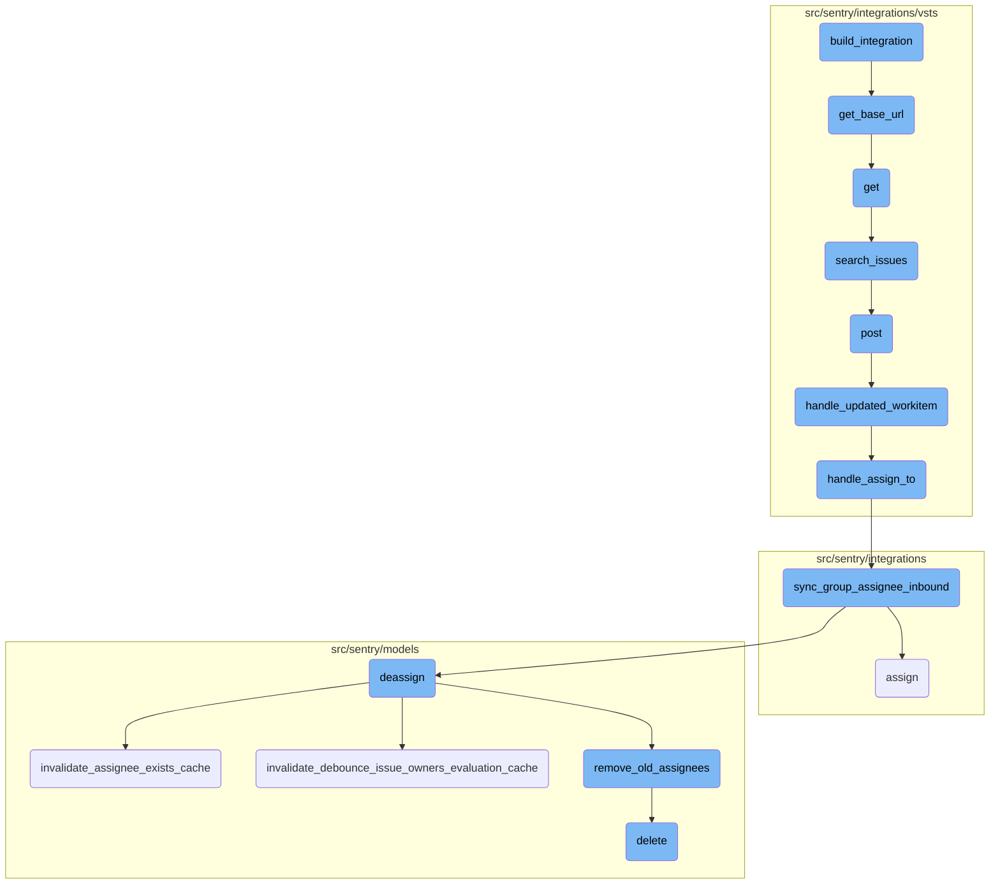
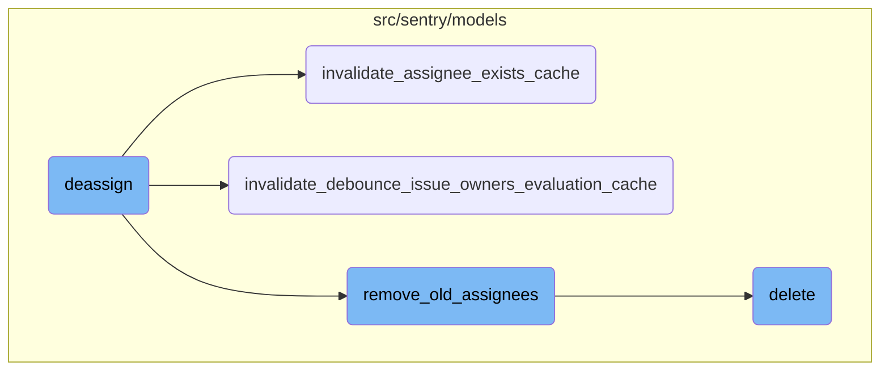

This document explains the <SwmToken path="src/sentry/integrations/vsts/integration.py" pos="442:3:3" line-data="    def build_integration(self, state: Mapping[str, Any]) -&gt; Mapping[str, Any]:">`build_integration`</SwmToken> process, which is responsible for initializing an integration by gathering necessary data and constructing an integration object. It involves several steps, including retrieving <SwmToken path="src/sentry/integrations/vsts/integration.py" pos="519:16:16" line-data="                    &quot;Please ensure third-party app access via OAuth is enabled \n&quot;">`OAuth`</SwmToken> data, user information, and account details, and then checking if an existing integration model is active or creating a new subscription if not.

The <SwmToken path="src/sentry/integrations/vsts/integration.py" pos="442:3:3" line-data="    def build_integration(self, state: Mapping[str, Any]) -&gt; Mapping[str, Any]:">`build_integration`</SwmToken> process starts by collecting essential data like <SwmToken path="src/sentry/integrations/vsts/integration.py" pos="519:16:16" line-data="                    &quot;Please ensure third-party app access via OAuth is enabled \n&quot;">`OAuth`</SwmToken> details, user info, and account specifics. It then creates an integration object and checks if there's already an active integration model. If there isn't one, it sets up a new subscription. This ensures that the integration is properly initialized and ready to use.

Here is a high level diagram of the flow, showing only the most important functions:



# Flow drill down

First, we'll zoom into this section of the flow:

```mermaid
graph TD;
      subgraph src/sentry/integrations/vsts
2eb3274b835c97ea5b25bae16463b074ba2108056be6b47c1f45b155ad67c7f8(build_integration):::mainFlowStyle --> 3a40802301e1642b0a2d0ce06ddee674da6a7fd8353ad71b1c436be19e6563d6(get_base_url):::mainFlowStyle
end

subgraph src/sentry/integrations/vsts
3a40802301e1642b0a2d0ce06ddee674da6a7fd8353ad71b1c436be19e6563d6(get_base_url):::mainFlowStyle --> c9f1b6abd5b86b248deafac3aa63eb8d055350bf49cbe100c54a0d94ee13361a(get):::mainFlowStyle
end

subgraph src/sentry/integrations/vsts
c9f1b6abd5b86b248deafac3aa63eb8d055350bf49cbe100c54a0d94ee13361a(get):::mainFlowStyle --> fc4a2a7e5f1b5a9d6230778920f9b62f4b7f3caa80ebd97c89444e007895b382(search_issues):::mainFlowStyle
end

subgraph src/sentry/integrations/vsts
fc4a2a7e5f1b5a9d6230778920f9b62f4b7f3caa80ebd97c89444e007895b382(search_issues):::mainFlowStyle --> a0445eff32744589c21cfe40b46d7b4346893653994134be4a340aaaf32b3f6d(post):::mainFlowStyle
end

subgraph src/sentry/integrations/vsts
a0445eff32744589c21cfe40b46d7b4346893653994134be4a340aaaf32b3f6d(post):::mainFlowStyle --> 66e049c83c1ca3a7a23933e320651f77196243d817b62c1a401dfd7205f9a929(handle_updated_workitem):::mainFlowStyle
end

subgraph src/sentry/integrations/vsts
66e049c83c1ca3a7a23933e320651f77196243d817b62c1a401dfd7205f9a929(handle_updated_workitem):::mainFlowStyle --> 66c307c65db74ab637ed0ed1623cc34d22110f0911938f86a52ccb8f5e8009dd(handle_assign_to):::mainFlowStyle
end

subgraph src/sentry/integrations/utils/sync.py
66c307c65db74ab637ed0ed1623cc34d22110f0911938f86a52ccb8f5e8009dd(handle_assign_to):::mainFlowStyle --> dd6f2c6555a3ad00a0aed3ab34055c7026063e3a2a74b2537fcf2a1223ffa577(sync_group_assignee_inbound):::mainFlowStyle
end

subgraph src/sentry/integrations/discord/webhooks
dd6f2c6555a3ad00a0aed3ab34055c7026063e3a2a74b2537fcf2a1223ffa577(sync_group_assignee_inbound):::mainFlowStyle --> 56621b0838f35e2e3d298b3ec08199d7d5798cf4ceebb767aed231b8ab67c192(assign)
end

subgraph src/sentry/models/groupassignee.py
dd6f2c6555a3ad00a0aed3ab34055c7026063e3a2a74b2537fcf2a1223ffa577(sync_group_assignee_inbound):::mainFlowStyle --> c745dbcbd32c9f5374c257f26bdc9092c08fc103acaae49568a75a0568d76364(deassign):::mainFlowStyle
end

subgraph src/sentry/models/groupassignee.py
c745dbcbd32c9f5374c257f26bdc9092c08fc103acaae49568a75a0568d76364(deassign):::mainFlowStyle --> ezqzw(...)
end

subgraph src/sentry/integrations/discord/webhooks
56621b0838f35e2e3d298b3ec08199d7d5798cf4ceebb767aed231b8ab67c192(assign) --> 5abb0782c5d50dc9bb2caef009ed5c564204afbedcccbd9f32c823400ee85c55(send_message)
end


      classDef mainFlowStyle color:#000000,fill:#7CB9F4
classDef rootsStyle color:#000000,fill:#00FFF4
classDef Style1 color:#000000,fill:#00FFAA
classDef Style2 color:#000000,fill:#FFFF00
classDef Style3 color:#000000,fill:#AA7CB9

%% Swimm:
%% graph TD;
%%       subgraph <SwmPath>[src/sentry/integrations/vsts/](src/sentry/integrations/vsts/)</SwmPath>
%% 2eb3274b835c97ea5b25bae16463b074ba2108056be6b47c1f45b155ad67c7f8(build_integration):::mainFlowStyle --> 3a40802301e1642b0a2d0ce06ddee674da6a7fd8353ad71b1c436be19e6563d6(get_base_url):::mainFlowStyle
%% end
%% 
%% subgraph <SwmPath>[src/sentry/integrations/vsts/](src/sentry/integrations/vsts/)</SwmPath>
%% 3a40802301e1642b0a2d0ce06ddee674da6a7fd8353ad71b1c436be19e6563d6(get_base_url):::mainFlowStyle --> c9f1b6abd5b86b248deafac3aa63eb8d055350bf49cbe100c54a0d94ee13361a(get):::mainFlowStyle
%% end
%% 
%% subgraph <SwmPath>[src/sentry/integrations/vsts/](src/sentry/integrations/vsts/)</SwmPath>
%% c9f1b6abd5b86b248deafac3aa63eb8d055350bf49cbe100c54a0d94ee13361a(get):::mainFlowStyle --> fc4a2a7e5f1b5a9d6230778920f9b62f4b7f3caa80ebd97c89444e007895b382(search_issues):::mainFlowStyle
%% end
%% 
%% subgraph <SwmPath>[src/sentry/integrations/vsts/](src/sentry/integrations/vsts/)</SwmPath>
%% fc4a2a7e5f1b5a9d6230778920f9b62f4b7f3caa80ebd97c89444e007895b382(search_issues):::mainFlowStyle --> a0445eff32744589c21cfe40b46d7b4346893653994134be4a340aaaf32b3f6d(post):::mainFlowStyle
%% end
%% 
%% subgraph <SwmPath>[src/sentry/integrations/vsts/](src/sentry/integrations/vsts/)</SwmPath>
%% a0445eff32744589c21cfe40b46d7b4346893653994134be4a340aaaf32b3f6d(post):::mainFlowStyle --> 66e049c83c1ca3a7a23933e320651f77196243d817b62c1a401dfd7205f9a929(handle_updated_workitem):::mainFlowStyle
%% end
%% 
%% subgraph <SwmPath>[src/sentry/integrations/vsts/](src/sentry/integrations/vsts/)</SwmPath>
%% 66e049c83c1ca3a7a23933e320651f77196243d817b62c1a401dfd7205f9a929(handle_updated_workitem):::mainFlowStyle --> 66c307c65db74ab637ed0ed1623cc34d22110f0911938f86a52ccb8f5e8009dd(handle_assign_to):::mainFlowStyle
%% end
%% 
%% subgraph <SwmPath>[src/sentry/integrations/utils/sync.py](src/sentry/integrations/utils/sync.py)</SwmPath>
%% 66c307c65db74ab637ed0ed1623cc34d22110f0911938f86a52ccb8f5e8009dd(handle_assign_to):::mainFlowStyle --> dd6f2c6555a3ad00a0aed3ab34055c7026063e3a2a74b2537fcf2a1223ffa577(sync_group_assignee_inbound):::mainFlowStyle
%% end
%% 
%% subgraph <SwmPath>[src/sentry/integrations/discord/webhooks/](src/sentry/integrations/discord/webhooks/)</SwmPath>
%% dd6f2c6555a3ad00a0aed3ab34055c7026063e3a2a74b2537fcf2a1223ffa577(sync_group_assignee_inbound):::mainFlowStyle --> 56621b0838f35e2e3d298b3ec08199d7d5798cf4ceebb767aed231b8ab67c192(assign)
%% end
%% 
%% subgraph <SwmPath>[src/sentry/models/groupassignee.py](src/sentry/models/groupassignee.py)</SwmPath>
%% dd6f2c6555a3ad00a0aed3ab34055c7026063e3a2a74b2537fcf2a1223ffa577(sync_group_assignee_inbound):::mainFlowStyle --> c745dbcbd32c9f5374c257f26bdc9092c08fc103acaae49568a75a0568d76364(deassign):::mainFlowStyle
%% end
%% 
%% subgraph <SwmPath>[src/sentry/models/groupassignee.py](src/sentry/models/groupassignee.py)</SwmPath>
%% c745dbcbd32c9f5374c257f26bdc9092c08fc103acaae49568a75a0568d76364(deassign):::mainFlowStyle --> ezqzw(...)
%% end
%% 
%% subgraph <SwmPath>[src/sentry/integrations/discord/webhooks/](src/sentry/integrations/discord/webhooks/)</SwmPath>
%% 56621b0838f35e2e3d298b3ec08199d7d5798cf4ceebb767aed231b8ab67c192(assign) --> 5abb0782c5d50dc9bb2caef009ed5c564204afbedcccbd9f32c823400ee85c55(send_message)
%% end
%% 
%% 
%%       classDef mainFlowStyle color:#000000,fill:#7CB9F4
%% classDef rootsStyle color:#000000,fill:#00FFF4
%% classDef Style1 color:#000000,fill:#00FFAA
%% classDef Style2 color:#000000,fill:#FFFF00
%% classDef Style3 color:#000000,fill:#AA7CB9
```



<SwmSnippet path="/src/sentry/integrations/vsts/integration.py" line="443">

---

## Building Integration

The <SwmToken path="src/sentry/integrations/vsts/integration.py" pos="442:3:3" line-data="    def build_integration(self, state: Mapping[str, Any]) -&gt; Mapping[str, Any]:">`build_integration`</SwmToken> function initializes the integration by gathering necessary data such as <SwmToken path="src/sentry/integrations/vsts/integration.py" pos="519:16:16" line-data="                    &quot;Please ensure third-party app access via OAuth is enabled \n&quot;">`OAuth`</SwmToken> data, user information, and account details. It then constructs an integration object and checks if an existing integration model is active. If not, it creates a new subscription.

```python
        data = state["identity"]["data"]
        oauth_data = self.get_oauth_data(data)
        account = state["account"]
        user = get_user_info(data["access_token"])
        scopes = sorted(self.get_scopes())
        base_url = self.get_base_url(data["access_token"], account["accountId"])

        integration: MutableMapping[str, Any] = {
            "name": account["accountName"],
            "external_id": account["accountId"],
            "metadata": {"domain_name": base_url, "scopes": scopes},
            "user_identity": {
                "type": "vsts",
                "external_id": user["id"],
                "scopes": scopes,
                "data": oauth_data,
            },
        }

        try:
            integration_model = IntegrationModel.objects.get(
```

---

</SwmSnippet>

<SwmSnippet path="/src/sentry/integrations/vsts/integration.py" line="540">

---

## Getting Base URL

The <SwmToken path="src/sentry/integrations/vsts/integration.py" pos="540:3:3" line-data="    def get_base_url(cls, access_token: str, account_id: int) -&gt; str | None:">`get_base_url`</SwmToken> function retrieves the base URL for the VSTS account by making an HTTP GET request using the provided access token and account ID. It returns the location URL if the request is successful.

```python
    def get_base_url(cls, access_token: str, account_id: int) -> str | None:
        """TODO(mgaeta): This should not be allowed to return None."""
        url = VstsIntegrationProvider.VSTS_ACCOUNT_LOOKUP_URL % account_id
        with http.build_session() as session:
            response = session.get(
                url,
                headers={
                    "Content-Type": "application/json",
                    "Authorization": f"Bearer {access_token}",
                },
            )
        if response.status_code == 200:
            return response.json()["locationUrl"]

        logger.info("vsts.get_base_url", extra={"responseCode": response.status_code})
        return None
```

---

</SwmSnippet>

<SwmSnippet path="/src/sentry/integrations/vsts/search.py" line="23">

---

## Fetching Integration

The <SwmToken path="src/sentry/integrations/vsts/search.py" pos="23:3:3" line-data="    def get(">`get`</SwmToken> function fetches the integration details based on the organization and integration ID. It validates the request parameters and calls the <SwmToken path="src/sentry/integrations/vsts/client.py" pos="417:3:3" line-data="    def search_issues(self, account_name: str, query: str | None = None) -&gt; Response:">`search_issues`</SwmToken> function to search for issues based on the query.

```python
    def get(
        self, request: Request, organization: RpcOrganization, integration_id: int, **kwds: Any
    ) -> Response:
        try:
            integration = Integration.objects.get(
                organizationintegration__organization_id=coerce_id_from(organization),
                id=integration_id,
                provider="vsts",
            )
        except Integration.DoesNotExist:
            return Response(status=404)

        field = request.GET.get("field")
        query = request.GET.get("query")
        if field is None:
            return Response({"detail": "field is a required parameter"}, status=400)
        if not query:
            return Response({"detail": "query is a required parameter"}, status=400)

        installation = integration.get_installation(organization.id)
        assert isinstance(installation, VstsIntegration), installation
```

---

</SwmSnippet>

<SwmSnippet path="/src/sentry/integrations/vsts/client.py" line="417">

---

## Searching Issues

The <SwmToken path="src/sentry/integrations/vsts/client.py" pos="417:3:3" line-data="    def search_issues(self, account_name: str, query: str | None = None) -&gt; Response:">`search_issues`</SwmToken> function sends a POST request to the VSTS API to search for work items based on the provided query. It returns the response from the API.

```python
    def search_issues(self, account_name: str, query: str | None = None) -> Response:
        return self.post(
            VstsApiPath.work_item_search.format(account_name=account_name),
            data={"searchText": query, "$top": 1000},
            api_preview=True,
        )
```

---

</SwmSnippet>

<SwmSnippet path="/src/sentry/integrations/vsts/webhooks.py" line="43">

---

## Handling Webhook Post

The <SwmToken path="src/sentry/integrations/vsts/webhooks.py" pos="43:3:3" line-data="    def post(self, request: Request, *args: Any, **kwargs: Any) -&gt; Response:">`post`</SwmToken> function handles incoming webhook requests. It extracts the event type and external ID from the request data, validates the webhook secret, and calls the <SwmToken path="src/sentry/integrations/vsts/webhooks.py" pos="151:2:2" line-data="def handle_updated_workitem(data: Mapping[str, Any], integration: RpcIntegration) -&gt; None:">`handle_updated_workitem`</SwmToken> function if the event type is <SwmToken path="src/sentry/integrations/vsts/webhooks.py" pos="52:31:33" line-data="        # https://docs.microsoft.com/en-us/azure/devops/service-hooks/events?view=azure-devops#workitem.updated">`workitem.updated`</SwmToken>.

```python
    def post(self, request: Request, *args: Any, **kwargs: Any) -> Response:
        try:
            data = request.data
            event_type = data["eventType"]
            external_id = get_vsts_external_id(data=request.data)
        except Exception as e:
            logger.info("vsts.invalid-webhook-payload", extra={"error": str(e)})
            return self.respond(status=status.HTTP_400_BAD_REQUEST)

        # https://docs.microsoft.com/en-us/azure/devops/service-hooks/events?view=azure-devops#workitem.updated
        if event_type == "workitem.updated":
            integration = integration_service.get_integration(
                provider=PROVIDER_KEY, external_id=external_id
            )
            if integration is None:
                logger.info(
                    "vsts.integration-in-webhook-payload-does-not-exist",
                    extra={"external_id": external_id, "event_type": event_type},
                )
                return self.respond(
                    {"detail": "Integration does not exist."}, status=status.HTTP_400_BAD_REQUEST
```

---

</SwmSnippet>

<SwmSnippet path="/src/sentry/integrations/vsts/webhooks.py" line="151">

---

## Handling Updated Work Item

The <SwmToken path="src/sentry/integrations/vsts/webhooks.py" pos="151:2:2" line-data="def handle_updated_workitem(data: Mapping[str, Any], integration: RpcIntegration) -&gt; None:">`handle_updated_workitem`</SwmToken> function processes the updated work item data from the webhook. It extracts necessary information such as the work item ID, project ID, assigned user, and status change. It then calls <SwmToken path="src/sentry/integrations/vsts/webhooks.py" pos="89:2:2" line-data="def handle_assign_to(">`handle_assign_to`</SwmToken> and <SwmToken path="src/sentry/integrations/vsts/webhooks.py" pos="124:2:2" line-data="def handle_status_change(">`handle_status_change`</SwmToken> to update the assignment and status.

```python
def handle_updated_workitem(data: Mapping[str, Any], integration: RpcIntegration) -> None:
    project: str | None = None
    try:
        external_issue_key = data["resource"]["workItemId"]
    except KeyError as e:
        logger.info(
            "vsts.updating-workitem-does-not-have-necessary-information",
            extra={"error": str(e), "integration_id": integration.id},
        )
        return

    try:
        project = data["resourceContainers"]["project"]["id"]
    except KeyError as e:
        logger.info(
            "vsts.updating-workitem-does-not-have-necessary-information",
            extra={"error": str(e), "integration_id": integration.id},
        )

    try:
        assigned_to = data["resource"]["fields"].get("System.AssignedTo")
```

---

</SwmSnippet>

<SwmSnippet path="/src/sentry/integrations/vsts/webhooks.py" line="89">

---

## Handling Assignment

The <SwmToken path="src/sentry/integrations/vsts/webhooks.py" pos="89:2:2" line-data="def handle_assign_to(">`handle_assign_to`</SwmToken> function processes the assignment data from the updated work item. It parses the email of the assigned user and calls <SwmToken path="src/sentry/integrations/utils/sync.py" pos="64:2:2" line-data="def sync_group_assignee_inbound(">`sync_group_assignee_inbound`</SwmToken> to synchronize the group assignee.

```python
def handle_assign_to(
    integration: RpcIntegration,
    external_issue_key: str | None,
    assigned_to: Mapping[str, str] | None,
) -> None:
    if not assigned_to:
        return

    email: str | None = None
    assign = False

    new_value = assigned_to.get("newValue")
    if new_value is not None:
        email = parse_email(new_value)
        if not email:
            logger.info(
                "vsts.failed-to-parse-email-in-handle-assign-to",
                extra={
                    "error": "parse_error",
                    "integration_id": integration.id,
                    "assigned_to_values": assigned_to,
```

---

</SwmSnippet>

<SwmSnippet path="/src/sentry/integrations/utils/sync.py" line="64">

---

## Synchronizing Group Assignee

The <SwmToken path="src/sentry/integrations/utils/sync.py" pos="64:2:2" line-data="def sync_group_assignee_inbound(">`sync_group_assignee_inbound`</SwmToken> function synchronizes the group assignee based on the integration, user email, and external issue key. It checks project membership and assigns the linked groups to matching users.

```python
def sync_group_assignee_inbound(
    integration: RpcIntegration,
    email: str | None,
    external_issue_key: str,
    assign: bool = True,
) -> Sequence[Group]:
    """
    Given an integration, user email address and an external issue key,
    assign linked groups to matching users. Checks project membership.
    Returns a list of groups that were successfully assigned.
    """

    logger = logging.getLogger(f"sentry.integrations.{integration.provider}")

    orgs_with_sync_enabled = where_should_sync(integration, "inbound_assignee")
    affected_groups = Group.objects.get_groups_by_external_issue(
        integration,
        orgs_with_sync_enabled,
        external_issue_key,
    )
    log_context = {
```

---

</SwmSnippet>

<SwmSnippet path="/src/sentry/integrations/discord/webhooks/message_component.py" line="137">

---

## Assigning in Discord

The <SwmToken path="src/sentry/integrations/discord/webhooks/message_component.py" pos="137:3:3" line-data="    def assign(self) -&gt; Response:">`assign`</SwmToken> function handles the assignment in Discord. It updates the group with the assigned user and logs the assignment. It then sends a follow-up message to confirm the assignment.

```python
    def assign(self) -> Response:
        assignee = self.request.get_selected_options()[0]

        self.update_group(
            {
                "assignedTo": assignee,
                "integration": ActivityIntegration.DISCORD.value,
            }
        )

        logger.info(
            "discord.assign.dialog",
            extra={
                "assignee": assignee,
                "user": self.request.user,
            },
        )

        assert self.request.user is not None

        analytics.record(
```

---

</SwmSnippet>

<SwmSnippet path="/src/sentry/integrations/discord/webhooks/handler.py" line="24">

---

## Sending Message

The <SwmToken path="src/sentry/integrations/discord/webhooks/handler.py" pos="24:3:3" line-data="    def send_message(self, message: str | DiscordMessageBuilder, update: bool = False) -&gt; Response:">`send_message`</SwmToken> function sends a follow-up message in Discord. It constructs the message and sends it as a response.

```python
    def send_message(self, message: str | DiscordMessageBuilder, update: bool = False) -> Response:
        """Sends a new follow up message."""
        response_type = DiscordResponseTypes.UPDATE if update else DiscordResponseTypes.MESSAGE

        if isinstance(message, str):
            message = DiscordMessageBuilder(
                content=message, flags=DiscordMessageFlags().set_ephemeral()
            )
        return Response(
            {
                "type": response_type,
                "data": message.build(),
            },
            status=200,
        )
```

---

</SwmSnippet>

Now, lets zoom into this section of the flow:



<SwmSnippet path="/src/sentry/models/groupassignee.py" line="197">

---

## Deassign Function

The <SwmToken path="src/sentry/models/groupassignee.py" pos="197:3:3" line-data="    def deassign(">`deassign`</SwmToken> function is responsible for unassigning a user or team from a group. It first attempts to retrieve the current assignee of the group. If an assignee exists, it deletes the assignee record and logs the unassignment activity. It also clears relevant caches and synchronizes the unassignment with external systems if necessary.

```python
    def deassign(
        self,
        group: Group,
        acting_user: User | RpcUser | None = None,
        assigned_to: Team | RpcUser | None = None,
        extra: dict[str, str] | None = None,
    ) -> None:
        from sentry.integrations.utils import sync_group_assignee_outbound
        from sentry.models.activity import Activity
        from sentry.models.projectownership import ProjectOwnership

        try:
            previous_groupassignee = self.get(group=group)
        except GroupAssignee.DoesNotExist:
            previous_groupassignee = None

        affected = self.filter(group=group)[:1].count()
        self.filter(group=group).delete()

        if affected > 0:
            Activity.objects.create_group_activity(group, ActivityType.UNASSIGNED, user=acting_user)
```

---

</SwmSnippet>

<SwmSnippet path="/src/sentry/models/groupowner.py" line="150">

---

### Invalidate Assignee Exists Cache

The <SwmToken path="src/sentry/models/groupowner.py" pos="150:3:3" line-data="    def invalidate_assignee_exists_cache(cls, project_id, group_id=None):">`invalidate_assignee_exists_cache`</SwmToken> function clears the cache that tracks whether an assignee exists for a group. If a specific group ID is provided, it clears the cache for that group; otherwise, it clears the cache for all groups in a project that had recent events.

```python
    def invalidate_assignee_exists_cache(cls, project_id, group_id=None):
        """
        If `group_id` is provided, clear the assignee exists cache for that group, else
        clear the cache of all groups for a project that had an event within the
        ASSIGNEE_EXISTS_DURATION window.
        """
        if group_id:
            cache.delete(ASSIGNEE_EXISTS_KEY(group_id))
            return

        # Get all the groups for a project that had an event within the ASSIGNEE_EXISTS_DURATION window.
        # Any groups without events in that window would have expired their TTL in the cache.
        queryset = Group.objects.filter(
            project_id=project_id,
            last_seen__gte=timezone.now() - timedelta(seconds=ASSIGNEE_EXISTS_DURATION),
        ).values_list("id", flat=True)

        # Run cache invalidation in batches
        group_id_iter = queryset.iterator(chunk_size=1000)
        while True:
            group_ids = list(itertools.islice(group_id_iter, 1000))
```

---

</SwmSnippet>

<SwmSnippet path="/src/sentry/models/groupowner.py" line="123">

---

### Invalidate Debounce Issue Owners Evaluation Cache

The <SwmToken path="src/sentry/models/groupowner.py" pos="123:3:3" line-data="    def invalidate_debounce_issue_owners_evaluation_cache(cls, project_id, group_id=None):">`invalidate_debounce_issue_owners_evaluation_cache`</SwmToken> function clears the cache that tracks the debounce state of issue owners evaluation. Similar to the previous function, it can clear the cache for a specific group or for all groups in a project with recent events.

```python
    def invalidate_debounce_issue_owners_evaluation_cache(cls, project_id, group_id=None):
        """
        If `group_id` is provided, clear the debounce issue owners cache for that group, else clear
        the cache of all groups for a project that had an event within the
        ISSUE_OWNERS_DEBOUNCE_DURATION window.
        """
        if group_id:
            cache.delete(ISSUE_OWNERS_DEBOUNCE_KEY(group_id))
            return

        # Get all the groups for a project that had an event within the ISSUE_OWNERS_DEBOUNCE_DURATION window.
        # Any groups without events in that window would have expired their TTL in the cache.
        queryset = Group.objects.filter(
            project_id=project_id,
            last_seen__gte=timezone.now() - timedelta(seconds=ISSUE_OWNERS_DEBOUNCE_DURATION),
        ).values_list("id", flat=True)

        # Run cache invalidation in batches
        group_id_iter = queryset.iterator(chunk_size=1000)
        while True:
            group_ids = list(itertools.islice(group_id_iter, 1000))
```

---

</SwmSnippet>

<SwmSnippet path="/src/sentry/models/groupassignee.py" line="65">

---

### Remove Old Assignees

The <SwmToken path="src/sentry/models/groupassignee.py" pos="65:3:3" line-data="    def remove_old_assignees(">`remove_old_assignees`</SwmToken> function handles the cleanup of old assignees from a group. Depending on the type of the previous assignee (team or user), it removes the relevant subscriptions and logs the removal activity.

```python
    def remove_old_assignees(
        self,
        group: Group,
        previous_assignee: GroupAssignee | None,
        new_assignee_id: int | None = None,
        new_assignee_type: str | None = None,
    ) -> None:
        from sentry.models.team import Team

        if not previous_assignee:
            return

        if (
            features.has("organizations:team-workflow-notifications", group.organization)
            and previous_assignee.team
        ):
            GroupSubscription.objects.filter(
                group=group,
                project=group.project,
                team=previous_assignee.team,
                reason=GroupSubscriptionReason.assigned,
```

---

</SwmSnippet>

<SwmSnippet path="/src/sentry/models/project.py" line="718">

---

### Delete Function

The <SwmToken path="src/sentry/models/project.py" pos="718:3:3" line-data="    def delete(self, *args, **kwargs):">`delete`</SwmToken> function in the <SwmToken path="src/sentry/models/project.py" pos="722:13:13" line-data="        with outbox_context(transaction.atomic(router.db_for_write(Project))):">`Project`</SwmToken> model manually cascades the deletion of related notification settings and ensures the deletion is properly logged and synchronized.

```python
    def delete(self, *args, **kwargs):
        # There is no foreign key relationship so we have to manually cascade.
        notifications_service.remove_notification_settings_for_project(project_id=self.id)

        with outbox_context(transaction.atomic(router.db_for_write(Project))):
            Project.outbox_for_update(self.id, self.organization_id).save()
            return super().delete(*args, **kwargs)
```

---

</SwmSnippet>

&nbsp;

*This is an auto-generated document by Swimm AI 🌊 and has not yet been verified by a human*

<SwmMeta version="3.0.0" repo-id="Z2l0aHViJTNBJTNBc2VudHJ5LWRlbW8tMSUzQSUzQVN3aW1tLURlbW8=" repo-name="sentry-demo-1" doc-type="flows"><sup>Powered by [Swimm](/)</sup></SwmMeta>
