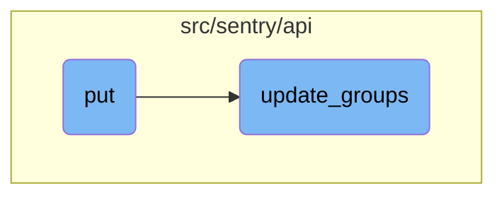

This document explains the process of bulk mutating issue attributes using the <SwmToken path="src/sentry/api/endpoints/project_group_index.py" pos="188:3:3" line-data="    def put(self, request: Request, project) -&gt; Response:">`put`</SwmToken> function. It covers how the function takes a list of issue <SwmToken path="src/sentry/api/endpoints/project_group_index.py" pos="206:5:5" line-data="        If any IDs are out of scope this operation will succeed without">`IDs`</SwmToken> and modifies their attributes based on the provided JSON object in the request body.

The flow starts with the <SwmToken path="src/sentry/api/endpoints/project_group_index.py" pos="188:3:3" line-data="    def put(self, request: Request, project) -&gt; Response:">`put`</SwmToken> function, which takes a list of issue <SwmToken path="src/sentry/api/endpoints/project_group_index.py" pos="206:5:5" line-data="        If any IDs are out of scope this operation will succeed without">`IDs`</SwmToken> and a JSON object with the new attributes. It then uses the <SwmToken path="src/sentry/api/helpers/group_index/update.py" pos="166:2:2" line-data="def update_groups(">`update_groups`</SwmToken> function to apply these changes. The <SwmToken path="src/sentry/api/helpers/group_index/update.py" pos="166:2:2" line-data="def update_groups(">`update_groups`</SwmToken> function filters the groups based on the provided <SwmToken path="src/sentry/api/endpoints/project_group_index.py" pos="206:5:5" line-data="        If any IDs are out of scope this operation will succeed without">`IDs`</SwmToken>, validates the data, and applies the updates, including changes to status, priority, and resolution details.

# Flow drill down



<SwmSnippet path="/src/sentry/api/endpoints/project_group_index.py" line="188">

---

## Bulk Mutate Issues

The <SwmToken path="src/sentry/api/endpoints/project_group_index.py" pos="188:3:3" line-data="    def put(self, request: Request, project) -&gt; Response:">`put`</SwmToken> function is responsible for bulk mutating various attributes on issues. It takes a list of issue <SwmToken path="src/sentry/api/endpoints/project_group_index.py" pos="206:5:5" line-data="        If any IDs are out of scope this operation will succeed without">`IDs`</SwmToken> and modifies their attributes based on the provided JSON object in the request body. The function supports updating attributes like status, assignment, visibility, and more. It uses the <SwmToken path="src/sentry/api/helpers/group_index/update.py" pos="166:2:2" line-data="def update_groups(">`update_groups`</SwmToken> function to apply these changes.

`````````````````````````````python
    def put(self, request: Request, project) -> Response:
        """
        Bulk Mutate a List of Issues
        ````````````````````````````

        Bulk mutate various attributes on issues.  The list of issues
        to modify is given through the `id` query parameter.  It is repeated
        for each issue that should be modified.

        - For non-status updates, the `id` query parameter is required.
        - For status updates, the `id` query parameter may be omitted
          for a batch "update all" query.
        - An optional `status` query parameter may be used to restrict
          mutations to only events with the given status.

        The following attributes can be modified and are supplied as
        JSON object in the body:

        If any IDs are out of scope this operation will succeed without
        any data mutation.

`````````````````````````````

---

</SwmSnippet>

<SwmSnippet path="/src/sentry/api/helpers/group_index/update.py" line="166">

---

## Applying Updates to Groups

The <SwmToken path="src/sentry/api/helpers/group_index/update.py" pos="166:2:2" line-data="def update_groups(">`update_groups`</SwmToken> function processes the updates to the specified groups. It filters the groups based on the provided <SwmToken path="src/sentry/api/helpers/group_index/update.py" pos="184:9:9" line-data="        # filter down group ids to only valid matches">`ids`</SwmToken> and validates the data using the <SwmToken path="src/sentry/api/helpers/group_index/update.py" pos="60:7:7" line-data="from .validators import GroupValidator, ValidationError">`GroupValidator`</SwmToken>. If the validation passes, it applies the updates to the groups, including changes to status, priority, and resolution details. The function also handles special cases like resolving issues in the next release or in a specific commit.

```python
def update_groups(
    request: Request,
    group_ids: Sequence[int | str] | None,
    projects: Sequence[Project],
    organization_id: int,
    search_fn: SearchFunction | None,
    user: User | None = None,
    data: Mapping[str, Any] | None = None,
) -> Response:
    # If `user` and `data` are passed as parameters then they should override
    # the values in `request`.
    user = user or request.user
    data = data or request.data

    if group_ids:
        group_list = Group.objects.filter(
            project__organization_id=organization_id, project__in=projects, id__in=group_ids
        )
        # filter down group ids to only valid matches
        group_ids = [g.id for g in group_list]
        if not group_ids:
```

---

</SwmSnippet>

&nbsp;

*This is an auto-generated document by Swimm AI 🌊 and has not yet been verified by a human*

<SwmMeta version="3.0.0" repo-id="Z2l0aHViJTNBJTNBc2VudHJ5LWRlbW8tMSUzQSUzQVN3aW1tLURlbW8=" repo-name="sentry-demo-1" doc-type="flows"><sup>Powered by [Swimm](/)</sup></SwmMeta>
