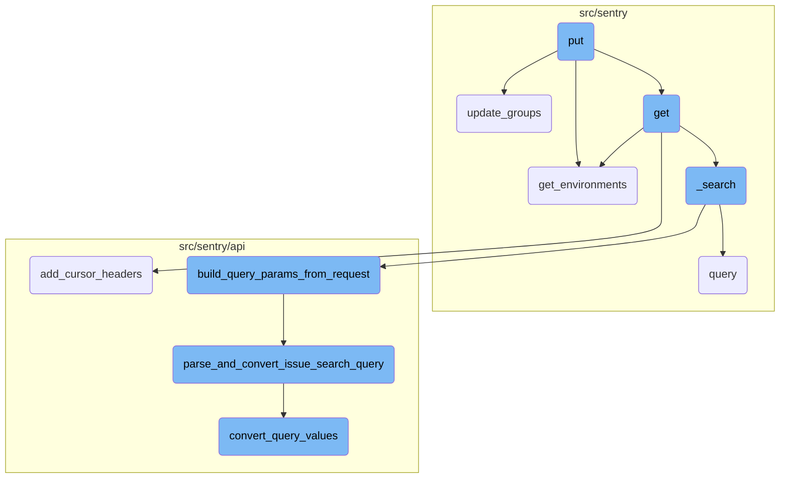
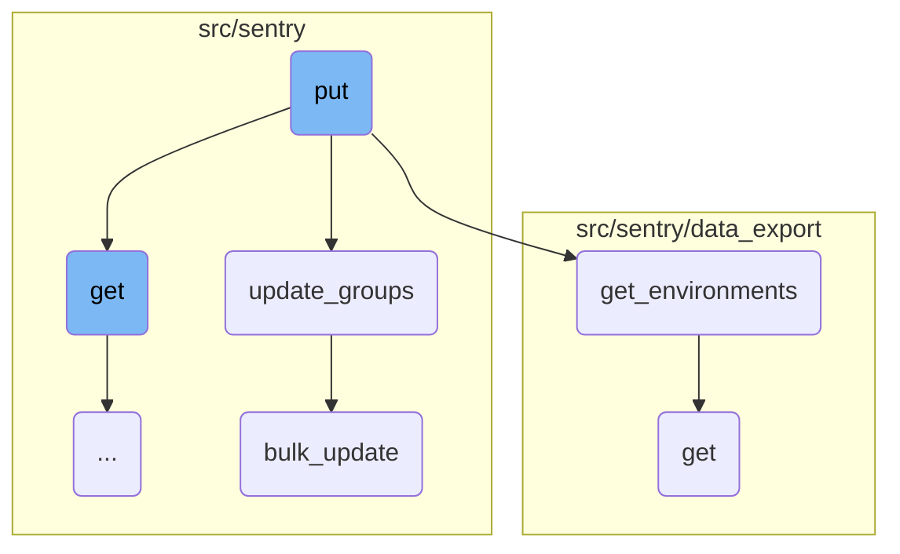
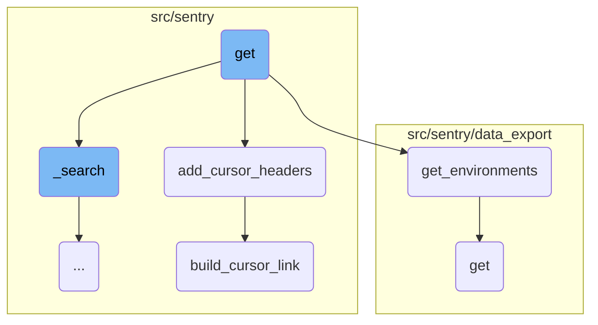
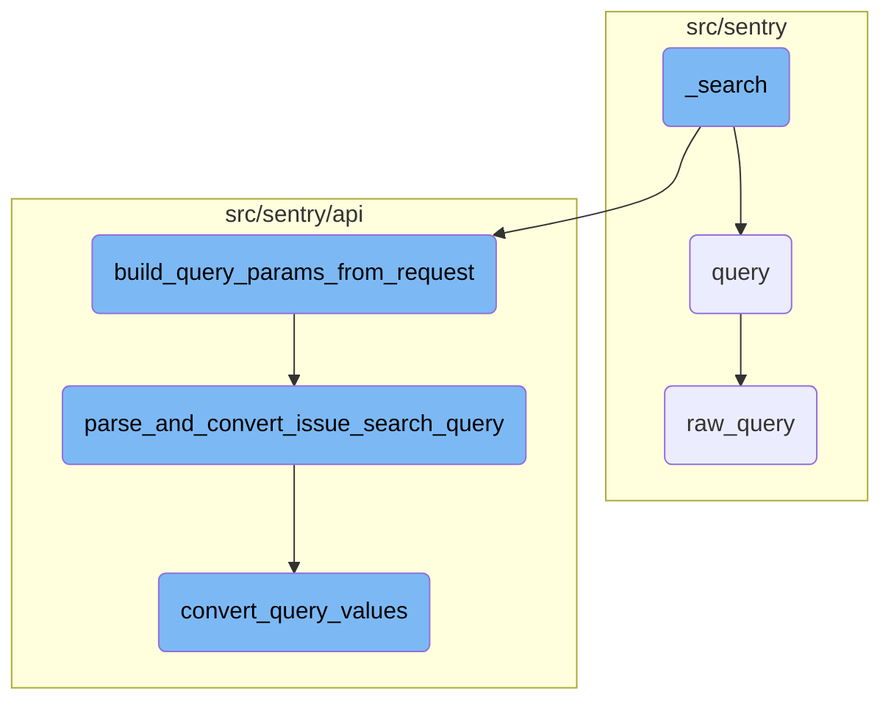

This document explains the <SwmToken path="src/sentry/issues/endpoints/organization_group_index.py" pos="408:3:3" line-data="    def put(self, request: Request, organization) -&gt; Response:">`put`</SwmToken> function, which is responsible for handling bulk mutations of various attributes on issues. It processes the request, validates project access, and then calls <SwmToken path="src/sentry/tasks/embeddings_grouping/utils.py" pos="492:2:2" line-data="def update_groups(project, seer_response, group_id_batch_filtered, group_hashes_dict):">`update_groups`</SwmToken> to apply the changes. This function is crucial for modifying multiple issues efficiently based on the provided query parameters.

The <SwmToken path="src/sentry/issues/endpoints/organization_group_index.py" pos="408:3:3" line-data="    def put(self, request: Request, organization) -&gt; Response:">`put`</SwmToken> function starts by processing the incoming request and validating access to the specified project. It then identifies the issues to be modified based on the query parameters. Once the issues are identified, the function calls <SwmToken path="src/sentry/tasks/embeddings_grouping/utils.py" pos="492:2:2" line-data="def update_groups(project, seer_response, group_id_batch_filtered, group_hashes_dict):">`update_groups`</SwmToken> to apply the necessary changes to these issues. This ensures that multiple issues can be updated efficiently in a single operation.

Here is a high level diagram of the flow, showing only the most important functions:



# Flow drill down

First, we'll zoom into this section of the flow:



<SwmSnippet path="/src/sentry/issues/endpoints/organization_group_index.py" line="408">

---

## Handling Bulk Mutation of Issues

The <SwmToken path="src/sentry/issues/endpoints/organization_group_index.py" pos="408:3:3" line-data="    def put(self, request: Request, organization) -&gt; Response:">`put`</SwmToken> function handles bulk mutation of various attributes on issues. It processes the request, validates project access, and then calls <SwmToken path="src/sentry/tasks/embeddings_grouping/utils.py" pos="492:2:2" line-data="def update_groups(project, seer_response, group_id_batch_filtered, group_hashes_dict):">`update_groups`</SwmToken> to apply the changes. This function is crucial for modifying multiple issues efficiently based on the provided query parameters.

`````````````````````````````python
    def put(self, request: Request, organization) -> Response:
        """
        Bulk Mutate a List of Issues
        ````````````````````````````

        Bulk mutate various attributes on issues.  The list of issues
        to modify is given through the `id` query parameter.  It is repeated
        for each issue that should be modified.

        - For non-status updates, the `id` query parameter is required.
        - For status updates, the `id` query parameter may be omitted
          for a batch "update all" query.
        - An optional `status` query parameter may be used to restrict
          mutations to only events with the given status.

        The following attributes can be modified and are supplied as
        JSON object in the body:

        If any ids are out of scope this operation will succeed without
        any data mutation.

`````````````````````````````

---

</SwmSnippet>

<SwmSnippet path="/src/sentry/tasks/embeddings_grouping/utils.py" line="492">

---

## Updating Group Data

The <SwmToken path="src/sentry/tasks/embeddings_grouping/utils.py" pos="492:2:2" line-data="def update_groups(project, seer_response, group_id_batch_filtered, group_hashes_dict):">`update_groups`</SwmToken> function updates group data based on the response from Seer. It iterates over the groups, updates their metadata with similarity data, and performs a bulk update. This function ensures that the group data is kept up-to-date with the latest similarity information.

```python
def update_groups(project, seer_response, group_id_batch_filtered, group_hashes_dict):
    groups_with_neighbor = seer_response["groups_with_neighbor"]
    groups = Group.objects.filter(project_id=project.id, id__in=group_id_batch_filtered)
    for group in groups:
        seer_similarity: dict[str, Any] = {
            "similarity_model_version": SEER_SIMILARITY_MODEL_VERSION,
            "request_hash": group_hashes_dict[group.id],
        }
        if str(group.id) in groups_with_neighbor:
            logger.info(
                "backfill_seer_grouping_records.found_neighbor",
                extra={
                    "project_id": project.id,
                    "group_id": group.id,
                },
            )
            # TODO: remove this try catch once the helper is made
            try:
                seer_similarity["results"] = [
                    asdict(
                        SeerSimilarIssueData.from_raw(
```

---

</SwmSnippet>

<SwmSnippet path="/src/sentry/data_export/processors/discover.py" line="61">

---

## Fetching Environments

The <SwmToken path="src/sentry/data_export/processors/discover.py" pos="61:3:3" line-data="    def get_environments(organization_id, query):">`get_environments`</SwmToken> function retrieves the list of environments based on the query parameters. It validates the requested environments and returns the corresponding environment objects. This function is used to filter issues by their environment.

```python
    def get_environments(organization_id, query):
        requested_environments = query.get("environment", [])
        if not isinstance(requested_environments, list):
            requested_environments = [requested_environments]

        if not requested_environments:
            return []

        environments = list(
            Environment.objects.filter(
                organization_id=organization_id, name__in=requested_environments
            )
        )
        environment_names = [e.name for e in environments]

        if set(requested_environments) != set(environment_names):
            raise ExportError("Requested environment does not exist")

        return environments
```

---

</SwmSnippet>

<SwmSnippet path="/src/sentry/data_export/endpoints/data_export_details.py" line="27">

---

## Retrieving Data Export Details

The <SwmToken path="src/sentry/data_export/endpoints/data_export_details.py" pos="27:3:3" line-data="    def get(self, request: Request, organization: Organization, data_export_id: str) -&gt; Response:">`get`</SwmToken> function retrieves information about a temporary file record used for data export. It checks for necessary permissions and returns the serialized data export object. This function is essential for providing users with access to their exported data.

```python
    def get(self, request: Request, organization: Organization, data_export_id: str) -> Response:
        """
        Retrieve information about the temporary file record.
        Used to populate page emailed to the user.
        """

        if not features.has("organizations:discover-query", organization):
            return Response(status=404)

        try:
            data_export = ExportedData.objects.get(id=data_export_id, organization=organization)
        except ExportedData.DoesNotExist:
            return Response(status=404)
        # Check data export permissions
        if data_export.query_info.get("project"):
            project_ids = [int(project) for project in data_export.query_info.get("project", [])]
            projects = Project.objects.filter(organization=organization, id__in=project_ids)
            if any(p for p in projects if not request.access.has_project_access(p)):
                raise PermissionDenied(
                    detail="You don't have permissions to view some of the data this export contains."
                )
```

---

</SwmSnippet>

<SwmSnippet path="/src/sentry/hybridcloud/outbox/base.py" line="115">

---

## Performing Bulk Update

The <SwmToken path="src/sentry/hybridcloud/outbox/base.py" pos="115:3:3" line-data="    def bulk_update(">`bulk_update`</SwmToken> function performs a bulk update on a list of objects. It creates outbox records for each object and then calls the superclass's <SwmToken path="src/sentry/hybridcloud/outbox/base.py" pos="115:3:3" line-data="    def bulk_update(">`bulk_update`</SwmToken> method. This function ensures that updates are efficiently applied to multiple objects in a single operation.

```python
    def bulk_update(
        self, objs: Iterable[_RM], fields: Sequence[str], *args: Any, **kwds: Any
    ) -> Any:
        from sentry.hybridcloud.models.outbox import outbox_context

        tuple_of_objs: tuple[_RM, ...] = tuple(objs)
        if not tuple_of_objs:
            return super().bulk_update(tuple_of_objs, fields, *args, **kwds)

        model: type[_RM] = type(tuple_of_objs[0])
        using = router.db_for_write(model)
        with outbox_context(transaction.atomic(using=using), flush=False):
            outboxes: list[RegionOutboxBase] = []
            for obj in tuple_of_objs:
                outboxes.append(obj.outbox_for_update())

            type(outboxes[0]).objects.bulk_create(outboxes)
            return super().bulk_update(tuple_of_objs, fields, *args, **kwds)
```

---

</SwmSnippet>

Now, lets zoom into this section of the flow:



<SwmSnippet path="/src/sentry/issues/endpoints/organization_group_index.py" line="203">

---

## Handling the Request

The <SwmToken path="src/sentry/issues/endpoints/organization_group_index.py" pos="203:3:3" line-data="    def get(self, request: Request, organization) -&gt; Response:">`get`</SwmToken> function handles the request to list an organization's issues. It processes various query parameters, validates them, and fetches the relevant issues from the database. It also handles special cases like direct event ID lookups and short ID lookups. The function then serializes the results and prepares the response.

``````````````````````````````python
    def get(self, request: Request, organization) -> Response:
        """
        List an Organization's Issues
        `````````````````````````````

        Return a list of issues (groups) bound to an organization.  All parameters are
        supplied as query string parameters.

        A default query of ``is:unresolved issue.priority:[high,medium]`` is applied.
        To return results with other statuses send a new query value
        (i.e. ``?query=`` for all results).

        The ``groupStatsPeriod`` parameter can be used to select the timeline
        stats which should be present. Possible values are: '' (disable),
        '24h', '14d'

        The ``statsPeriod`` parameter can be used to select a date window starting
        from now. Ex. ``14d``.

        The ``start`` and ``end`` parameters can be used to select an absolute
        date period to fetch issues from.
``````````````````````````````

---

</SwmSnippet>

<SwmSnippet path="/src/sentry/api/base.py" line="501">

---

## Adding Cursor Headers

The <SwmToken path="src/sentry/api/base.py" pos="501:3:3" line-data="    def add_cursor_headers(self, request: Request, response, cursor_result):">`add_cursor_headers`</SwmToken> function adds pagination headers to the response. It sets the <SwmToken path="src/sentry/api/base.py" pos="503:4:6" line-data="            response[&quot;X-Hits&quot;] = cursor_result.hits">`X-Hits`</SwmToken> and <SwmToken path="src/sentry/api/base.py" pos="505:4:8" line-data="            response[&quot;X-Max-Hits&quot;] = cursor_result.max_hits">`X-Max-Hits`</SwmToken> headers based on the cursor result and constructs the <SwmToken path="src/sentry/api/base.py" pos="506:4:4" line-data="        response[&quot;Link&quot;] = &quot;, &quot;.join(">`Link`</SwmToken> header using the <SwmToken path="src/sentry/api/base.py" pos="508:3:3" line-data="                self.build_cursor_link(request, &quot;previous&quot;, cursor_result.prev),">`build_cursor_link`</SwmToken> function.

```python
    def add_cursor_headers(self, request: Request, response, cursor_result):
        if cursor_result.hits is not None:
            response["X-Hits"] = cursor_result.hits
        if cursor_result.max_hits is not None:
            response["X-Max-Hits"] = cursor_result.max_hits
        response["Link"] = ", ".join(
            [
                self.build_cursor_link(request, "previous", cursor_result.prev),
                self.build_cursor_link(request, "next", cursor_result.next),
            ]
        )
```

---

</SwmSnippet>

<SwmSnippet path="/src/sentry/api/base.py" line="239">

---

### Building Cursor Link

The <SwmToken path="src/sentry/api/base.py" pos="239:3:3" line-data="    def build_cursor_link(self, request: Request, name: str, cursor: Cursor):">`build_cursor_link`</SwmToken> function constructs a URL for pagination. It takes the current request, the name of the link (previous or next), and the cursor object. It generates the base URL and appends the query string, then formats it into the <SwmToken path="src/sentry/api/base.py" pos="259:3:3" line-data="        return CURSOR_LINK_HEADER.format(">`CURSOR_LINK_HEADER`</SwmToken> template.

```python
    def build_cursor_link(self, request: Request, name: str, cursor: Cursor):
        if request.GET.get("cursor") is None:
            querystring = request.GET.urlencode()
        else:
            mutable_query_dict = request.GET.copy()
            mutable_query_dict.pop("cursor")
            querystring = mutable_query_dict.urlencode()

        url_prefix = (
            generate_organization_url(request.subdomain)
            if is_using_customer_domain(request)
            else None
        )
        base_url = absolute_uri(urlquote(request.path), url_prefix=url_prefix)

        if querystring:
            base_url = f"{base_url}?{querystring}"
        else:
            base_url = f"{base_url}?"

        return CURSOR_LINK_HEADER.format(
```

---

</SwmSnippet>

Now, lets zoom into this section of the flow:



<SwmSnippet path="/src/sentry/issues/endpoints/organization_group_index.py" line="153">

---

## \_search Function

The <SwmToken path="src/sentry/issues/endpoints/organization_group_index.py" pos="153:3:3" line-data="    def _search(">`_search`</SwmToken> function is responsible for handling the search logic. It starts by building query parameters from the request using the <SwmToken path="src/sentry/issues/endpoints/organization_group_index.py" pos="157:5:5" line-data="            query_kwargs = build_query_params_from_request(">`build_query_params_from_request`</SwmToken> function. It then updates these parameters with any additional query arguments and sets the environment and actor. Depending on the <SwmToken path="src/sentry/issues/endpoints/organization_group_index.py" pos="167:6:6" line-data="            if query_kwargs[&quot;sort_by&quot;] == &quot;inbox&quot;:">`sort_by`</SwmToken> parameter, it either performs an inbox search or a regular search using the Snuba dataset.

```python
    def _search(
        self, request: Request, organization, projects, environments, extra_query_kwargs=None
    ):
        with start_span(op="_search"):
            query_kwargs = build_query_params_from_request(
                request, organization, projects, environments
            )
            if extra_query_kwargs is not None:
                assert "environment" not in extra_query_kwargs
                query_kwargs.update(extra_query_kwargs)

            query_kwargs["environments"] = environments if environments else None

            query_kwargs["actor"] = request.user
            if query_kwargs["sort_by"] == "inbox":
                query_kwargs.pop("sort_by")
                result = inbox_search(**query_kwargs)
            else:

                def use_group_snuba_dataset() -> bool:
                    # if useGroupSnubaDataset is present, override the flag so we can test the new dataset
```

---

</SwmSnippet>

<SwmSnippet path="/src/sentry/api/helpers/group_index/index.py" line="65">

---

### Building Query Parameters

The <SwmToken path="src/sentry/api/helpers/group_index/index.py" pos="65:2:2" line-data="def build_query_params_from_request(">`build_query_params_from_request`</SwmToken> function constructs the query parameters needed for the search. It extracts various parameters from the request, such as projects, sort options, limits, and search filters. It also handles pagination and saved searches, ensuring that the query parameters are correctly set up for the search operation.

```python
def build_query_params_from_request(
    request: Request,
    organization: "Organization",
    projects: Sequence["Project"],
    environments: Sequence["Environment"] | None,
) -> MutableMapping[str, Any]:
    query_kwargs = {"projects": projects, "sort_by": request.GET.get("sort", DEFAULT_SORT_OPTION)}

    limit = request.GET.get("limit")
    if limit:
        try:
            query_kwargs["limit"] = int(limit)
        except ValueError:
            raise ValidationError("invalid limit")

    # TODO: proper pagination support
    if request.GET.get("cursor"):
        try:
            query_kwargs["cursor"] = Cursor.from_string(request.GET.get("cursor"))
        except ValueError:
            raise ParseError(detail="Invalid cursor parameter.")
```

---

</SwmSnippet>

<SwmSnippet path="/src/sentry/api/helpers/group_index/index.py" line="47">

---

### Parsing and Converting Search Query

The <SwmToken path="src/sentry/api/helpers/group_index/index.py" pos="47:2:2" line-data="def parse_and_convert_issue_search_query(">`parse_and_convert_issue_search_query`</SwmToken> function parses the search query and converts it into search filters. It uses the <SwmToken path="src/sentry/api/helpers/group_index/index.py" pos="55:5:5" line-data="        search_filters = convert_query_values(">`convert_query_values`</SwmToken> function to transform the query values into the appropriate format and validates the search filters' permissions.

```python
def parse_and_convert_issue_search_query(
    query: str,
    organization: Organization,
    projects: Sequence[Project],
    environments: Sequence[Environment],
    user: User | AnonymousUser,
) -> Sequence[SearchFilter]:
    try:
        search_filters = convert_query_values(
            parse_search_query(query), projects, user, environments
        )
    except InvalidSearchQuery as e:
        raise ValidationError(f"Error parsing search query: {e}")

    validate_search_filter_permissions(organization, search_filters, user)
    return search_filters
```

---

</SwmSnippet>

<SwmSnippet path="/src/sentry/api/issue_search.py" line="260">

---

### Converting Query Values

The <SwmToken path="src/sentry/api/issue_search.py" pos="260:2:2" line-data="def convert_query_values(">`convert_query_values`</SwmToken> function takes a collection of search filters and converts their values into a specific format based on predefined converters. It ensures that the search filters are correctly formatted and handles any aggregate filters that are not supported in issue searches.

```python
def convert_query_values(
    search_filters: ParsedTerms,
    projects: Sequence[Project],
    user: User | RpcUser | None,
    environments: Sequence[Environment] | None,
    value_converters=value_converters,
    allow_aggregate_filters=False,
) -> list[SearchFilter]:
    """
    Accepts a collection of SearchFilter objects and converts their values into
    a specific format, based on converters specified in `value_converters`.
    :param search_filters: Collection of `SearchFilter` objects.
    :param projects: List of projects being searched across
    :param user: The user making the search
    :param environments: The environments to consider when making the search
    :param value_converters: A dictionary of functions that convert search filter values into different formats.
    :return: New collection of `SearchFilters`, which may have converted values.
    """

    def convert_search_filter(
        search_filter: SearchFilter, organization: Organization
```

---

</SwmSnippet>

<SwmSnippet path="/src/sentry/utils/snuba.py" line="1318">

---

### Query Function

The <SwmToken path="src/sentry/utils/snuba.py" pos="1318:2:2" line-data="def query(">`query`</SwmToken> function sends a query to Snuba and processes the response. It constructs the query body using the <SwmToken path="src/sentry/utils/snuba.py" pos="1337:5:5" line-data="        body = raw_query(">`raw_query`</SwmToken> function and validates the response to ensure that the expected columns match the received columns. The function then processes the result and returns the nested groups.

```python
def query(
    dataset=None,
    start=None,
    end=None,
    groupby=None,
    conditions=None,
    filter_keys=None,
    aggregations=None,
    selected_columns=None,
    totals=None,
    use_cache=False,
    **kwargs,
):
    aggregations = aggregations or [["count()", "", "aggregate"]]
    filter_keys = filter_keys or {}
    selected_columns = selected_columns or []
    groupby = groupby or []

    try:
        body = raw_query(
            dataset=dataset,
```

---

</SwmSnippet>

<SwmSnippet path="/src/sentry/utils/snuba.py" line="846">

---

### Raw Query Function

The <SwmToken path="src/sentry/utils/snuba.py" pos="846:2:2" line-data="def raw_query(">`raw_query`</SwmToken> function sends a low-level query to Snuba. It constructs the query parameters and sends them to Snuba, returning the raw response. This function is used by the <SwmToken path="src/sentry/utils/snuba.py" pos="861:5:5" line-data="    Sends a query to snuba.  See `SnubaQueryParams` docstring for param">`query`</SwmToken> function to perform the actual data retrieval from Snuba.

```python
def raw_query(
    dataset=None,
    start=None,
    end=None,
    groupby=None,
    conditions=None,
    filter_keys=None,
    aggregations=None,
    rollup=None,
    referrer=None,
    is_grouprelease=False,
    use_cache=False,
    **kwargs,
) -> Mapping[str, Any]:
    """
    Sends a query to snuba.  See `SnubaQueryParams` docstring for param
    descriptions.
    """

    if referrer:
        kwargs["tenant_ids"] = kwargs.get("tenant_ids") or dict()
```

---

</SwmSnippet>

&nbsp;

*This is an auto-generated document by Swimm AI 🌊 and has not yet been verified by a human*

<SwmMeta version="3.0.0" repo-id="Z2l0aHViJTNBJTNBc2VudHJ5LWRlbW8tMSUzQSUzQVN3aW1tLURlbW8=" repo-name="sentry-demo-1" doc-type="flows"><sup>Powered by [Swimm](/)</sup></SwmMeta>
