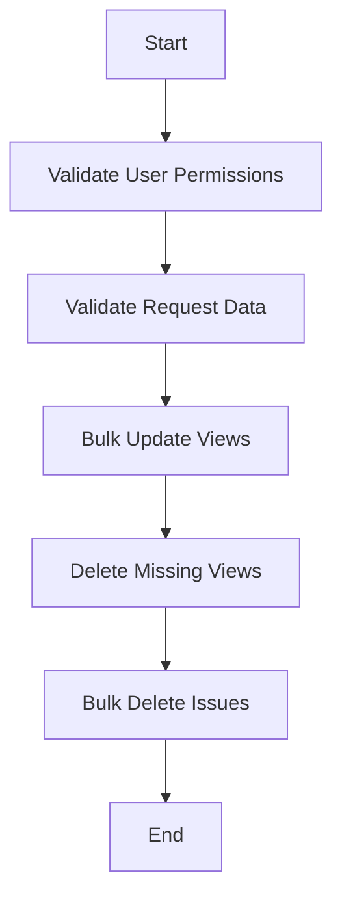

This document will cover the Bulk Update and Delete Views Flow, which includes:

1. Validating user permissions and request data
2. Performing bulk updates to custom views
3. Deleting missing views
4. Bulk deleting issues

Technical document: <SwmLink doc-title="Bulk Update and Delete Views Flow">[Bulk Update and Delete Views Flow](/.swm/bulk-update-and-delete-views-flow.k15du8ob.sw.md)</SwmLink>

# [Validating User Permissions](https://app.swimm.io/repos/Z2l0aHViJTNBJTNBc2VudHJ5LWRlbW8tMSUzQSUzQVN3aW1tLURlbW8=/docs/k15du8ob#put)

The first step in the bulk update and delete views flow is to ensure that the user has the necessary permissions to perform these actions. This involves checking if the user has the required features enabled for their organization. If the user does not have the necessary permissions, the process is halted, and an appropriate error response is returned.

# [Validating Request Data](https://app.swimm.io/repos/Z2l0aHViJTNBJTNBc2VudHJ5LWRlbW8tMSUzQSUzQVN3aW1tLURlbW8=/docs/k15du8ob#put)

Once user permissions are validated, the next step is to validate the incoming request data. This involves checking the data against predefined criteria to ensure it is in the correct format and contains all necessary information. If the data is invalid, an error response is returned, and the process is halted.

# [Performing Bulk Updates to Custom Views](https://app.swimm.io/repos/Z2l0aHViJTNBJTNBc2VudHJ5LWRlbW8tMSUzQSUzQVN3aW1tLURlbW8=/docs/k15du8ob#bulk_update_views)

After validating the request data, the system proceeds to update the custom views. This involves iterating over the provided views and either creating new views or updating existing ones. The system ensures that any views not included in the request are deleted. This step is crucial for maintaining the accuracy and relevance of the custom views for the organization member.

# [Deleting Missing Views](https://app.swimm.io/repos/Z2l0aHViJTNBJTNBc2VudHJ5LWRlbW8tMSUzQSUzQVN3aW1tLURlbW8=/docs/k15du8ob#_delete_missing_views)

In this step, the system identifies and deletes any views that are not included in the current request. This is done to ensure that only the relevant views are retained, and any outdated or unnecessary views are removed. This helps in keeping the custom views list clean and up-to-date.

# [Bulk Deleting Issues](https://app.swimm.io/repos/Z2l0aHViJTNBJTNBc2VudHJ5LWRlbW8tMSUzQSUzQVN3aW1tLURlbW8=/docs/k15du8ob#delete)

The final step in the flow involves the bulk deletion of issues. This step ensures that only the specified issues are deleted, based on the provided list of issue IDs. The system validates the request, checks for necessary features, and then performs the deletion. This step is important for managing and maintaining the issue list within the organization.

&nbsp;

*This is an auto-generated document by Swimm AI 🌊 and has not yet been verified by a human*

<SwmMeta version="3.0.0" repo-id="Z2l0aHViJTNBJTNBc2VudHJ5LWRlbW8tMSUzQSUzQVN3aW1tLURlbW8=" repo-name="sentry-demo-1" doc-type="product-flows">Powered by [Swimm](/)</SwmMeta>
