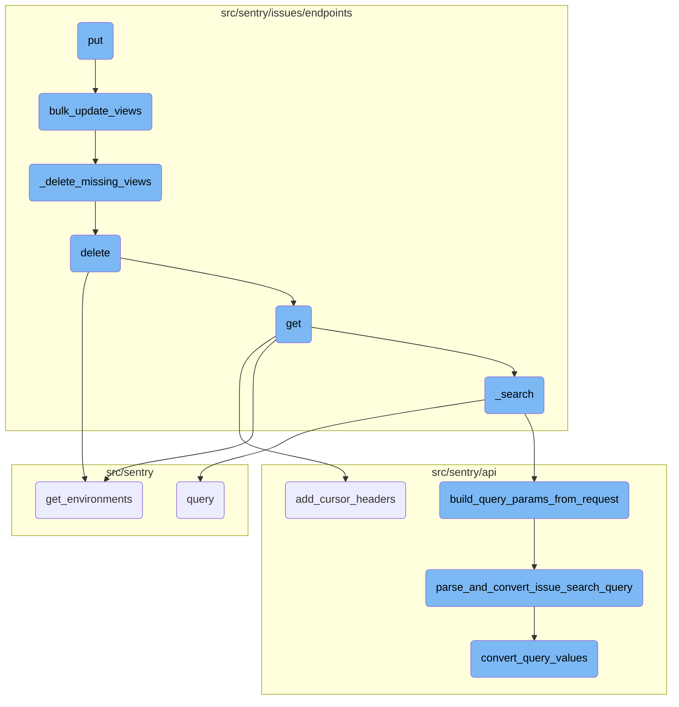
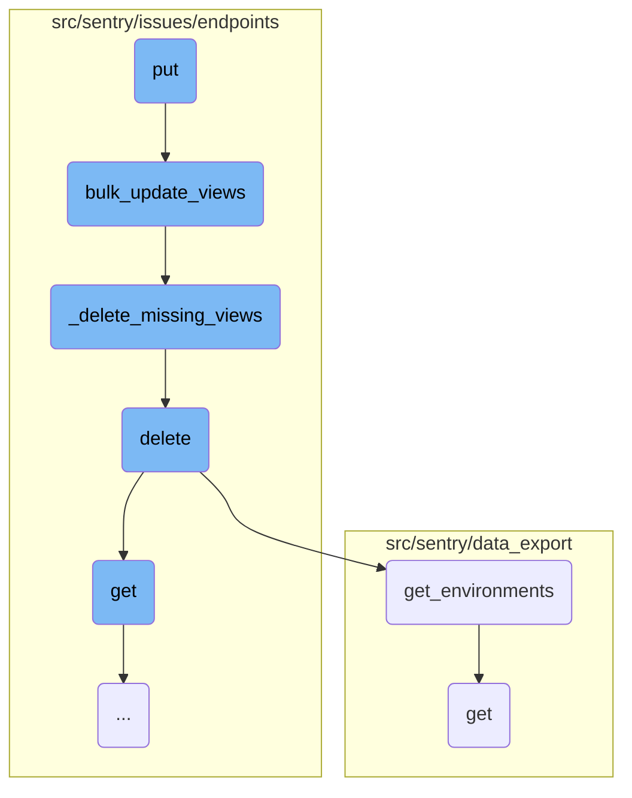
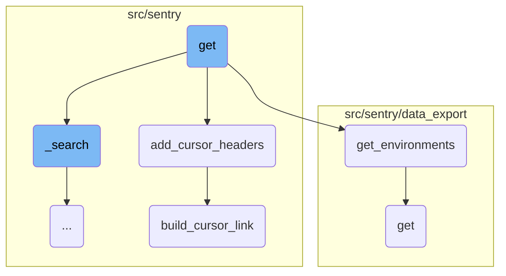
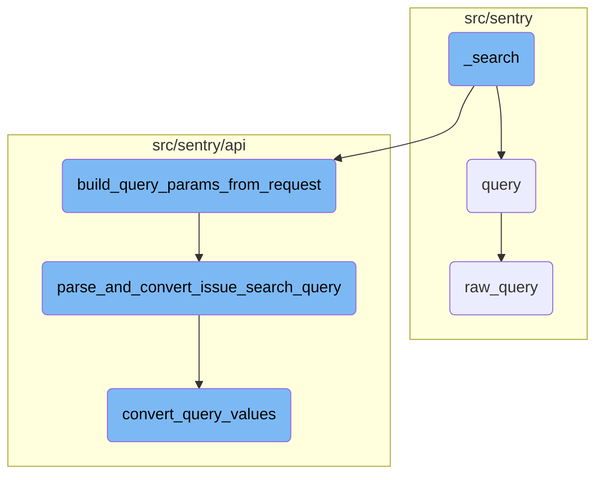

This document explains the <SwmToken path="src/sentry/issues/endpoints/organization_group_search_views.py" pos="82:3:3" line-data="    def put(self, request: Request, organization: Organization) -&gt; Response:">`put`</SwmToken> function, which handles bulk updates to custom views for an organization member. It validates the request data, performs updates within a transaction, and paginates the results. The document also covers related functions such as <SwmToken path="src/sentry/issues/endpoints/organization_group_search_views.py" pos="118:2:2" line-data="def bulk_update_views(">`bulk_update_views`</SwmToken>, <SwmToken path="src/sentry/issues/endpoints/organization_group_search_views.py" pos="124:1:1" line-data="    _delete_missing_views(org, user_id, view_ids_to_keep=existing_view_ids)">`_delete_missing_views`</SwmToken>, and <SwmToken path="src/sentry/issues/endpoints/organization_group_search_views.py" pos="85:3:3" line-data="        will delete any views that are not included in the request, add views if">`delete`</SwmToken>.

The <SwmToken path="src/sentry/issues/endpoints/organization_group_search_views.py" pos="82:3:3" line-data="    def put(self, request: Request, organization: Organization) -&gt; Response:">`put`</SwmToken> function is responsible for updating multiple custom views at once. It starts by checking if the user has the necessary features enabled. Then, it validates the incoming data and, if valid, proceeds to update the views. The <SwmToken path="src/sentry/issues/endpoints/organization_group_search_views.py" pos="118:2:2" line-data="def bulk_update_views(">`bulk_update_views`</SwmToken> function is called to handle the actual updates, which includes deleting views not in the request and updating or creating new views as needed. If any views are missing, the <SwmToken path="src/sentry/issues/endpoints/organization_group_search_views.py" pos="124:1:1" line-data="    _delete_missing_views(org, user_id, view_ids_to_keep=existing_view_ids)">`_delete_missing_views`</SwmToken> function removes them. Finally, the <SwmToken path="src/sentry/issues/endpoints/organization_group_search_views.py" pos="85:3:3" line-data="        will delete any views that are not included in the request, add views if">`delete`</SwmToken> function can be used to remove issues in bulk, ensuring that only the specified issues are deleted.

Here is a high level diagram of the flow, showing only the most important functions:



# Flow drill down

First, we'll zoom into this section of the flow:



<SwmSnippet path="/src/sentry/issues/endpoints/organization_group_search_views.py" line="82">

---

## Handling bulk updates and deletions of views

The <SwmToken path="src/sentry/issues/endpoints/organization_group_search_views.py" pos="82:3:3" line-data="    def put(self, request: Request, organization: Organization) -&gt; Response:">`put`</SwmToken> function handles bulk updates to the current organization member's custom views. It validates the request data, performs the updates within a transaction, and paginates the results.

```python
    def put(self, request: Request, organization: Organization) -> Response:
        """
        Bulk updates the current organization member's custom views. This endpoint
        will delete any views that are not included in the request, add views if
        they are new, and update existing views if they are included in the request.
        This endpoint is explcititly designed to be used by our frontend.

        """
        if not features.has(
            "organizations:issue-stream-custom-views", organization, actor=request.user
        ):
            return Response(status=status.HTTP_404_NOT_FOUND)

        serializer = GroupSearchViewValidator(data=request.data)

        if not serializer.is_valid():
            return Response(serializer.errors, status=status.HTTP_400_BAD_REQUEST)

        validated_data = serializer.validated_data
        try:
            with transaction.atomic(using=router.db_for_write(GroupSearchView)):
```

---

</SwmSnippet>

<SwmSnippet path="/src/sentry/issues/endpoints/organization_group_search_views.py" line="118">

---

### Bulk updating views

The <SwmToken path="src/sentry/issues/endpoints/organization_group_search_views.py" pos="118:2:2" line-data="def bulk_update_views(">`bulk_update_views`</SwmToken> function processes the list of views to be updated. It first deletes any views not included in the request and then iterates over the provided views to either create new ones or update existing ones.

```python
def bulk_update_views(
    org: Organization, user_id: int, views: list[GroupSearchViewValidatorResponse]
) -> None:

    existing_view_ids = [view["id"] for view in views if "id" in view]

    _delete_missing_views(org, user_id, view_ids_to_keep=existing_view_ids)

    for idx, view in enumerate(views):
        if "id" not in view:
            _create_view(org, user_id, view, position=idx)
        else:
            _update_existing_view(view, position=idx)
```

---

</SwmSnippet>

<SwmSnippet path="/src/sentry/issues/endpoints/organization_group_search_views.py" line="133">

---

### Deleting missing views

The <SwmToken path="src/sentry/issues/endpoints/organization_group_search_views.py" pos="133:2:2" line-data="def _delete_missing_views(org: Organization, user_id: int, view_ids_to_keep: list[str]) -&gt; None:">`_delete_missing_views`</SwmToken> function deletes views that are not included in the request. It filters out views that should be kept and deletes the rest.

```python
def _delete_missing_views(org: Organization, user_id: int, view_ids_to_keep: list[str]) -> None:
    GroupSearchView.objects.filter(organization=org, user_id=user_id).exclude(
        id__in=view_ids_to_keep
    ).delete()
```

---

</SwmSnippet>

<SwmSnippet path="/src/sentry/issues/endpoints/organization_group_index.py" line="495">

---

### Deleting issues

The <SwmToken path="src/sentry/issues/endpoints/organization_group_index.py" pos="495:3:3" line-data="    def delete(self, request: Request, organization) -&gt; Response:">`delete`</SwmToken> function handles the bulk removal of issues. It validates the request, checks for necessary features, and then calls <SwmToken path="src/sentry/issues/endpoints/organization_group_index.py" pos="23:1:1" line-data="    delete_groups,">`delete_groups`</SwmToken> to perform the deletion.

`````````````````````````````python
    def delete(self, request: Request, organization) -> Response:
        """
        Bulk Remove a List of Issues
        ````````````````````````````

        Permanently remove the given issues. The list of issues to
        modify is given through the `id` query parameter.  It is repeated
        for each issue that should be removed.

        Only queries by 'id' are accepted.

        If any IDs are out of scope this operation will succeed without
        any data mutation.

        :qparam int id: a list of IDs of the issues to be removed.  This
                        parameter shall be repeated for each issue, e.g.
                        `?id=1&id=2&id=3`. If this parameter is not provided,
                        it will attempt to remove the first 1000 issues.
        :pparam string organization_id_or_slug: the id or slug of the organization the
                                          issues belong to.
        :auth: required
`````````````````````````````

---

</SwmSnippet>

<SwmSnippet path="/src/sentry/data_export/processors/discover.py" line="61">

---

### Retrieving environments

The <SwmToken path="src/sentry/data_export/processors/discover.py" pos="61:3:3" line-data="    def get_environments(organization_id, query):">`get_environments`</SwmToken> function retrieves the list of environments based on the provided query. It ensures that the requested environments exist and returns them.

```python
    def get_environments(organization_id, query):
        requested_environments = query.get("environment", [])
        if not isinstance(requested_environments, list):
            requested_environments = [requested_environments]

        if not requested_environments:
            return []

        environments = list(
            Environment.objects.filter(
                organization_id=organization_id, name__in=requested_environments
            )
        )
        environment_names = [e.name for e in environments]

        if set(requested_environments) != set(environment_names):
            raise ExportError("Requested environment does not exist")

        return environments
```

---

</SwmSnippet>

<SwmSnippet path="/src/sentry/data_export/endpoints/data_export_details.py" line="27">

---

### Retrieving data export details

The <SwmToken path="src/sentry/data_export/endpoints/data_export_details.py" pos="27:3:3" line-data="    def get(self, request: Request, organization: Organization, data_export_id: str) -&gt; Response:">`get`</SwmToken> function retrieves information about a temporary file record for data export. It checks for necessary features and permissions before returning the serialized data export details.

```python
    def get(self, request: Request, organization: Organization, data_export_id: str) -> Response:
        """
        Retrieve information about the temporary file record.
        Used to populate page emailed to the user.
        """

        if not features.has("organizations:discover-query", organization):
            return Response(status=404)

        try:
            data_export = ExportedData.objects.get(id=data_export_id, organization=organization)
        except ExportedData.DoesNotExist:
            return Response(status=404)
        # Check data export permissions
        if data_export.query_info.get("project"):
            project_ids = [int(project) for project in data_export.query_info.get("project", [])]
            projects = Project.objects.filter(organization=organization, id__in=project_ids)
            if any(p for p in projects if not request.access.has_project_access(p)):
                raise PermissionDenied(
                    detail="You don't have permissions to view some of the data this export contains."
                )
```

---

</SwmSnippet>

Now, lets zoom into this section of the flow:



<SwmSnippet path="/src/sentry/issues/endpoints/organization_group_index.py" line="203">

---

## Retrieving and Processing Organization Issues

The <SwmToken path="src/sentry/issues/endpoints/organization_group_index.py" pos="203:3:3" line-data="    def get(self, request: Request, organization) -&gt; Response:">`get`</SwmToken> function retrieves a list of issues bound to an organization. It processes various query parameters to filter and sort the issues, applies default queries, and handles date ranges. It also checks user permissions and records analytics for the search query. The function then serializes the results and adds cursor headers to the response.

``````````````````````````````python
    def get(self, request: Request, organization) -> Response:
        """
        List an Organization's Issues
        `````````````````````````````

        Return a list of issues (groups) bound to an organization.  All parameters are
        supplied as query string parameters.

        A default query of ``is:unresolved issue.priority:[high,medium]`` is applied.
        To return results with other statuses send a new query value
        (i.e. ``?query=`` for all results).

        The ``groupStatsPeriod`` parameter can be used to select the timeline
        stats which should be present. Possible values are: '' (disable),
        '24h', '14d'

        The ``statsPeriod`` parameter can be used to select a date window starting
        from now. Ex. ``14d``.

        The ``start`` and ``end`` parameters can be used to select an absolute
        date period to fetch issues from.
``````````````````````````````

---

</SwmSnippet>

<SwmSnippet path="/src/sentry/api/base.py" line="501">

---

### Adding Cursor Headers

The <SwmToken path="src/sentry/api/base.py" pos="501:3:3" line-data="    def add_cursor_headers(self, request: Request, response, cursor_result):">`add_cursor_headers`</SwmToken> function adds pagination headers to the response. It includes the total number of hits and maximum hits, and constructs links for the previous and next pages using the <SwmToken path="src/sentry/api/base.py" pos="508:3:3" line-data="                self.build_cursor_link(request, &quot;previous&quot;, cursor_result.prev),">`build_cursor_link`</SwmToken> function.

```python
    def add_cursor_headers(self, request: Request, response, cursor_result):
        if cursor_result.hits is not None:
            response["X-Hits"] = cursor_result.hits
        if cursor_result.max_hits is not None:
            response["X-Max-Hits"] = cursor_result.max_hits
        response["Link"] = ", ".join(
            [
                self.build_cursor_link(request, "previous", cursor_result.prev),
                self.build_cursor_link(request, "next", cursor_result.next),
            ]
        )
```

---

</SwmSnippet>

<SwmSnippet path="/src/sentry/api/base.py" line="239">

---

### Building Cursor Links

The <SwmToken path="src/sentry/api/base.py" pos="239:3:3" line-data="    def build_cursor_link(self, request: Request, name: str, cursor: Cursor):">`build_cursor_link`</SwmToken> function constructs a URL for pagination. It takes the current request, the name of the link (previous or next), and the cursor object. It generates the base URL and appends the query string, then formats the cursor link header with the appropriate values.

```python
    def build_cursor_link(self, request: Request, name: str, cursor: Cursor):
        if request.GET.get("cursor") is None:
            querystring = request.GET.urlencode()
        else:
            mutable_query_dict = request.GET.copy()
            mutable_query_dict.pop("cursor")
            querystring = mutable_query_dict.urlencode()

        url_prefix = (
            generate_organization_url(request.subdomain)
            if is_using_customer_domain(request)
            else None
        )
        base_url = absolute_uri(urlquote(request.path), url_prefix=url_prefix)

        if querystring:
            base_url = f"{base_url}?{querystring}"
        else:
            base_url = f"{base_url}?"

        return CURSOR_LINK_HEADER.format(
```

---

</SwmSnippet>

Now, lets zoom into this section of the flow:



<SwmSnippet path="/src/sentry/issues/endpoints/organization_group_index.py" line="153">

---

## \_search Function

The <SwmToken path="src/sentry/issues/endpoints/organization_group_index.py" pos="153:3:3" line-data="    def _search(">`_search`</SwmToken> function is responsible for handling the search logic. It starts by building query parameters from the request using <SwmToken path="src/sentry/issues/endpoints/organization_group_index.py" pos="157:5:5" line-data="            query_kwargs = build_query_params_from_request(">`build_query_params_from_request`</SwmToken>. It then updates these parameters with any additional query arguments and sets the environment and actor. Depending on the <SwmToken path="src/sentry/issues/endpoints/organization_group_index.py" pos="167:6:6" line-data="            if query_kwargs[&quot;sort_by&quot;] == &quot;inbox&quot;:">`sort_by`</SwmToken> parameter, it either performs an inbox search or a regular search using the Snuba dataset.

```python
    def _search(
        self, request: Request, organization, projects, environments, extra_query_kwargs=None
    ):
        with start_span(op="_search"):
            query_kwargs = build_query_params_from_request(
                request, organization, projects, environments
            )
            if extra_query_kwargs is not None:
                assert "environment" not in extra_query_kwargs
                query_kwargs.update(extra_query_kwargs)

            query_kwargs["environments"] = environments if environments else None

            query_kwargs["actor"] = request.user
            if query_kwargs["sort_by"] == "inbox":
                query_kwargs.pop("sort_by")
                result = inbox_search(**query_kwargs)
            else:

                def use_group_snuba_dataset() -> bool:
                    # if useGroupSnubaDataset is present, override the flag so we can test the new dataset
```

---

</SwmSnippet>

<SwmSnippet path="/src/sentry/utils/snuba.py" line="1318">

---

## query Function

The <SwmToken path="src/sentry/utils/snuba.py" pos="1318:2:2" line-data="def query(">`query`</SwmToken> function sends a query to Snuba, a service for querying event data. It constructs the query body using the provided parameters and calls <SwmToken path="src/sentry/utils/snuba.py" pos="1337:5:5" line-data="        body = raw_query(">`raw_query`</SwmToken> to execute the query. The function then processes the result, ensuring that the response matches the expected format.

```python
def query(
    dataset=None,
    start=None,
    end=None,
    groupby=None,
    conditions=None,
    filter_keys=None,
    aggregations=None,
    selected_columns=None,
    totals=None,
    use_cache=False,
    **kwargs,
):
    aggregations = aggregations or [["count()", "", "aggregate"]]
    filter_keys = filter_keys or {}
    selected_columns = selected_columns or []
    groupby = groupby or []

    try:
        body = raw_query(
            dataset=dataset,
```

---

</SwmSnippet>

<SwmSnippet path="/src/sentry/api/helpers/group_index/index.py" line="65">

---

## <SwmToken path="src/sentry/api/helpers/group_index/index.py" pos="65:2:2" line-data="def build_query_params_from_request(">`build_query_params_from_request`</SwmToken> Function

The <SwmToken path="src/sentry/api/helpers/group_index/index.py" pos="65:2:2" line-data="def build_query_params_from_request(">`build_query_params_from_request`</SwmToken> function constructs the query parameters from the incoming request. It handles pagination, saved searches, and sets various tags for monitoring. It also parses and converts the search query using <SwmToken path="src/sentry/api/helpers/group_index/index.py" pos="47:2:2" line-data="def parse_and_convert_issue_search_query(">`parse_and_convert_issue_search_query`</SwmToken>.

```python
def build_query_params_from_request(
    request: Request,
    organization: "Organization",
    projects: Sequence["Project"],
    environments: Sequence["Environment"] | None,
) -> MutableMapping[str, Any]:
    query_kwargs = {"projects": projects, "sort_by": request.GET.get("sort", DEFAULT_SORT_OPTION)}

    limit = request.GET.get("limit")
    if limit:
        try:
            query_kwargs["limit"] = int(limit)
        except ValueError:
            raise ValidationError("invalid limit")

    # TODO: proper pagination support
    if request.GET.get("cursor"):
        try:
            query_kwargs["cursor"] = Cursor.from_string(request.GET.get("cursor"))
        except ValueError:
            raise ParseError(detail="Invalid cursor parameter.")
```

---

</SwmSnippet>

<SwmSnippet path="/src/sentry/api/helpers/group_index/index.py" line="47">

---

## <SwmToken path="src/sentry/api/helpers/group_index/index.py" pos="47:2:2" line-data="def parse_and_convert_issue_search_query(">`parse_and_convert_issue_search_query`</SwmToken> Function

The <SwmToken path="src/sentry/api/helpers/group_index/index.py" pos="47:2:2" line-data="def parse_and_convert_issue_search_query(">`parse_and_convert_issue_search_query`</SwmToken> function parses the search query and converts it into search filters. It uses <SwmToken path="src/sentry/api/helpers/group_index/index.py" pos="55:5:5" line-data="        search_filters = convert_query_values(">`convert_query_values`</SwmToken> to transform the parsed query into a format suitable for searching.

```python
def parse_and_convert_issue_search_query(
    query: str,
    organization: Organization,
    projects: Sequence[Project],
    environments: Sequence[Environment],
    user: User | AnonymousUser,
) -> Sequence[SearchFilter]:
    try:
        search_filters = convert_query_values(
            parse_search_query(query), projects, user, environments
        )
    except InvalidSearchQuery as e:
        raise ValidationError(f"Error parsing search query: {e}")

    validate_search_filter_permissions(organization, search_filters, user)
    return search_filters
```

---

</SwmSnippet>

<SwmSnippet path="/src/sentry/utils/snuba.py" line="846">

---

## <SwmToken path="src/sentry/utils/snuba.py" pos="846:2:2" line-data="def raw_query(">`raw_query`</SwmToken> Function

The <SwmToken path="src/sentry/utils/snuba.py" pos="846:2:2" line-data="def raw_query(">`raw_query`</SwmToken> function sends a raw query to Snuba. It constructs the query parameters and calls <SwmToken path="src/sentry/utils/snuba.py" pos="882:3:3" line-data="    return bulk_raw_query([snuba_params], referrer=referrer, use_cache=use_cache)[0]">`bulk_raw_query`</SwmToken> to execute the query. The function returns the first result from the bulk query.

```python
def raw_query(
    dataset=None,
    start=None,
    end=None,
    groupby=None,
    conditions=None,
    filter_keys=None,
    aggregations=None,
    rollup=None,
    referrer=None,
    is_grouprelease=False,
    use_cache=False,
    **kwargs,
) -> Mapping[str, Any]:
    """
    Sends a query to snuba.  See `SnubaQueryParams` docstring for param
    descriptions.
    """

    if referrer:
        kwargs["tenant_ids"] = kwargs.get("tenant_ids") or dict()
```

---

</SwmSnippet>

<SwmSnippet path="/src/sentry/api/issue_search.py" line="260">

---

## <SwmToken path="src/sentry/api/issue_search.py" pos="260:2:2" line-data="def convert_query_values(">`convert_query_values`</SwmToken> Function

The <SwmToken path="src/sentry/api/issue_search.py" pos="260:2:2" line-data="def convert_query_values(">`convert_query_values`</SwmToken> function converts search filter values into a specific format based on predefined converters. It handles various types of search filters and ensures that the converted values are in the correct format for searching.

```python
def convert_query_values(
    search_filters: ParsedTerms,
    projects: Sequence[Project],
    user: User | RpcUser | None,
    environments: Sequence[Environment] | None,
    value_converters=value_converters,
    allow_aggregate_filters=False,
) -> list[SearchFilter]:
    """
    Accepts a collection of SearchFilter objects and converts their values into
    a specific format, based on converters specified in `value_converters`.
    :param search_filters: Collection of `SearchFilter` objects.
    :param projects: List of projects being searched across
    :param user: The user making the search
    :param environments: The environments to consider when making the search
    :param value_converters: A dictionary of functions that convert search filter values into different formats.
    :return: New collection of `SearchFilters`, which may have converted values.
    """

    def convert_search_filter(
        search_filter: SearchFilter, organization: Organization
```

---

</SwmSnippet>

&nbsp;

*This is an auto-generated document by Swimm AI 🌊 and has not yet been verified by a human*

<SwmMeta version="3.0.0" repo-id="Z2l0aHViJTNBJTNBc2VudHJ5LWRlbW8tMSUzQSUzQVN3aW1tLURlbW8=" repo-name="sentry-demo-1" doc-type="flows"><sup>Powered by [Swimm](/)</sup></SwmMeta>
