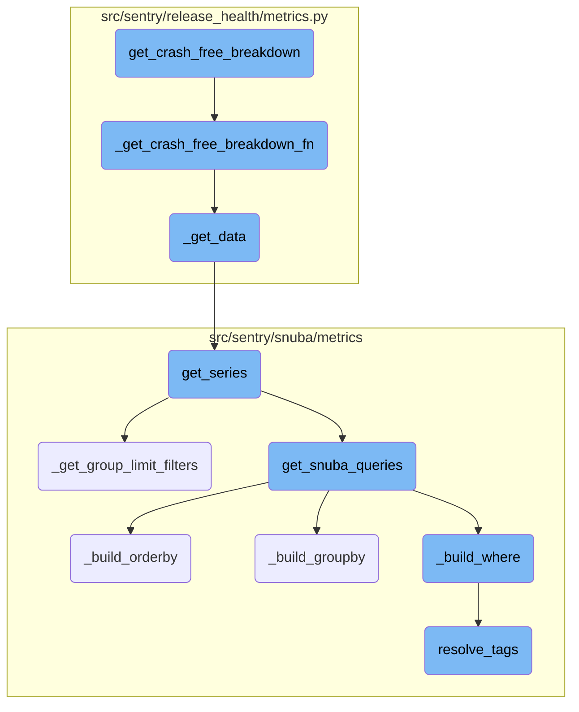
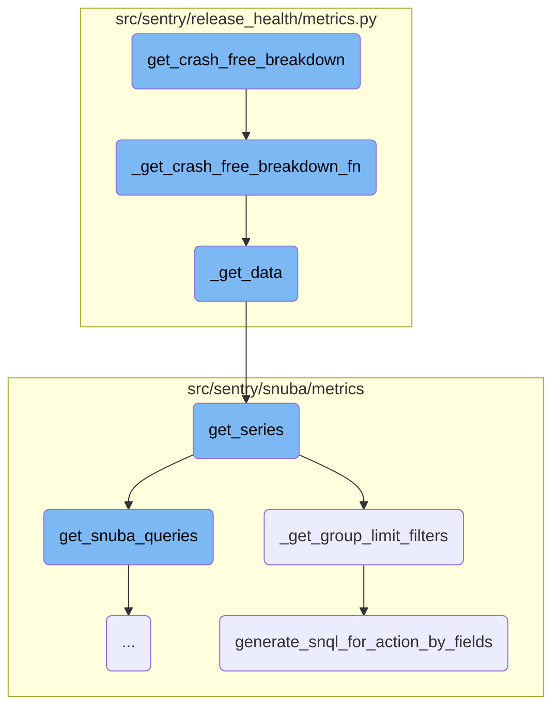
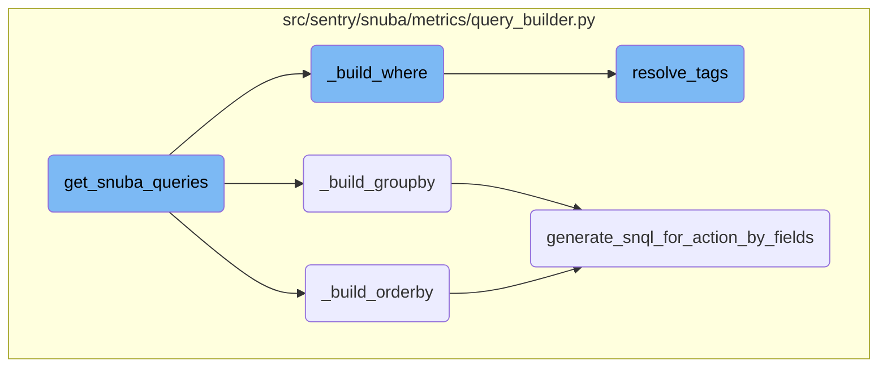

This document provides an overview of the process involved in calculating crash-free rates for sessions and users. It outlines the key functions and their interactions to achieve this goal.

The process starts by setting up the necessary parameters and calling a function to get a query function. This query function is then used to gather data over predefined time intervals. The data is processed to calculate the crash-free rates for sessions and users, ensuring that the application can monitor its performance effectively.

Here is a high level diagram of the flow, showing only the most important functions:



# Flow drill down

First, we'll zoom into this section of the flow:



<SwmSnippet path="/src/sentry/release_health/metrics.py" line="1168">

---

## <SwmToken path="src/sentry/release_health/metrics.py" pos="1168:3:3" line-data="    def get_crash_free_breakdown(">`get_crash_free_breakdown`</SwmToken>

The function <SwmToken path="src/sentry/release_health/metrics.py" pos="1168:3:3" line-data="    def get_crash_free_breakdown(">`get_crash_free_breakdown`</SwmToken> initiates the process of calculating crash-free rates by setting up the necessary parameters and calling <SwmToken path="src/sentry/release_health/metrics.py" pos="1182:7:7" line-data="        query_fn = self._get_crash_free_breakdown_fn(">`_get_crash_free_breakdown_fn`</SwmToken> to get a query function. It then iterates over predefined time intervals to execute the query function and collect the results.

```python
    def get_crash_free_breakdown(
        self,
        project_id: ProjectId,
        release: ReleaseName,
        start: datetime,
        environments: Sequence[EnvironmentName] | None = None,
        now: datetime | None = None,
    ) -> Sequence[CrashFreeBreakdown]:

        projects, org_id = self._get_projects_and_org_id([project_id])

        if now is None:
            now = datetime.now(timezone.utc)

        query_fn = self._get_crash_free_breakdown_fn(
            org_id, project_id, release, start, environments
        )

        last: datetime | None = None
        rv = []
        for offset in (
```

---

</SwmSnippet>

<SwmSnippet path="/src/sentry/release_health/metrics.py" line="1088">

---

## <SwmToken path="src/sentry/release_health/metrics.py" pos="1088:3:3" line-data="    def _get_crash_free_breakdown_fn(">`_get_crash_free_breakdown_fn`</SwmToken>

The function <SwmToken path="src/sentry/release_health/metrics.py" pos="1088:3:3" line-data="    def _get_crash_free_breakdown_fn(">`_get_crash_free_breakdown_fn`</SwmToken> constructs the query conditions and defines the <SwmToken path="src/sentry/release_health/metrics.py" pos="1117:3:3" line-data="        def query_stats(end: datetime) -&gt; CrashFreeBreakdown:">`query_stats`</SwmToken> function, which is responsible for querying the metrics data and calculating the crash-free rates for sessions and users.

```python
    def _get_crash_free_breakdown_fn(
        self,
        org_id: int,
        project_id: ProjectId,
        release: ReleaseName,
        start: datetime,
        environments: Sequence[EnvironmentName] | None = None,
    ) -> Callable[[datetime], CrashFreeBreakdown]:

        projects = self._get_projects([project_id])

        where = [
            Condition(
                lhs=Column(name="tags[release]"),
                op=Op.EQ,
                rhs=release,
            )
        ]

        if environments:
            environments = list(environments)
```

---

</SwmSnippet>

<SwmSnippet path="/src/sentry/release_health/metrics.py" line="1118">

---

### <SwmToken path="src/sentry/release_health/metrics.py" pos="1118:3:3" line-data="            def _get_data(select: list[MetricField]) -&gt; tuple[int, int]:">`_get_data`</SwmToken>

The helper function <SwmToken path="src/sentry/release_health/metrics.py" pos="1118:3:3" line-data="            def _get_data(select: list[MetricField]) -&gt; tuple[int, int]:">`_get_data`</SwmToken> within <SwmToken path="src/sentry/release_health/metrics.py" pos="1088:3:3" line-data="    def _get_crash_free_breakdown_fn(">`_get_crash_free_breakdown_fn`</SwmToken> executes the metrics query and processes the raw results to extract the total and crashed <SwmPath>[src/sentry/users/services/user/](src/sentry/users/services/user/)</SwmPath> counts.

```python
            def _get_data(select: list[MetricField]) -> tuple[int, int]:
                query = DeprecatingMetricsQuery(
                    org_id=org_id,
                    project_ids=[project_id],
                    select=select,
                    start=start,
                    end=end,
                    where=where,
                    granularity=Granularity(LEGACY_SESSIONS_DEFAULT_ROLLUP),
                    include_series=False,
                    include_totals=True,
                )

                raw_result = get_series(
                    projects=projects,
                    metrics_query=query,
                    use_case_id=USE_CASE_ID,
                )

                groups = raw_result["groups"]
                assert len(groups) == 1
```

---

</SwmSnippet>

<SwmSnippet path="/src/sentry/snuba/metrics/datasource.py" line="897">

---

## <SwmToken path="src/sentry/snuba/metrics/datasource.py" pos="897:2:2" line-data="def get_series(">`get_series`</SwmToken>

The function <SwmToken path="src/sentry/snuba/metrics/datasource.py" pos="897:2:2" line-data="def get_series(">`get_series`</SwmToken> retrieves time series data for the given metrics query. It handles the construction and execution of Snuba queries, processes the results, and returns the aggregated data.

```python
def get_series(
    projects: Sequence[Project],
    metrics_query: DeprecatingMetricsQuery,
    use_case_id: UseCaseID,
    include_meta: bool = False,
    tenant_ids: dict[str, Any] | None = None,
) -> dict:
    """Get time series for the given query"""

    organization_id = projects[0].organization_id if projects else None
    tenant_ids = dict()
    if organization_id is not None:
        tenant_ids["organization_id"] = organization_id
    tenant_ids["use_case_id"] = use_case_id.value

    if metrics_query.interval is not None:
        interval = metrics_query.interval
    else:
        interval = metrics_query.granularity.granularity

    start, end, _num_intervals = to_intervals(metrics_query.start, metrics_query.end, interval)
```

---

</SwmSnippet>

<SwmSnippet path="/src/sentry/snuba/metrics/datasource.py" line="763">

---

## <SwmToken path="src/sentry/snuba/metrics/datasource.py" pos="763:2:2" line-data="def _get_group_limit_filters(">`_get_group_limit_filters`</SwmToken>

The function <SwmToken path="src/sentry/snuba/metrics/datasource.py" pos="763:2:2" line-data="def _get_group_limit_filters(">`_get_group_limit_filters`</SwmToken> generates filters to limit the groups in the query results based on the specified group-by fields. This helps in optimizing the query performance and ensuring accurate results.

```python
def _get_group_limit_filters(
    metrics_query: DeprecatingMetricsQuery,
    results: list[Mapping[str, int]],
    use_case_id: UseCaseID,
) -> GroupLimitFilters | None:
    if not metrics_query.groupby or not results:
        return None

    # Creates a mapping of groupBy fields to their equivalent SnQL
    key_to_condition_dict: dict[Groupable, Any] = {}
    for metric_groupby_obj in metrics_query.groupby:
        key_to_condition_dict[
            metric_groupby_obj.name
        ] = SnubaQueryBuilder.generate_snql_for_action_by_fields(
            metric_action_by_field=metric_groupby_obj,
            use_case_id=use_case_id,
            org_id=metrics_query.org_id,
            projects=Project.objects.get_many_from_cache(metrics_query.project_ids),
            is_column=True,
        )

```

---

</SwmSnippet>

<SwmSnippet path="/src/sentry/snuba/metrics/query_builder.py" line="794">

---

## <SwmToken path="src/sentry/snuba/metrics/query_builder.py" pos="794:3:3" line-data="    def generate_snql_for_action_by_fields(">`generate_snql_for_action_by_fields`</SwmToken>

The function <SwmToken path="src/sentry/snuba/metrics/query_builder.py" pos="794:3:3" line-data="    def generate_snql_for_action_by_fields(">`generate_snql_for_action_by_fields`</SwmToken> generates the necessary <SwmToken path="src/sentry/snuba/metrics/query_builder.py" pos="802:7:7" line-data="        Generates the necessary snql for any action by field which in our case will be group by and order by. This">`snql`</SwmToken> expressions for group-by and order-by fields in the metrics query. It ensures that the query is correctly structured to retrieve the desired data.

```python
    def generate_snql_for_action_by_fields(
        metric_action_by_field: MetricActionByField,
        use_case_id: UseCaseID,
        org_id: int,
        projects: Sequence[Project],
        is_column: bool = False,
    ) -> list[OrderBy] | Column | AliasedExpression | Function:
        """
        Generates the necessary snql for any action by field which in our case will be group by and order by. This
        function has been designed to share as much logic as possible, however, it should be refactored in case
        the snql generation starts to diverge significantly.
        """

        is_group_by = isinstance(metric_action_by_field, MetricGroupByField)
        is_order_by = isinstance(metric_action_by_field, MetricOrderByField)
        if not is_group_by and not is_order_by:
            raise InvalidParams("The metric action must either be an order by or group by.")

        if isinstance(metric_action_by_field.field, str):
            # This transformation is currently supported only for group by because OrderBy doesn't support the Function type.
            if is_group_by and metric_action_by_field.field == "transaction":
```

---

</SwmSnippet>

Now, lets zoom into this section of the flow:



<SwmSnippet path="/src/sentry/snuba/metrics/query_builder.py" line="1167">

---

## Building and Resolving Query Components

The function <SwmToken path="src/sentry/snuba/metrics/datasource.py" pos="991:3:3" line-data="        ).get_snuba_queries()">`get_snuba_queries`</SwmToken> calls <SwmToken path="src/sentry/snuba/metrics/query_builder.py" pos="1167:7:7" line-data="        where = self._build_where()">`_build_where`</SwmToken> and <SwmToken path="src/sentry/snuba/metrics/query_builder.py" pos="1168:7:7" line-data="        groupby = self._build_groupby()">`_build_groupby`</SwmToken> to construct the WHERE and GROUP BY clauses for the Snuba query.

```python
        where = self._build_where()
        groupby = self._build_groupby()

```

---

</SwmSnippet>

<SwmSnippet path="/src/sentry/snuba/metrics/query_builder.py" line="890">

---

### Building the WHERE Clause

The <SwmToken path="src/sentry/snuba/metrics/query_builder.py" pos="890:3:3" line-data="    def _build_where(self) -&gt; list[BooleanCondition | Condition]:">`_build_where`</SwmToken> function constructs the WHERE clause for the Snuba query by adding conditions based on organization ID, project <SwmToken path="src/sentry/release_health/metrics.py" pos="90:7:7" line-data="    Maps Environment Model ids to the environment name">`ids`</SwmToken>, and additional filters. It also resolves tags using the <SwmToken path="src/sentry/snuba/metrics/query_builder.py" pos="179:2:2" line-data="def resolve_tags(">`resolve_tags`</SwmToken> function.

```python
    def _build_where(self) -> list[BooleanCondition | Condition]:
        where: list[BooleanCondition | Condition] = [
            Condition(Column("org_id"), Op.EQ, self._org_id),
            Condition(Column("project_id"), Op.IN, self._metrics_query.project_ids),
        ]

        where += self._build_timeframe()

        if not self._metrics_query.where:
            return where

        snuba_conditions = []
        # Adds filters that do not need to be resolved because they are instances of `MetricConditionField`
        metric_condition_filters = []
        for condition in self._metrics_query.where:
            if isinstance(condition, MetricConditionField):
                metric_expression = metric_object_factory(
                    condition.lhs.op, condition.lhs.metric_mri
                )
                try:
                    metric_condition_filters.append(
```

---

</SwmSnippet>

<SwmSnippet path="/src/sentry/snuba/metrics/query_builder.py" line="957">

---

### Building the GROUP BY Clause

The <SwmToken path="src/sentry/snuba/metrics/query_builder.py" pos="957:3:3" line-data="    def _build_groupby(self) -&gt; list[Column] | None:">`_build_groupby`</SwmToken> function constructs the GROUP BY clause for the Snuba query by generating <SwmToken path="src/sentry/snuba/metrics/datasource.py" pos="771:21:21" line-data="    # Creates a mapping of groupBy fields to their equivalent SnQL">`SnQL`</SwmToken> for each group-by field specified in the metrics query.

```python
    def _build_groupby(self) -> list[Column] | None:
        if self._metrics_query.groupby is None:
            return None

        groupby_cols = []

        for metric_groupby_obj in self._metrics_query.groupby or []:
            groupby_cols.append(
                self.generate_snql_for_action_by_fields(
                    metric_action_by_field=metric_groupby_obj,
                    use_case_id=self._use_case_id,
                    org_id=self._org_id,
                    projects=self._projects,
                )
            )
        return groupby_cols
```

---

</SwmSnippet>

<SwmSnippet path="/src/sentry/snuba/metrics/query_builder.py" line="974">

---

### Building the ORDER BY Clause

The <SwmToken path="src/sentry/snuba/metrics/query_builder.py" pos="974:3:3" line-data="    def _build_orderby(self) -&gt; list[OrderBy] | None:">`_build_orderby`</SwmToken> function constructs the ORDER BY clause for the Snuba query by generating <SwmToken path="src/sentry/snuba/metrics/datasource.py" pos="771:21:21" line-data="    # Creates a mapping of groupBy fields to their equivalent SnQL">`SnQL`</SwmToken> for each order-by field specified in the metrics query.

```python
    def _build_orderby(self) -> list[OrderBy] | None:
        if self._metrics_query.orderby is None:
            return None

        orderby_fields = []
        for metric_order_by_obj in self._metrics_query.orderby:
            orderby_fields.extend(
                self.generate_snql_for_action_by_fields(
                    metric_action_by_field=metric_order_by_obj,
                    use_case_id=self._use_case_id,
                    org_id=self._org_id,
                    projects=self._projects,
                    is_column=True,
                )
            )

        return orderby_fields
```

---

</SwmSnippet>

<SwmSnippet path="/src/sentry/snuba/metrics/query_builder.py" line="179">

---

### Resolving Tags

The <SwmToken path="src/sentry/snuba/metrics/query_builder.py" pos="179:2:2" line-data="def resolve_tags(">`resolve_tags`</SwmToken> function translates tags in the Snuba condition, ensuring that tag keys and values are correctly resolved for the query.

```python
def resolve_tags(
    use_case_id: UseCaseID,
    org_id: int,
    input_: Any,
    projects: Sequence[Project],
    is_tag_value: bool = False,
    allowed_tag_keys: dict[str, str] | None = None,
) -> Any:
    """Translate tags in snuba condition

    Column("metric_id") is not supported.
    """
    if input_ is None:
        return None
    if isinstance(input_, (list, tuple)):
        elements = [
            resolve_tags(
                use_case_id,
                org_id,
                item,
                projects,
```

---

</SwmSnippet>

&nbsp;

*This is an auto-generated document by Swimm AI 🌊 and has not yet been verified by a human*

<SwmMeta version="3.0.0" repo-id="Z2l0aHViJTNBJTNBc2VudHJ5LWRlbW8tMSUzQSUzQVN3aW1tLURlbW8=" repo-name="sentry-demo-1" doc-type="flows"><sup>Powered by [Swimm](/)</sup></SwmMeta>
