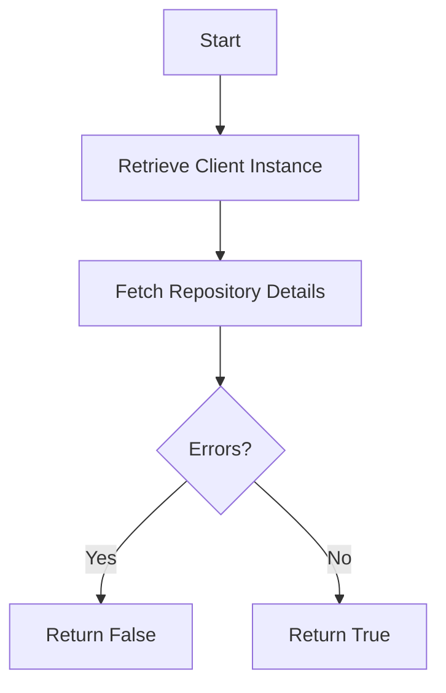

This document will cover the process of checking repository access, which includes:

1. Retrieving a client instance
2. Fetching repository details
3. Handling potential errors to determine access.

Technical document: <SwmLink doc-title="Checking Repository Access">[Checking Repository Access](/.swm/checking-repository-access.r4z2dcwu.sw.md)</SwmLink>

# [Retrieving a Client Instance](https://app.swimm.io/repos/Z2l0aHViJTNBJTNBc2VudHJ5LWRlbW8tMSUzQSUzQVN3aW1tLURlbW8=/docs/r4z2dcwu#initializing-vstsapiclient)

The first step in checking repository access is to retrieve a client instance. This involves initializing a VstsApiClient. The base URL is set, and the current SiloMode is checked. If the mode is not REGION, it ensures that the default identity is set and validates the domain name. It also verifies that org_integration and default_auth_id are defined before creating the VstsApiClient instance with the necessary parameters.

# [Fetching Repository Details](https://app.swimm.io/repos/Z2l0aHViJTNBJTNBc2VudHJ5LWRlbW8tMSUzQSUzQVN3aW1tLURlbW8=/docs/r4z2dcwu#fetching-repository-details)

Once the client instance is retrieved, the next step is to fetch the repository details. This is done by constructing a URL using the repository name or ID and optionally the project name. A GET request is made to this URL, and the response is returned. This step is crucial to verify if the repository exists and is accessible.

# [Handling Potential Errors](https://app.swimm.io/repos/Z2l0aHViJTNBJTNBc2VudHJ5LWRlbW8tMSUzQSUzQVN3aW1tLURlbW8=/docs/r4z2dcwu#checking-repository-access)

The final step involves handling potential errors that may occur while fetching the repository details. If an ApiError or IdentityNotValid exception is raised, it indicates that there is no access to the repository, and the process returns False. If no errors are encountered, it confirms that access is granted and returns True. This step ensures that only valid and accessible repositories are processed.

&nbsp;

*This is an auto-generated document by Swimm AI 🌊 and has not yet been verified by a human*

<SwmMeta version="3.0.0" repo-id="Z2l0aHViJTNBJTNBc2VudHJ5LWRlbW8tMSUzQSUzQVN3aW1tLURlbW8=" repo-name="sentry-demo-1" doc-type="product-flows">Powered by [Swimm](/)</SwmMeta>
