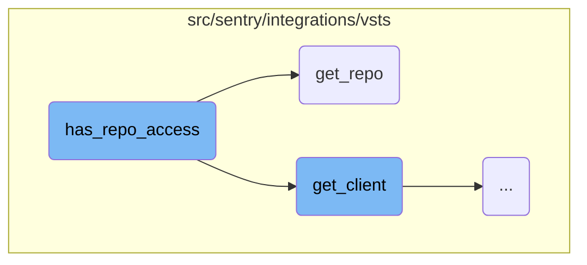
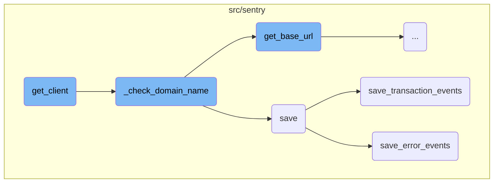
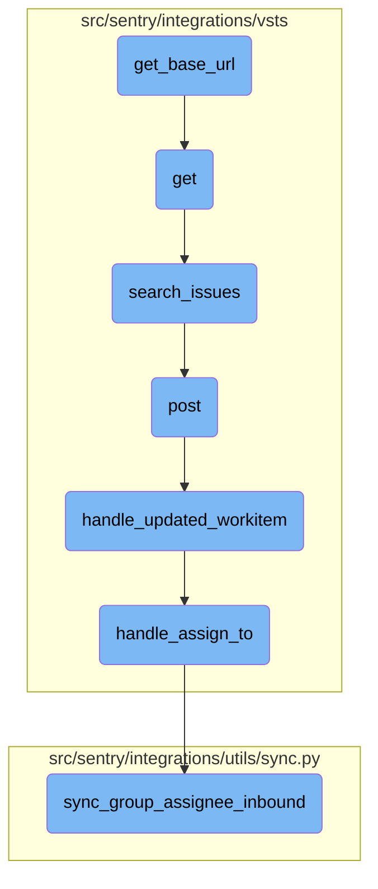

This document explains the process of checking repository access. It involves retrieving a client instance, fetching repository details, and handling potential errors to determine access.

The process starts by getting a client instance. Then, it tries to fetch the repository details. If it encounters any errors, it concludes that there is no access and returns `False`. If everything goes smoothly, it confirms access and returns `True`.

Here is a high level diagram of the flow, showing only the most important functions:

```mermaid
graph TD;
      subgraph src/sentry/integrations/vsts
3585daca30401bf103536502630abaffbe46d81aa77325688c1a46fae8355ad5(has_repo_access):::mainFlowStyle --> 74b316f54d176da86308dfba8d0054afe5b6d0405e813833638a55eee67f517e(get_repo)
end

subgraph src/sentry/integrations/vsts
3585daca30401bf103536502630abaffbe46d81aa77325688c1a46fae8355ad5(has_repo_access):::mainFlowStyle --> 0929df67669e089b92a784392a4caa0c21baeadfd85263fa34c49a09c193b3d1(get_client):::mainFlowStyle
end

subgraph src/sentry/integrations/vsts
0929df67669e089b92a784392a4caa0c21baeadfd85263fa34c49a09c193b3d1(get_client):::mainFlowStyle --> 7f10adeb955518d0b9ce9a18ae73cf60c8e87d6b2b7bc87f5b2addc217981d21(_check_domain_name):::mainFlowStyle
end

subgraph src/sentry/event_manager.py
7f10adeb955518d0b9ce9a18ae73cf60c8e87d6b2b7bc87f5b2addc217981d21(_check_domain_name):::mainFlowStyle --> 5086692df24257d76a0adf892eba843feac14033d92b4a32022b125d5a725f9b(save)
end

subgraph src/sentry/integrations/vsts
7f10adeb955518d0b9ce9a18ae73cf60c8e87d6b2b7bc87f5b2addc217981d21(_check_domain_name):::mainFlowStyle --> 3a40802301e1642b0a2d0ce06ddee674da6a7fd8353ad71b1c436be19e6563d6(get_base_url):::mainFlowStyle
end

subgraph src/sentry/integrations/vsts
3a40802301e1642b0a2d0ce06ddee674da6a7fd8353ad71b1c436be19e6563d6(get_base_url):::mainFlowStyle --> c9f1b6abd5b86b248deafac3aa63eb8d055350bf49cbe100c54a0d94ee13361a(get):::mainFlowStyle
end

subgraph src/sentry/integrations/vsts
c9f1b6abd5b86b248deafac3aa63eb8d055350bf49cbe100c54a0d94ee13361a(get):::mainFlowStyle --> fc4a2a7e5f1b5a9d6230778920f9b62f4b7f3caa80ebd97c89444e007895b382(search_issues):::mainFlowStyle
end

subgraph src/sentry/integrations/vsts
fc4a2a7e5f1b5a9d6230778920f9b62f4b7f3caa80ebd97c89444e007895b382(search_issues):::mainFlowStyle --> a0445eff32744589c21cfe40b46d7b4346893653994134be4a340aaaf32b3f6d(post):::mainFlowStyle
end

subgraph src/sentry/integrations/vsts
a0445eff32744589c21cfe40b46d7b4346893653994134be4a340aaaf32b3f6d(post):::mainFlowStyle --> 66e049c83c1ca3a7a23933e320651f77196243d817b62c1a401dfd7205f9a929(handle_updated_workitem):::mainFlowStyle
end

subgraph src/sentry/integrations/vsts
66e049c83c1ca3a7a23933e320651f77196243d817b62c1a401dfd7205f9a929(handle_updated_workitem):::mainFlowStyle --> 66c307c65db74ab637ed0ed1623cc34d22110f0911938f86a52ccb8f5e8009dd(handle_assign_to):::mainFlowStyle
end

subgraph src/sentry/integrations/utils/sync.py
66c307c65db74ab637ed0ed1623cc34d22110f0911938f86a52ccb8f5e8009dd(handle_assign_to):::mainFlowStyle --> dd6f2c6555a3ad00a0aed3ab34055c7026063e3a2a74b2537fcf2a1223ffa577(sync_group_assignee_inbound):::mainFlowStyle
end


      classDef mainFlowStyle color:#000000,fill:#7CB9F4
classDef rootsStyle color:#000000,fill:#00FFF4
classDef Style1 color:#000000,fill:#00FFAA
classDef Style2 color:#000000,fill:#FFFF00
classDef Style3 color:#000000,fill:#AA7CB9

%% Swimm:
%% graph TD;
%%       subgraph <SwmPath>[src/sentry/integrations/vsts/](src/sentry/integrations/vsts/)</SwmPath>
%% 3585daca30401bf103536502630abaffbe46d81aa77325688c1a46fae8355ad5(has_repo_access):::mainFlowStyle --> 74b316f54d176da86308dfba8d0054afe5b6d0405e813833638a55eee67f517e(get_repo)
%% end
%% 
%% subgraph <SwmPath>[src/sentry/integrations/vsts/](src/sentry/integrations/vsts/)</SwmPath>
%% 3585daca30401bf103536502630abaffbe46d81aa77325688c1a46fae8355ad5(has_repo_access):::mainFlowStyle --> 0929df67669e089b92a784392a4caa0c21baeadfd85263fa34c49a09c193b3d1(get_client):::mainFlowStyle
%% end
%% 
%% subgraph <SwmPath>[src/sentry/integrations/vsts/](src/sentry/integrations/vsts/)</SwmPath>
%% 0929df67669e089b92a784392a4caa0c21baeadfd85263fa34c49a09c193b3d1(get_client):::mainFlowStyle --> 7f10adeb955518d0b9ce9a18ae73cf60c8e87d6b2b7bc87f5b2addc217981d21(_check_domain_name):::mainFlowStyle
%% end
%% 
%% subgraph <SwmPath>[src/sentry/event_manager.py](src/sentry/event_manager.py)</SwmPath>
%% 7f10adeb955518d0b9ce9a18ae73cf60c8e87d6b2b7bc87f5b2addc217981d21(_check_domain_name):::mainFlowStyle --> 5086692df24257d76a0adf892eba843feac14033d92b4a32022b125d5a725f9b(save)
%% end
%% 
%% subgraph <SwmPath>[src/sentry/integrations/vsts/](src/sentry/integrations/vsts/)</SwmPath>
%% 7f10adeb955518d0b9ce9a18ae73cf60c8e87d6b2b7bc87f5b2addc217981d21(_check_domain_name):::mainFlowStyle --> 3a40802301e1642b0a2d0ce06ddee674da6a7fd8353ad71b1c436be19e6563d6(get_base_url):::mainFlowStyle
%% end
%% 
%% subgraph <SwmPath>[src/sentry/integrations/vsts/](src/sentry/integrations/vsts/)</SwmPath>
%% 3a40802301e1642b0a2d0ce06ddee674da6a7fd8353ad71b1c436be19e6563d6(get_base_url):::mainFlowStyle --> c9f1b6abd5b86b248deafac3aa63eb8d055350bf49cbe100c54a0d94ee13361a(get):::mainFlowStyle
%% end
%% 
%% subgraph <SwmPath>[src/sentry/integrations/vsts/](src/sentry/integrations/vsts/)</SwmPath>
%% c9f1b6abd5b86b248deafac3aa63eb8d055350bf49cbe100c54a0d94ee13361a(get):::mainFlowStyle --> fc4a2a7e5f1b5a9d6230778920f9b62f4b7f3caa80ebd97c89444e007895b382(search_issues):::mainFlowStyle
%% end
%% 
%% subgraph <SwmPath>[src/sentry/integrations/vsts/](src/sentry/integrations/vsts/)</SwmPath>
%% fc4a2a7e5f1b5a9d6230778920f9b62f4b7f3caa80ebd97c89444e007895b382(search_issues):::mainFlowStyle --> a0445eff32744589c21cfe40b46d7b4346893653994134be4a340aaaf32b3f6d(post):::mainFlowStyle
%% end
%% 
%% subgraph <SwmPath>[src/sentry/integrations/vsts/](src/sentry/integrations/vsts/)</SwmPath>
%% a0445eff32744589c21cfe40b46d7b4346893653994134be4a340aaaf32b3f6d(post):::mainFlowStyle --> 66e049c83c1ca3a7a23933e320651f77196243d817b62c1a401dfd7205f9a929(handle_updated_workitem):::mainFlowStyle
%% end
%% 
%% subgraph <SwmPath>[src/sentry/integrations/vsts/](src/sentry/integrations/vsts/)</SwmPath>
%% 66e049c83c1ca3a7a23933e320651f77196243d817b62c1a401dfd7205f9a929(handle_updated_workitem):::mainFlowStyle --> 66c307c65db74ab637ed0ed1623cc34d22110f0911938f86a52ccb8f5e8009dd(handle_assign_to):::mainFlowStyle
%% end
%% 
%% subgraph <SwmPath>[src/sentry/integrations/utils/sync.py](src/sentry/integrations/utils/sync.py)</SwmPath>
%% 66c307c65db74ab637ed0ed1623cc34d22110f0911938f86a52ccb8f5e8009dd(handle_assign_to):::mainFlowStyle --> dd6f2c6555a3ad00a0aed3ab34055c7026063e3a2a74b2537fcf2a1223ffa577(sync_group_assignee_inbound):::mainFlowStyle
%% end
%% 
%% 
%%       classDef mainFlowStyle color:#000000,fill:#7CB9F4
%% classDef rootsStyle color:#000000,fill:#00FFF4
%% classDef Style1 color:#000000,fill:#00FFAA
%% classDef Style2 color:#000000,fill:#FFFF00
%% classDef Style3 color:#000000,fill:#AA7CB9
```



# Flow drill down

First, we'll zoom into this section of the flow:



<SwmSnippet path="/src/sentry/integrations/vsts/integration.py" line="317">

---

## Checking repository access

The function <SwmToken path="src/sentry/integrations/vsts/integration.py" pos="317:3:3" line-data="    def has_repo_access(self, repo: RpcRepository) -&gt; bool:">`has_repo_access`</SwmToken> is responsible for verifying if there is access to a specific repository. It first retrieves a client instance using <SwmToken path="src/sentry/integrations/vsts/integration.py" pos="318:7:7" line-data="        client = self.get_client()">`get_client`</SwmToken>. Then, it attempts to fetch the repository details using <SwmToken path="src/sentry/integrations/vsts/integration.py" pos="322:1:3" line-data="            client.get_repo(repo.config[&quot;name&quot;], project=repo.config[&quot;project&quot;])">`client.get_repo`</SwmToken>. If an <SwmToken path="src/sentry/integrations/vsts/integration.py" pos="323:4:4" line-data="        except (ApiError, IdentityNotValid):">`ApiError`</SwmToken> or <SwmToken path="src/sentry/integrations/vsts/integration.py" pos="323:7:7" line-data="        except (ApiError, IdentityNotValid):">`IdentityNotValid`</SwmToken> exception is raised, it returns `False`, indicating no access. Otherwise, it returns `True`.

```python
    def has_repo_access(self, repo: RpcRepository) -> bool:
        client = self.get_client()
        try:
            # since we don't actually use webhooks for vsts commits,
            # just verify repo access
            client.get_repo(repo.config["name"], project=repo.config["project"])
        except (ApiError, IdentityNotValid):
            return False
        return True
```

---

</SwmSnippet>

<SwmSnippet path="/src/sentry/integrations/vsts/client.py" line="321">

---

### Fetching repository details

The function <SwmToken path="src/sentry/integrations/vsts/client.py" pos="321:3:3" line-data="    def get_repo(self, name_or_id: str, project: str | None = None) -&gt; Response:">`get_repo`</SwmToken> constructs a URL to fetch repository details from the VSTS API. It uses the repository name or ID and optionally the project name to format the URL. The function then makes a GET request to this URL and returns the response.

```python
    def get_repo(self, name_or_id: str, project: str | None = None) -> Response:
        return self.get(
            VstsApiPath.repository.format(
                instance=self.base_url,
                project=f"{project}/" if project else "",
                repo_id=name_or_id,
            )
        )
```

---

</SwmSnippet>

Now, lets zoom into this section of the flow:



<SwmSnippet path="/src/sentry/integrations/vsts/integration.py" line="135">

---

## Initializing <SwmToken path="src/sentry/integrations/vsts/integration.py" pos="145:3:3" line-data="        return VstsApiClient(">`VstsApiClient`</SwmToken>

The <SwmToken path="src/sentry/integrations/vsts/integration.py" pos="318:7:7" line-data="        client = self.get_client()">`get_client`</SwmToken> function initializes and returns a <SwmToken path="src/sentry/integrations/vsts/integration.py" pos="145:3:3" line-data="        return VstsApiClient(">`VstsApiClient`</SwmToken> instance. It first sets the <SwmToken path="src/sentry/integrations/vsts/integration.py" pos="135:1:1" line-data="        base_url = self.instance">`base_url`</SwmToken> and checks the current <SwmToken path="src/sentry/integrations/vsts/integration.py" pos="136:3:3" line-data="        if SiloMode.get_current_mode() != SiloMode.REGION:">`SiloMode`</SwmToken>. If the mode is not <SwmToken path="src/sentry/integrations/vsts/integration.py" pos="136:13:13" line-data="        if SiloMode.get_current_mode() != SiloMode.REGION:">`REGION`</SwmToken>, it ensures that <SwmToken path="src/sentry/integrations/vsts/integration.py" pos="137:5:5" line-data="            if self.default_identity is None:">`default_identity`</SwmToken> is set and calls <SwmToken path="src/sentry/integrations/vsts/integration.py" pos="139:3:3" line-data="            self._check_domain_name(self.default_identity)">`_check_domain_name`</SwmToken> to validate the domain. It also verifies that <SwmToken path="src/sentry/integrations/vsts/integration.py" pos="141:5:5" line-data="        if self.org_integration is None:">`org_integration`</SwmToken> and <SwmToken path="src/sentry/integrations/vsts/integration.py" pos="143:7:7" line-data="        if self.org_integration.default_auth_id is None:">`default_auth_id`</SwmToken> are defined before creating the <SwmToken path="src/sentry/integrations/vsts/integration.py" pos="145:3:3" line-data="        return VstsApiClient(">`VstsApiClient`</SwmToken> instance with the necessary parameters.

```python
        base_url = self.instance
        if SiloMode.get_current_mode() != SiloMode.REGION:
            if self.default_identity is None:
                self.default_identity = self.get_default_identity()
            self._check_domain_name(self.default_identity)

        if self.org_integration is None:
            raise Exception("self.org_integration is not defined")
        if self.org_integration.default_auth_id is None:
            raise Exception("self.org_integration.default_auth_id is not defined")
        return VstsApiClient(
            base_url=base_url,
            oauth_redirect_url=VstsIntegrationProvider.oauth_redirect_url,
            org_integration_id=self.org_integration.id,
            identity_id=self.org_integration.default_auth_id,
        )
```

---

</SwmSnippet>

<SwmSnippet path="/src/sentry/integrations/vsts/integration.py" line="358">

---

## Validating Domain Name

The <SwmToken path="src/sentry/integrations/vsts/integration.py" pos="358:3:3" line-data="    def _check_domain_name(self, default_identity: RpcIdentity) -&gt; None:">`_check_domain_name`</SwmToken> function validates the domain name format using a regular expression. If the domain name is not in the correct format, it retrieves the base URL using the <SwmToken path="src/sentry/integrations/vsts/integration.py" pos="362:7:7" line-data="        base_url = VstsIntegrationProvider.get_base_url(">`get_base_url`</SwmToken> method and updates the domain name in the model's metadata before saving the model.

```python
    def _check_domain_name(self, default_identity: RpcIdentity) -> None:
        if re.match("^https://.+/$", self.model.metadata["domain_name"]):
            return

        base_url = VstsIntegrationProvider.get_base_url(
            default_identity.data["access_token"], self.model.external_id
        )
        self.model.metadata["domain_name"] = base_url
        self.model.save()
```

---

</SwmSnippet>

<SwmSnippet path="/src/sentry/event_manager.py" line="448">

---

## Saving Event Data

The <SwmToken path="src/sentry/event_manager.py" pos="448:3:3" line-data="    def save(">`save`</SwmToken> function processes and saves event data. It normalizes the event if needed, retrieves the project and organization details, and prepares a job dictionary with the event data. Depending on the event type, it calls either <SwmToken path="src/sentry/event_manager.py" pos="3040:2:2" line-data="def save_transaction_events(jobs: Sequence[Job], projects: ProjectsMapping) -&gt; Sequence[Job]:">`save_transaction_events`</SwmToken> or <SwmToken path="src/sentry/event_manager.py" pos="517:5:5" line-data="            jobs = save_generic_events([job], projects)">`save_generic_events`</SwmToken> to handle the specific event type.

```python
    def save(
        self,
        project_id: int | None,
        raw: bool = False,
        assume_normalized: bool = False,
        start_time: float | None = None,
        cache_key: str | None = None,
        skip_send_first_transaction: bool = False,
        has_attachments: bool = False,
    ) -> Event:
        """
        After normalizing and processing an event, save adjacent models such as
        releases and environments to postgres and write the event into
        eventstream. From there it will be picked up by Snuba and
        post-processing.

        We re-insert events with duplicate IDs into Snuba, which is responsible
        for deduplicating events. Since deduplication in Snuba is on the primary
        key (based on event ID, project ID and day), events with same IDs are only
        deduplicated if their timestamps fall on the same day. The latest event
        always wins and overwrites the value of events received earlier in that day.
```

---

</SwmSnippet>

<SwmSnippet path="/src/sentry/event_manager.py" line="3040">

---

### Handling Transaction Events

The <SwmToken path="src/sentry/event_manager.py" pos="3040:2:2" line-data="def save_transaction_events(jobs: Sequence[Job], projects: ProjectsMapping) -&gt; Sequence[Job]:">`save_transaction_events`</SwmToken> function processes a list of transaction event jobs. It retrieves and sets organization details, measures job and project counts, and performs various operations such as creating releases, deriving tags, calculating span grouping, and saving event data to the nodestore. Finally, it inserts the events into the event stream and returns the processed jobs.

```python
def save_transaction_events(jobs: Sequence[Job], projects: ProjectsMapping) -> Sequence[Job]:
    organization_ids = {project.organization_id for project in projects.values()}
    organizations = {o.id: o for o in Organization.objects.get_many_from_cache(organization_ids)}

    for project in projects.values():
        try:
            project.set_cached_field_value("organization", organizations[project.organization_id])
        except KeyError:
            continue

    set_measurement(measurement_name="jobs", value=len(jobs))
    set_measurement(measurement_name="projects", value=len(projects))

    _get_or_create_release_many(jobs, projects)
    _get_event_user_many(jobs, projects)
    _derive_plugin_tags_many(jobs, projects)
    _derive_interface_tags_many(jobs)
    _calculate_span_grouping(jobs, projects)
    _materialize_metadata_many(jobs)
    _get_or_create_environment_many(jobs, projects)
    _get_or_create_release_associated_models(jobs, projects)
```

---

</SwmSnippet>

<SwmSnippet path="/src/sentry/event_manager.py" line="544">

---

### Handling Error Events

The <SwmToken path="src/sentry/event_manager.py" pos="544:3:3" line-data="    def save_error_events(">`save_error_events`</SwmToken> function processes a single error event job. It handles sample events, retrieves and sets project key details, derives tags, assigns the event to a group, and performs various operations such as creating releases, recording metrics, and saving event data to the nodestore. It also handles attachments and inserts the event into the event stream before returning the processed event.

```python
    def save_error_events(
        self,
        project: Project,
        job: Job,
        projects: ProjectsMapping,
        metric_tags: MutableTags,
        raw: bool = False,
        cache_key: str | None = None,
        has_attachments: bool = False,
    ) -> Event:
        jobs = [job]

        if is_sample_event(job):
            logger.info(
                "save_error_events: processing sample event",
                extra={
                    "event.id": job["event"].event_id,
                    "project_id": project.id,
                    "sample_event": True,
                },
            )
```

---

</SwmSnippet>

Now, lets zoom into this section of the flow:



<SwmSnippet path="/src/sentry/integrations/vsts/integration.py" line="542">

---

## Retrieving the base URL

The function <SwmToken path="src/sentry/integrations/vsts/integration.py" pos="554:8:8" line-data="        logger.info(&quot;vsts.get_base_url&quot;, extra={&quot;responseCode&quot;: response.status_code})">`get_base_url`</SwmToken> constructs the URL for the VSTS account lookup using the provided <SwmToken path="src/sentry/integrations/vsts/integration.py" pos="542:11:11" line-data="        url = VstsIntegrationProvider.VSTS_ACCOUNT_LOOKUP_URL % account_id">`account_id`</SwmToken>. It then makes an HTTP GET request to this URL with the <SwmToken path="src/sentry/integrations/vsts/integration.py" pos="548:11:11" line-data="                    &quot;Authorization&quot;: f&quot;Bearer {access_token}&quot;,">`access_token`</SwmToken> in the authorization header. If the response status is 200, it extracts and returns the <SwmToken path="src/sentry/integrations/vsts/integration.py" pos="552:10:10" line-data="            return response.json()[&quot;locationUrl&quot;]">`locationUrl`</SwmToken> from the JSON response. Otherwise, it logs the response status code and returns `None`.

```python
        url = VstsIntegrationProvider.VSTS_ACCOUNT_LOOKUP_URL % account_id
        with http.build_session() as session:
            response = session.get(
                url,
                headers={
                    "Content-Type": "application/json",
                    "Authorization": f"Bearer {access_token}",
                },
            )
        if response.status_code == 200:
            return response.json()["locationUrl"]

        logger.info("vsts.get_base_url", extra={"responseCode": response.status_code})
        return None
```

---

</SwmSnippet>

&nbsp;

*This is an auto-generated document by Swimm AI 🌊 and has not yet been verified by a human*

<SwmMeta version="3.0.0" repo-id="Z2l0aHViJTNBJTNBc2VudHJ5LWRlbW8tMSUzQSUzQVN3aW1tLURlbW8=" repo-name="sentry-demo-1" doc-type="flows"><sup>Powered by [Swimm](/)</sup></SwmMeta>
