This document explains the process of comparing commits in a repository. The process involves retrieving a range of commits between two specified commit SHAs, processing the commit data, and ensuring the completeness of commit messages and associated file changes.

The flow starts by retrieving a range of commits between two specified commit SHAs. If the starting SHA is not provided, it fetches the latest commits up to a limit. The retrieved commits are then processed to ensure that the commit messages and associated file changes are complete. This involves making additional API calls if commit comments are truncated. Finally, the processed commit data is formatted and returned.

# Flow drill down

```mermaid
graph TD;
      subgraph src/sentry/integrations/vsts
17ce63f9fa0e3f6509be0b479a7dc5d960f46a19a709f2c1cc8bc6ba9028b6eb(compare_commits):::mainFlowStyle --> 0dfed4678b7b543909adc849fd886a664f4468f32b97d3f2ef4eac4756d38881(zip_commit_data):::mainFlowStyle
end

subgraph src/sentry/integrations/vsts
0dfed4678b7b543909adc849fd886a664f4468f32b97d3f2ef4eac4756d38881(zip_commit_data):::mainFlowStyle --> 0929df67669e089b92a784392a4caa0c21baeadfd85263fa34c49a09c193b3d1(get_client):::mainFlowStyle
end

subgraph src/sentry/integrations/vsts
0929df67669e089b92a784392a4caa0c21baeadfd85263fa34c49a09c193b3d1(get_client):::mainFlowStyle --> 7f10adeb955518d0b9ce9a18ae73cf60c8e87d6b2b7bc87f5b2addc217981d21(_check_domain_name):::mainFlowStyle
end


      classDef mainFlowStyle color:#000000,fill:#7CB9F4
classDef rootsStyle color:#000000,fill:#00FFF4
classDef Style1 color:#000000,fill:#00FFAA
classDef Style2 color:#000000,fill:#FFFF00
classDef Style3 color:#000000,fill:#AA7CB9

%% Swimm:
%% graph TD;
%%       subgraph <SwmPath>[src/sentry/integrations/vsts/](src/sentry/integrations/vsts/)</SwmPath>
%% 17ce63f9fa0e3f6509be0b479a7dc5d960f46a19a709f2c1cc8bc6ba9028b6eb(compare_commits):::mainFlowStyle --> 0dfed4678b7b543909adc849fd886a664f4468f32b97d3f2ef4eac4756d38881(zip_commit_data):::mainFlowStyle
%% end
%% 
%% subgraph <SwmPath>[src/sentry/integrations/vsts/](src/sentry/integrations/vsts/)</SwmPath>
%% 0dfed4678b7b543909adc849fd886a664f4468f32b97d3f2ef4eac4756d38881(zip_commit_data):::mainFlowStyle --> 0929df67669e089b92a784392a4caa0c21baeadfd85263fa34c49a09c193b3d1(get_client):::mainFlowStyle
%% end
%% 
%% subgraph <SwmPath>[src/sentry/integrations/vsts/](src/sentry/integrations/vsts/)</SwmPath>
%% 0929df67669e089b92a784392a4caa0c21baeadfd85263fa34c49a09c193b3d1(get_client):::mainFlowStyle --> 7f10adeb955518d0b9ce9a18ae73cf60c8e87d6b2b7bc87f5b2addc217981d21(_check_domain_name):::mainFlowStyle
%% end
%% 
%% 
%%       classDef mainFlowStyle color:#000000,fill:#7CB9F4
%% classDef rootsStyle color:#000000,fill:#00FFF4
%% classDef Style1 color:#000000,fill:#00FFAA
%% classDef Style2 color:#000000,fill:#FFFF00
%% classDef Style3 color:#000000,fill:#AA7CB9
```



<SwmSnippet path="/src/sentry/integrations/vsts/repository.py" line="99">

---

## <SwmToken path="src/sentry/integrations/vsts/repository.py" pos="99:3:3" line-data="    def compare_commits(">`compare_commits`</SwmToken>

The <SwmToken path="src/sentry/integrations/vsts/repository.py" pos="99:3:3" line-data="    def compare_commits(">`compare_commits`</SwmToken> function retrieves a range of commits between two specified commit SHAs. It uses the <SwmToken path="src/sentry/integrations/vsts/repository.py" pos="104:7:7" line-data="        client = installation.get_client()">`get_client`</SwmToken> method to obtain a client instance and fetches the commits using either <SwmToken path="src/sentry/integrations/vsts/repository.py" pos="108:7:7" line-data="                res = client.get_commits(repo.external_id, commit=end_sha, limit=10)">`get_commits`</SwmToken> or <SwmToken path="src/sentry/integrations/vsts/repository.py" pos="110:7:7" line-data="                res = client.get_commit_range(repo.external_id, start_sha, end_sha)">`get_commit_range`</SwmToken> based on whether the <SwmToken path="src/sentry/integrations/vsts/repository.py" pos="100:10:10" line-data="        self, repo: Repository, start_sha: str | None, end_sha: str">`start_sha`</SwmToken> is provided. The retrieved commits are then processed using the <SwmToken path="src/sentry/integrations/vsts/repository.py" pos="114:7:7" line-data="        commits = self.zip_commit_data(repo, res[&quot;value&quot;], repo.organization_id)">`zip_commit_data`</SwmToken> function.

```python
    def compare_commits(
        self, repo: Repository, start_sha: str | None, end_sha: str
    ) -> Sequence[Mapping[str, str]]:
        """TODO(mgaeta): This function is kinda a mess."""
        installation = self.get_installation(repo.integration_id, repo.organization_id)
        client = installation.get_client()

        try:
            if start_sha is None:
                res = client.get_commits(repo.external_id, commit=end_sha, limit=10)
            else:
                res = client.get_commit_range(repo.external_id, start_sha, end_sha)
        except Exception as e:
            raise installation.raise_error(e)

        commits = self.zip_commit_data(repo, res["value"], repo.organization_id)
        return self._format_commits(repo, commits)
```

---

</SwmSnippet>

<SwmSnippet path="/src/sentry/integrations/vsts/repository.py" line="74">

---

## <SwmToken path="src/sentry/integrations/vsts/repository.py" pos="74:3:3" line-data="    def zip_commit_data(">`zip_commit_data`</SwmToken>

The <SwmToken path="src/sentry/integrations/vsts/repository.py" pos="74:3:3" line-data="    def zip_commit_data(">`zip_commit_data`</SwmToken> function processes a list of commits to ensure complete commit messages and associated file changes are retrieved. It makes additional API calls if commit comments are truncated and transforms the changes for each commit. This function ensures that the commit data is comprehensive and includes necessary details for further processing.

```python
    def zip_commit_data(
        self, repo: Repository, commit_list: Sequence[Commit], organization_id: int
    ) -> Sequence[Commit]:
        installation = self.get_installation(repo.integration_id, organization_id)
        client = installation.get_client()
        n = 0
        for commit in commit_list:
            # Azure will truncate commit comments to only the first line.
            # We need to make an additional API call to get the full commit message.
            # This is important because issue refs could be anywhere in the commit
            # message.
            if commit.get("commentTruncated", False):
                full_commit = client.get_commit(repo.external_id, commit["commitId"])
                commit["comment"] = full_commit["comment"]

            commit["patch_set"] = self.transform_changes(
                client.get_commit_filechanges(repo.external_id, commit["commitId"])
            )
            # We only fetch patch data for 90 commits.
            n += 1
            if n > MAX_COMMIT_DATA_REQUESTS:
```

---

</SwmSnippet>

<SwmSnippet path="/src/sentry/integrations/vsts/integration.py" line="134">

---

## <SwmToken path="src/sentry/integrations/vsts/integration.py" pos="134:3:3" line-data="    def get_client(self) -&gt; VstsApiClient:">`get_client`</SwmToken>

The <SwmToken path="src/sentry/integrations/vsts/integration.py" pos="134:3:3" line-data="    def get_client(self) -&gt; VstsApiClient:">`get_client`</SwmToken> function initializes and returns a <SwmToken path="src/sentry/integrations/vsts/integration.py" pos="134:10:10" line-data="    def get_client(self) -&gt; VstsApiClient:">`VstsApiClient`</SwmToken> instance. It checks the current silo mode and ensures that the default identity and organization integration are properly set up. The function also calls <SwmToken path="src/sentry/integrations/vsts/integration.py" pos="139:3:3" line-data="            self._check_domain_name(self.default_identity)">`_check_domain_name`</SwmToken> to validate the domain name associated with the integration.

```python
    def get_client(self) -> VstsApiClient:
        base_url = self.instance
        if SiloMode.get_current_mode() != SiloMode.REGION:
            if self.default_identity is None:
                self.default_identity = self.get_default_identity()
            self._check_domain_name(self.default_identity)

        if self.org_integration is None:
            raise Exception("self.org_integration is not defined")
        if self.org_integration.default_auth_id is None:
            raise Exception("self.org_integration.default_auth_id is not defined")
        return VstsApiClient(
            base_url=base_url,
            oauth_redirect_url=VstsIntegrationProvider.oauth_redirect_url,
            org_integration_id=self.org_integration.id,
            identity_id=self.org_integration.default_auth_id,
        )
```

---

</SwmSnippet>

<SwmSnippet path="/src/sentry/integrations/vsts/integration.py" line="358">

---

## <SwmToken path="src/sentry/integrations/vsts/integration.py" pos="358:3:3" line-data="    def _check_domain_name(self, default_identity: RpcIdentity) -&gt; None:">`_check_domain_name`</SwmToken>

The <SwmToken path="src/sentry/integrations/vsts/integration.py" pos="358:3:3" line-data="    def _check_domain_name(self, default_identity: RpcIdentity) -&gt; None:">`_check_domain_name`</SwmToken> function validates the domain name format for the Azure <SwmToken path="src/sentry/integrations/vsts/repository.py" pos="19:8:8" line-data="    name = &quot;Azure DevOps&quot;">`DevOps`</SwmToken> integration. If the domain name is not in the correct format, it retrieves the base URL using the access token and updates the domain name in the model's metadata.

```python
    def _check_domain_name(self, default_identity: RpcIdentity) -> None:
        if re.match("^https://.+/$", self.model.metadata["domain_name"]):
            return

        base_url = VstsIntegrationProvider.get_base_url(
            default_identity.data["access_token"], self.model.external_id
        )
        self.model.metadata["domain_name"] = base_url
        self.model.save()
```

---

</SwmSnippet>

&nbsp;

*This is an auto-generated document by Swimm AI 🌊 and has not yet been verified by a human*

<SwmMeta version="3.0.0" repo-id="Z2l0aHViJTNBJTNBc2VudHJ5LWRlbW8tMSUzQSUzQVN3aW1tLURlbW8=" repo-name="sentry-demo-1" doc-type="flows"><sup>Powered by [Swimm](/)</sup></SwmMeta>
