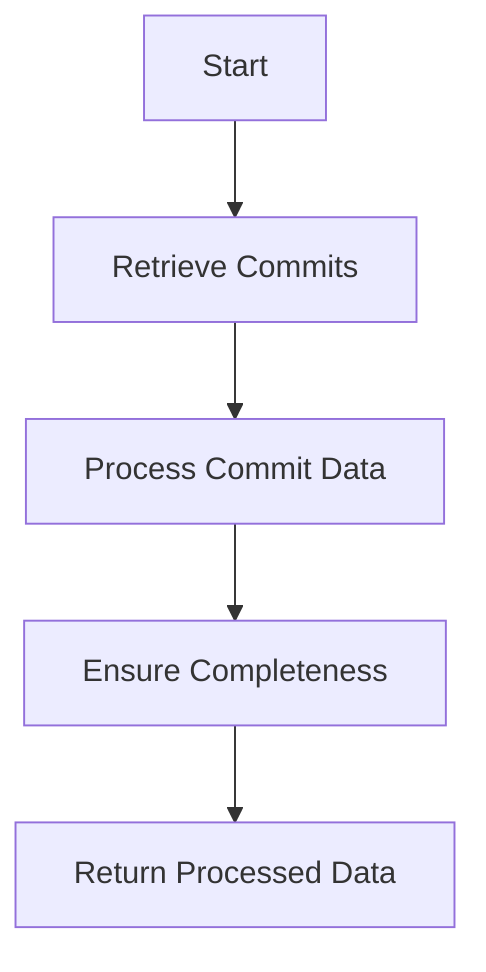

This document will cover the process of comparing commits in a repository. We'll cover:

1. Retrieving commits
2. Processing commit data
3. Ensuring completeness of commit messages and file changes.

Technical document: <SwmLink doc-title="Comparing Commits Flow">[Comparing Commits Flow](/.swm/comparing-commits-flow.m1m6cyd4.sw.md)</SwmLink>

# [Retrieving Commits](https://app.swimm.io/repos/Z2l0aHViJTNBJTNBc2VudHJ5LWRlbW8tMSUzQSUzQVN3aW1tLURlbW8=/docs/m1m6cyd4#compare_commits)

The process begins by retrieving a range of commits between two specified commit SHAs (unique identifiers for commits). If the starting SHA is not provided, the system fetches the latest commits up to a predefined limit. This ensures that we have a set of commits to compare, which is essential for understanding the changes made over a period.

# [Processing Commit Data](https://app.swimm.io/repos/Z2l0aHViJTNBJTNBc2VudHJ5LWRlbW8tMSUzQSUzQVN3aW1tLURlbW8=/docs/m1m6cyd4#zip_commit_data)

Once the commits are retrieved, the next step is to process the commit data. This involves ensuring that the commit messages and associated file changes are complete. If any commit comments are truncated, additional API calls are made to retrieve the full commit message. This step is crucial because it ensures that all relevant information, such as issue references, is included in the commit data.

# [Ensuring Completeness of Commit Messages and File Changes](https://app.swimm.io/repos/Z2l0aHViJTNBJTNBc2VudHJ5LWRlbW8tMSUzQSUzQVN3aW1tLURlbW8=/docs/m1m6cyd4#zip_commit_data)

To ensure the completeness of commit messages and file changes, the system makes additional API calls if commit comments are truncated. This is important because issue references could be anywhere in the commit message. Additionally, the system transforms the changes for each commit to ensure that the commit data is comprehensive and includes all necessary details for further processing.

# [Returning Processed Data](https://app.swimm.io/repos/Z2l0aHViJTNBJTNBc2VudHJ5LWRlbW8tMSUzQSUzQVN3aW1tLURlbW8=/docs/m1m6cyd4#compare_commits)

Finally, the processed commit data is formatted and returned. This formatted data includes complete commit messages and associated file changes, providing a comprehensive view of the changes made between the specified commits. This step ensures that the end user has all the necessary information to understand the differences between the commits.

&nbsp;

*This is an auto-generated document by Swimm AI 🌊 and has not yet been verified by a human*

<SwmMeta version="3.0.0" repo-id="Z2l0aHViJTNBJTNBc2VudHJ5LWRlbW8tMSUzQSUzQVN3aW1tLURlbW8=" repo-name="sentry-demo-1" doc-type="product-flows">Powered by [Swimm](/)</SwmMeta>
