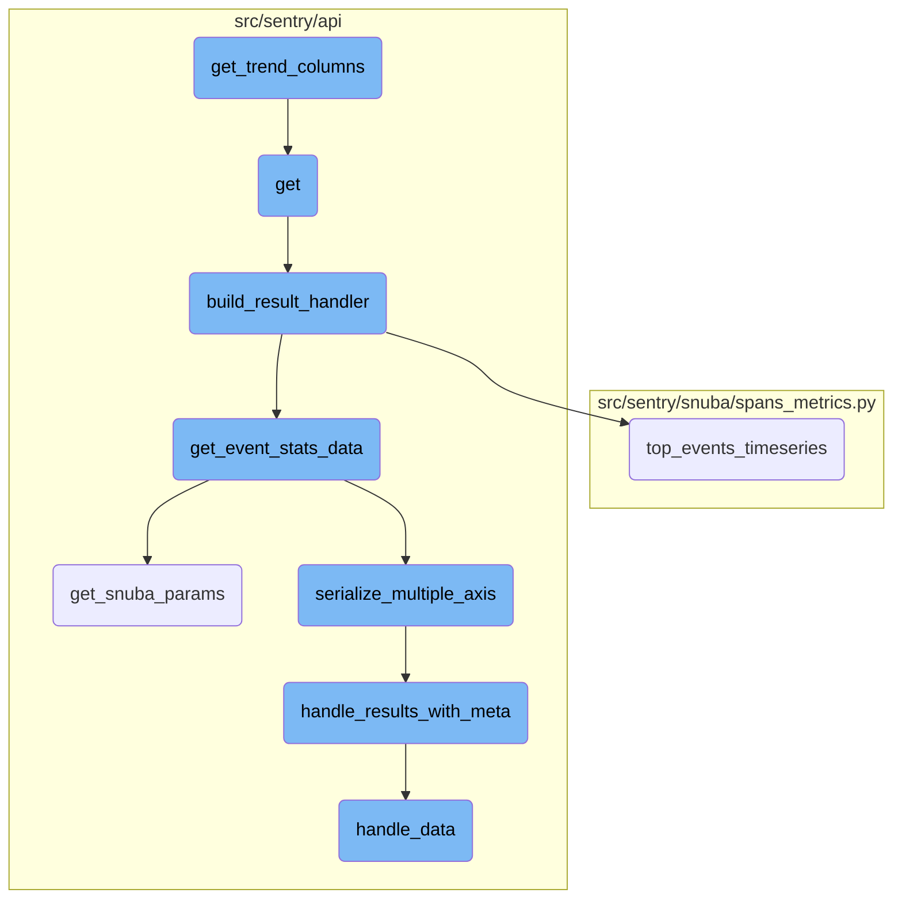
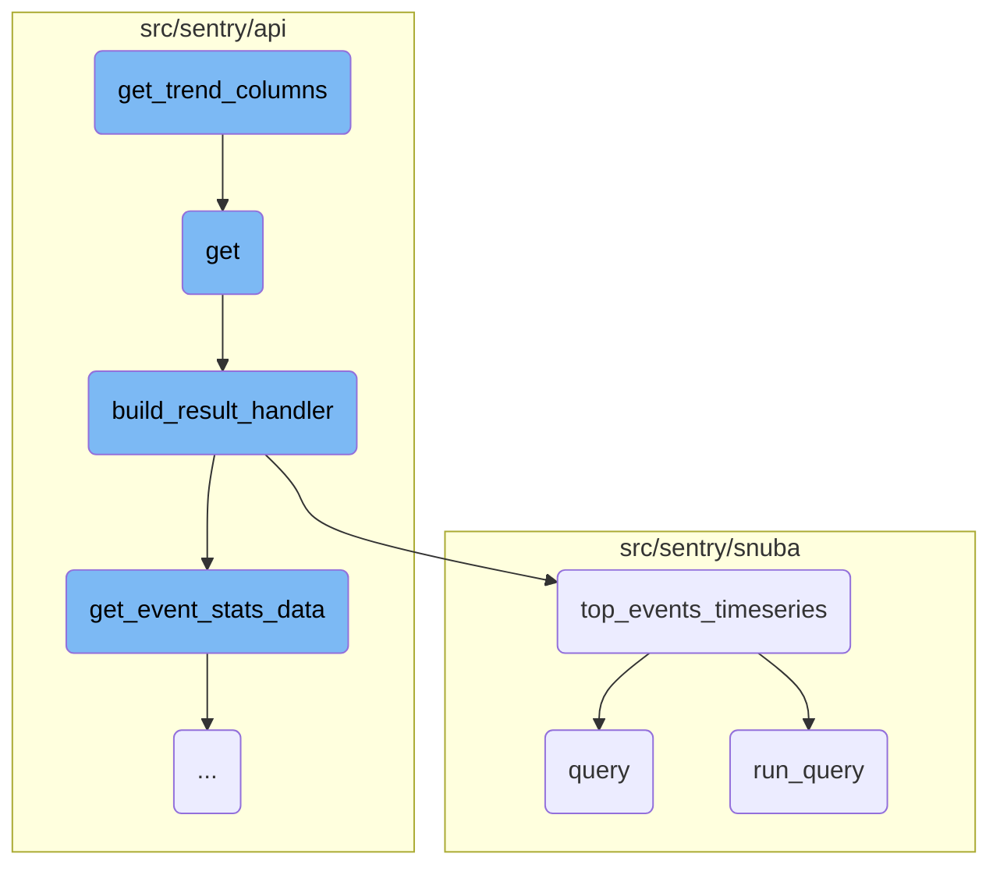

This document explains the process of constructing trend columns and handling query results. The process involves constructing the necessary columns for trend analysis, handling the main logic for processing a trend query request, building a result handler, performing timeseries queries, and executing the query.

The flow starts with constructing the necessary columns for trend analysis, which includes columns for variance, average, t-test, and other statistical measures. Next, the main logic for processing a trend query request is handled, which involves validating the request, constructing query parameters, and executing the query. The results are then processed using a result handler, which formats the final response. Timeseries queries are performed for top events, and the query is executed to retrieve the results.

Here is a high level diagram of the flow, showing only the most important functions:



# Flow drill down

First, we'll zoom into this section of the flow:



<SwmSnippet path="/src/sentry/api/endpoints/organization_events_trends.py" line="352">

---

## Constructing Trend Columns

The function <SwmToken path="src/sentry/api/endpoints/organization_events_trends.py" pos="352:3:3" line-data="    def get_trend_columns(self, baseline_function, column, middle):">`get_trend_columns`</SwmToken> constructs the necessary columns to calculate high confidence trends. It dynamically builds a list of columns based on the provided <SwmToken path="src/sentry/api/endpoints/organization_events_trends.py" pos="352:8:8" line-data="    def get_trend_columns(self, baseline_function, column, middle):">`baseline_function`</SwmToken>, <SwmToken path="src/sentry/api/endpoints/organization_events_trends.py" pos="352:11:11" line-data="    def get_trend_columns(self, baseline_function, column, middle):">`column`</SwmToken>, and <SwmToken path="src/sentry/api/endpoints/organization_events_trends.py" pos="352:14:14" line-data="    def get_trend_columns(self, baseline_function, column, middle):">`middle`</SwmToken> parameters. This includes columns for variance, average, t-test, and other statistical measures required for trend analysis.

```python
    def get_trend_columns(self, baseline_function, column, middle):
        """Construct the columns needed to calculate high confidence trends"""
        trend_column = self.trend_columns.get(baseline_function)
        if trend_column is None:
            raise ParseError(detail=f"{baseline_function} is not a supported trend function")

        count_column = self.trend_columns["count_range"]
        percentage_column = self.trend_columns["percentage"]
        variance_column = self.trend_columns["variance"]

        # t_test, and the columns required to calculate it
        t_test_columns = [
            variance_column.format(
                condition="greater", boundary=middle, query_alias="variance_range_1"
            ),
            variance_column.format(
                condition="lessOrEquals", boundary=middle, query_alias="variance_range_2"
            ),
        ]
        # Only add average when its not the baseline
        if baseline_function != "avg":
```

---

</SwmSnippet>

<SwmSnippet path="/src/sentry/api/endpoints/organization_events_trends.py" line="425">

---

## Handling Query Results

The function <SwmToken path="src/sentry/api/endpoints/organization_events_trends.py" pos="425:3:3" line-data="    def get(self, request: Request, organization) -&gt; Response:">`get`</SwmToken> handles the main logic for processing a trend query request. It validates the request, constructs the query parameters, and uses the <SwmToken path="src/sentry/api/endpoints/organization_events_trends.py" pos="58:2:2" line-data="class TrendQueryBuilder(DiscoverQueryBuilder):">`TrendQueryBuilder`</SwmToken> to build and execute the query. The results are then paginated and processed using the <SwmToken path="src/sentry/api/endpoints/organization_events_trends.py" pos="529:3:3" line-data="    def build_result_handler(">`build_result_handler`</SwmToken> function.

```python
    def get(self, request: Request, organization) -> Response:
        if not self.has_feature(organization, request):
            return Response(status=404)

        try:
            snuba_params = self.get_snuba_params(request, organization)
        except NoProjects:
            return Response([])

        with sentry_sdk.start_span(op="discover.endpoint", description="trend_dates"):
            middle_date = request.GET.get("middle")
            if middle_date:
                try:
                    middle = parse_datetime_string(middle_date)
                except InvalidQuery:
                    raise ParseError(detail=f"{middle_date} is not a valid date format")
                if middle <= snuba_params.start_date or middle >= snuba_params.end_date:
                    raise ParseError(
                        detail="The middle date should be within the duration of the query"
                    )
            else:
```

---

</SwmSnippet>

<SwmSnippet path="/src/sentry/api/endpoints/organization_events_trends.py" line="529">

---

### Building Result Handler

The function <SwmToken path="src/sentry/api/endpoints/organization_events_trends.py" pos="529:3:3" line-data="    def build_result_handler(">`build_result_handler`</SwmToken> creates a handler for processing the results of the trend query. It defines an inner function <SwmToken path="src/sentry/api/endpoints/organization_events_trends.py" pos="539:3:3" line-data="        def on_results(events_results):">`on_results`</SwmToken> that processes the event statistics and formats the final response, including both event data and statistical results.

```python
    def build_result_handler(
        self,
        request,
        organization,
        snuba_params,
        trend_function,
        selected_columns,
        orderby,
        query,
    ):
        def on_results(events_results):
            def get_event_stats(
                query_columns, query, snuba_params, rollup, zerofill_results, _=None
            ):
                return discover.top_events_timeseries(
                    query_columns,
                    selected_columns,
                    query,
                    snuba_params,
                    orderby,
                    rollup,
```

---

</SwmSnippet>

<SwmSnippet path="/src/sentry/snuba/spans_metrics.py" line="144">

---

## Top Events Timeseries

The function <SwmToken path="src/sentry/snuba/spans_metrics.py" pos="144:2:2" line-data="def top_events_timeseries(">`top_events_timeseries`</SwmToken> performs timeseries queries for a limited number of top events. It handles the construction and execution of the query, processes the results, and ensures that the data is correctly formatted and zero-filled where necessary.

```python
def top_events_timeseries(
    timeseries_columns,
    selected_columns,
    user_query,
    snuba_params,
    orderby,
    rollup,
    limit,
    organization,
    equations=None,
    referrer=None,
    top_events=None,
    allow_empty=True,
    zerofill_results=True,
    include_other=False,
    functions_acl=None,
    on_demand_metrics_enabled=False,
    on_demand_metrics_type: MetricSpecType | None = None,
    query_source: QuerySource | None = None,
):
    """
```

---

</SwmSnippet>

<SwmSnippet path="/src/sentry/snuba/spans_metrics.py" line="22">

---

### Query Execution

The function <SwmToken path="src/sentry/snuba/spans_metrics.py" pos="22:2:2" line-data="def query(">`query`</SwmToken> builds and executes a query using the <SwmToken path="src/sentry/snuba/spans_metrics.py" pos="8:1:1" line-data="    SpansMetricsQueryBuilder,">`SpansMetricsQueryBuilder`</SwmToken>. It processes the query results and returns them in a structured format.

```python
def query(
    selected_columns,
    query,
    snuba_params=None,
    equations=None,
    orderby=None,
    offset=None,
    limit=50,
    referrer=None,
    auto_fields=False,
    auto_aggregations=False,
    include_equation_fields=False,
    allow_metric_aggregates=False,
    use_aggregate_conditions=False,
    conditions=None,
    functions_acl=None,
    transform_alias_to_input_format=False,
    sample=None,
    has_metrics=False,
    use_metrics_layer=False,
    skip_tag_resolution=False,
```

---

</SwmSnippet>

<SwmSnippet path="/src/sentry/snuba/metrics_layer/query.py" line="143">

---

### Running the Query

The function <SwmToken path="src/sentry/snuba/metrics_layer/query.py" pos="143:2:2" line-data="def run_query(request: Request) -&gt; Mapping[str, Any]:">`run_query`</SwmToken> is the entry point for executing a metrics query in Snuba. It calls <SwmToken path="src/sentry/snuba/metrics_layer/query.py" pos="147:3:3" line-data="    return bulk_run_query([request])[0]">`bulk_run_query`</SwmToken> to execute the query and returns the results.

```python
def run_query(request: Request) -> Mapping[str, Any]:
    """
    Entrypoint for executing a metrics query in Snuba.
    """
    return bulk_run_query([request])[0]
```

---

</SwmSnippet>

Now, lets zoom into this section of the flow:

```mermaid
graph TD;
      subgraph src/sentry/api/bases/organization_events.py
9a7c498c62bb10bd14cfa8e6b88481cb1758fe0fe619fac236b1dfc4f2bc9964(get_event_stats_data):::mainFlowStyle --> a4f25188cdb1c709695d3a93e7176ddb7bd151b9a322e0836404ad0986b5f514(get_snuba_params)
end

subgraph src/sentry/api/bases/organization_events.py
9a7c498c62bb10bd14cfa8e6b88481cb1758fe0fe619fac236b1dfc4f2bc9964(get_event_stats_data):::mainFlowStyle --> 6bfd0761a315100cfb455cd63eee604e1d6ebf8e2957d5881bc086457f48801e(serialize_multiple_axis):::mainFlowStyle
end

subgraph src/sentry/api/bases/organization_events.py
6bfd0761a315100cfb455cd63eee604e1d6ebf8e2957d5881bc086457f48801e(serialize_multiple_axis):::mainFlowStyle --> 76555db3c36df80d8ce698d10ee1f95e79e25496e48ce2c0e3a19dce410f1dcd(handle_results_with_meta):::mainFlowStyle
end

subgraph src/sentry/api/bases/organization_events.py
76555db3c36df80d8ce698d10ee1f95e79e25496e48ce2c0e3a19dce410f1dcd(handle_results_with_meta):::mainFlowStyle --> 9335165d6fb85d88094c6bb73f9e154b223f793b29b1af6be9aa07d145132b65(handle_data):::mainFlowStyle
end


      classDef mainFlowStyle color:#000000,fill:#7CB9F4
classDef rootsStyle color:#000000,fill:#00FFF4
classDef Style1 color:#000000,fill:#00FFAA
classDef Style2 color:#000000,fill:#FFFF00
classDef Style3 color:#000000,fill:#AA7CB9

%% Swimm:
%% graph TD;
%%       subgraph <SwmPath>[src/sentry/api/bases/organization_events.py](src/sentry/api/bases/organization_events.py)</SwmPath>
%% 9a7c498c62bb10bd14cfa8e6b88481cb1758fe0fe619fac236b1dfc4f2bc9964(get_event_stats_data):::mainFlowStyle --> a4f25188cdb1c709695d3a93e7176ddb7bd151b9a322e0836404ad0986b5f514(get_snuba_params)
%% end
%% 
%% subgraph <SwmPath>[src/sentry/api/bases/organization_events.py](src/sentry/api/bases/organization_events.py)</SwmPath>
%% 9a7c498c62bb10bd14cfa8e6b88481cb1758fe0fe619fac236b1dfc4f2bc9964(get_event_stats_data):::mainFlowStyle --> 6bfd0761a315100cfb455cd63eee604e1d6ebf8e2957d5881bc086457f48801e(serialize_multiple_axis):::mainFlowStyle
%% end
%% 
%% subgraph <SwmPath>[src/sentry/api/bases/organization_events.py](src/sentry/api/bases/organization_events.py)</SwmPath>
%% 6bfd0761a315100cfb455cd63eee604e1d6ebf8e2957d5881bc086457f48801e(serialize_multiple_axis):::mainFlowStyle --> 76555db3c36df80d8ce698d10ee1f95e79e25496e48ce2c0e3a19dce410f1dcd(handle_results_with_meta):::mainFlowStyle
%% end
%% 
%% subgraph <SwmPath>[src/sentry/api/bases/organization_events.py](src/sentry/api/bases/organization_events.py)</SwmPath>
%% 76555db3c36df80d8ce698d10ee1f95e79e25496e48ce2c0e3a19dce410f1dcd(handle_results_with_meta):::mainFlowStyle --> 9335165d6fb85d88094c6bb73f9e154b223f793b29b1af6be9aa07d145132b65(handle_data):::mainFlowStyle
%% end
%% 
%% 
%%       classDef mainFlowStyle color:#000000,fill:#7CB9F4
%% classDef rootsStyle color:#000000,fill:#00FFF4
%% classDef Style1 color:#000000,fill:#00FFAA
%% classDef Style2 color:#000000,fill:#FFFF00
%% classDef Style3 color:#000000,fill:#AA7CB9
```



<SwmSnippet path="/src/sentry/api/bases/organization_events.py" line="388">

---

## <SwmToken path="src/sentry/api/bases/organization_events.py" pos="388:3:3" line-data="    def get_event_stats_data(">`get_event_stats_data`</SwmToken>

The function <SwmToken path="src/sentry/api/bases/organization_events.py" pos="388:3:3" line-data="    def get_event_stats_data(">`get_event_stats_data`</SwmToken> is responsible for orchestrating the retrieval and serialization of event statistics data. It handles query parameters, constructs the necessary columns for the query, and manages the rollup intervals. The function also ensures compatibility with older versions and handles the serialization of results, including multiple axes and top events.

```python
    def get_event_stats_data(
        self,
        request: Request,
        organization: Organization,
        get_event_stats: Callable[
            [Sequence[str], str, SnubaParams, int, bool, timedelta | None], SnubaTSResult
        ],
        top_events: int = 0,
        query_column: str = "count()",
        snuba_params: SnubaParams | None = None,
        query: str | None = None,
        allow_partial_buckets: bool = False,
        zerofill_results: bool = True,
        comparison_delta: timedelta | None = None,
        additional_query_column: str | None = None,
        dataset: Any | None = None,
    ) -> dict[str, Any]:
        with handle_query_errors():
            with sentry_sdk.start_span(
                op="discover.endpoint", description="base.stats_query_creation"
            ):
```

---

</SwmSnippet>

<SwmSnippet path="/src/sentry/api/bases/organization_events.py" line="91">

---

## <SwmToken path="src/sentry/api/bases/organization_events.py" pos="91:3:3" line-data="    def get_snuba_params(">`get_snuba_params`</SwmToken>

The function <SwmToken path="src/sentry/api/bases/organization_events.py" pos="91:3:3" line-data="    def get_snuba_params(">`get_snuba_params`</SwmToken> returns the parameters needed to make Snuba queries. It validates the number of fields, retrieves filter parameters, and ensures that the user has the necessary permissions to view events from multiple projects.

```python
    def get_snuba_params(
        self,
        request: Request,
        organization: Organization,
        check_global_views: bool = True,
        quantize_date_params: bool = True,
    ) -> SnubaParams:
        """Returns params to make snuba queries with"""
        with sentry_sdk.start_span(op="discover.endpoint", description="filter_params(dataclass)"):
            if (
                len(self.get_field_list(organization, request))
                + len(self.get_equation_list(organization, request))
                > MAX_FIELDS
            ):
                raise ParseError(
                    detail=f"You can view up to {MAX_FIELDS} fields at a time. Please delete some and try again."
                )

            filter_params: dict[str, Any] = self.get_filter_params(request, organization)
            if quantize_date_params:
                filter_params = self.quantize_date_params(request, filter_params)
```

---

</SwmSnippet>

<SwmSnippet path="/src/sentry/api/bases/organization_events.py" line="566">

---

## <SwmToken path="src/sentry/api/bases/organization_events.py" pos="566:3:3" line-data="    def serialize_multiple_axis(">`serialize_multiple_axis`</SwmToken>

The function <SwmToken path="src/sentry/api/bases/organization_events.py" pos="566:3:3" line-data="    def serialize_multiple_axis(">`serialize_multiple_axis`</SwmToken> handles the serialization of results when multiple axes are requested. It iterates over the query columns, serializes each axis, and includes metadata in the results.

```python
    def serialize_multiple_axis(
        self,
        request: Request,
        organization: Organization,
        serializer: BaseSnubaSerializer,
        event_result: SnubaTSResult,
        snuba_params: SnubaParams,
        columns: Sequence[str],
        query_columns: Sequence[str],
        allow_partial_buckets: bool,
        zerofill_results: bool = True,
        dataset: Any | None = None,
    ) -> dict[str, Any]:
        # Return with requested yAxis as the key
        result = {}
        equations = 0
        meta = self.handle_results_with_meta(
            request,
            organization,
            snuba_params.project_ids,
            event_result.data,
```

---

</SwmSnippet>

<SwmSnippet path="/src/sentry/api/bases/organization_events.py" line="290">

---

## <SwmToken path="src/sentry/api/bases/organization_events.py" pos="290:3:3" line-data="    def handle_results_with_meta(">`handle_results_with_meta`</SwmToken>

The function <SwmToken path="src/sentry/api/bases/organization_events.py" pos="290:3:3" line-data="    def handle_results_with_meta(">`handle_results_with_meta`</SwmToken> processes the results and includes metadata. It handles unit metadata, checks for metrics data, and ensures that the results are formatted correctly.

```python
    def handle_results_with_meta(
        self,
        request: Request,
        organization: Organization,
        project_ids: Sequence[int],
        results: dict[str, Any],
        standard_meta: bool | None = False,
        dataset: Any | None = None,
    ) -> dict[str, Any]:
        with sentry_sdk.start_span(op="discover.endpoint", description="base.handle_results"):
            data = self.handle_data(request, organization, project_ids, results.get("data"))
            meta = results.get("meta", {})
            fields_meta = meta.get("fields", {})

            if standard_meta:
                isMetricsData = meta.pop("isMetricsData", False)
                isMetricsExtractedData = meta.pop("isMetricsExtractedData", False)
                discoverSplitDecision = meta.pop("discoverSplitDecision", None)
                fields, units = self.handle_unit_meta(fields_meta)
                meta = {
                    "fields": fields,
```

---

</SwmSnippet>

<SwmSnippet path="/src/sentry/api/bases/organization_events.py" line="332">

---

## <SwmToken path="src/sentry/api/bases/organization_events.py" pos="332:3:3" line-data="    def handle_data(">`handle_data`</SwmToken>

The function <SwmToken path="src/sentry/api/bases/organization_events.py" pos="332:3:3" line-data="    def handle_data(">`handle_data`</SwmToken> processes the raw data results. It formats transaction statuses, handles issues, and ensures that the project <SwmToken path="src/sentry/snuba/spans_metrics.py" pos="180:15:15" line-data="    organization (Organization) Used to map group ids to short ids">`ids`</SwmToken> are correctly included or excluded from the results.

```python
    def handle_data(
        self,
        request: Request,
        organization: Organization,
        project_ids: Sequence[int],
        results: Sequence[Any] | None,
    ) -> Sequence[Any] | None:
        if not results:
            return results

        first_row = results[0]

        # TODO(mark) move all of this result formatting into discover.query()
        # once those APIs are used across the application.
        if "transaction.status" in first_row:
            for row in results:
                if "transaction.status" in row and type(row["transaction.status"]) is int:
                    row["transaction.status"] = SPAN_STATUS_CODE_TO_NAME.get(
                        row["transaction.status"]
                    )

```

---

</SwmSnippet>

&nbsp;

*This is an auto-generated document by Swimm AI 🌊 and has not yet been verified by a human*

<SwmMeta version="3.0.0" repo-id="Z2l0aHViJTNBJTNBc2VudHJ5LWRlbW8tMSUzQSUzQVN3aW1tLURlbW8=" repo-name="sentry-demo-1" doc-type="flows"><sup>Powered by [Swimm](/)</sup></SwmMeta>
