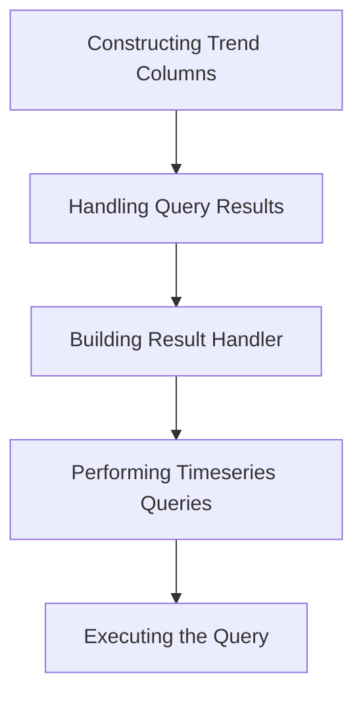

This document will cover the process of constructing trend columns and handling query results. We'll cover:

1. Constructing Trend Columns
2. Handling Query Results
3. Building Result Handler
4. Performing Timeseries Queries
5. Executing the Query

Technical document: <SwmLink doc-title="Constructing Trend Columns and Handling Query Results">[Constructing Trend Columns and Handling Query Results](/.swm/constructing-trend-columns-and-handling-query-results.0z0xb6dc.sw.md)</SwmLink>

# [Constructing Trend Columns](https://app.swimm.io/repos/Z2l0aHViJTNBJTNBc2VudHJ5LWRlbW8tMSUzQSUzQVN3aW1tLURlbW8=/docs/0z0xb6dc#constructing-trend-columns)

The process begins with constructing the necessary columns for trend analysis. This involves creating columns for various statistical measures such as variance, average, and t-test. These columns are essential for identifying high-confidence trends in the data. For example, the variance column helps in understanding the spread of data points, while the t-test columns are used to determine if there is a significant difference between two sets of data. This step ensures that all the required statistical measures are available for accurate trend analysis.

# [Handling Query Results](https://app.swimm.io/repos/Z2l0aHViJTNBJTNBc2VudHJ5LWRlbW8tMSUzQSUzQVN3aW1tLURlbW8=/docs/0z0xb6dc#handling-query-results)

Once the trend columns are constructed, the next step is to handle the main logic for processing a trend query request. This involves validating the request to ensure it contains all necessary parameters and is within acceptable limits. For instance, the middle date parameter must be within the duration of the query. After validation, the query parameters are constructed, and the query is executed. This step is crucial for ensuring that the query is correctly formulated and executed, leading to accurate and reliable results.

# [Building Result Handler](https://app.swimm.io/repos/Z2l0aHViJTNBJTNBc2VudHJ5LWRlbW8tMSUzQSUzQVN3aW1tLURlbW8=/docs/0z0xb6dc#building-result-handler)

The results of the query are then processed using a result handler. The result handler is responsible for formatting the final response, which includes both event data and statistical results. This involves defining an inner function that processes the event statistics and formats the response in a way that is easy to understand and use. For example, the result handler might aggregate data points, calculate averages, and format the results into a JSON object that can be easily consumed by other parts of the application.

# [Performing Timeseries Queries](https://app.swimm.io/repos/Z2l0aHViJTNBJTNBc2VudHJ5LWRlbW8tMSUzQSUzQVN3aW1tLURlbW8=/docs/0z0xb6dc#top-events-timeseries)

Timeseries queries are performed for a limited number of top events. This step involves constructing and executing the query, processing the results, and ensuring that the data is correctly formatted and zero-filled where necessary. For example, if a user wants to see the top 5 events over a specific time period, this step will retrieve and format that data, ensuring that any gaps in the data are filled with zeros to provide a complete timeseries.

# [Executing the Query](https://app.swimm.io/repos/Z2l0aHViJTNBJTNBc2VudHJ5LWRlbW8tMSUzQSUzQVN3aW1tLURlbW8=/docs/0z0xb6dc#running-the-query)

The final step is executing the query. This involves calling the entry point for executing a metrics query in Snuba, which processes the query and returns the results. The results are then structured and formatted for easy consumption. This step ensures that the query is executed efficiently and the results are returned in a format that can be easily used by other parts of the application.

&nbsp;

*This is an auto-generated document by Swimm AI 🌊 and has not yet been verified by a human*

<SwmMeta version="3.0.0" repo-id="Z2l0aHViJTNBJTNBc2VudHJ5LWRlbW8tMSUzQSUzQVN3aW1tLURlbW8=" repo-name="sentry-demo-1" doc-type="product-flows">Powered by [Swimm](/)</SwmMeta>
