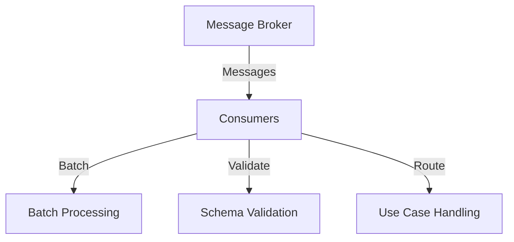

# What are Consumers in Sentry Metrics

Consumers are components responsible for processing messages from a message broker, such as Kafka. They handle the ingestion of metrics data, ensuring that messages are batched, validated, and routed correctly. Consumers play a key role in maintaining the flow of data through the system, enabling efficient processing and transformation of metrics.

# Batch Processing

Consumers check the header to see if the use case ID is disabled, ensuring only relevant messages are processed. This step ensures that the data is processed in a timely manner, adhering to specified batch sizes and time constraints.

<SwmSnippet path="/src/sentry/sentry_metrics/consumers/indexer/batch.py" line="1">

---

The function checks the header to see if the use case ID is disabled.

```python
import logging
import random
from collections import defaultdict
```

---

</SwmSnippet>

# Schema Validation

Consumers apply schema validation to all messages of a use case if the configuration option is not defined, ensuring data integrity. This step is crucial to maintain data integrity and prevent errors during processing.

# Use Case Handling

Consumers get the tags and schema validator functions for the current use case, ensuring that the data conforms to expected formats.

<SwmSnippet path="/src/sentry/sentry_metrics/consumers/indexer/processing.py" line="59">

---

The function gets the tags validator function for the current use case and the schema validator function.

```python
        Get the tags validator function for the current use case.
        """
        if self._config.use_case_id == UseCaseKey.RELEASE_HEALTH:
            return ReleaseHealthTagsValidator().is_allowed
        else:
            return GenericMetricsTagsValidator().is_allowed

    def __get_schema_validator(self) -> Callable[[str, IngestMetric], None]:
        """
        Get the schema validator function for the current use case.
```

---

</SwmSnippet>

# Main Functions

There are several main functions in this folder. Some of them are batching, validating, and routing messages. We will dive a little into each of these functions.

## Batching Messages

Consumers handle the batching of messages to ensure efficient processing. This involves collecting messages over a period and processing them together to optimize resource usage.

<SwmSnippet path="/src/sentry/replays/lib/consumer.py" line="1">

---

The class <SwmToken path="src/sentry/replays/lib/consumer.py" pos="10:2:2" line-data="class LogExceptionStep(ProcessingStrategy[TPayload]):">`LogExceptionStep`</SwmToken> is part of the batching process.

```python
import logging
from typing import TypeVar

from arroyo.processing.strategies.abstract import MessageRejected, ProcessingStrategy
from arroyo.types import Message

TPayload = TypeVar("TPayload")


class LogExceptionStep(ProcessingStrategy[TPayload]):
```

---

</SwmSnippet>

## Validating Messages

Consumers validate the incoming messages to ensure they meet the required format and criteria. This step is crucial to maintain data integrity and prevent errors during processing.

<SwmSnippet path="/src/sentry/replays/lib/consumer.py" line="11">

---

The constructor of <SwmToken path="src/sentry/replays/lib/consumer.py" pos="10:2:2" line-data="class LogExceptionStep(ProcessingStrategy[TPayload]):">`LogExceptionStep`</SwmToken> initializes the validation process.

```python
    def __init__(
        self,
        message: str,
        logger: logging.Logger,
        next_step: ProcessingStrategy[TPayload],
    ) -> None:
        self.__exception_message = message
        self.__next_step = next_step
        self.__closed = False
        self.__logger = logger
```

---

</SwmSnippet>

## Routing Messages

Consumers are responsible for routing messages to the appropriate destinations based on predefined rules. This ensures that each message reaches the correct component for further processing.

<SwmSnippet path="/src/sentry/replays/lib/consumer.py" line="22">

---

The <SwmToken path="src/sentry/replays/lib/consumer.py" pos="22:3:3" line-data="    def submit(self, message: Message[TPayload]) -&gt; None:">`submit`</SwmToken> method in <SwmToken path="src/sentry/replays/lib/consumer.py" pos="10:2:2" line-data="class LogExceptionStep(ProcessingStrategy[TPayload]):">`LogExceptionStep`</SwmToken> handles the routing of messages.

```python
    def submit(self, message: Message[TPayload]) -> None:
        assert not self.__closed

        try:
            self.__next_step.submit(message)
        except MessageRejected:
            raise
        except Exception:
            self.__logger.exception(self.__exception_message)
```

---

</SwmSnippet>

# Endpoints of Consumers

Endpoints of Consumers include methods that determine the route for a message and return a list of all producers that the router uses.

## <SwmToken path="src/sentry/sentry_metrics/consumers/indexer/slicing_router.py" pos="124:3:3" line-data="    def get_route_for_message(self, message: Message[RoutingPayload]) -&gt; MessageRoute:">`get_route_for_message`</SwmToken>

The <SwmToken path="src/sentry/sentry_metrics/consumers/indexer/slicing_router.py" pos="124:3:3" line-data="    def get_route_for_message(self, message: Message[RoutingPayload]) -&gt; MessageRoute:">`get_route_for_message`</SwmToken> method in the <SwmToken path="src/sentry/sentry_metrics/consumers/indexer/slicing_router.py" pos="27:15:15" line-data="    Exception raised when the configuration for the SlicingRouter is invalid.">`SlicingRouter`</SwmToken> class determines the route for a message based on the <SwmToken path="src/sentry/sentry_metrics/consumers/indexer/slicing_router.py" pos="126:28:28" line-data="        Get route for the message. The message will be routed based on the org_id">`org_id`</SwmToken> present in the message payload header. It maps the <SwmToken path="src/sentry/sentry_metrics/consumers/indexer/slicing_router.py" pos="126:28:28" line-data="        Get route for the message. The message will be routed based on the org_id">`org_id`</SwmToken> to a logical partition and then to a specific slice, returning the corresponding producer.

<SwmSnippet path="/src/sentry/sentry_metrics/consumers/indexer/slicing_router.py" line="124">

---

The <SwmToken path="src/sentry/sentry_metrics/consumers/indexer/slicing_router.py" pos="124:3:3" line-data="    def get_route_for_message(self, message: Message[RoutingPayload]) -&gt; MessageRoute:">`get_route_for_message`</SwmToken> method routes the message based on the <SwmToken path="src/sentry/sentry_metrics/consumers/indexer/slicing_router.py" pos="126:28:28" line-data="        Get route for the message. The message will be routed based on the org_id">`org_id`</SwmToken>.

```python
    def get_route_for_message(self, message: Message[RoutingPayload]) -> MessageRoute:
        """
        Get route for the message. The message will be routed based on the org_id
        present in the message payload header and how it maps to a specific
        slice.
        """
        org_id = message.payload.routing_header.get("org_id", None)

        if org_id is None:
            raise MissingOrgInRoutingHeader("org_id is missing from the routing header")
        else:
            slice_id = map_logical_partition_to_slice(
                self.__sliceable, map_org_id_to_logical_partition(org_id)
            )
            producer = self.__slice_to_producer[slice_id]

        return producer
```

---

</SwmSnippet>

## <SwmToken path="src/sentry/sentry_metrics/consumers/indexer/slicing_router.py" pos="121:3:3" line-data="    def get_all_producers(self) -&gt; Sequence[Producer]:">`get_all_producers`</SwmToken>

The <SwmToken path="src/sentry/sentry_metrics/consumers/indexer/slicing_router.py" pos="121:3:3" line-data="    def get_all_producers(self) -&gt; Sequence[Producer]:">`get_all_producers`</SwmToken> method in the <SwmToken path="src/sentry/sentry_metrics/consumers/indexer/slicing_router.py" pos="27:15:15" line-data="    Exception raised when the configuration for the SlicingRouter is invalid.">`SlicingRouter`</SwmToken> class returns a list of all producers that the router uses. This is necessary for the processing strategy to call <SwmToken path="src/sentry/replays/lib/consumer.py" pos="34:5:7" line-data="            self.__next_step.poll()">`poll()`</SwmToken> on all the producers.

<SwmSnippet path="/src/sentry/sentry_metrics/consumers/indexer/slicing_router.py" line="121">

---

The <SwmToken path="src/sentry/sentry_metrics/consumers/indexer/slicing_router.py" pos="121:3:3" line-data="    def get_all_producers(self) -&gt; Sequence[Producer]:">`get_all_producers`</SwmToken> method returns all producers used by the router.

```python
    def get_all_producers(self) -> Sequence[Producer]:
        return [route.producer for route in self.__slice_to_producer.values()]
```

---

</SwmSnippet>

&nbsp;

*This is an auto-generated document by Swimm AI 🌊 and has not yet been verified by a human*

<SwmMeta version="3.0.0" repo-id="Z2l0aHViJTNBJTNBc2VudHJ5LWRlbW8tMSUzQSUzQVN3aW1tLURlbW8=" repo-name="sentry-demo-1" doc-type="overview"><sup>Powered by [Swimm](/)</sup></SwmMeta>
