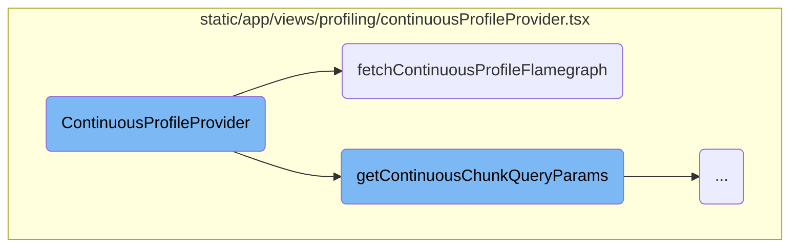

This document explains the role and functionality of the <SwmToken path="static/app/views/profiling/continuousProfileProvider.tsx" pos="98:2:2" line-data="function ContinuousProfileProvider(">`ContinuousProfileProvider`</SwmToken>. It manages the state and lifecycle of continuous profiling data, fetching necessary data and updating the state accordingly.

The <SwmToken path="static/app/views/profiling/continuousProfileProvider.tsx" pos="98:2:2" line-data="function ContinuousProfileProvider(">`ContinuousProfileProvider`</SwmToken> is responsible for managing profiling data. It starts by initializing necessary hooks to gather data. Then, it uses an effect to fetch profiling data based on query parameters and project details. If the parameters are invalid or the project is not found, it logs errors. Upon successful data retrieval, it updates the state with the fetched profiles and provides this data to child components.

Here is a high level diagram of the flow, showing only the most important functions:

```mermaid
graph TD;
      subgraph static/app
12335b37ee37f553d791e6c45933b4ca9d6d94edf781035b4208304a71c1d41c(ContinuousProfileProvider):::mainFlowStyle --> ef7ff0352f4ece4fb04a71994e4079bd5584fe71daab8df110f8812bac546f70(fetchContinuousProfileFlamegraph)
end

subgraph static/app
12335b37ee37f553d791e6c45933b4ca9d6d94edf781035b4208304a71c1d41c(ContinuousProfileProvider):::mainFlowStyle --> 6fcc93ccfa3a55826174c679f6a6983c2cc116160caafe3f63f22e63381d9a71(getContinuousChunkQueryParams):::mainFlowStyle
end

subgraph static/app
6fcc93ccfa3a55826174c679f6a6983c2cc116160caafe3f63f22e63381d9a71(getContinuousChunkQueryParams):::mainFlowStyle --> ed6274f0b425f01d10e16aac969e90755cd36f493e5faa66460aae3feda4d0da(isValidDate):::mainFlowStyle
end

subgraph static/app
ed6274f0b425f01d10e16aac969e90755cd36f493e5faa66460aae3feda4d0da(isValidDate):::mainFlowStyle --> 4b2faee236c2e651d9932fa234f72966df49f7aa0f85eb9909d65f4b6d8ce1a6(parse):::mainFlowStyle
end

subgraph static/app
4b2faee236c2e651d9932fa234f72966df49f7aa0f85eb9909d65f4b6d8ce1a6(parse):::mainFlowStyle --> b2b47f6077e96a1ff47606d77c3fe70b18a84edc0ab0fa1349f7face4165d2ea(parseWidget):::mainFlowStyle
end

subgraph static/app
b2b47f6077e96a1ff47606d77c3fe70b18a84edc0ab0fa1349f7face4165d2ea(parseWidget):::mainFlowStyle --> 05bf2ddeab316943d2187e10bc3886949b4b03ae946f68d4f27a5bfc0025e132(mapToMetricsQuery):::mainFlowStyle
end

subgraph static/app
05bf2ddeab316943d2187e10bc3886949b4b03ae946f68d4f27a5bfc0025e132(mapToMetricsQuery):::mainFlowStyle --> 635bb507b11255a8fd7c2375dac3b6c46b736470cf89007061c6861fc973e73b(fetchAvailableTags):::mainFlowStyle
end

subgraph static/app
635bb507b11255a8fd7c2375dac3b6c46b736470cf89007061c6861fc973e73b(fetchAvailableTags):::mainFlowStyle --> 1025c11ff078741e3a52849e4dc81510d630800b045c60aea951683433a1c993(requestPromise):::mainFlowStyle
end

subgraph static/app
1025c11ff078741e3a52849e4dc81510d630800b045c60aea951683433a1c993(requestPromise):::mainFlowStyle --> 4f5a67a71dfb71654db327ed24d5e8187187a49b58963a473eec18ecb0aef026(request):::mainFlowStyle
end

subgraph static/app
4f5a67a71dfb71654db327ed24d5e8187187a49b58963a473eec18ecb0aef026(request):::mainFlowStyle --> 2cd409575454572c7b228bde73d6eb55227f3d7b14d37cc7ca5415bbcb81e4e5(handler):::mainFlowStyle
end

subgraph static/app
2cd409575454572c7b228bde73d6eb55227f3d7b14d37cc7ca5415bbcb81e4e5(handler):::mainFlowStyle --> 559bfddfedaeb6eedd4a2b9c4af59508927a1a6190c13b585781a179d22a07a1(processEvent):::mainFlowStyle
end

subgraph src/sentry/utils
559bfddfedaeb6eedd4a2b9c4af59508927a1a6190c13b585781a179d22a07a1(processEvent):::mainFlowStyle --> f4806fbc42267a83efc17e560b73c8335a116a7d12accc0ce1b678112e33fa25(increment):::mainFlowStyle
end

subgraph src/sentry/utils
f4806fbc42267a83efc17e560b73c8335a116a7d12accc0ce1b678112e33fa25(increment):::mainFlowStyle --> 411e09b2a8fb05fb965aa689da087a4eb0afb53a22d1a0177a8dfd222ea23bac(incr):::mainFlowStyle
end

subgraph src/sentry/api/client.py
411e09b2a8fb05fb965aa689da087a4eb0afb53a22d1a0177a8dfd222ea23bac(incr):::mainFlowStyle --> 560768831e5caae094d399ce451ab0489318662774e26c007cf59ac610285662(put):::mainFlowStyle
end

subgraph src/sentry/api/client.py
560768831e5caae094d399ce451ab0489318662774e26c007cf59ac610285662(put):::mainFlowStyle --> f9a76a621506843e728c753bbfd65f5dee5fa0fc21993c46938d555bf01dd967(request):::mainFlowStyle
end


      classDef mainFlowStyle color:#000000,fill:#7CB9F4
classDef rootsStyle color:#000000,fill:#00FFF4
classDef Style1 color:#000000,fill:#00FFAA
classDef Style2 color:#000000,fill:#FFFF00
classDef Style3 color:#000000,fill:#AA7CB9

%% Swimm:
%% graph TD;
%%       subgraph <SwmPath>[static/app/](static/app/)</SwmPath>
%% 12335b37ee37f553d791e6c45933b4ca9d6d94edf781035b4208304a71c1d41c(ContinuousProfileProvider):::mainFlowStyle --> ef7ff0352f4ece4fb04a71994e4079bd5584fe71daab8df110f8812bac546f70(fetchContinuousProfileFlamegraph)
%% end
%% 
%% subgraph <SwmPath>[static/app/](static/app/)</SwmPath>
%% 12335b37ee37f553d791e6c45933b4ca9d6d94edf781035b4208304a71c1d41c(ContinuousProfileProvider):::mainFlowStyle --> 6fcc93ccfa3a55826174c679f6a6983c2cc116160caafe3f63f22e63381d9a71(getContinuousChunkQueryParams):::mainFlowStyle
%% end
%% 
%% subgraph <SwmPath>[static/app/](static/app/)</SwmPath>
%% 6fcc93ccfa3a55826174c679f6a6983c2cc116160caafe3f63f22e63381d9a71(getContinuousChunkQueryParams):::mainFlowStyle --> ed6274f0b425f01d10e16aac969e90755cd36f493e5faa66460aae3feda4d0da(isValidDate):::mainFlowStyle
%% end
%% 
%% subgraph <SwmPath>[static/app/](static/app/)</SwmPath>
%% ed6274f0b425f01d10e16aac969e90755cd36f493e5faa66460aae3feda4d0da(isValidDate):::mainFlowStyle --> 4b2faee236c2e651d9932fa234f72966df49f7aa0f85eb9909d65f4b6d8ce1a6(parse):::mainFlowStyle
%% end
%% 
%% subgraph <SwmPath>[static/app/](static/app/)</SwmPath>
%% 4b2faee236c2e651d9932fa234f72966df49f7aa0f85eb9909d65f4b6d8ce1a6(parse):::mainFlowStyle --> b2b47f6077e96a1ff47606d77c3fe70b18a84edc0ab0fa1349f7face4165d2ea(parseWidget):::mainFlowStyle
%% end
%% 
%% subgraph <SwmPath>[static/app/](static/app/)</SwmPath>
%% b2b47f6077e96a1ff47606d77c3fe70b18a84edc0ab0fa1349f7face4165d2ea(parseWidget):::mainFlowStyle --> 05bf2ddeab316943d2187e10bc3886949b4b03ae946f68d4f27a5bfc0025e132(mapToMetricsQuery):::mainFlowStyle
%% end
%% 
%% subgraph <SwmPath>[static/app/](static/app/)</SwmPath>
%% 05bf2ddeab316943d2187e10bc3886949b4b03ae946f68d4f27a5bfc0025e132(mapToMetricsQuery):::mainFlowStyle --> 635bb507b11255a8fd7c2375dac3b6c46b736470cf89007061c6861fc973e73b(fetchAvailableTags):::mainFlowStyle
%% end
%% 
%% subgraph <SwmPath>[static/app/](static/app/)</SwmPath>
%% 635bb507b11255a8fd7c2375dac3b6c46b736470cf89007061c6861fc973e73b(fetchAvailableTags):::mainFlowStyle --> 1025c11ff078741e3a52849e4dc81510d630800b045c60aea951683433a1c993(requestPromise):::mainFlowStyle
%% end
%% 
%% subgraph <SwmPath>[static/app/](static/app/)</SwmPath>
%% 1025c11ff078741e3a52849e4dc81510d630800b045c60aea951683433a1c993(requestPromise):::mainFlowStyle --> 4f5a67a71dfb71654db327ed24d5e8187187a49b58963a473eec18ecb0aef026(request):::mainFlowStyle
%% end
%% 
%% subgraph <SwmPath>[static/app/](static/app/)</SwmPath>
%% 4f5a67a71dfb71654db327ed24d5e8187187a49b58963a473eec18ecb0aef026(request):::mainFlowStyle --> 2cd409575454572c7b228bde73d6eb55227f3d7b14d37cc7ca5415bbcb81e4e5(handler):::mainFlowStyle
%% end
%% 
%% subgraph <SwmPath>[static/app/](static/app/)</SwmPath>
%% 2cd409575454572c7b228bde73d6eb55227f3d7b14d37cc7ca5415bbcb81e4e5(handler):::mainFlowStyle --> 559bfddfedaeb6eedd4a2b9c4af59508927a1a6190c13b585781a179d22a07a1(processEvent):::mainFlowStyle
%% end
%% 
%% subgraph <SwmPath>[src/sentry/utils/](src/sentry/utils/)</SwmPath>
%% 559bfddfedaeb6eedd4a2b9c4af59508927a1a6190c13b585781a179d22a07a1(processEvent):::mainFlowStyle --> f4806fbc42267a83efc17e560b73c8335a116a7d12accc0ce1b678112e33fa25(increment):::mainFlowStyle
%% end
%% 
%% subgraph <SwmPath>[src/sentry/utils/](src/sentry/utils/)</SwmPath>
%% f4806fbc42267a83efc17e560b73c8335a116a7d12accc0ce1b678112e33fa25(increment):::mainFlowStyle --> 411e09b2a8fb05fb965aa689da087a4eb0afb53a22d1a0177a8dfd222ea23bac(incr):::mainFlowStyle
%% end
%% 
%% subgraph <SwmPath>[src/sentry/api/client.py](src/sentry/api/client.py)</SwmPath>
%% 411e09b2a8fb05fb965aa689da087a4eb0afb53a22d1a0177a8dfd222ea23bac(incr):::mainFlowStyle --> 560768831e5caae094d399ce451ab0489318662774e26c007cf59ac610285662(put):::mainFlowStyle
%% end
%% 
%% subgraph <SwmPath>[src/sentry/api/client.py](src/sentry/api/client.py)</SwmPath>
%% 560768831e5caae094d399ce451ab0489318662774e26c007cf59ac610285662(put):::mainFlowStyle --> f9a76a621506843e728c753bbfd65f5dee5fa0fc21993c46938d555bf01dd967(request):::mainFlowStyle
%% end
%% 
%% 
%%       classDef mainFlowStyle color:#000000,fill:#7CB9F4
%% classDef rootsStyle color:#000000,fill:#00FFF4
%% classDef Style1 color:#000000,fill:#00FFAA
%% classDef Style2 color:#000000,fill:#FFFF00
%% classDef Style3 color:#000000,fill:#AA7CB9
```



# Flow drill down

First, we'll zoom into this section of the flow:



<SwmSnippet path="/static/app/views/profiling/continuousProfileProvider.tsx" line="98">

---

## <SwmToken path="static/app/views/profiling/continuousProfileProvider.tsx" pos="98:2:2" line-data="function ContinuousProfileProvider(">`ContinuousProfileProvider`</SwmToken>

The <SwmToken path="static/app/views/profiling/continuousProfileProvider.tsx" pos="98:2:2" line-data="function ContinuousProfileProvider(">`ContinuousProfileProvider`</SwmToken> function is responsible for managing the state and lifecycle of continuous profiling data. It initializes necessary hooks like <SwmToken path="static/app/views/profiling/continuousProfileProvider.tsx" pos="101:7:7" line-data="  const api = useApi();">`useApi`</SwmToken>, <SwmToken path="static/app/views/profiling/continuousProfileProvider.tsx" pos="102:7:7" line-data="  const params = useParams();">`useParams`</SwmToken>, <SwmToken path="static/app/views/profiling/continuousProfileProvider.tsx" pos="103:7:7" line-data="  const organization = useOrganization();">`useOrganization`</SwmToken>, and <SwmToken path="static/app/views/profiling/continuousProfileProvider.tsx" pos="104:7:7" line-data="  const projects = useProjects();">`useProjects`</SwmToken> to gather required data. It then uses <SwmToken path="static/app/views/profiling/continuousProfileProvider.tsx" pos="110:1:1" line-data="  useLayoutEffect(() =&gt; {">`useLayoutEffect`</SwmToken> to fetch profiling data based on query parameters and project details. If the parameters are invalid or the project is not found, it logs errors using Sentry. Upon successful data retrieval, it updates the state with the fetched profiles and provides this data to the context for child components to consume.

```tsx
function ContinuousProfileProvider(
  props: ContinuousFlamegraphViewProps
): React.ReactElement {
  const api = useApi();
  const params = useParams();
  const organization = useOrganization();
  const projects = useProjects();

  const [profiles, setProfiles] = useState<RequestState<Profiling.ProfileInput>>({
    type: 'initial',
  });

  useLayoutEffect(() => {
    if (!params.projectId) {
      return undefined;
    }

    const chunkParams = getContinuousChunkQueryParams(window.location.search);
    const project = projects.projects.find(p => p.slug === params.projectId);

    if (!chunkParams) {
```

---

</SwmSnippet>

<SwmSnippet path="/static/app/views/profiling/continuousProfileProvider.tsx" line="23">

---

## <SwmToken path="static/app/views/profiling/continuousProfileProvider.tsx" pos="23:2:2" line-data="function fetchContinuousProfileFlamegraph(">`fetchContinuousProfileFlamegraph`</SwmToken>

The <SwmToken path="static/app/views/profiling/continuousProfileProvider.tsx" pos="23:2:2" line-data="function fetchContinuousProfileFlamegraph(">`fetchContinuousProfileFlamegraph`</SwmToken> function is used to make an API request to fetch profiling data. It constructs a request to the endpoint `/organizations/${orgSlug}/profiling/chunks/` with the necessary query parameters, including the project and organization slugs. The function returns a promise that resolves with the profiling data chunk, which is then used by <SwmToken path="static/app/views/profiling/continuousProfileProvider.tsx" pos="98:2:2" line-data="function ContinuousProfileProvider(">`ContinuousProfileProvider`</SwmToken> to update the state.

```tsx
function fetchContinuousProfileFlamegraph(
  api: Client,
  query: ContinuousProfileQueryParams,
  projectSlug: Project['slug'],
  orgSlug: Organization['slug']
): Promise<Profiling.ProfileInput> {
  return api
    .requestPromise(`/organizations/${orgSlug}/profiling/chunks/`, {
      method: 'GET',
      query: {
        ...query,
        project: projectSlug,
      },
      includeAllArgs: true,
    })
    .then(([data]) => data.chunk);
}
```

---

</SwmSnippet>

Now, lets zoom into this section of the flow:

```mermaid
graph TD;
      subgraph static/app
6fcc93ccfa3a55826174c679f6a6983c2cc116160caafe3f63f22e63381d9a71(getContinuousChunkQueryParams):::mainFlowStyle --> ed6274f0b425f01d10e16aac969e90755cd36f493e5faa66460aae3feda4d0da(isValidDate):::mainFlowStyle
end

subgraph static/app
ed6274f0b425f01d10e16aac969e90755cd36f493e5faa66460aae3feda4d0da(isValidDate):::mainFlowStyle --> 4b2faee236c2e651d9932fa234f72966df49f7aa0f85eb9909d65f4b6d8ce1a6(parse):::mainFlowStyle
end

subgraph static/app
4b2faee236c2e651d9932fa234f72966df49f7aa0f85eb9909d65f4b6d8ce1a6(parse):::mainFlowStyle --> b2b47f6077e96a1ff47606d77c3fe70b18a84edc0ab0fa1349f7face4165d2ea(parseWidget):::mainFlowStyle
end

subgraph static/app
b2b47f6077e96a1ff47606d77c3fe70b18a84edc0ab0fa1349f7face4165d2ea(parseWidget):::mainFlowStyle --> 05bf2ddeab316943d2187e10bc3886949b4b03ae946f68d4f27a5bfc0025e132(mapToMetricsQuery):::mainFlowStyle
end

subgraph static/app
05bf2ddeab316943d2187e10bc3886949b4b03ae946f68d4f27a5bfc0025e132(mapToMetricsQuery):::mainFlowStyle --> 635bb507b11255a8fd7c2375dac3b6c46b736470cf89007061c6861fc973e73b(fetchAvailableTags):::mainFlowStyle
end

subgraph static/app
635bb507b11255a8fd7c2375dac3b6c46b736470cf89007061c6861fc973e73b(fetchAvailableTags):::mainFlowStyle --> 1025c11ff078741e3a52849e4dc81510d630800b045c60aea951683433a1c993(requestPromise):::mainFlowStyle
end

subgraph static/app
1025c11ff078741e3a52849e4dc81510d630800b045c60aea951683433a1c993(requestPromise):::mainFlowStyle --> 4f5a67a71dfb71654db327ed24d5e8187187a49b58963a473eec18ecb0aef026(request):::mainFlowStyle
end

subgraph static/app
4f5a67a71dfb71654db327ed24d5e8187187a49b58963a473eec18ecb0aef026(request):::mainFlowStyle --> 2cd409575454572c7b228bde73d6eb55227f3d7b14d37cc7ca5415bbcb81e4e5(handler):::mainFlowStyle
end

subgraph static/app
2cd409575454572c7b228bde73d6eb55227f3d7b14d37cc7ca5415bbcb81e4e5(handler):::mainFlowStyle --> 559bfddfedaeb6eedd4a2b9c4af59508927a1a6190c13b585781a179d22a07a1(processEvent):::mainFlowStyle
end

subgraph src/sentry/utils
559bfddfedaeb6eedd4a2b9c4af59508927a1a6190c13b585781a179d22a07a1(processEvent):::mainFlowStyle --> f4806fbc42267a83efc17e560b73c8335a116a7d12accc0ce1b678112e33fa25(increment):::mainFlowStyle
end

subgraph src/sentry/utils
f4806fbc42267a83efc17e560b73c8335a116a7d12accc0ce1b678112e33fa25(increment):::mainFlowStyle --> 411e09b2a8fb05fb965aa689da087a4eb0afb53a22d1a0177a8dfd222ea23bac(incr):::mainFlowStyle
end

subgraph src/sentry/api/client.py
411e09b2a8fb05fb965aa689da087a4eb0afb53a22d1a0177a8dfd222ea23bac(incr):::mainFlowStyle --> 560768831e5caae094d399ce451ab0489318662774e26c007cf59ac610285662(put):::mainFlowStyle
end

subgraph src/sentry/api/client.py
560768831e5caae094d399ce451ab0489318662774e26c007cf59ac610285662(put):::mainFlowStyle --> f9a76a621506843e728c753bbfd65f5dee5fa0fc21993c46938d555bf01dd967(request):::mainFlowStyle
end


      classDef mainFlowStyle color:#000000,fill:#7CB9F4
classDef rootsStyle color:#000000,fill:#00FFF4
classDef Style1 color:#000000,fill:#00FFAA
classDef Style2 color:#000000,fill:#FFFF00
classDef Style3 color:#000000,fill:#AA7CB9

%% Swimm:
%% graph TD;
%%       subgraph <SwmPath>[static/app/](static/app/)</SwmPath>
%% 6fcc93ccfa3a55826174c679f6a6983c2cc116160caafe3f63f22e63381d9a71(getContinuousChunkQueryParams):::mainFlowStyle --> ed6274f0b425f01d10e16aac969e90755cd36f493e5faa66460aae3feda4d0da(isValidDate):::mainFlowStyle
%% end
%% 
%% subgraph <SwmPath>[static/app/](static/app/)</SwmPath>
%% ed6274f0b425f01d10e16aac969e90755cd36f493e5faa66460aae3feda4d0da(isValidDate):::mainFlowStyle --> 4b2faee236c2e651d9932fa234f72966df49f7aa0f85eb9909d65f4b6d8ce1a6(parse):::mainFlowStyle
%% end
%% 
%% subgraph <SwmPath>[static/app/](static/app/)</SwmPath>
%% 4b2faee236c2e651d9932fa234f72966df49f7aa0f85eb9909d65f4b6d8ce1a6(parse):::mainFlowStyle --> b2b47f6077e96a1ff47606d77c3fe70b18a84edc0ab0fa1349f7face4165d2ea(parseWidget):::mainFlowStyle
%% end
%% 
%% subgraph <SwmPath>[static/app/](static/app/)</SwmPath>
%% b2b47f6077e96a1ff47606d77c3fe70b18a84edc0ab0fa1349f7face4165d2ea(parseWidget):::mainFlowStyle --> 05bf2ddeab316943d2187e10bc3886949b4b03ae946f68d4f27a5bfc0025e132(mapToMetricsQuery):::mainFlowStyle
%% end
%% 
%% subgraph <SwmPath>[static/app/](static/app/)</SwmPath>
%% 05bf2ddeab316943d2187e10bc3886949b4b03ae946f68d4f27a5bfc0025e132(mapToMetricsQuery):::mainFlowStyle --> 635bb507b11255a8fd7c2375dac3b6c46b736470cf89007061c6861fc973e73b(fetchAvailableTags):::mainFlowStyle
%% end
%% 
%% subgraph <SwmPath>[static/app/](static/app/)</SwmPath>
%% 635bb507b11255a8fd7c2375dac3b6c46b736470cf89007061c6861fc973e73b(fetchAvailableTags):::mainFlowStyle --> 1025c11ff078741e3a52849e4dc81510d630800b045c60aea951683433a1c993(requestPromise):::mainFlowStyle
%% end
%% 
%% subgraph <SwmPath>[static/app/](static/app/)</SwmPath>
%% 1025c11ff078741e3a52849e4dc81510d630800b045c60aea951683433a1c993(requestPromise):::mainFlowStyle --> 4f5a67a71dfb71654db327ed24d5e8187187a49b58963a473eec18ecb0aef026(request):::mainFlowStyle
%% end
%% 
%% subgraph <SwmPath>[static/app/](static/app/)</SwmPath>
%% 4f5a67a71dfb71654db327ed24d5e8187187a49b58963a473eec18ecb0aef026(request):::mainFlowStyle --> 2cd409575454572c7b228bde73d6eb55227f3d7b14d37cc7ca5415bbcb81e4e5(handler):::mainFlowStyle
%% end
%% 
%% subgraph <SwmPath>[static/app/](static/app/)</SwmPath>
%% 2cd409575454572c7b228bde73d6eb55227f3d7b14d37cc7ca5415bbcb81e4e5(handler):::mainFlowStyle --> 559bfddfedaeb6eedd4a2b9c4af59508927a1a6190c13b585781a179d22a07a1(processEvent):::mainFlowStyle
%% end
%% 
%% subgraph <SwmPath>[src/sentry/utils/](src/sentry/utils/)</SwmPath>
%% 559bfddfedaeb6eedd4a2b9c4af59508927a1a6190c13b585781a179d22a07a1(processEvent):::mainFlowStyle --> f4806fbc42267a83efc17e560b73c8335a116a7d12accc0ce1b678112e33fa25(increment):::mainFlowStyle
%% end
%% 
%% subgraph <SwmPath>[src/sentry/utils/](src/sentry/utils/)</SwmPath>
%% f4806fbc42267a83efc17e560b73c8335a116a7d12accc0ce1b678112e33fa25(increment):::mainFlowStyle --> 411e09b2a8fb05fb965aa689da087a4eb0afb53a22d1a0177a8dfd222ea23bac(incr):::mainFlowStyle
%% end
%% 
%% subgraph <SwmPath>[src/sentry/api/client.py](src/sentry/api/client.py)</SwmPath>
%% 411e09b2a8fb05fb965aa689da087a4eb0afb53a22d1a0177a8dfd222ea23bac(incr):::mainFlowStyle --> 560768831e5caae094d399ce451ab0489318662774e26c007cf59ac610285662(put):::mainFlowStyle
%% end
%% 
%% subgraph <SwmPath>[src/sentry/api/client.py](src/sentry/api/client.py)</SwmPath>
%% 560768831e5caae094d399ce451ab0489318662774e26c007cf59ac610285662(put):::mainFlowStyle --> f9a76a621506843e728c753bbfd65f5dee5fa0fc21993c46938d555bf01dd967(request):::mainFlowStyle
%% end
%% 
%% 
%%       classDef mainFlowStyle color:#000000,fill:#7CB9F4
%% classDef rootsStyle color:#000000,fill:#00FFF4
%% classDef Style1 color:#000000,fill:#00FFAA
%% classDef Style2 color:#000000,fill:#FFFF00
%% classDef Style3 color:#000000,fill:#AA7CB9
```



<SwmSnippet path="/static/app/views/profiling/continuousProfileProvider.tsx" line="74">

---

## Extracting and Validating Query Parameters

The function <SwmToken path="static/app/views/profiling/continuousProfileProvider.tsx" pos="115:7:7" line-data="    const chunkParams = getContinuousChunkQueryParams(window.location.search);">`getContinuousChunkQueryParams`</SwmToken> is responsible for extracting query parameters from a URL string. It retrieves the <SwmToken path="static/app/views/profiling/continuousProfileProvider.tsx" pos="75:3:3" line-data="  const start = queryString.get(&#39;start&#39;);">`start`</SwmToken>, <SwmToken path="static/app/views/profiling/continuousProfileProvider.tsx" pos="76:3:3" line-data="  const end = queryString.get(&#39;end&#39;);">`end`</SwmToken>, and <SwmToken path="static/app/views/profiling/continuousProfileProvider.tsx" pos="77:3:3" line-data="  const profiler_id = queryString.get(&#39;profilerId&#39;);">`profiler_id`</SwmToken> parameters and validates them to ensure they are present and correctly formatted.

```tsx
  const queryString = new URLSearchParams(query);
  const start = queryString.get('start');
  const end = queryString.get('end');
  const profiler_id = queryString.get('profilerId');

  if (!start || !end || !profiler_id) {
    return null;
  }

  if (!isValidDate(start) || !isValidDate(end)) {
    return null;
  }

  return {
    start,
    end,
    profiler_id,
  };
```

---

</SwmSnippet>

<SwmSnippet path="/static/app/views/profiling/continuousProfileProvider.tsx" line="67">

---

### Validating Dates

The function <SwmToken path="static/app/views/profiling/continuousProfileProvider.tsx" pos="67:2:2" line-data="function isValidDate(date: string): boolean {">`isValidDate`</SwmToken> checks if a given date string can be parsed into a valid date. This is used within <SwmToken path="static/app/views/profiling/continuousProfileProvider.tsx" pos="115:7:7" line-data="    const chunkParams = getContinuousChunkQueryParams(window.location.search);">`getContinuousChunkQueryParams`</SwmToken> to ensure that the <SwmToken path="static/app/views/profiling/continuousProfileProvider.tsx" pos="75:3:3" line-data="  const start = queryString.get(&#39;start&#39;);">`start`</SwmToken> and <SwmToken path="static/app/views/profiling/continuousProfileProvider.tsx" pos="76:3:3" line-data="  const end = queryString.get(&#39;end&#39;);">`end`</SwmToken> parameters are valid dates.

```tsx
function isValidDate(date: string): boolean {
  return !isNaN(Date.parse(date));
}
```

---

</SwmSnippet>

&nbsp;

*This is an auto-generated document by Swimm AI 🌊 and has not yet been verified by a human*

<SwmMeta version="3.0.0" repo-id="Z2l0aHViJTNBJTNBc2VudHJ5LWRlbW8tMSUzQSUzQVN3aW1tLURlbW8=" repo-name="sentry-demo-1" doc-type="flows"><sup>Powered by [Swimm](/)</sup></SwmMeta>
