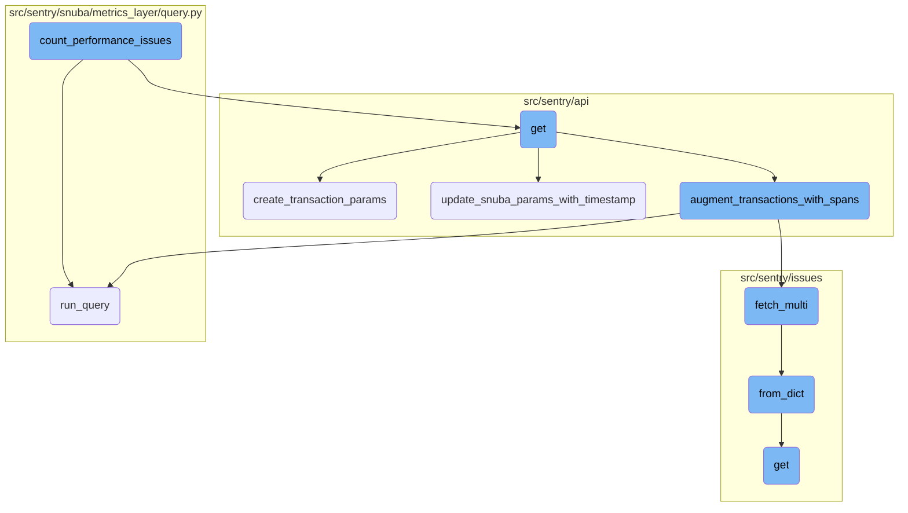
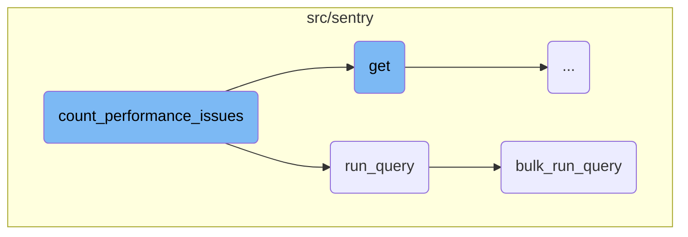
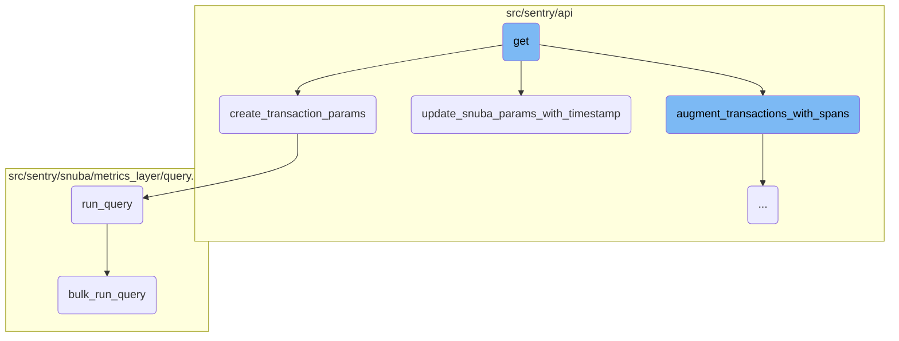
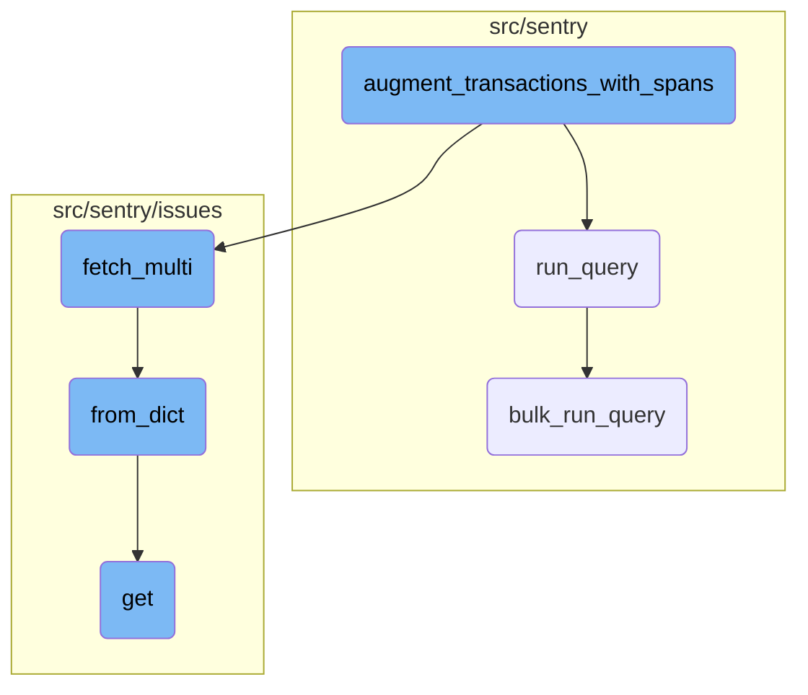

In this document, we will explain the process of counting performance issues related to a specific trace ID. This involves constructing a query, executing it, and processing the results to return the count of performance issues.

The flow starts by constructing a query to search for performance issues related to a specific trace ID. This query is then executed, and the results are processed to count the number of performance issues found. Finally, the count is returned as an integer.

Here is a high level diagram of the flow, showing only the most important functions:



# Flow drill down

First, we'll zoom into this section of the flow:



<SwmSnippet path="/src/sentry/api/endpoints/organization_events_trace.py" line="506">

---

## Counting Performance Issues

The function <SwmToken path="src/sentry/api/endpoints/organization_events_trace.py" pos="506:2:2" line-data="def count_performance_issues(">`count_performance_issues`</SwmToken> is responsible for counting the number of performance issues related to a specific trace ID. It constructs a query using the <SwmToken path="src/sentry/api/endpoints/organization_events_trace.py" pos="511:5:5" line-data="    transaction_query = DiscoverQueryBuilder(">`DiscoverQueryBuilder`</SwmToken> to search for issues in the <SwmToken path="src/sentry/api/endpoints/organization_events_trace.py" pos="512:3:3" line-data="        Dataset.IssuePlatform,">`IssuePlatform`</SwmToken> dataset. The query filters results based on the provided trace ID and counts the total number of groups (performance issues) found. The result is then returned as an integer.

```python
def count_performance_issues(
    trace_id: str,
    params: SnubaParams,
    query_source: QuerySource | None = QuerySource.SENTRY_BACKEND,
) -> int:
    transaction_query = DiscoverQueryBuilder(
        Dataset.IssuePlatform,
        params={},
        snuba_params=params,
        query=f"trace:{trace_id}",
        selected_columns=[],
        limit=MAX_TRACE_SIZE,
    )
    transaction_query.columns.append(Function("count()", alias="total_groups"))
    count = transaction_query.run_query(
        referrer=Referrer.API_TRACE_VIEW_COUNT_PERFORMANCE_ISSUES.value,
        query_source=query_source,
    )
    return count["data"][0].get("total_groups", 0)
```

---

</SwmSnippet>

<SwmSnippet path="/src/sentry/snuba/metrics_layer/query.py" line="143">

---

## Running a Query

The function <SwmToken path="src/sentry/snuba/metrics_layer/query.py" pos="143:2:2" line-data="def run_query(request: Request) -&gt; Mapping[str, Any]:">`run_query`</SwmToken> serves as the entry point for executing a single metrics query in Snuba. It delegates the actual execution to the <SwmToken path="src/sentry/snuba/metrics_layer/query.py" pos="147:3:3" line-data="    return bulk_run_query([request])[0]">`bulk_run_query`</SwmToken> function, passing the request as a list with a single element and returning the first result from the list.

```python
def run_query(request: Request) -> Mapping[str, Any]:
    """
    Entrypoint for executing a metrics query in Snuba.
    """
    return bulk_run_query([request])[0]
```

---

</SwmSnippet>

<SwmSnippet path="/src/sentry/snuba/metrics_layer/query.py" line="81">

---

### Executing Multiple Queries

The function <SwmToken path="src/sentry/snuba/metrics_layer/query.py" pos="81:2:2" line-data="def bulk_run_query(requests: list[Request]) -&gt; list[Mapping[str, Any]]:">`bulk_run_query`</SwmToken> is designed to execute multiple metrics queries in a single request to Snuba. It prepares each query by setting up the metrics query and resolving it. The queries are then executed in bulk using <SwmToken path="src/sentry/api/endpoints/organization_events_trace.py" pos="40:10:10" line-data="from sentry.utils.snuba import bulk_snuba_queries">`bulk_snuba_queries`</SwmToken>. The results are processed and converted to the appropriate format before being returned. This function is crucial for optimizing performance by reducing the number of individual requests sent to Snuba.

```python
def bulk_run_query(requests: list[Request]) -> list[Mapping[str, Any]]:
    """
    Entrypoint for executing a list of metrics queries in Snuba.

    This function is used to execute multiple metrics queries in a single request.
    """
    if not requests:
        return []

    queries = []
    for request in requests:
        request, start, end = _setup_metrics_query(request)
        queries.append([request, start, end])

    logging_tags = {"referrer": request.tenant_ids["referrer"] or "unknown", "lang": "mql"}

    for q in queries:
        q[0], reverse_mappings, mappings = _resolve_metrics_query(q[0], logging_tags)
        q.extend([reverse_mappings, mappings])

    try:
```

---

</SwmSnippet>

Now, lets zoom into this section of the flow:



<SwmSnippet path="/src/sentry/api/endpoints/organization_events_trace.py" line="1045">

---

## Retrieving Trace Data

The <SwmToken path="src/sentry/api/endpoints/organization_events_trace.py" pos="1045:3:3" line-data="    def get(self, request: Request, organization: Organization, trace_id: str) -&gt; HttpResponse:">`get`</SwmToken> function first checks if the feature is enabled for the organization and request. If not, it returns a 404 response. Then, it attempts to get Snuba parameters for querying trace data.

```python
    def get(self, request: Request, organization: Organization, trace_id: str) -> HttpResponse:
        if not self.has_feature(organization, request):
            return Response(status=404)

        try:
            # The trace view isn't useful without global views, so skipping the check here
            snuba_params = self.get_snuba_params(request, organization, check_global_views=False)
        except NoProjects:
            return Response(status=404)
```

---

</SwmSnippet>

<SwmSnippet path="/src/sentry/api/endpoints/organization_events_trace.py" line="1059">

---

## Updating Snuba Parameters

The function <SwmToken path="src/sentry/api/endpoints/organization_events_trace.py" pos="1059:1:1" line-data="        update_snuba_params_with_timestamp(request, snuba_params)">`update_snuba_params_with_timestamp`</SwmToken> is called to update the Snuba parameters with the timestamp from the request. This helps in querying data around a specific event or trace.

```python
        update_snuba_params_with_timestamp(request, snuba_params)

```

---

</SwmSnippet>

<SwmSnippet path="/src/sentry/api/endpoints/organization_events_trace.py" line="1073">

---

## Creating Transaction Parameters

The <SwmToken path="src/sentry/api/endpoints/organization_events_trace.py" pos="1073:5:5" line-data="            transaction_params = create_transaction_params(">`create_transaction_params`</SwmToken> function is called to create parameters for querying transactions. These parameters are used to fetch trace data from Snuba.

```python
            transaction_params = create_transaction_params(
                trace_id, snuba_params, query_source=query_source
            )
```

---

</SwmSnippet>

<SwmSnippet path="/src/sentry/api/endpoints/organization_events_trace.py" line="1087">

---

## Augmenting Transactions with Spans

If spans are used, the <SwmToken path="src/sentry/api/endpoints/organization_events_trace.py" pos="1087:5:5" line-data="                transactions = augment_transactions_with_spans(">`augment_transactions_with_spans`</SwmToken> function is called to add span data to the transactions. This enhances the trace data with additional details.

```python
                transactions = augment_transactions_with_spans(
                    transactions,
                    errors,
                    trace_id,
                    snuba_params,
                    query_source=query_source,
                )
```

---

</SwmSnippet>

<SwmSnippet path="/src/sentry/api/endpoints/organization_events_trace.py" line="1124">

---

## Serializing the Response

Finally, the function serializes the trace data, errors, roots, and other details into a response object and returns it.

```python
        return Response(
            self.serialize(
                limit,
                transactions,
                errors,
                roots,
                warning_extra,
                event_id,
                detailed,
                use_spans,
                query_source=self.get_request_source(request),
            )
        )
```

---

</SwmSnippet>

Now, lets zoom into this section of the flow:



<SwmSnippet path="/src/sentry/api/endpoints/organization_events_trace.py" line="785">

---

## Augmenting transactions with spans

The function <SwmToken path="src/sentry/api/endpoints/organization_events_trace.py" pos="785:2:2" line-data="def augment_transactions_with_spans(">`augment_transactions_with_spans`</SwmToken> augments a list of transactions with additional data such as parent, error, and problem data. It starts by setting up various data structures to track spans, errors, and projects. It then iterates over the errors to pad span <SwmToken path="src/sentry/api/endpoints/organization_events_trace.py" pos="794:15:15" line-data="        trace_parent_spans = set()  # parent span ids of segment spans">`ids`</SwmToken> and collect error spans and project <SwmToken path="src/sentry/api/endpoints/organization_events_trace.py" pos="794:15:15" line-data="        trace_parent_spans = set()  # parent span ids of segment spans">`ids`</SwmToken>. The function adjusts the query time range based on the transaction timestamps and sets up measurements and tags for Sentry. It then iterates over the transactions to collect occurrence data and parent span <SwmToken path="src/sentry/api/endpoints/organization_events_trace.py" pos="794:15:15" line-data="        trace_parent_spans = set()  # parent span ids of segment spans">`ids`</SwmToken>. The function fetches issue occurrences and their offender span <SwmToken path="src/sentry/api/endpoints/organization_events_trace.py" pos="794:15:15" line-data="        trace_parent_spans = set()  # parent span ids of segment spans">`ids`</SwmToken>, creates query parameters, and performs span queries in chunks if necessary. Finally, it links transactions with their parent transactions, performance issues, and errors before returning the augmented transactions.

```python
def augment_transactions_with_spans(
    transactions: Sequence[SnubaTransaction],
    errors: Sequence[SnubaError],
    trace_id: str,
    params: SnubaParams,
    query_source: QuerySource | None = QuerySource.SENTRY_BACKEND,
) -> Sequence[SnubaTransaction]:
    """Augment the list of transactions with parent, error and problem data"""
    with sentry_sdk.start_span(op="augment.transactions", description="setup"):
        trace_parent_spans = set()  # parent span ids of segment spans
        transaction_problem_map: dict[str, SnubaTransaction] = {}
        problem_project_map: dict[int, list[str]] = {}
        issue_occurrences = []
        occurrence_spans: set[str] = set()
        error_spans = set()
        projects = set()
        for error in errors:
            if "trace.span" in error:
                error["trace.span"] = pad_span_id(error["trace.span"])
                error_spans.add(error["trace.span"])
            projects.add(error["project.id"])
```

---

</SwmSnippet>

<SwmSnippet path="/src/sentry/issues/issue_occurrence.py" line="207">

---

### Fetching multiple issue occurrences

The function <SwmToken path="src/sentry/issues/issue_occurrence.py" pos="207:3:3" line-data="    def fetch_multi(cls, ids: Sequence[str], project_id: int) -&gt; list[IssueOccurrence | None]:">`fetch_multi`</SwmToken> retrieves multiple issue occurrences based on their <SwmToken path="src/sentry/issues/issue_occurrence.py" pos="207:8:8" line-data="    def fetch_multi(cls, ids: Sequence[str], project_id: int) -&gt; list[IssueOccurrence | None]:">`ids`</SwmToken> and project ID. It builds storage identifiers for the given <SwmToken path="src/sentry/issues/issue_occurrence.py" pos="207:8:8" line-data="    def fetch_multi(cls, ids: Sequence[str], project_id: int) -&gt; list[IssueOccurrence | None]:">`ids`</SwmToken> and fetches the corresponding data from the nodestore backend. The function then iterates over the results, converting each result to an <SwmToken path="src/sentry/issues/issue_occurrence.py" pos="207:27:27" line-data="    def fetch_multi(cls, ids: Sequence[str], project_id: int) -&gt; list[IssueOccurrence | None]:">`IssueOccurrence`</SwmToken> object using the <SwmToken path="src/sentry/issues/issue_occurrence.py" pos="214:7:7" line-data="                ret.append(IssueOccurrence.from_dict(result))">`from_dict`</SwmToken> method, and returns a list of issue occurrences.

```python
    def fetch_multi(cls, ids: Sequence[str], project_id: int) -> list[IssueOccurrence | None]:
        ids = [cls.build_storage_identifier(id, project_id) for id in ids]
        results = nodestore.backend.get_multi(ids)
        ret: list[IssueOccurrence | None] = []
        for _id in ids:
            result = results.get(_id)
            if result:
                ret.append(IssueOccurrence.from_dict(result))
            else:
                ret.append(None)
        return ret
```

---

</SwmSnippet>

<SwmSnippet path="/src/sentry/issues/issue_occurrence.py" line="126">

---

### Converting data to <SwmToken path="src/sentry/issues/issue_occurrence.py" pos="126:16:16" line-data="    def from_dict(cls, data: IssueOccurrenceData) -&gt; IssueOccurrence:">`IssueOccurrence`</SwmToken>

The function <SwmToken path="src/sentry/issues/issue_occurrence.py" pos="126:3:3" line-data="    def from_dict(cls, data: IssueOccurrenceData) -&gt; IssueOccurrence:">`from_dict`</SwmToken> converts a dictionary of issue occurrence data into an <SwmToken path="src/sentry/issues/issue_occurrence.py" pos="126:16:16" line-data="    def from_dict(cls, data: IssueOccurrenceData) -&gt; IssueOccurrence:">`IssueOccurrence`</SwmToken> object. It handles backwards compatibility by setting default values for missing fields and attempts to parse the assignee actor identifier. The function then creates and returns an <SwmToken path="src/sentry/issues/issue_occurrence.py" pos="126:16:16" line-data="    def from_dict(cls, data: IssueOccurrenceData) -&gt; IssueOccurrence:">`IssueOccurrence`</SwmToken> object with the provided data, including evidence data and display, group type, detection time, and other relevant fields.

```python
    def from_dict(cls, data: IssueOccurrenceData) -> IssueOccurrence:
        from sentry.api.serializers.rest_framework import ValidationError

        # Backwards compatibility - we used to not require this field, so set a default when `None`
        level = data.get("level")
        if not level:
            level = DEFAULT_LEVEL
        culprit = data.get("culprit")
        if not culprit:
            culprit = ""

        assignee = None
        try:
            # Note that this can cause IO, but in practice this will happen only the first time that
            # the occurrence is sent to the issue platform. We then translate to the id and store
            # that, so subsequent fetches won't cause IO.
            assignee = Actor.from_identifier(data.get("assignee"))
        except ValidationError:
            logging.exception("Failed to parse assignee actor identifier")
        except Exception:
            # We never want this to cause parsing an occurrence to fail
```

---

</SwmSnippet>

<SwmSnippet path="/src/sentry/issues/endpoints/project_stacktrace_link.py" line="122">

---

### Getting stacktrace link

The function <SwmToken path="src/sentry/issues/endpoints/project_stacktrace_link.py" pos="122:3:3" line-data="    def get(self, request: Request, project: Project) -&gt; Response:">`get`</SwmToken> handles a request to retrieve a stacktrace link for a given project. It generates the context from the request, validates the filepath, and retrieves integrations for the project. The function serializes the integrations and retrieves sorted code mapping configurations. It then sets up the scope and tags, processes the stacktrace configuration, and records analytics. Finally, it returns a response with the error, configuration, source URL, attempted URL, and serialized integrations.

```python
    def get(self, request: Request, project: Project) -> Response:
        ctx = generate_context(request.GET)
        filepath = ctx["file"]
        if not filepath:
            return Response({"detail": "Filepath is required"}, status=400)

        integrations = integration_service.get_integrations(organization_id=project.organization_id)
        # TODO(meredith): should use get_provider.has_feature() instead once this is
        # no longer feature gated and is added as an IntegrationFeature
        serializer = IntegrationSerializer()
        serialized_integrations = [
            serialize(i, request.user, serializer)
            for i in integrations
            if i.has_feature(IntegrationFeatures.STACKTRACE_LINK)
        ]

        configs = get_sorted_code_mapping_configs(project)
        if not configs:
            return Response(
                {
                    "config": None,
```

---

</SwmSnippet>

&nbsp;

*This is an auto-generated document by Swimm AI 🌊 and has not yet been verified by a human*

<SwmMeta version="3.0.0" repo-id="Z2l0aHViJTNBJTNBc2VudHJ5LWRlbW8tMSUzQSUzQVN3aW1tLURlbW8=" repo-name="sentry-demo-1" doc-type="flows"><sup>Powered by [Swimm](/)</sup></SwmMeta>
