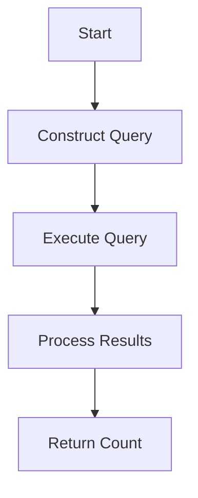

This document will cover the process of counting performance issues related to a specific trace ID. We'll cover:

1. Constructing the query
2. Executing the query
3. Processing the results
4. Returning the count.

Technical document: <SwmLink doc-title="Counting Performance Issues">[Counting Performance Issues](/.swm/counting-performance-issues.g8qh6m6h.sw.md)</SwmLink>

# [Constructing the Query](https://app.swimm.io/repos/Z2l0aHViJTNBJTNBc2VudHJ5LWRlbW8tMSUzQSUzQVN3aW1tLURlbW8=/docs/g8qh6m6h#counting-performance-issues)

The process begins by constructing a query to search for performance issues related to a specific trace ID. This involves creating a query that filters results based on the provided trace ID. The query is designed to search within the IssuePlatform dataset and count the total number of performance issues found. This step ensures that we are looking at the correct set of data related to the trace ID.

# [Executing the Query](https://app.swimm.io/repos/Z2l0aHViJTNBJTNBc2VudHJ5LWRlbW8tMSUzQSUzQVN3aW1tLURlbW8=/docs/g8qh6m6h#running-a-query)

Once the query is constructed, it needs to be executed. This involves sending the query to the data storage system (Snuba) to retrieve the relevant data. The execution step is crucial as it fetches the data that will be processed to count the performance issues. The query is executed in a way that optimizes performance by reducing the number of individual requests sent to Snuba.

# [Processing the Results](https://app.swimm.io/repos/Z2l0aHViJTNBJTNBc2VudHJ5LWRlbW8tMSUzQSUzQVN3aW1tLURlbW8=/docs/g8qh6m6h#executing-multiple-queries)

After the query is executed, the results need to be processed. This involves interpreting the data returned by Snuba and extracting the count of performance issues. The results are processed to ensure that the data is accurate and relevant to the trace ID. This step includes handling any potential errors or discrepancies in the data.

# [Returning the Count](https://app.swimm.io/repos/Z2l0aHViJTNBJTNBc2VudHJ5LWRlbW8tMSUzQSUzQVN3aW1tLURlbW8=/docs/g8qh6m6h#serializing-the-response)

Finally, the count of performance issues is returned as an integer. This step involves packaging the processed data into a format that can be easily understood and used by other parts of the system or by end-users. The count is then made available for further analysis or reporting. This final step ensures that the information is accessible and actionable.

&nbsp;

*This is an auto-generated document by Swimm AI 🌊 and has not yet been verified by a human*

<SwmMeta version="3.0.0" repo-id="Z2l0aHViJTNBJTNBc2VudHJ5LWRlbW8tMSUzQSUzQVN3aW1tLURlbW8=" repo-name="sentry-demo-1" doc-type="product-flows">Powered by [Swimm](/)</SwmMeta>
