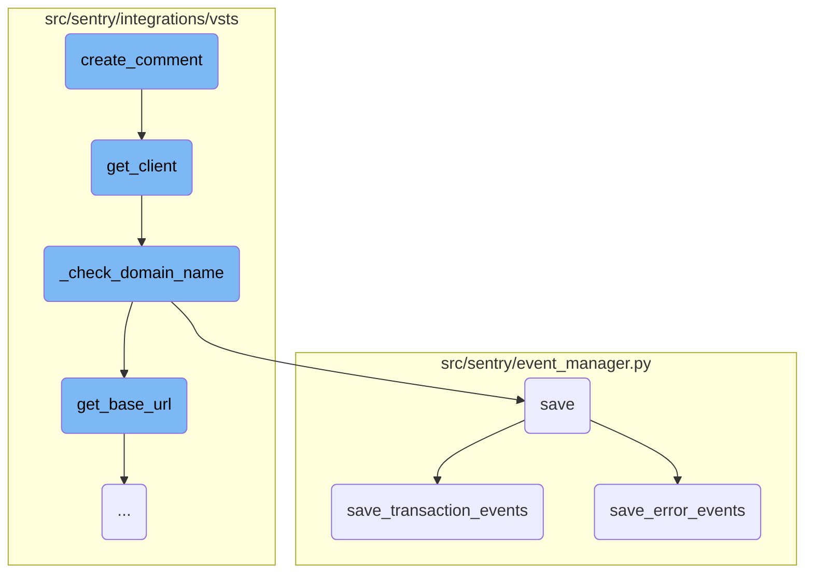
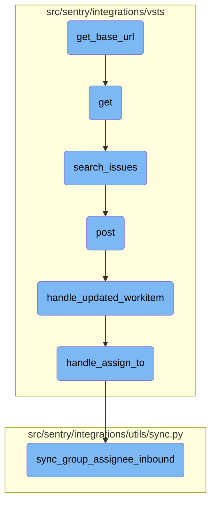

This document explains the process of creating a comment on an issue. The process involves extracting the comment text, formatting it with user attribution, and updating the work item using the client.

The flow starts by extracting the comment text from the provided data. This text is then formatted to include information about the user who made the comment. After formatting, the system updates the relevant work item with this new comment using a client that handles the communication with the external system.

Here is a high level diagram of the flow, showing only the most important functions:

```mermaid
graph TD;
      subgraph src/sentry/integrations/vsts
2aae706e8ccffc0bc4f7e1213604e46967fd13479cf08fac73fa2aac9bc13a04(create_comment):::mainFlowStyle --> 0929df67669e089b92a784392a4caa0c21baeadfd85263fa34c49a09c193b3d1(get_client):::mainFlowStyle
end

subgraph src/sentry/integrations/vsts
0929df67669e089b92a784392a4caa0c21baeadfd85263fa34c49a09c193b3d1(get_client):::mainFlowStyle --> 7f10adeb955518d0b9ce9a18ae73cf60c8e87d6b2b7bc87f5b2addc217981d21(_check_domain_name):::mainFlowStyle
end

subgraph src/sentry/event_manager.py
7f10adeb955518d0b9ce9a18ae73cf60c8e87d6b2b7bc87f5b2addc217981d21(_check_domain_name):::mainFlowStyle --> 5086692df24257d76a0adf892eba843feac14033d92b4a32022b125d5a725f9b(save)
end

subgraph src/sentry/integrations/vsts
7f10adeb955518d0b9ce9a18ae73cf60c8e87d6b2b7bc87f5b2addc217981d21(_check_domain_name):::mainFlowStyle --> 3a40802301e1642b0a2d0ce06ddee674da6a7fd8353ad71b1c436be19e6563d6(get_base_url):::mainFlowStyle
end

subgraph src/sentry/integrations/vsts
3a40802301e1642b0a2d0ce06ddee674da6a7fd8353ad71b1c436be19e6563d6(get_base_url):::mainFlowStyle --> c9f1b6abd5b86b248deafac3aa63eb8d055350bf49cbe100c54a0d94ee13361a(get):::mainFlowStyle
end

subgraph src/sentry/integrations/vsts
c9f1b6abd5b86b248deafac3aa63eb8d055350bf49cbe100c54a0d94ee13361a(get):::mainFlowStyle --> fc4a2a7e5f1b5a9d6230778920f9b62f4b7f3caa80ebd97c89444e007895b382(search_issues):::mainFlowStyle
end

subgraph src/sentry/integrations/vsts
fc4a2a7e5f1b5a9d6230778920f9b62f4b7f3caa80ebd97c89444e007895b382(search_issues):::mainFlowStyle --> a0445eff32744589c21cfe40b46d7b4346893653994134be4a340aaaf32b3f6d(post):::mainFlowStyle
end

subgraph src/sentry/integrations/vsts
a0445eff32744589c21cfe40b46d7b4346893653994134be4a340aaaf32b3f6d(post):::mainFlowStyle --> 66e049c83c1ca3a7a23933e320651f77196243d817b62c1a401dfd7205f9a929(handle_updated_workitem):::mainFlowStyle
end

subgraph src/sentry/integrations/vsts
66e049c83c1ca3a7a23933e320651f77196243d817b62c1a401dfd7205f9a929(handle_updated_workitem):::mainFlowStyle --> 66c307c65db74ab637ed0ed1623cc34d22110f0911938f86a52ccb8f5e8009dd(handle_assign_to):::mainFlowStyle
end

subgraph src/sentry/integrations/utils/sync.py
66c307c65db74ab637ed0ed1623cc34d22110f0911938f86a52ccb8f5e8009dd(handle_assign_to):::mainFlowStyle --> dd6f2c6555a3ad00a0aed3ab34055c7026063e3a2a74b2537fcf2a1223ffa577(sync_group_assignee_inbound):::mainFlowStyle
end


      classDef mainFlowStyle color:#000000,fill:#7CB9F4
classDef rootsStyle color:#000000,fill:#00FFF4
classDef Style1 color:#000000,fill:#00FFAA
classDef Style2 color:#000000,fill:#FFFF00
classDef Style3 color:#000000,fill:#AA7CB9

%% Swimm:
%% graph TD;
%%       subgraph <SwmPath>[src/sentry/integrations/vsts/](src/sentry/integrations/vsts/)</SwmPath>
%% 2aae706e8ccffc0bc4f7e1213604e46967fd13479cf08fac73fa2aac9bc13a04(create_comment):::mainFlowStyle --> 0929df67669e089b92a784392a4caa0c21baeadfd85263fa34c49a09c193b3d1(get_client):::mainFlowStyle
%% end
%% 
%% subgraph <SwmPath>[src/sentry/integrations/vsts/](src/sentry/integrations/vsts/)</SwmPath>
%% 0929df67669e089b92a784392a4caa0c21baeadfd85263fa34c49a09c193b3d1(get_client):::mainFlowStyle --> 7f10adeb955518d0b9ce9a18ae73cf60c8e87d6b2b7bc87f5b2addc217981d21(_check_domain_name):::mainFlowStyle
%% end
%% 
%% subgraph <SwmPath>[src/sentry/event_manager.py](src/sentry/event_manager.py)</SwmPath>
%% 7f10adeb955518d0b9ce9a18ae73cf60c8e87d6b2b7bc87f5b2addc217981d21(_check_domain_name):::mainFlowStyle --> 5086692df24257d76a0adf892eba843feac14033d92b4a32022b125d5a725f9b(save)
%% end
%% 
%% subgraph <SwmPath>[src/sentry/integrations/vsts/](src/sentry/integrations/vsts/)</SwmPath>
%% 7f10adeb955518d0b9ce9a18ae73cf60c8e87d6b2b7bc87f5b2addc217981d21(_check_domain_name):::mainFlowStyle --> 3a40802301e1642b0a2d0ce06ddee674da6a7fd8353ad71b1c436be19e6563d6(get_base_url):::mainFlowStyle
%% end
%% 
%% subgraph <SwmPath>[src/sentry/integrations/vsts/](src/sentry/integrations/vsts/)</SwmPath>
%% 3a40802301e1642b0a2d0ce06ddee674da6a7fd8353ad71b1c436be19e6563d6(get_base_url):::mainFlowStyle --> c9f1b6abd5b86b248deafac3aa63eb8d055350bf49cbe100c54a0d94ee13361a(get):::mainFlowStyle
%% end
%% 
%% subgraph <SwmPath>[src/sentry/integrations/vsts/](src/sentry/integrations/vsts/)</SwmPath>
%% c9f1b6abd5b86b248deafac3aa63eb8d055350bf49cbe100c54a0d94ee13361a(get):::mainFlowStyle --> fc4a2a7e5f1b5a9d6230778920f9b62f4b7f3caa80ebd97c89444e007895b382(search_issues):::mainFlowStyle
%% end
%% 
%% subgraph <SwmPath>[src/sentry/integrations/vsts/](src/sentry/integrations/vsts/)</SwmPath>
%% fc4a2a7e5f1b5a9d6230778920f9b62f4b7f3caa80ebd97c89444e007895b382(search_issues):::mainFlowStyle --> a0445eff32744589c21cfe40b46d7b4346893653994134be4a340aaaf32b3f6d(post):::mainFlowStyle
%% end
%% 
%% subgraph <SwmPath>[src/sentry/integrations/vsts/](src/sentry/integrations/vsts/)</SwmPath>
%% a0445eff32744589c21cfe40b46d7b4346893653994134be4a340aaaf32b3f6d(post):::mainFlowStyle --> 66e049c83c1ca3a7a23933e320651f77196243d817b62c1a401dfd7205f9a929(handle_updated_workitem):::mainFlowStyle
%% end
%% 
%% subgraph <SwmPath>[src/sentry/integrations/vsts/](src/sentry/integrations/vsts/)</SwmPath>
%% 66e049c83c1ca3a7a23933e320651f77196243d817b62c1a401dfd7205f9a929(handle_updated_workitem):::mainFlowStyle --> 66c307c65db74ab637ed0ed1623cc34d22110f0911938f86a52ccb8f5e8009dd(handle_assign_to):::mainFlowStyle
%% end
%% 
%% subgraph <SwmPath>[src/sentry/integrations/utils/sync.py](src/sentry/integrations/utils/sync.py)</SwmPath>
%% 66c307c65db74ab637ed0ed1623cc34d22110f0911938f86a52ccb8f5e8009dd(handle_assign_to):::mainFlowStyle --> dd6f2c6555a3ad00a0aed3ab34055c7026063e3a2a74b2537fcf2a1223ffa577(sync_group_assignee_inbound):::mainFlowStyle
%% end
%% 
%% 
%%       classDef mainFlowStyle color:#000000,fill:#7CB9F4
%% classDef rootsStyle color:#000000,fill:#00FFF4
%% classDef Style1 color:#000000,fill:#00FFAA
%% classDef Style2 color:#000000,fill:#FFFF00
%% classDef Style3 color:#000000,fill:#AA7CB9
```



# Flow drill down

First, we'll zoom into this section of the flow:



<SwmSnippet path="/src/sentry/integrations/vsts/issues.py" line="343">

---

## Creating a Comment

The <SwmToken path="src/sentry/integrations/vsts/issues.py" pos="343:3:3" line-data="    def create_comment(self, issue_id: int, user_id: int, group_note: Activity) -&gt; Response:">`create_comment`</SwmToken> function is responsible for creating a comment on a specific issue. It extracts the comment text from the <SwmToken path="src/sentry/integrations/vsts/issues.py" pos="343:20:20" line-data="    def create_comment(self, issue_id: int, user_id: int, group_note: Activity) -&gt; Response:">`group_note`</SwmToken> data, formats it with user attribution, and then updates the work item using the <SwmToken path="src/sentry/integrations/vsts/issues.py" pos="346:9:9" line-data="        return self.get_client().update_work_item(issue_id, comment=quoted_comment)">`update_work_item`</SwmToken> method from the client.

```python
    def create_comment(self, issue_id: int, user_id: int, group_note: Activity) -> Response:
        comment = group_note.data["text"]
        quoted_comment = self.create_comment_attribution(user_id, comment)
        return self.get_client().update_work_item(issue_id, comment=quoted_comment)
```

---

</SwmSnippet>

<SwmSnippet path="/src/sentry/integrations/vsts/integration.py" line="134">

---

## Getting the Client

The <SwmToken path="src/sentry/integrations/vsts/integration.py" pos="134:3:3" line-data="    def get_client(self) -&gt; VstsApiClient:">`get_client`</SwmToken> function initializes and returns a <SwmToken path="src/sentry/integrations/vsts/integration.py" pos="134:10:10" line-data="    def get_client(self) -&gt; VstsApiClient:">`VstsApiClient`</SwmToken> instance. It ensures that the necessary identity and organization integration details are available and valid before creating the client.

```python
    def get_client(self) -> VstsApiClient:
        base_url = self.instance
        if SiloMode.get_current_mode() != SiloMode.REGION:
            if self.default_identity is None:
                self.default_identity = self.get_default_identity()
            self._check_domain_name(self.default_identity)

        if self.org_integration is None:
            raise Exception("self.org_integration is not defined")
        if self.org_integration.default_auth_id is None:
            raise Exception("self.org_integration.default_auth_id is not defined")
        return VstsApiClient(
            base_url=base_url,
            oauth_redirect_url=VstsIntegrationProvider.oauth_redirect_url,
            org_integration_id=self.org_integration.id,
            identity_id=self.org_integration.default_auth_id,
        )
```

---

</SwmSnippet>

<SwmSnippet path="/src/sentry/integrations/vsts/integration.py" line="358">

---

### Checking Domain Name

The <SwmToken path="src/sentry/integrations/vsts/integration.py" pos="358:3:3" line-data="    def _check_domain_name(self, default_identity: RpcIdentity) -&gt; None:">`_check_domain_name`</SwmToken> function verifies the domain name format in the integration metadata. If the domain name is not in the correct format, it retrieves the base URL using the access token and updates the metadata.

```python
    def _check_domain_name(self, default_identity: RpcIdentity) -> None:
        if re.match("^https://.+/$", self.model.metadata["domain_name"]):
            return

        base_url = VstsIntegrationProvider.get_base_url(
            default_identity.data["access_token"], self.model.external_id
        )
        self.model.metadata["domain_name"] = base_url
        self.model.save()
```

---

</SwmSnippet>

<SwmSnippet path="/src/sentry/event_manager.py" line="448">

---

## Saving Events

The <SwmToken path="src/sentry/event_manager.py" pos="448:3:3" line-data="    def save(">`save`</SwmToken> function processes and saves events. It normalizes the event data, associates it with the relevant project and organization, and then saves the event to the event stream. Depending on the event type, it delegates the saving process to either <SwmToken path="src/sentry/event_manager.py" pos="3040:2:2" line-data="def save_transaction_events(jobs: Sequence[Job], projects: ProjectsMapping) -&gt; Sequence[Job]:">`save_transaction_events`</SwmToken> or <SwmToken path="src/sentry/event_manager.py" pos="544:3:3" line-data="    def save_error_events(">`save_error_events`</SwmToken>.

```python
    def save(
        self,
        project_id: int | None,
        raw: bool = False,
        assume_normalized: bool = False,
        start_time: float | None = None,
        cache_key: str | None = None,
        skip_send_first_transaction: bool = False,
        has_attachments: bool = False,
    ) -> Event:
        """
        After normalizing and processing an event, save adjacent models such as
        releases and environments to postgres and write the event into
        eventstream. From there it will be picked up by Snuba and
        post-processing.

        We re-insert events with duplicate IDs into Snuba, which is responsible
        for deduplicating events. Since deduplication in Snuba is on the primary
        key (based on event ID, project ID and day), events with same IDs are only
        deduplicated if their timestamps fall on the same day. The latest event
        always wins and overwrites the value of events received earlier in that day.
```

---

</SwmSnippet>

<SwmSnippet path="/src/sentry/event_manager.py" line="3040">

---

### Saving Transaction Events

The <SwmToken path="src/sentry/event_manager.py" pos="3040:2:2" line-data="def save_transaction_events(jobs: Sequence[Job], projects: ProjectsMapping) -&gt; Sequence[Job]:">`save_transaction_events`</SwmToken> function handles the saving of transaction events. It performs various operations such as creating releases, deriving tags, calculating span grouping, and inserting the events into the event stream.

```python
def save_transaction_events(jobs: Sequence[Job], projects: ProjectsMapping) -> Sequence[Job]:
    organization_ids = {project.organization_id for project in projects.values()}
    organizations = {o.id: o for o in Organization.objects.get_many_from_cache(organization_ids)}

    for project in projects.values():
        try:
            project.set_cached_field_value("organization", organizations[project.organization_id])
        except KeyError:
            continue

    set_measurement(measurement_name="jobs", value=len(jobs))
    set_measurement(measurement_name="projects", value=len(projects))

    _get_or_create_release_many(jobs, projects)
    _get_event_user_many(jobs, projects)
    _derive_plugin_tags_many(jobs, projects)
    _derive_interface_tags_many(jobs)
    _calculate_span_grouping(jobs, projects)
    _materialize_metadata_many(jobs)
    _get_or_create_environment_many(jobs, projects)
    _get_or_create_release_associated_models(jobs, projects)
```

---

</SwmSnippet>

<SwmSnippet path="/src/sentry/event_manager.py" line="544">

---

### Saving Error Events

The <SwmToken path="src/sentry/event_manager.py" pos="544:3:3" line-data="    def save_error_events(">`save_error_events`</SwmToken> function manages the saving of error events. It processes the event data, assigns the event to a group, creates necessary models, and inserts the event into the event stream. It also handles attachments and tracks event outcomes.

```python
    def save_error_events(
        self,
        project: Project,
        job: Job,
        projects: ProjectsMapping,
        metric_tags: MutableTags,
        raw: bool = False,
        cache_key: str | None = None,
        has_attachments: bool = False,
    ) -> Event:
        jobs = [job]

        if is_sample_event(job):
            logger.info(
                "save_error_events: processing sample event",
                extra={
                    "event.id": job["event"].event_id,
                    "project_id": project.id,
                    "sample_event": True,
                },
            )
```

---

</SwmSnippet>

Now, lets zoom into this section of the flow:



<SwmSnippet path="/src/sentry/integrations/vsts/integration.py" line="540">

---

## Constructing the Base URL

The function <SwmToken path="src/sentry/integrations/vsts/integration.py" pos="540:3:3" line-data="    def get_base_url(cls, access_token: str, account_id: int) -&gt; str | None:">`get_base_url`</SwmToken> constructs the base URL by making an HTTP GET request to the VSTS account lookup URL. It uses the provided <SwmToken path="src/sentry/integrations/vsts/integration.py" pos="540:8:8" line-data="    def get_base_url(cls, access_token: str, account_id: int) -&gt; str | None:">`access_token`</SwmToken> and <SwmToken path="src/sentry/integrations/vsts/integration.py" pos="540:14:14" line-data="    def get_base_url(cls, access_token: str, account_id: int) -&gt; str | None:">`account_id`</SwmToken> to authenticate the request. If the request is successful, it extracts and returns the <SwmToken path="src/sentry/integrations/vsts/integration.py" pos="552:10:10" line-data="            return response.json()[&quot;locationUrl&quot;]">`locationUrl`</SwmToken> from the response JSON.

```python
    def get_base_url(cls, access_token: str, account_id: int) -> str | None:
        """TODO(mgaeta): This should not be allowed to return None."""
        url = VstsIntegrationProvider.VSTS_ACCOUNT_LOOKUP_URL % account_id
        with http.build_session() as session:
            response = session.get(
                url,
                headers={
                    "Content-Type": "application/json",
                    "Authorization": f"Bearer {access_token}",
                },
            )
        if response.status_code == 200:
            return response.json()["locationUrl"]

        logger.info("vsts.get_base_url", extra={"responseCode": response.status_code})
        return None
```

---

</SwmSnippet>

&nbsp;

*This is an auto-generated document by Swimm AI 🌊 and has not yet been verified by a human*

<SwmMeta version="3.0.0" repo-id="Z2l0aHViJTNBJTNBc2VudHJ5LWRlbW8tMSUzQSUzQVN3aW1tLURlbW8=" repo-name="sentry-demo-1" doc-type="flows"><sup>Powered by [Swimm](/)</sup></SwmMeta>
