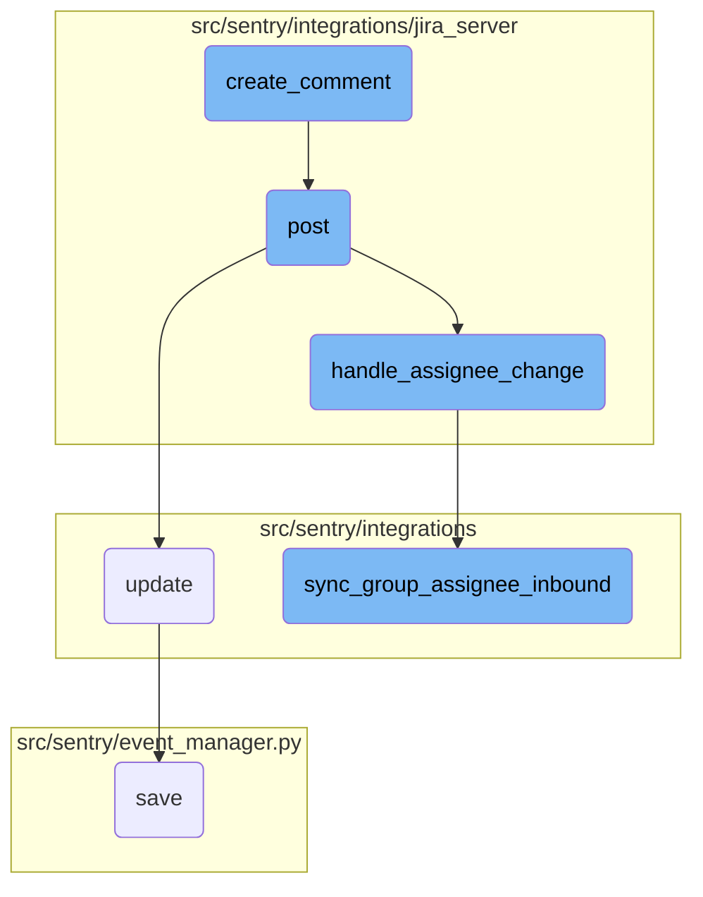

In this document, we will explain the process of creating a comment on a Jira issue using Sentry integration. The process involves several steps, including posting the comment, handling assignee changes, and synchronizing the group assignee.

The flow starts with creating a comment on a Jira issue. This is done by sending the comment data to the Jira server. Once the comment is posted, the system checks if there are any changes in the assignee of the issue. If there are changes, it retrieves the new assignee's email and updates the group assignee accordingly. This ensures that the correct user is assigned to the group based on the new assignee's email.

# Flow drill down



<SwmSnippet path="/src/sentry/integrations/jira_server/client.py" line="113">

---

## Creating a Comment

The <SwmToken path="src/sentry/integrations/jira_server/client.py" pos="113:3:3" line-data="    def create_comment(self, issue_key, comment):">`create_comment`</SwmToken> function is responsible for creating a comment on a specific issue in Jira. It uses the <SwmToken path="src/sentry/integrations/jira_server/client.py" pos="114:5:5" line-data="        return self.post(self.COMMENTS_URL % issue_key, data={&quot;body&quot;: comment})">`post`</SwmToken> method to send the comment data to the Jira server.

```python
    def create_comment(self, issue_key, comment):
        return self.post(self.COMMENTS_URL % issue_key, data={"body": comment})
```

---

</SwmSnippet>

<SwmSnippet path="/src/sentry/integrations/jira_server/webhooks.py" line="64">

---

## Posting the Comment

The <SwmToken path="src/sentry/integrations/jira_server/webhooks.py" pos="64:3:3" line-data="    def post(self, request: Request, token, *args, **kwargs) -&gt; Response:">`post`</SwmToken> function handles incoming webhook requests from Jira. It validates the token, processes the request data, and calls <SwmToken path="src/sentry/integrations/jira_server/utils/api.py" pos="25:2:2" line-data="def handle_assignee_change(">`handle_assignee_change`</SwmToken> to manage any changes in the assignee.

```python
    def post(self, request: Request, token, *args, **kwargs) -> Response:
        clear_tags_and_context()
        extra: dict[str, object] = {}
        try:
            integration = get_integration_from_token(token)
            extra["integration_id"] = integration.id
        except ValueError as err:
            extra.update({"token": token, "error": str(err)})
            logger.warning("token-validation-error", extra=extra)
            metrics.incr("jira_server.webhook.invalid_token")
            return self.respond(status=400)

        data = request.data

        # Note: If we ever process more webhooks from jira server
        # we also need to update JiraServerRequestParser
        if not data.get("changelog"):
            logger.info("missing-changelog", extra=extra)
            return self.respond()

        try:
```

---

</SwmSnippet>

<SwmSnippet path="/src/sentry/integrations/jira_server/utils/api.py" line="25">

---

### Handling Assignee Change

The <SwmToken path="src/sentry/integrations/jira_server/utils/api.py" pos="25:2:2" line-data="def handle_assignee_change(">`handle_assignee_change`</SwmToken> function checks if the assignee has changed in the issue's changelog. If the assignee has changed, it retrieves the new assignee's email and calls <SwmToken path="src/sentry/integrations/jira_server/utils/api.py" pos="42:1:1" line-data="        sync_group_assignee_inbound(integration, None, issue_key, assign=False)">`sync_group_assignee_inbound`</SwmToken> to update the group assignee accordingly.

```python
def handle_assignee_change(
    integration: RpcIntegration | Integration,
    data: Mapping[str, Any],
) -> None:
    assignee_changed = any(
        item for item in data["changelog"]["items"] if item["field"] == "assignee"
    )
    if not assignee_changed:
        return

    fields = data["issue"]["fields"]

    # If there is no assignee, assume it was unassigned.
    assignee = fields.get("assignee")
    issue_key = data["issue"]["key"]

    if assignee is None:
        sync_group_assignee_inbound(integration, None, issue_key, assign=False)
        return

    email = get_assignee_email(integration, assignee)
```

---

</SwmSnippet>

<SwmSnippet path="/src/sentry/integrations/utils/sync.py" line="64">

---

### Synchronizing Group Assignee

The <SwmToken path="src/sentry/integrations/utils/sync.py" pos="64:2:2" line-data="def sync_group_assignee_inbound(">`sync_group_assignee_inbound`</SwmToken> function updates the group assignee based on the new assignee's email. It checks if the user is a member of the project and assigns the group to the user if they are found.

```python
def sync_group_assignee_inbound(
    integration: RpcIntegration,
    email: str | None,
    external_issue_key: str,
    assign: bool = True,
) -> Sequence[Group]:
    """
    Given an integration, user email address and an external issue key,
    assign linked groups to matching users. Checks project membership.
    Returns a list of groups that were successfully assigned.
    """

    logger = logging.getLogger(f"sentry.integrations.{integration.provider}")

    orgs_with_sync_enabled = where_should_sync(integration, "inbound_assignee")
    affected_groups = Group.objects.get_groups_by_external_issue(
        integration,
        orgs_with_sync_enabled,
        external_issue_key,
    )
    log_context = {
```

---

</SwmSnippet>

&nbsp;

*This is an auto-generated document by Swimm AI 🌊 and has not yet been verified by a human*

<SwmMeta version="3.0.0" repo-id="Z2l0aHViJTNBJTNBc2VudHJ5LWRlbW8tMSUzQSUzQVN3aW1tLURlbW8=" repo-name="sentry-demo-1" doc-type="flows"><sup>Powered by [Swimm](/)</sup></SwmMeta>
