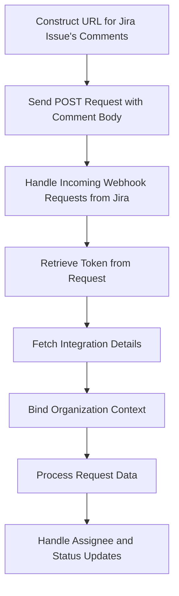

This document will cover the process of creating a comment in a Jira issue. We'll cover:

1. Constructing the URL for the Jira issue's comments
2. Sending a POST request with the comment body
3. Handling incoming webhook requests from Jira

Technical document: <SwmLink doc-title="Creating a Comment in Jira">[Creating a Comment in Jira](/.swm/creating-a-comment-in-jira.w2n5rcak.sw.md)</SwmLink>

# [Constructing the URL for Jira Issue's Comments](https://app.swimm.io/repos/Z2l0aHViJTNBJTNBc2VudHJ5LWRlbW8tMSUzQSUzQVN3aW1tLURlbW8=/docs/w2n5rcak#constructing-the-url)

The process begins by constructing the URL for the Jira issue's comments. This URL is essential as it directs where the comment will be posted within Jira. The URL is constructed using the issue key, which uniquely identifies the Jira issue. This step ensures that the comment is added to the correct issue.

# [Sending a POST Request with the Comment Body](https://app.swimm.io/repos/Z2l0aHViJTNBJTNBc2VudHJ5LWRlbW8tMSUzQSUzQVN3aW1tLURlbW8=/docs/w2n5rcak#posting-the-comment)

Once the URL is constructed, a POST request is sent with the comment body. This request includes the actual content of the comment that needs to be added to the Jira issue. The POST request ensures that the comment is transmitted to Jira and appended to the specified issue. This step is crucial for adding the comment to the issue.

# [Handling Incoming Webhook Requests from Jira](https://app.swimm.io/repos/Z2l0aHViJTNBJTNBc2VudHJ5LWRlbW8tMSUzQSUzQVN3aW1tLURlbW8=/docs/w2n5rcak#handling-webhook-requests)

When Jira sends a webhook request, it needs to be handled appropriately. The first step in this process is to retrieve the token from the request. This token is used to authenticate and fetch the integration details. The integration details provide context about the Jira instance and the specific integration being used. This step ensures that the request is processed in the correct organizational context.

# [Binding Organization Context](https://app.swimm.io/repos/Z2l0aHViJTNBJTNBc2VudHJ5LWRlbW8tMSUzQSUzQVN3aW1tLURlbW8=/docs/w2n5rcak#binding-organization-context)

Binding the organization context involves associating the integration with the relevant organizational data. This step ensures that the integration's organizational data is correctly set up for further processing. It involves retrieving the associated organizations and binding the appropriate context. This step is essential for maintaining the integrity of the organizational data during the comment creation process.

# [Processing Request Data](https://app.swimm.io/repos/Z2l0aHViJTNBJTNBc2VudHJ5LWRlbW8tMSUzQSUzQVN3aW1tLURlbW8=/docs/w2n5rcak#processing-request-data)

The request data from the webhook is then processed to handle any changes, such as assignee and status updates. This involves examining the changelog to determine if the assignee has changed. If the assignee has changed, the new assignee's email is retrieved, and the assignment is updated accordingly. This step ensures that any changes to the issue are accurately reflected in the integration.

&nbsp;

*This is an auto-generated document by Swimm AI 🌊 and has not yet been verified by a human*

<SwmMeta version="3.0.0" repo-id="Z2l0aHViJTNBJTNBc2VudHJ5LWRlbW8tMSUzQSUzQVN3aW1tLURlbW8=" repo-name="sentry-demo-1" doc-type="product-flows">Powered by [Swimm](/)</SwmMeta>
