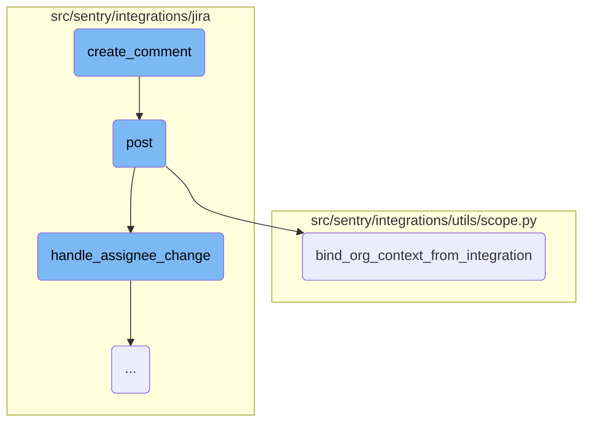
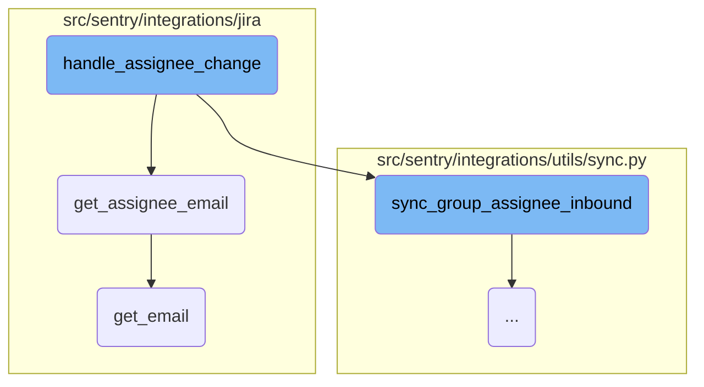
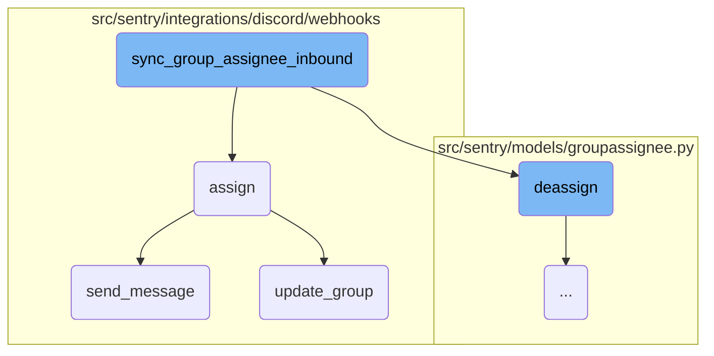
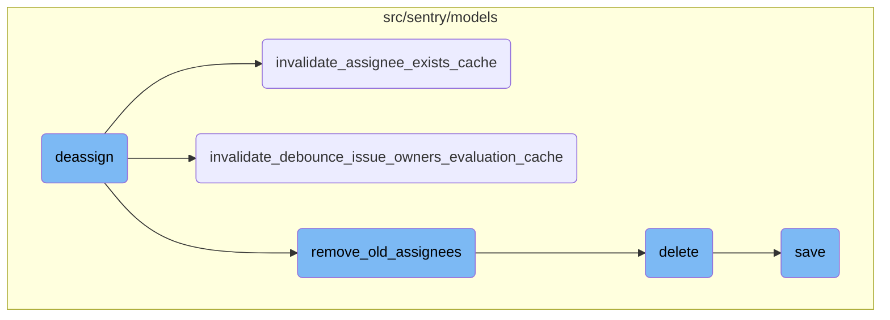

This document explains the process of creating a comment in a Jira issue. The process involves constructing the URL for the issue's comments, sending a POST request with the comment body, and handling the incoming webhook requests from Jira.

The flow starts with constructing the URL for the Jira issue's comments. Then, a POST request is sent with the comment body to add the comment to the issue. When a webhook request is received from Jira, the token is retrieved from the request, and the integration details are fetched. The organization context is then bound, and the request data is processed to handle changes such as assignee and status updates.

Here is a high level diagram of the flow, showing only the most important functions:

```mermaid
graph TD;
      subgraph src/sentry/integrations/jira
8f327db8813eb2f1cad8dde0a604c8da5a440870d4f1af2ff8919b2d6100bc68(create_comment):::mainFlowStyle --> 96574e8cc7d4a2177185cfe95b90c6244b094cf11ac72525aade0784caab9e29(post):::mainFlowStyle
end

subgraph src/sentry/integrations/utils
96574e8cc7d4a2177185cfe95b90c6244b094cf11ac72525aade0784caab9e29(post):::mainFlowStyle --> b04db465ffac116e748afde54434a5ffafa80366538156b166f6606fa6d66901(bind_org_context_from_integration)
end

subgraph src/sentry/integrations/jira
96574e8cc7d4a2177185cfe95b90c6244b094cf11ac72525aade0784caab9e29(post):::mainFlowStyle --> f93a3d132c7300bf133fb93506fe05bbbecae76bc6af253ac1560ab02575f64e(handle_assignee_change):::mainFlowStyle
end

subgraph src/sentry/integrations/jira
f93a3d132c7300bf133fb93506fe05bbbecae76bc6af253ac1560ab02575f64e(handle_assignee_change):::mainFlowStyle --> 79ce65a6a6a07311625395fc447b0dfacf2dc4304cb2a500c016341063d485b6(get_assignee_email)
end

subgraph src/sentry/integrations/utils
f93a3d132c7300bf133fb93506fe05bbbecae76bc6af253ac1560ab02575f64e(handle_assignee_change):::mainFlowStyle --> dd6f2c6555a3ad00a0aed3ab34055c7026063e3a2a74b2537fcf2a1223ffa577(sync_group_assignee_inbound):::mainFlowStyle
end

subgraph src/sentry/integrations/discord/webhooks/message_component.py
dd6f2c6555a3ad00a0aed3ab34055c7026063e3a2a74b2537fcf2a1223ffa577(sync_group_assignee_inbound):::mainFlowStyle --> 56621b0838f35e2e3d298b3ec08199d7d5798cf4ceebb767aed231b8ab67c192(assign)
end

subgraph src/sentry/models
dd6f2c6555a3ad00a0aed3ab34055c7026063e3a2a74b2537fcf2a1223ffa577(sync_group_assignee_inbound):::mainFlowStyle --> c745dbcbd32c9f5374c257f26bdc9092c08fc103acaae49568a75a0568d76364(deassign):::mainFlowStyle
end

subgraph src/sentry/models
c745dbcbd32c9f5374c257f26bdc9092c08fc103acaae49568a75a0568d76364(deassign):::mainFlowStyle --> 01368d88a3a0e24a1e435d13ebf77b722fb8e80a4bad8dc3a1eb5e0fcc324d55(invalidate_assignee_exists_cache)
end

subgraph src/sentry/models
c745dbcbd32c9f5374c257f26bdc9092c08fc103acaae49568a75a0568d76364(deassign):::mainFlowStyle --> 47f1197195f87c2f55b9fd40c3e093cc1d5ae83dd81f087492464d748751e0f9(invalidate_debounce_issue_owners_evaluation_cache)
end

subgraph src/sentry/models
c745dbcbd32c9f5374c257f26bdc9092c08fc103acaae49568a75a0568d76364(deassign):::mainFlowStyle --> 65e09c39cf502e9436df0fb68ec2e3dd327ca3ce30e26896c68f31aca5077bc4(remove_old_assignees):::mainFlowStyle
end

subgraph src/sentry/models
65e09c39cf502e9436df0fb68ec2e3dd327ca3ce30e26896c68f31aca5077bc4(remove_old_assignees):::mainFlowStyle --> b48d8e567c3071c40fb0a41cd3b4749edf659e57d1580c2cd7d686738dd2fa86(delete):::mainFlowStyle
end

subgraph src/sentry/models
b48d8e567c3071c40fb0a41cd3b4749edf659e57d1580c2cd7d686738dd2fa86(delete):::mainFlowStyle --> e428c3061e6be3bd5b6c2e853ddbf5de95dd22c84bdedc018937dc5f1548a2c3(save):::mainFlowStyle
end


      classDef mainFlowStyle color:#000000,fill:#7CB9F4
classDef rootsStyle color:#000000,fill:#00FFF4
classDef Style1 color:#000000,fill:#00FFAA
classDef Style2 color:#000000,fill:#FFFF00
classDef Style3 color:#000000,fill:#AA7CB9

%% Swimm:
%% graph TD;
%%       subgraph <SwmPath>[src/sentry/integrations/jira/](src/sentry/integrations/jira/)</SwmPath>
%% 8f327db8813eb2f1cad8dde0a604c8da5a440870d4f1af2ff8919b2d6100bc68(create_comment):::mainFlowStyle --> 96574e8cc7d4a2177185cfe95b90c6244b094cf11ac72525aade0784caab9e29(post):::mainFlowStyle
%% end
%% 
%% subgraph <SwmPath>[src/sentry/integrations/utils/](src/sentry/integrations/utils/)</SwmPath>
%% 96574e8cc7d4a2177185cfe95b90c6244b094cf11ac72525aade0784caab9e29(post):::mainFlowStyle --> b04db465ffac116e748afde54434a5ffafa80366538156b166f6606fa6d66901(bind_org_context_from_integration)
%% end
%% 
%% subgraph <SwmPath>[src/sentry/integrations/jira/](src/sentry/integrations/jira/)</SwmPath>
%% 96574e8cc7d4a2177185cfe95b90c6244b094cf11ac72525aade0784caab9e29(post):::mainFlowStyle --> f93a3d132c7300bf133fb93506fe05bbbecae76bc6af253ac1560ab02575f64e(handle_assignee_change):::mainFlowStyle
%% end
%% 
%% subgraph <SwmPath>[src/sentry/integrations/jira/](src/sentry/integrations/jira/)</SwmPath>
%% f93a3d132c7300bf133fb93506fe05bbbecae76bc6af253ac1560ab02575f64e(handle_assignee_change):::mainFlowStyle --> 79ce65a6a6a07311625395fc447b0dfacf2dc4304cb2a500c016341063d485b6(get_assignee_email)
%% end
%% 
%% subgraph <SwmPath>[src/sentry/integrations/utils/](src/sentry/integrations/utils/)</SwmPath>
%% f93a3d132c7300bf133fb93506fe05bbbecae76bc6af253ac1560ab02575f64e(handle_assignee_change):::mainFlowStyle --> dd6f2c6555a3ad00a0aed3ab34055c7026063e3a2a74b2537fcf2a1223ffa577(sync_group_assignee_inbound):::mainFlowStyle
%% end
%% 
%% subgraph <SwmPath>[src/sentry/integrations/discord/webhooks/message_component.py](src/sentry/integrations/discord/webhooks/message_component.py)</SwmPath>
%% dd6f2c6555a3ad00a0aed3ab34055c7026063e3a2a74b2537fcf2a1223ffa577(sync_group_assignee_inbound):::mainFlowStyle --> 56621b0838f35e2e3d298b3ec08199d7d5798cf4ceebb767aed231b8ab67c192(assign)
%% end
%% 
%% subgraph <SwmPath>[src/sentry/models/](src/sentry/models/)</SwmPath>
%% dd6f2c6555a3ad00a0aed3ab34055c7026063e3a2a74b2537fcf2a1223ffa577(sync_group_assignee_inbound):::mainFlowStyle --> c745dbcbd32c9f5374c257f26bdc9092c08fc103acaae49568a75a0568d76364(deassign):::mainFlowStyle
%% end
%% 
%% subgraph <SwmPath>[src/sentry/models/](src/sentry/models/)</SwmPath>
%% c745dbcbd32c9f5374c257f26bdc9092c08fc103acaae49568a75a0568d76364(deassign):::mainFlowStyle --> 01368d88a3a0e24a1e435d13ebf77b722fb8e80a4bad8dc3a1eb5e0fcc324d55(invalidate_assignee_exists_cache)
%% end
%% 
%% subgraph <SwmPath>[src/sentry/models/](src/sentry/models/)</SwmPath>
%% c745dbcbd32c9f5374c257f26bdc9092c08fc103acaae49568a75a0568d76364(deassign):::mainFlowStyle --> 47f1197195f87c2f55b9fd40c3e093cc1d5ae83dd81f087492464d748751e0f9(invalidate_debounce_issue_owners_evaluation_cache)
%% end
%% 
%% subgraph <SwmPath>[src/sentry/models/](src/sentry/models/)</SwmPath>
%% c745dbcbd32c9f5374c257f26bdc9092c08fc103acaae49568a75a0568d76364(deassign):::mainFlowStyle --> 65e09c39cf502e9436df0fb68ec2e3dd327ca3ce30e26896c68f31aca5077bc4(remove_old_assignees):::mainFlowStyle
%% end
%% 
%% subgraph <SwmPath>[src/sentry/models/](src/sentry/models/)</SwmPath>
%% 65e09c39cf502e9436df0fb68ec2e3dd327ca3ce30e26896c68f31aca5077bc4(remove_old_assignees):::mainFlowStyle --> b48d8e567c3071c40fb0a41cd3b4749edf659e57d1580c2cd7d686738dd2fa86(delete):::mainFlowStyle
%% end
%% 
%% subgraph <SwmPath>[src/sentry/models/](src/sentry/models/)</SwmPath>
%% b48d8e567c3071c40fb0a41cd3b4749edf659e57d1580c2cd7d686738dd2fa86(delete):::mainFlowStyle --> e428c3061e6be3bd5b6c2e853ddbf5de95dd22c84bdedc018937dc5f1548a2c3(save):::mainFlowStyle
%% end
%% 
%% 
%%       classDef mainFlowStyle color:#000000,fill:#7CB9F4
%% classDef rootsStyle color:#000000,fill:#00FFF4
%% classDef Style1 color:#000000,fill:#00FFAA
%% classDef Style2 color:#000000,fill:#FFFF00
%% classDef Style3 color:#000000,fill:#AA7CB9
```



# Flow drill down

First, we'll zoom into this section of the flow:



<SwmSnippet path="/src/sentry/integrations/jira/client.py" line="116">

---

## Creating a Comment

The <SwmToken path="src/sentry/integrations/jira/client.py" pos="116:3:3" line-data="    def create_comment(self, issue_key, comment):">`create_comment`</SwmToken> function is responsible for adding a comment to a specific Jira issue. It constructs the URL for the issue's comments and sends a POST request with the comment body.

```python
    def create_comment(self, issue_key, comment):
        return self.post(self.COMMENTS_URL % issue_key, data={"body": comment})
```

---

</SwmSnippet>

<SwmSnippet path="/src/sentry/integrations/jira/webhooks/issue_updated.py" line="50">

---

## Posting the Comment

The <SwmToken path="src/sentry/integrations/jira/webhooks/issue_updated.py" pos="50:3:3" line-data="    def post(self, request: Request, *args, **kwargs) -&gt; Response:">`post`</SwmToken> function handles incoming webhook requests from Jira. It first retrieves a token from the request and uses it to get the integration details. It then binds the organization context and processes the request data to handle changes such as assignee and status updates.

```python
    def post(self, request: Request, *args, **kwargs) -> Response:
        token = self.get_token(request)
        rpc_integration = get_integration_from_jwt(
            token=token,
            path=request.path,
            provider=self.provider,
            query_params=request.GET,
            method="POST",
        )
        # Integrations and their corresponding RpcIntegrations share the same id,
        # so we don't need to first convert this to a full Integration object
        bind_org_context_from_integration(rpc_integration.id, {"webhook": "issue_updated"})
        sentry_sdk.set_tag("integration_id", rpc_integration.id)

        data = request.data
        if not data.get("changelog"):
            logger.info("jira.missing-changelog", extra={"integration_id": rpc_integration.id})
            return self.respond()

        handle_assignee_change(rpc_integration, data, use_email_scope=settings.JIRA_USE_EMAIL_SCOPE)
        handle_status_change(rpc_integration, data)
```

---

</SwmSnippet>

<SwmSnippet path="/src/sentry/integrations/utils/scope.py" line="59">

---

### Binding Organization Context

The <SwmToken path="src/sentry/integrations/utils/scope.py" pos="59:2:2" line-data="def bind_org_context_from_integration(">`bind_org_context_from_integration`</SwmToken> function binds the organization context to the scope based on the integration ID. It retrieves the associated organizations and binds the appropriate context, ensuring that the integration's organizational data is correctly set up for further processing.

```python
def bind_org_context_from_integration(
    integration_id: int, extra: Mapping[str, Any] | None = None
) -> None:
    """
    Given the id of an Integration or an RpcIntegration, get the associated org(s) and bind that
    data to the scope.

    Note: An `Integration` is an instance of given provider's integration, tied to a single entity
    on the provider's end (for example, an instance of the GitHub integration tied to a particular
    GitHub org, or an instance of the Slack integration tied to a particular Slack workspace), which
    can be shared by multiple orgs. Also, it doesn't matter whether the passed id comes from an
    Integration or an RpcIntegration object, because corresponding ones share the same id.
    """

    org_integrations = get_org_integrations(integration_id)

    if len(org_integrations) == 0:
        logger.warning(
            "Can't bind org context - no orgs are associated with integration id=%s.",
            integration_id,
            extra=extra,
```

---

</SwmSnippet>

Now, lets zoom into this section of the flow:



<SwmSnippet path="/src/sentry/integrations/jira/utils/api.py" line="47">

---

## Handling Assignee Change

The function <SwmToken path="src/sentry/integrations/jira/utils/api.py" pos="47:2:2" line-data="def handle_assignee_change(">`handle_assignee_change`</SwmToken> is responsible for managing changes to the assignee of a Jira issue. It first checks if the assignee has changed by examining the changelog. If the assignee has not changed, it logs this information and exits. If the assignee has been removed, it calls <SwmToken path="src/sentry/integrations/jira/utils/api.py" pos="67:1:1" line-data="        sync_group_assignee_inbound(integration, None, issue_key, assign=False)">`sync_group_assignee_inbound`</SwmToken> with <SwmToken path="src/sentry/integrations/jira/utils/api.py" pos="67:12:14" line-data="        sync_group_assignee_inbound(integration, None, issue_key, assign=False)">`assign=False`</SwmToken>. If there is a new assignee, it retrieves the assignee's email using <SwmToken path="src/sentry/integrations/jira/utils/api.py" pos="33:2:2" line-data="def get_assignee_email(">`get_assignee_email`</SwmToken> and then calls <SwmToken path="src/sentry/integrations/jira/utils/api.py" pos="67:1:1" line-data="        sync_group_assignee_inbound(integration, None, issue_key, assign=False)">`sync_group_assignee_inbound`</SwmToken> with <SwmToken path="src/sentry/integrations/jira/utils/api.py" pos="75:12:14" line-data="    sync_group_assignee_inbound(integration, email, issue_key, assign=True)">`assign=True`</SwmToken>.

```python
def handle_assignee_change(
    integration: RpcIntegration,
    data: Mapping[str, Any],
    use_email_scope: bool = False,
) -> None:
    issue_key = data["issue"]["key"]

    log_context = {"issue_key": issue_key, "integration_id": integration.id}
    assignee_changed = any(
        item for item in data["changelog"]["items"] if item["field"] == "assignee"
    )
    if not assignee_changed:
        logger.info("jira.assignee-not-in-changelog", extra=log_context)
        return

    # If there is no assignee, assume it was unassigned.
    fields = data["issue"]["fields"]
    assignee = fields.get("assignee")

    if assignee is None:
        sync_group_assignee_inbound(integration, None, issue_key, assign=False)
```

---

</SwmSnippet>

<SwmSnippet path="/src/sentry/integrations/jira/utils/api.py" line="33">

---

### Retrieving Assignee Email

The function <SwmToken path="src/sentry/integrations/jira/utils/api.py" pos="33:2:2" line-data="def get_assignee_email(">`get_assignee_email`</SwmToken> attempts to retrieve the email address of the assignee from the provided data. If the email is not directly available and the <SwmToken path="src/sentry/integrations/jira/utils/api.py" pos="36:1:1" line-data="    use_email_scope: bool = False,">`use_email_scope`</SwmToken> flag is set, it fetches the email using the Jira API by calling the <SwmToken path="src/sentry/integrations/jira/utils/api.py" pos="43:7:7" line-data="        email = client.get_email(account_id)">`get_email`</SwmToken> method of the Jira client.

```python
def get_assignee_email(
    integration: RpcIntegration,
    assignee: Mapping[str, str],
    use_email_scope: bool = False,
) -> str | None:
    """Get email from `assignee` or pull it from API (if we have the scope for it.)"""
    email = assignee.get("emailAddress")
    if not email and use_email_scope:
        account_id = assignee.get("accountId")
        client = _get_client(integration)
        email = client.get_email(account_id)
    return email
```

---

</SwmSnippet>

<SwmSnippet path="/src/sentry/integrations/jira/client.py" line="213">

---

### Fetching Email from Jira API

The function <SwmToken path="src/sentry/integrations/jira/client.py" pos="213:3:3" line-data="    def get_email(self, account_id):">`get_email`</SwmToken> in the Jira client fetches the email address of a user by making an API call to Jira with the user's account ID. It returns the email address from the API response.

```python
    def get_email(self, account_id):
        user = self.get_cached(self.EMAIL_URL, params={"accountId": account_id})
        return user.get("email")
```

---

</SwmSnippet>

Now, lets zoom into this section of the flow:



<SwmSnippet path="/src/sentry/integrations/utils/sync.py" line="64">

---

## <SwmToken path="src/sentry/integrations/utils/sync.py" pos="64:2:2" line-data="def sync_group_assignee_inbound(">`sync_group_assignee_inbound`</SwmToken>

The function <SwmToken path="src/sentry/integrations/utils/sync.py" pos="64:2:2" line-data="def sync_group_assignee_inbound(">`sync_group_assignee_inbound`</SwmToken> is responsible for synchronizing the assignee of a group based on an external issue key. It first identifies the groups linked to the external issue key and checks if the assignment should be made. If the <SwmToken path="src/sentry/integrations/utils/sync.py" pos="68:1:1" line-data="    assign: bool = True,">`assign`</SwmToken> flag is false, it deassigns the current assignees. Otherwise, it retrieves the user information based on the provided email and assigns the user to the affected groups.

```python
def sync_group_assignee_inbound(
    integration: RpcIntegration,
    email: str | None,
    external_issue_key: str,
    assign: bool = True,
) -> Sequence[Group]:
    """
    Given an integration, user email address and an external issue key,
    assign linked groups to matching users. Checks project membership.
    Returns a list of groups that were successfully assigned.
    """

    logger = logging.getLogger(f"sentry.integrations.{integration.provider}")

    orgs_with_sync_enabled = where_should_sync(integration, "inbound_assignee")
    affected_groups = Group.objects.get_groups_by_external_issue(
        integration,
        orgs_with_sync_enabled,
        external_issue_key,
    )
    log_context = {
```

---

</SwmSnippet>

<SwmSnippet path="/src/sentry/integrations/discord/webhooks/message_component.py" line="137">

---

## assign

The <SwmToken path="src/sentry/integrations/discord/webhooks/message_component.py" pos="137:3:3" line-data="    def assign(self) -&gt; Response:">`assign`</SwmToken> function handles the assignment of a user to a group within the Discord integration. It updates the group with the new assignee information, logs the assignment, and sends a confirmation message using the <SwmToken path="src/sentry/integrations/discord/webhooks/handler.py" pos="24:3:3" line-data="    def send_message(self, message: str | DiscordMessageBuilder, update: bool = False) -&gt; Response:">`send_message`</SwmToken> function.

```python
    def assign(self) -> Response:
        assignee = self.request.get_selected_options()[0]

        self.update_group(
            {
                "assignedTo": assignee,
                "integration": ActivityIntegration.DISCORD.value,
            }
        )

        logger.info(
            "discord.assign.dialog",
            extra={
                "assignee": assignee,
                "user": self.request.user,
            },
        )

        assert self.request.user is not None

        analytics.record(
```

---

</SwmSnippet>

<SwmSnippet path="/src/sentry/integrations/discord/webhooks/handler.py" line="24">

---

### <SwmToken path="src/sentry/integrations/discord/webhooks/handler.py" pos="24:3:3" line-data="    def send_message(self, message: str | DiscordMessageBuilder, update: bool = False) -&gt; Response:">`send_message`</SwmToken>

The <SwmToken path="src/sentry/integrations/discord/webhooks/handler.py" pos="24:3:3" line-data="    def send_message(self, message: str | DiscordMessageBuilder, update: bool = False) -&gt; Response:">`send_message`</SwmToken> function is used to send a message to Discord. It constructs a message using the <SwmToken path="src/sentry/integrations/discord/webhooks/handler.py" pos="24:15:15" line-data="    def send_message(self, message: str | DiscordMessageBuilder, update: bool = False) -&gt; Response:">`DiscordMessageBuilder`</SwmToken> and sends it as a response. This function is called within the <SwmToken path="src/sentry/integrations/jira/utils/api.py" pos="67:12:12" line-data="        sync_group_assignee_inbound(integration, None, issue_key, assign=False)">`assign`</SwmToken> function to notify users of the assignment update.

```python
    def send_message(self, message: str | DiscordMessageBuilder, update: bool = False) -> Response:
        """Sends a new follow up message."""
        response_type = DiscordResponseTypes.UPDATE if update else DiscordResponseTypes.MESSAGE

        if isinstance(message, str):
            message = DiscordMessageBuilder(
                content=message, flags=DiscordMessageFlags().set_ephemeral()
            )
        return Response(
            {
                "type": response_type,
                "data": message.build(),
            },
            status=200,
        )
```

---

</SwmSnippet>

<SwmSnippet path="/src/sentry/integrations/discord/webhooks/message_component.py" line="221">

---

### <SwmToken path="src/sentry/integrations/discord/webhooks/message_component.py" pos="221:3:3" line-data="    def update_group(self, data: Mapping[str, object]) -&gt; None:">`update_group`</SwmToken>

The <SwmToken path="src/sentry/integrations/discord/webhooks/message_component.py" pos="221:3:3" line-data="    def update_group(self, data: Mapping[str, object]) -&gt; None:">`update_group`</SwmToken> function updates the group information with the new assignee details. It records the status change using analytics and calls the <SwmToken path="src/sentry/integrations/discord/webhooks/message_component.py" pos="229:1:1" line-data="            update_groups(">`update_groups`</SwmToken> function to apply the changes to the group.

```python
    def update_group(self, data: Mapping[str, object]) -> None:
        if self.group:
            analytics.record(
                "integrations.discord.status",
                organization_id=self.group.organization.id,
                user_id=self.user.id,
                status=data,
            )
            update_groups(
                request=self.request.request,
                group_ids=[self.group.id],
                projects=[self.group.project],
                organization_id=self.group.organization.id,
                search_fn=None,
                user=self.user,  # type: ignore[arg-type]
                data=data,
            )
```

---

</SwmSnippet>

Now, lets zoom into this section of the flow:



<SwmSnippet path="/src/sentry/models/groupassignee.py" line="197">

---

## Deassign Function

The <SwmToken path="src/sentry/models/groupassignee.py" pos="197:3:3" line-data="    def deassign(">`deassign`</SwmToken> function is responsible for removing the current assignee from a group. It first attempts to retrieve the current assignee and then deletes the assignee record if it exists. The function also logs the unassignment activity, updates group history, and clears relevant caches. Additionally, it handles syncing the unassignment with external systems if the feature is enabled.

```python
    def deassign(
        self,
        group: Group,
        acting_user: User | RpcUser | None = None,
        assigned_to: Team | RpcUser | None = None,
        extra: dict[str, str] | None = None,
    ) -> None:
        from sentry.integrations.utils import sync_group_assignee_outbound
        from sentry.models.activity import Activity
        from sentry.models.projectownership import ProjectOwnership

        try:
            previous_groupassignee = self.get(group=group)
        except GroupAssignee.DoesNotExist:
            previous_groupassignee = None

        affected = self.filter(group=group)[:1].count()
        self.filter(group=group).delete()

        if affected > 0:
            Activity.objects.create_group_activity(group, ActivityType.UNASSIGNED, user=acting_user)
```

---

</SwmSnippet>

<SwmSnippet path="/src/sentry/models/groupowner.py" line="150">

---

### Invalidate Assignee Exists Cache

The <SwmToken path="src/sentry/models/groupowner.py" pos="150:3:3" line-data="    def invalidate_assignee_exists_cache(cls, project_id, group_id=None):">`invalidate_assignee_exists_cache`</SwmToken> function clears the cache that tracks whether an assignee exists for a group. If a specific group ID is provided, it clears the cache for that group; otherwise, it clears the cache for all groups within a project that had recent events.

```python
    def invalidate_assignee_exists_cache(cls, project_id, group_id=None):
        """
        If `group_id` is provided, clear the assignee exists cache for that group, else
        clear the cache of all groups for a project that had an event within the
        ASSIGNEE_EXISTS_DURATION window.
        """
        if group_id:
            cache.delete(ASSIGNEE_EXISTS_KEY(group_id))
            return

        # Get all the groups for a project that had an event within the ASSIGNEE_EXISTS_DURATION window.
        # Any groups without events in that window would have expired their TTL in the cache.
        queryset = Group.objects.filter(
            project_id=project_id,
            last_seen__gte=timezone.now() - timedelta(seconds=ASSIGNEE_EXISTS_DURATION),
        ).values_list("id", flat=True)

        # Run cache invalidation in batches
        group_id_iter = queryset.iterator(chunk_size=1000)
        while True:
            group_ids = list(itertools.islice(group_id_iter, 1000))
```

---

</SwmSnippet>

<SwmSnippet path="/src/sentry/models/groupowner.py" line="123">

---

### Invalidate Debounce Issue Owners Evaluation Cache

The <SwmToken path="src/sentry/models/groupowner.py" pos="123:3:3" line-data="    def invalidate_debounce_issue_owners_evaluation_cache(cls, project_id, group_id=None):">`invalidate_debounce_issue_owners_evaluation_cache`</SwmToken> function clears the cache that prevents frequent evaluations of issue owners. Similar to the previous function, it can clear the cache for a specific group or for all groups within a project that had recent events.

```python
    def invalidate_debounce_issue_owners_evaluation_cache(cls, project_id, group_id=None):
        """
        If `group_id` is provided, clear the debounce issue owners cache for that group, else clear
        the cache of all groups for a project that had an event within the
        ISSUE_OWNERS_DEBOUNCE_DURATION window.
        """
        if group_id:
            cache.delete(ISSUE_OWNERS_DEBOUNCE_KEY(group_id))
            return

        # Get all the groups for a project that had an event within the ISSUE_OWNERS_DEBOUNCE_DURATION window.
        # Any groups without events in that window would have expired their TTL in the cache.
        queryset = Group.objects.filter(
            project_id=project_id,
            last_seen__gte=timezone.now() - timedelta(seconds=ISSUE_OWNERS_DEBOUNCE_DURATION),
        ).values_list("id", flat=True)

        # Run cache invalidation in batches
        group_id_iter = queryset.iterator(chunk_size=1000)
        while True:
            group_ids = list(itertools.islice(group_id_iter, 1000))
```

---

</SwmSnippet>

<SwmSnippet path="/src/sentry/models/groupassignee.py" line="65">

---

### Remove Old Assignees

The <SwmToken path="src/sentry/models/groupassignee.py" pos="65:3:3" line-data="    def remove_old_assignees(">`remove_old_assignees`</SwmToken> function handles the removal of old assignees from group subscriptions. It checks if the previous assignee was a team or a user and removes their subscriptions accordingly. It also logs the removal activity.

```python
    def remove_old_assignees(
        self,
        group: Group,
        previous_assignee: GroupAssignee | None,
        new_assignee_id: int | None = None,
        new_assignee_type: str | None = None,
    ) -> None:
        from sentry.models.team import Team

        if not previous_assignee:
            return

        if (
            features.has("organizations:team-workflow-notifications", group.organization)
            and previous_assignee.team
        ):
            GroupSubscription.objects.filter(
                group=group,
                project=group.project,
                team=previous_assignee.team,
                reason=GroupSubscriptionReason.assigned,
```

---

</SwmSnippet>

<SwmSnippet path="/src/sentry/models/project.py" line="718">

---

### Delete Function

The <SwmToken path="src/sentry/models/project.py" pos="718:3:3" line-data="    def delete(self, *args, **kwargs):">`delete`</SwmToken> function in the <SwmToken path="src/sentry/models/project.py" pos="722:13:13" line-data="        with outbox_context(transaction.atomic(router.db_for_write(Project))):">`Project`</SwmToken> model manually cascades the deletion of related notification settings and ensures the deletion is properly recorded in the outbox for synchronization.

```python
    def delete(self, *args, **kwargs):
        # There is no foreign key relationship so we have to manually cascade.
        notifications_service.remove_notification_settings_for_project(project_id=self.id)

        with outbox_context(transaction.atomic(router.db_for_write(Project))):
            Project.outbox_for_update(self.id, self.organization_id).save()
            return super().delete(*args, **kwargs)
```

---

</SwmSnippet>

<SwmSnippet path="/src/sentry/models/project.py" line="365">

---

### Save Function

The <SwmToken path="src/sentry/models/project.py" pos="365:3:3" line-data="    def save(self, *args, **kwargs):">`save`</SwmToken> function in the <SwmToken path="src/sentry/models/project.py" pos="368:5:5" line-data="                f&quot;slug:project:{self.organization_id}&quot;, duration=5, name=&quot;project_slug&quot;">`project`</SwmToken> model ensures that the project slug is unique and properly formatted before saving. It also handles saving with a Snowflake ID if the feature is enabled.

```python
    def save(self, *args, **kwargs):
        if not self.slug:
            lock = locks.get(
                f"slug:project:{self.organization_id}", duration=5, name="project_slug"
            )
            with TimedRetryPolicy(10)(lock.acquire):
                slugify_instance(
                    self,
                    self.name,
                    organization=self.organization,
                    reserved=RESERVED_PROJECT_SLUGS,
                    max_length=50,
                )

        if SENTRY_USE_SNOWFLAKE:
            snowflake_redis_key = "project_snowflake_key"
            save_with_snowflake_id(
                instance=self,
                snowflake_redis_key=snowflake_redis_key,
                save_callback=lambda: super(Project, self).save(*args, **kwargs),
            )
```

---

</SwmSnippet>

&nbsp;

*This is an auto-generated document by Swimm AI 🌊 and has not yet been verified by a human*

<SwmMeta version="3.0.0" repo-id="Z2l0aHViJTNBJTNBc2VudHJ5LWRlbW8tMSUzQSUzQVN3aW1tLURlbW8=" repo-name="sentry-demo-1" doc-type="flows"><sup>Powered by [Swimm](/)</sup></SwmMeta>
