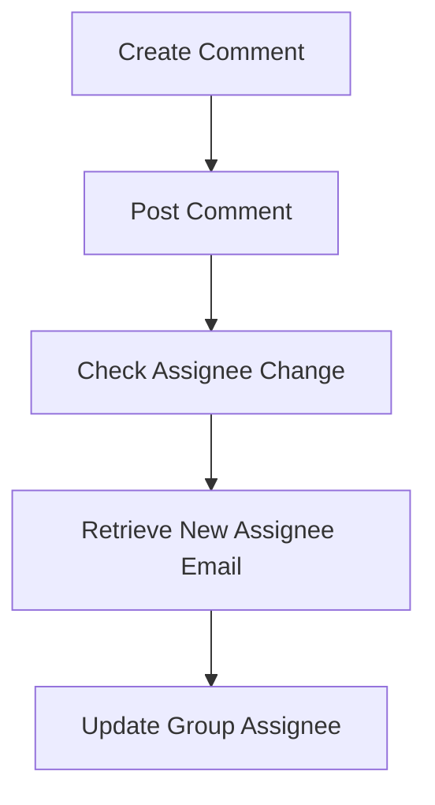

This document will cover the process of creating a comment on a Jira issue using Sentry integration. We'll cover:

1. Posting the comment
2. Handling assignee changes
3. Synchronizing the group assignee.

Technical document: <SwmLink doc-title="Creating a Comment Flow">[Creating a Comment Flow](/.swm/creating-a-comment-flow.x5lbigv6.sw.md)</SwmLink>

# [Posting the Comment](https://app.swimm.io/repos/Z2l0aHViJTNBJTNBc2VudHJ5LWRlbW8tMSUzQSUzQVN3aW1tLURlbW8=/docs/x5lbigv6#posting-the-comment)

The process begins with posting a comment on a Jira issue. This involves sending the comment data to the Jira server. The system ensures that the comment is correctly associated with the specific issue by validating the token and processing the request data. This step is crucial for maintaining accurate communication and documentation within the Jira issue.

# [Handling Assignee Changes](https://app.swimm.io/repos/Z2l0aHViJTNBJTNBc2VudHJ5LWRlbW8tMSUzQSUzQVN3aW1tLURlbW8=/docs/x5lbigv6#handling-assignee-change)

After posting the comment, the system checks if there are any changes in the assignee of the issue. This is done by examining the issue's changelog for any modifications to the assignee field. If the assignee has changed, the system retrieves the new assignee's email. This step ensures that the correct user is assigned to the issue, reflecting any updates in responsibility or ownership.

# [Synchronizing the Group Assignee](https://app.swimm.io/repos/Z2l0aHViJTNBJTNBc2VudHJ5LWRlbW8tMSUzQSUzQVN3aW1tLURlbW8=/docs/x5lbigv6#synchronizing-group-assignee)

The final step involves synchronizing the group assignee based on the new assignee's email. The system checks if the new assignee is a member of the project and updates the group assignment accordingly. This ensures that the group is always assigned to the correct user, maintaining accurate and up-to-date project management.

&nbsp;

*This is an auto-generated document by Swimm AI 🌊 and has not yet been verified by a human*

<SwmMeta version="3.0.0" repo-id="Z2l0aHViJTNBJTNBc2VudHJ5LWRlbW8tMSUzQSUzQVN3aW1tLURlbW8=" repo-name="sentry-demo-1" doc-type="product-flows">Powered by [Swimm](/)</SwmMeta>
