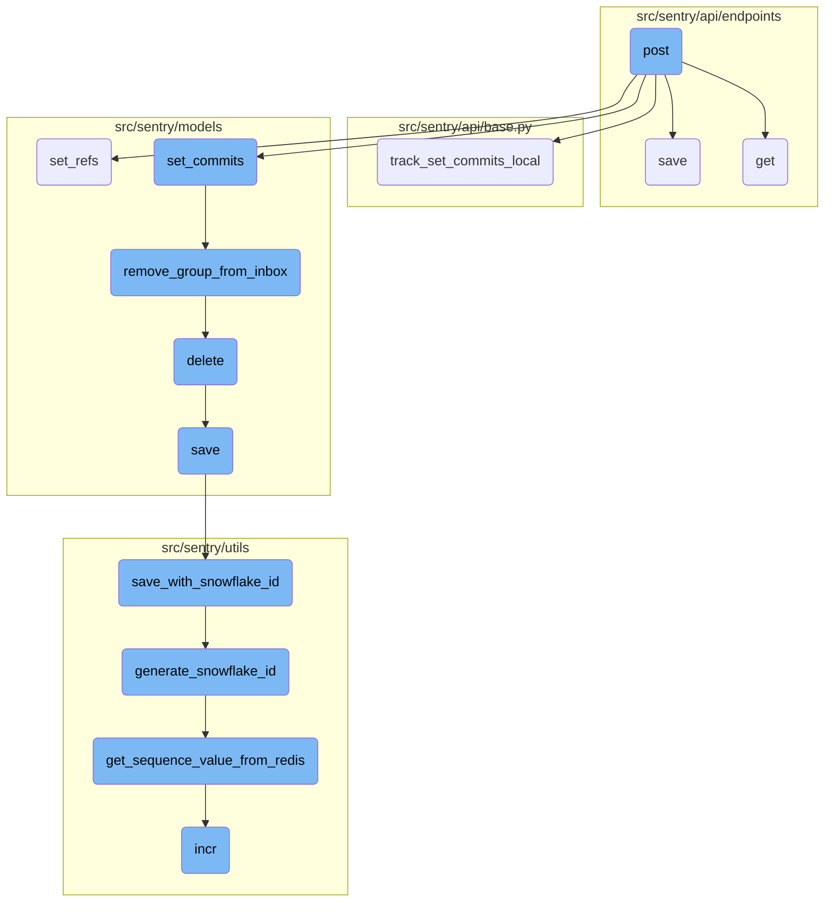

This document explains the process of creating a new release. The process involves validating input data, checking for existing releases, creating a new release if it doesn't exist, associating commits with the release, and saving the release details.

The flow starts with validating the input data to ensure all required fields are present. Then, it checks if a release with the same version already exists. If it does, it updates the existing release; otherwise, it creates a new one. Next, it associates any provided commit data with the release, which helps in tracking changes and identifying issues. Finally, it saves the release details, ensuring all relevant data is persisted in the database.

Here is a high level diagram of the flow, showing only the most important functions:



# Flow drill down

First, we'll zoom into this section of the flow:

```mermaid
graph TD;
      subgraph src/sentry/api/endpoints
4bfe6a30aa00dcafe4aa9d5d2b847db828403f9d9239fb6e40e32668555227d0(post):::mainFlowStyle --> e7e0a0243c1e8121e4e6b9f766a2b7592ddac04041819dc275371e02322ce783(save)
end

subgraph src/sentry/models/release.py
4bfe6a30aa00dcafe4aa9d5d2b847db828403f9d9239fb6e40e32668555227d0(post):::mainFlowStyle --> 7642a60b4d5f780a8c18c44d8c7fe5895d13a6a64fafa13d9a8cb0499469160f(set_refs)
end

subgraph src/sentry/api/endpoints
4bfe6a30aa00dcafe4aa9d5d2b847db828403f9d9239fb6e40e32668555227d0(post):::mainFlowStyle --> 3d7e0161e9f9b4db7105fec38821094c02adce3de569d45d0d812585140bba5b(get)
end

subgraph src/sentry/api
4bfe6a30aa00dcafe4aa9d5d2b847db828403f9d9239fb6e40e32668555227d0(post):::mainFlowStyle --> 5097c72f642505faf5ffb08b5caa79bf345aba9e79af9b2781e2c726910005ef(track_set_commits_local)
end

subgraph src/sentry/models/release.py
4bfe6a30aa00dcafe4aa9d5d2b847db828403f9d9239fb6e40e32668555227d0(post):::mainFlowStyle --> dddc69f3d3ede7642e1df63dd019dafef1105ec2be932c667b286f062e73744e(set_commits):::mainFlowStyle
end

subgraph src/sentry/models/release.py
dddc69f3d3ede7642e1df63dd019dafef1105ec2be932c667b286f062e73744e(set_commits):::mainFlowStyle --> w8isl(...)
end

subgraph src/sentry/api/endpoints
3d7e0161e9f9b4db7105fec38821094c02adce3de569d45d0d812585140bba5b(get) --> 5d1f05f9bc55df9ad89a685ed97c6c4dd66f57a6acc67d2eb967017a4271ab74(_filter_releases_by_query)
end

subgraph src/sentry/api/endpoints
3d7e0161e9f9b4db7105fec38821094c02adce3de569d45d0d812585140bba5b(get) --> 2f96a7d3a899ae19d48484ede4c93715d5c0c6ba26e01d62e48b584ad5c8ad1b(debounce_update_release_health_data)
end

subgraph src/sentry/api
e7e0a0243c1e8121e4e6b9f766a2b7592ddac04041819dc275371e02322ce783(save) --> 4840e06d7d2fcff2ec09e8fb0fb9717aff6966a85b0d184959efcf82ca1b5cb1(save_avatar)
end


      classDef mainFlowStyle color:#000000,fill:#7CB9F4
classDef rootsStyle color:#000000,fill:#00FFF4
classDef Style1 color:#000000,fill:#00FFAA
classDef Style2 color:#000000,fill:#FFFF00
classDef Style3 color:#000000,fill:#AA7CB9

%% Swimm:
%% graph TD;
%%       subgraph <SwmPath>[src/sentry/api/endpoints/](src/sentry/api/endpoints/)</SwmPath>
%% 4bfe6a30aa00dcafe4aa9d5d2b847db828403f9d9239fb6e40e32668555227d0(post):::mainFlowStyle --> e7e0a0243c1e8121e4e6b9f766a2b7592ddac04041819dc275371e02322ce783(save)
%% end
%% 
%% subgraph <SwmPath>[src/sentry/models/release.py](src/sentry/models/release.py)</SwmPath>
%% 4bfe6a30aa00dcafe4aa9d5d2b847db828403f9d9239fb6e40e32668555227d0(post):::mainFlowStyle --> 7642a60b4d5f780a8c18c44d8c7fe5895d13a6a64fafa13d9a8cb0499469160f(set_refs)
%% end
%% 
%% subgraph <SwmPath>[src/sentry/api/endpoints/](src/sentry/api/endpoints/)</SwmPath>
%% 4bfe6a30aa00dcafe4aa9d5d2b847db828403f9d9239fb6e40e32668555227d0(post):::mainFlowStyle --> 3d7e0161e9f9b4db7105fec38821094c02adce3de569d45d0d812585140bba5b(get)
%% end
%% 
%% subgraph <SwmPath>[src/sentry/api/](src/sentry/api/)</SwmPath>
%% 4bfe6a30aa00dcafe4aa9d5d2b847db828403f9d9239fb6e40e32668555227d0(post):::mainFlowStyle --> 5097c72f642505faf5ffb08b5caa79bf345aba9e79af9b2781e2c726910005ef(track_set_commits_local)
%% end
%% 
%% subgraph <SwmPath>[src/sentry/models/release.py](src/sentry/models/release.py)</SwmPath>
%% 4bfe6a30aa00dcafe4aa9d5d2b847db828403f9d9239fb6e40e32668555227d0(post):::mainFlowStyle --> dddc69f3d3ede7642e1df63dd019dafef1105ec2be932c667b286f062e73744e(set_commits):::mainFlowStyle
%% end
%% 
%% subgraph <SwmPath>[src/sentry/models/release.py](src/sentry/models/release.py)</SwmPath>
%% dddc69f3d3ede7642e1df63dd019dafef1105ec2be932c667b286f062e73744e(set_commits):::mainFlowStyle --> w8isl(...)
%% end
%% 
%% subgraph <SwmPath>[src/sentry/api/endpoints/](src/sentry/api/endpoints/)</SwmPath>
%% 3d7e0161e9f9b4db7105fec38821094c02adce3de569d45d0d812585140bba5b(get) --> 5d1f05f9bc55df9ad89a685ed97c6c4dd66f57a6acc67d2eb967017a4271ab74(_filter_releases_by_query)
%% end
%% 
%% subgraph <SwmPath>[src/sentry/api/endpoints/](src/sentry/api/endpoints/)</SwmPath>
%% 3d7e0161e9f9b4db7105fec38821094c02adce3de569d45d0d812585140bba5b(get) --> 2f96a7d3a899ae19d48484ede4c93715d5c0c6ba26e01d62e48b584ad5c8ad1b(debounce_update_release_health_data)
%% end
%% 
%% subgraph <SwmPath>[src/sentry/api/](src/sentry/api/)</SwmPath>
%% e7e0a0243c1e8121e4e6b9f766a2b7592ddac04041819dc275371e02322ce783(save) --> 4840e06d7d2fcff2ec09e8fb0fb9717aff6966a85b0d184959efcf82ca1b5cb1(save_avatar)
%% end
%% 
%% 
%%       classDef mainFlowStyle color:#000000,fill:#7CB9F4
%% classDef rootsStyle color:#000000,fill:#00FFF4
%% classDef Style1 color:#000000,fill:#00FFAA
%% classDef Style2 color:#000000,fill:#FFFF00
%% classDef Style3 color:#000000,fill:#AA7CB9
```



<SwmSnippet path="/src/sentry/api/endpoints/organization_releases.py" line="419">

---

## Creating a New Release

The <SwmToken path="src/sentry/api/endpoints/organization_releases.py" pos="419:3:3" line-data="    def post(self, request: Request, organization) -&gt; Response:">`post`</SwmToken> function is responsible for creating a new release for an organization. This involves validating the input data, checking for existing releases, and creating a new release if it doesn't already exist.

`````````````````````````````````````````python
    def post(self, request: Request, organization) -> Response:
        """
        Create a New Release for an Organization
        ````````````````````````````````````````
        Create a new release for the given Organization.  Releases are used by
        Sentry to improve its error reporting abilities by correlating
        first seen events with the release that might have introduced the
        problem.
        Releases are also necessary for sourcemaps and other debug features
`````````````````````````````````````````

---

</SwmSnippet>

<SwmSnippet path="/src/sentry/api/endpoints/organization_releases.py" line="460">

---

### Validating Input Data

The input data is validated using the <SwmToken path="src/sentry/api/endpoints/organization_releases.py" pos="460:5:5" line-data="        serializer = ReleaseSerializerWithProjects(">`ReleaseSerializerWithProjects`</SwmToken> serializer to ensure all required fields are present and correctly formatted.

```python
        serializer = ReleaseSerializerWithProjects(
            data=request.data, context={"organization": organization}
        )
```

---

</SwmSnippet>

<SwmSnippet path="/src/sentry/api/endpoints/organization_releases.py" line="492">

---

### Checking for Existing Releases

The function checks if a release with the same version already exists for the organization. If it does, it updates the existing release; otherwise, it creates a new one.

```python
                release, created = Release.objects.get_or_create(
                    organization_id=organization.id,
                    version=result["version"],
                    defaults={
                        "ref": result.get("ref"),
                        "url": result.get("url"),
                        "owner_id": owner_id,
                        "date_released": result.get("dateReleased"),
                        "status": new_status or ReleaseStatus.OPEN,
                        "user_agent": request.META.get("HTTP_USER_AGENT", "")[:256],
                    },
                )
```

---

</SwmSnippet>

<SwmSnippet path="/src/sentry/api/endpoints/organization_releases.py" line="531">

---

## Associating Commits with the Release

If commit data is provided, the <SwmToken path="src/sentry/api/endpoints/organization_releases.py" pos="534:3:3" line-data="                    release.set_commits(commit_list)">`set_commits`</SwmToken> method is called to associate the commits with the release. This helps in tracking changes and identifying issues introduced by specific commits.

```python
            commit_list = result.get("commits")
            if commit_list:
                try:
                    release.set_commits(commit_list)
                    self.track_set_commits_local(
```

---

</SwmSnippet>

<SwmSnippet path="/src/sentry/api/base.py" line="700">

---

### Tracking Commit Associations

The <SwmToken path="src/sentry/api/base.py" pos="700:3:3" line-data="    def track_set_commits_local(self, request: Request, organization_id=None, project_ids=None):">`track_set_commits_local`</SwmToken> function records analytics data about the commit associations, including user and organization details.

```python
    def track_set_commits_local(self, request: Request, organization_id=None, project_ids=None):
        analytics.record(
            "release.set_commits_local",
            user_id=request.user.id if request.user and request.user.id else None,
            organization_id=organization_id,
            project_ids=project_ids,
            user_agent=request.META.get("HTTP_USER_AGENT", ""),
        )
```

---

</SwmSnippet>

<SwmSnippet path="/src/sentry/api/endpoints/organization_details.py" line="462">

---

## Saving the Release

The <SwmToken path="src/sentry/api/endpoints/organization_details.py" pos="462:3:3" line-data="    def save(self):">`save`</SwmToken> function is responsible for saving the release details, including any changes to organization options and flags. It ensures that all relevant data is persisted in the database.

```python
    def save(self):
        from sentry import features

        org = self.context["organization"]
        changed_data = {}
        if not hasattr(org, "__data"):
            update_tracked_data(org)

        data = self.validated_data

        for key, option, type_, default_value in ORG_OPTIONS:
            if key not in data:
                continue
            try:
                option_inst = OrganizationOption.objects.get(organization=org, key=option)
                update_tracked_data(option_inst)
            except OrganizationOption.DoesNotExist:
                OrganizationOption.objects.set_value(
                    organization=org, key=option, value=type_(data[key])
                )

```

---

</SwmSnippet>

<SwmSnippet path="/src/sentry/models/release.py" line="600">

---

## Setting References

The <SwmToken path="src/sentry/models/release.py" pos="600:3:3" line-data="    def set_refs(self, refs, user_id, fetch=False):">`set_refs`</SwmToken> function sets the start and end commits for each repository included in the release. This is useful for tracking the range of commits that are part of the release.

```python
    def set_refs(self, refs, user_id, fetch=False):
        with sentry_sdk.start_span(op="set_refs"):
            from sentry.api.exceptions import InvalidRepository
            from sentry.models.commit import Commit
            from sentry.models.releaseheadcommit import ReleaseHeadCommit
            from sentry.models.repository import Repository
            from sentry.tasks.commits import fetch_commits

            # TODO: this does the wrong thing unless you are on the most
            # recent release.  Add a timestamp compare?
            prev_release = (
                type(self)
                .objects.filter(
                    organization_id=self.organization_id, projects__in=self.projects.all()
                )
                .extra(select={"sort": "COALESCE(date_released, date_added)"})
                .exclude(version=self.version)
                .order_by("-sort")
                .first()
            )

```

---

</SwmSnippet>

<SwmSnippet path="/src/sentry/api/endpoints/organization_releases.py" line="77">

---

## Filtering Releases by Query

The <SwmToken path="src/sentry/api/endpoints/organization_releases.py" pos="77:2:2" line-data="def _filter_releases_by_query(queryset, organization, query, filter_params):">`_filter_releases_by_query`</SwmToken> function filters the list of releases based on the provided query parameters. This allows users to search for specific releases using various criteria.

```python
def _filter_releases_by_query(queryset, organization, query, filter_params):
    search_filters = parse_search_query(query)
    for search_filter in search_filters:
        if search_filter.key.name == RELEASE_FREE_TEXT_KEY:
            query_q = Q(version__icontains=query)
            suffix_match = _release_suffix.match(query)
            if suffix_match is not None:
                query_q |= Q(version__icontains="%s+%s" % suffix_match.groups())

            queryset = queryset.filter(query_q)

        if search_filter.key.name == RELEASE_ALIAS:
            query_q = Q()
            raw_value = search_filter.value.raw_value
            if search_filter.value.is_wildcard():
                if raw_value.endswith("*") and raw_value.startswith("*"):
                    query_q = Q(version__contains=raw_value[1:-1])
                elif raw_value.endswith("*"):
                    query_q = Q(version__startswith=raw_value[:-1])
                elif raw_value.startswith("*"):
                    query_q = Q(version__endswith=raw_value[1:])
```

---

</SwmSnippet>

<SwmSnippet path="/src/sentry/api/endpoints/organization_releases.py" line="150">

---

## Debouncing Release Health Data Updates

The <SwmToken path="src/sentry/api/endpoints/organization_releases.py" pos="150:2:2" line-data="def debounce_update_release_health_data(organization, project_ids: list[int]):">`debounce_update_release_health_data`</SwmToken> function ensures that health data for releases is updated in a controlled manner, preventing excessive updates and ensuring data consistency.

```python
def debounce_update_release_health_data(organization, project_ids: list[int]):
    """This causes a flush of snuba health data to the postgres tables once
    per minute for the given projects.
    """
    # Figure out which projects need to get updates from the snuba.
    should_update = {}
    cache_keys = ["debounce-health:%d" % id for id in project_ids]
    cache_data = cache.get_many(cache_keys)
    for project_id, cache_key in zip(project_ids, cache_keys):
        if cache_data.get(cache_key) is None:
            should_update[project_id] = cache_key

    if not should_update:
        return

    projects = {p.id: p for p in Project.objects.get_many_from_cache(should_update.keys())}

    # This gives us updates for all release-projects which have seen new
    # health data over the last days. It will miss releases where the last
    # date is longer than what `get_changed_project_release_model_adoptions`
    # considers recent.
```

---

</SwmSnippet>

<SwmSnippet path="/src/sentry/api/bases/avatar.py" line="73">

---

## Saving Avatars

The <SwmToken path="src/sentry/api/bases/avatar.py" pos="73:3:3" line-data="    def save_avatar(self, obj: Any, serializer: serializers.Serializer, **kwargs: Any) -&gt; AvatarT:">`save_avatar`</SwmToken> function handles the saving of avatar images for organizations. It validates the input data and saves the avatar image to the appropriate location.

```python
    def save_avatar(self, obj: Any, serializer: serializers.Serializer, **kwargs: Any) -> AvatarT:
        result = serializer.validated_data

        return self.model.save_avatar(
            relation={self.object_type: obj},
            type=result["avatar_type"],
            avatar=result.get("avatar_photo"),
            filename=self.get_avatar_filename(obj),
            color=result.get("color"),
        )
```

---

</SwmSnippet>

Now, lets zoom into this section of the flow:

```mermaid
graph TD;
      subgraph src/sentry/models
dddc69f3d3ede7642e1df63dd019dafef1105ec2be932c667b286f062e73744e(set_commits):::mainFlowStyle --> 79037f0d346a0dfdb7052158de2cb4e57b48da307a949ca8dd862880d9a3a1c3(remove_group_from_inbox):::mainFlowStyle
end

subgraph src/sentry/models
79037f0d346a0dfdb7052158de2cb4e57b48da307a949ca8dd862880d9a3a1c3(remove_group_from_inbox):::mainFlowStyle --> b48d8e567c3071c40fb0a41cd3b4749edf659e57d1580c2cd7d686738dd2fa86(delete):::mainFlowStyle
end

subgraph src/sentry/models
b48d8e567c3071c40fb0a41cd3b4749edf659e57d1580c2cd7d686738dd2fa86(delete):::mainFlowStyle --> e428c3061e6be3bd5b6c2e853ddbf5de95dd22c84bdedc018937dc5f1548a2c3(save):::mainFlowStyle
end

subgraph src/sentry/utils
e428c3061e6be3bd5b6c2e853ddbf5de95dd22c84bdedc018937dc5f1548a2c3(save):::mainFlowStyle --> 030e147ffbd5089d45f3f5c3cde160cce5267b0806f5be94cc547a79b391d895(save_with_snowflake_id):::mainFlowStyle
end

subgraph src/sentry/utils
030e147ffbd5089d45f3f5c3cde160cce5267b0806f5be94cc547a79b391d895(save_with_snowflake_id):::mainFlowStyle --> 0b4d5d2efa041316eec36438537e6e9380a9cfbb3f3463557ca623bd4da1edd8(generate_snowflake_id):::mainFlowStyle
end

subgraph src/sentry/utils
0b4d5d2efa041316eec36438537e6e9380a9cfbb3f3463557ca623bd4da1edd8(generate_snowflake_id):::mainFlowStyle --> 138a96d4d3b8056e25f811bb93f0cf2580b835c87ccaed0af63c7280f05c19a8(get_sequence_value_from_redis):::mainFlowStyle
end

subgraph src/sentry/utils
138a96d4d3b8056e25f811bb93f0cf2580b835c87ccaed0af63c7280f05c19a8(get_sequence_value_from_redis):::mainFlowStyle --> 411e09b2a8fb05fb965aa689da087a4eb0afb53a22d1a0177a8dfd222ea23bac(incr):::mainFlowStyle
end


      classDef mainFlowStyle color:#000000,fill:#7CB9F4
classDef rootsStyle color:#000000,fill:#00FFF4
classDef Style1 color:#000000,fill:#00FFAA
classDef Style2 color:#000000,fill:#FFFF00
classDef Style3 color:#000000,fill:#AA7CB9

%% Swimm:
%% graph TD;
%%       subgraph <SwmPath>[src/sentry/models/](src/sentry/models/)</SwmPath>
%% dddc69f3d3ede7642e1df63dd019dafef1105ec2be932c667b286f062e73744e(set_commits):::mainFlowStyle --> 79037f0d346a0dfdb7052158de2cb4e57b48da307a949ca8dd862880d9a3a1c3(remove_group_from_inbox):::mainFlowStyle
%% end
%% 
%% subgraph <SwmPath>[src/sentry/models/](src/sentry/models/)</SwmPath>
%% 79037f0d346a0dfdb7052158de2cb4e57b48da307a949ca8dd862880d9a3a1c3(remove_group_from_inbox):::mainFlowStyle --> b48d8e567c3071c40fb0a41cd3b4749edf659e57d1580c2cd7d686738dd2fa86(delete):::mainFlowStyle
%% end
%% 
%% subgraph <SwmPath>[src/sentry/models/](src/sentry/models/)</SwmPath>
%% b48d8e567c3071c40fb0a41cd3b4749edf659e57d1580c2cd7d686738dd2fa86(delete):::mainFlowStyle --> e428c3061e6be3bd5b6c2e853ddbf5de95dd22c84bdedc018937dc5f1548a2c3(save):::mainFlowStyle
%% end
%% 
%% subgraph <SwmPath>[src/sentry/utils/](src/sentry/utils/)</SwmPath>
%% e428c3061e6be3bd5b6c2e853ddbf5de95dd22c84bdedc018937dc5f1548a2c3(save):::mainFlowStyle --> 030e147ffbd5089d45f3f5c3cde160cce5267b0806f5be94cc547a79b391d895(save_with_snowflake_id):::mainFlowStyle
%% end
%% 
%% subgraph <SwmPath>[src/sentry/utils/](src/sentry/utils/)</SwmPath>
%% 030e147ffbd5089d45f3f5c3cde160cce5267b0806f5be94cc547a79b391d895(save_with_snowflake_id):::mainFlowStyle --> 0b4d5d2efa041316eec36438537e6e9380a9cfbb3f3463557ca623bd4da1edd8(generate_snowflake_id):::mainFlowStyle
%% end
%% 
%% subgraph <SwmPath>[src/sentry/utils/](src/sentry/utils/)</SwmPath>
%% 0b4d5d2efa041316eec36438537e6e9380a9cfbb3f3463557ca623bd4da1edd8(generate_snowflake_id):::mainFlowStyle --> 138a96d4d3b8056e25f811bb93f0cf2580b835c87ccaed0af63c7280f05c19a8(get_sequence_value_from_redis):::mainFlowStyle
%% end
%% 
%% subgraph <SwmPath>[src/sentry/utils/](src/sentry/utils/)</SwmPath>
%% 138a96d4d3b8056e25f811bb93f0cf2580b835c87ccaed0af63c7280f05c19a8(get_sequence_value_from_redis):::mainFlowStyle --> 411e09b2a8fb05fb965aa689da087a4eb0afb53a22d1a0177a8dfd222ea23bac(incr):::mainFlowStyle
%% end
%% 
%% 
%%       classDef mainFlowStyle color:#000000,fill:#7CB9F4
%% classDef rootsStyle color:#000000,fill:#00FFF4
%% classDef Style1 color:#000000,fill:#00FFAA
%% classDef Style2 color:#000000,fill:#FFFF00
%% classDef Style3 color:#000000,fill:#AA7CB9
```



<SwmSnippet path="/src/sentry/models/release.py" line="655">

---

## Binding Commits to a Release

The function <SwmToken path="src/sentry/models/release.py" pos="655:3:3" line-data="    def set_commits(self, commit_list):">`set_commits`</SwmToken> binds a list of commits to a release. It starts by sorting the commit list in reverse order based on the timestamp. This ensures that the most recent commits are processed first. The function then filters out any commits that should be ignored based on their message content.

```python
    def set_commits(self, commit_list):
        """
        Bind a list of commits to this release.

        This will clear any existing commit log and replace it with the given
        commits.
        """

        # Sort commit list in reverse order
        commit_list.sort(key=lambda commit: commit.get("timestamp", 0), reverse=True)

        # TODO(dcramer): this function could use some cleanup/refactoring as it's a bit unwieldy
        from sentry.integrations.tasks.kick_off_status_syncs import kick_off_status_syncs
        from sentry.models.commit import Commit
        from sentry.models.group import Group, GroupStatus
        from sentry.models.grouplink import GroupLink
        from sentry.models.groupresolution import GroupResolution
        from sentry.models.pullrequest import PullRequest
        from sentry.models.releasecommit import ReleaseCommit
        from sentry.models.releaseheadcommit import ReleaseHeadCommit
        from sentry.models.repository import Repository
```

---

</SwmSnippet>

<SwmSnippet path="/src/sentry/models/release.py" line="699">

---

### Handling Commit Authors and Repositories

The function processes each commit to associate it with the correct repository and author. If the repository does not exist, it creates a new one. It also handles the creation or updating of commit authors based on the provided email and name.

```python
                ReleaseCommit.objects.filter(release=self).delete()

                authors = {}
                repos = {}
                commit_author_by_commit = {}
                head_commit_by_repo: dict[int, int] = {}
                latest_commit = None
                for idx, data in enumerate(commit_list):
                    repo_name = data.get("repository") or f"organization-{self.organization_id}"
                    if repo_name not in repos:
                        repo = (
                            Repository.objects.filter(
                                organization_id=self.organization_id,
                                name=repo_name,
                                status=ObjectStatus.ACTIVE,
                            )
                            .order_by("-pk")
                            .first()
                        )

                        if repo is None:
```

---

</SwmSnippet>

<SwmSnippet path="/src/sentry/models/release.py" line="753">

---

### Creating and Updating Commits

The function creates or updates commits in the database. It ensures that each commit is associated with the correct repository and author. If the commit already exists but has different data, it updates the commit with the new information.

```python
                    commit_data: _CommitDataKwargs = {}

                    # Update/set message and author if they are provided.
                    if author is not None:
                        commit_data["author"] = author
                    if "message" in data:
                        commit_data["message"] = data["message"]
                    if "timestamp" in data:
                        commit_data["date_added"] = data["timestamp"]

                    commit, created = Commit.objects.get_or_create(
                        organization_id=self.organization_id,
                        repository_id=repo.id,
                        key=data["id"],
                        defaults=commit_data,
                    )
                    if not created and any(
                        getattr(commit, key) != value for key, value in commit_data.items()
                    ):
                        commit.update(**commit_data)

```

---

</SwmSnippet>

<SwmSnippet path="/src/sentry/models/release.py" line="911">

---

### Resolving Groups

The function resolves groups associated with the commits. It updates the group status to resolved and removes the group from the inbox. It also records the group history and sends a signal indicating that the issue has been resolved.

```python
                    group_id=group_id,
                    values={
                        "release": self,
                        "type": GroupResolution.Type.in_release,
                        "status": GroupResolution.Status.resolved,
                        "actor_id": actor.id if actor is not None else None,
                    },
                )
                group = Group.objects.get(id=group_id)
                group.update(status=GroupStatus.RESOLVED, substatus=None)
                remove_group_from_inbox(group, action=GroupInboxRemoveAction.RESOLVED, user=actor)
                record_group_history(group, GroupHistoryStatus.RESOLVED, actor=actor)

                metrics.incr("group.resolved", instance="in_commit", skip_internal=True)

            issue_resolved.send_robust(
                organization_id=self.organization_id,
                user=actor,
                group=group,
                project=group.project,
                resolution_type="with_commit",
```

---

</SwmSnippet>

<SwmSnippet path="/src/sentry/models/groupinbox.py" line="96">

---

## Removing Group from Inbox

The function <SwmToken path="src/sentry/models/groupinbox.py" pos="96:2:2" line-data="def remove_group_from_inbox(group, action=None, user=None, referrer=None):">`remove_group_from_inbox`</SwmToken> removes a group from the inbox. If the action is to mark the group as reviewed and a user is provided, it creates an activity record and updates the group history to indicate that the group has been reviewed.

```python
def remove_group_from_inbox(group, action=None, user=None, referrer=None):
    try:
        group_inbox = GroupInbox.objects.get(group=group)
        group_inbox.delete()

        if action is GroupInboxRemoveAction.MARK_REVIEWED and user is not None:
            Activity.objects.create(
                project_id=group_inbox.group.project_id,
                group_id=group_inbox.group_id,
                type=ActivityType.MARK_REVIEWED.value,
                user_id=user.id,
            )
            record_group_history(group, GroupHistoryStatus.REVIEWED, actor=user)
    except GroupInbox.DoesNotExist:
        pass
```

---

</SwmSnippet>

&nbsp;

*This is an auto-generated document by Swimm AI 🌊 and has not yet been verified by a human*

<SwmMeta version="3.0.0" repo-id="Z2l0aHViJTNBJTNBc2VudHJ5LWRlbW8tMSUzQSUzQVN3aW1tLURlbW8=" repo-name="sentry-demo-1" doc-type="flows"><sup>Powered by [Swimm](/)</sup></SwmMeta>
