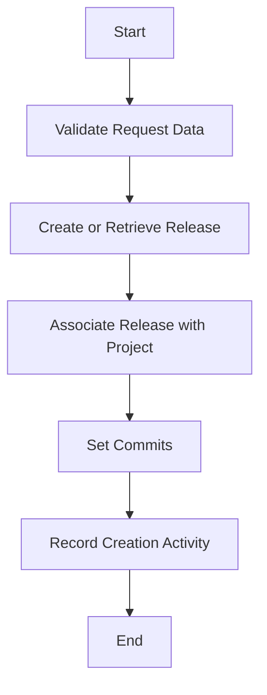

This document will cover the process of creating a new release, which includes:

1. Validating request data
2. Creating or retrieving a release
3. Associating the release with a project
4. Setting commits for the release
5. Recording the creation activity.

Technical document: <SwmLink doc-title="Creating a New Release">[Creating a New Release](/.swm/creating-a-new-release.ynfvhysw.sw.md)</SwmLink>

# [Validating Request Data](https://app.swimm.io/repos/Z2l0aHViJTNBJTNBc2VudHJ5LWRlbW8tMSUzQSUzQVN3aW1tLURlbW8=/docs/ynfvhysw#validating-the-request-data)

The first step in creating a new release is to validate the request data. This ensures that all necessary information is present and correct. For example, the request must include the organization ID or slug, the project ID or slug, and a version identifier for the release. This validation step is crucial to prevent errors and ensure that the release can be created successfully.

# [Creating or Retrieving a Release](https://app.swimm.io/repos/Z2l0aHViJTNBJTNBc2VudHJ5LWRlbW8tMSUzQSUzQVN3aW1tLURlbW8=/docs/ynfvhysw#creating-or-retrieving-a-release)

Once the request data is validated, the system either creates a new release or retrieves an existing one. Releases are identified by their version, and if a release with the same version already exists within the organization, it will be retrieved instead of creating a new one. This ensures that releases are idempotent, meaning that creating the same release multiple times will not result in duplicate entries.

# [Associating the Release with a Project](https://app.swimm.io/repos/Z2l0aHViJTNBJTNBc2VudHJ5LWRlbW8tMSUzQSUzQVN3aW1tLURlbW8=/docs/ynfvhysw#associating-the-release-with-the-project)

After creating or retrieving the release, it is associated with the specified project. This association allows Sentry to correlate errors and events with the release, improving error tracking and reporting. The release is linked to the project using the project ID or slug provided in the request.

# [Setting Commits for the Release](https://app.swimm.io/repos/Z2l0aHViJTNBJTNBc2VudHJ5LWRlbW8tMSUzQSUzQVN3aW1tLURlbW8=/docs/ynfvhysw#setting-commits-if-provided)

If commit data is provided in the request, the system binds these commits to the release. This involves clearing any existing commit log and replacing it with the new data. The commits are sorted in reverse order based on their timestamp, and any commits that should be ignored are filtered out. This step ensures that the release has an accurate and up-to-date commit history, which is essential for debugging and tracking changes.

# [Recording the Creation Activity](https://app.swimm.io/repos/Z2l0aHViJTNBJTNBc2VudHJ5LWRlbW8tMSUzQSUzQVN3aW1tLURlbW8=/docs/ynfvhysw#recording-the-creation-activity)

Finally, the creation activity is recorded to keep track of changes. This includes updating the release metadata with the commit count, authors, and the ID of the last commit. Additionally, groups linked to the commits are resolved by updating their status and removing them from the inbox. Recording this activity ensures that the release history is well-documented and can be referenced for future debugging and analysis.

&nbsp;

*This is an auto-generated document by Swimm AI 🌊 and has not yet been verified by a human*

<SwmMeta version="3.0.0" repo-id="Z2l0aHViJTNBJTNBc2VudHJ5LWRlbW8tMSUzQSUzQVN3aW1tLURlbW8=" repo-name="sentry-demo-1" doc-type="product-flows">Powered by [Swimm](/)</SwmMeta>
