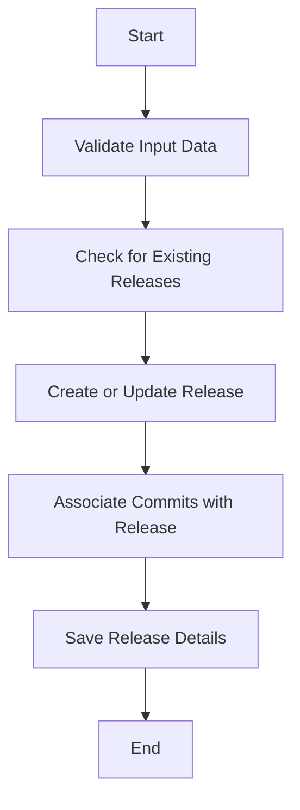

The process of creating a new release involves several steps to ensure the release is properly validated, associated with commits, and saved. This document will cover:

1. Validating input data
2. Checking for existing releases
3. Associating commits with the release
4. Saving the release details.

Technical document: <SwmLink doc-title="Creating a New Release">[Creating a New Release](/.swm/creating-a-new-release.3hb83lv7.sw.md)</SwmLink>

# [Validating Input Data](https://app.swimm.io/repos/Z2l0aHViJTNBJTNBc2VudHJ5LWRlbW8tMSUzQSUzQVN3aW1tLURlbW8=/docs/3hb83lv7#validating-input-data)

The first step in creating a new release is to validate the input data. This ensures that all required fields are present and correctly formatted. The validation process checks for essential information such as the release version, reference, URL, owner ID, release date, and status. This step is crucial to prevent any incomplete or incorrect data from being processed further.

# [Checking for Existing Releases](https://app.swimm.io/repos/Z2l0aHViJTNBJTNBc2VudHJ5LWRlbW8tMSUzQSUzQVN3aW1tLURlbW8=/docs/3hb83lv7#checking-for-existing-releases)

After validating the input data, the system checks if a release with the same version already exists for the organization. If a release with the same version is found, it updates the existing release with the new data. If no such release exists, a new release is created. This step ensures that there are no duplicate releases and that any updates to an existing release are properly handled.

# [Associating Commits with the Release](https://app.swimm.io/repos/Z2l0aHViJTNBJTNBc2VudHJ5LWRlbW8tMSUzQSUzQVN3aW1tLURlbW8=/docs/3hb83lv7#associating-commits-with-the-release)

If commit data is provided, the system associates these commits with the release. This association helps in tracking changes and identifying issues introduced by specific commits. The commits are linked to the release, providing a clear history of changes and facilitating debugging and issue resolution.

# [Saving the Release Details](https://app.swimm.io/repos/Z2l0aHViJTNBJTNBc2VudHJ5LWRlbW8tMSUzQSUzQVN3aW1tLURlbW8=/docs/3hb83lv7#saving-the-release)

The final step in the process is to save the release details. This includes persisting all relevant data in the database, such as the release version, associated commits, and any other metadata. Saving the release ensures that all information is stored securely and can be retrieved for future reference. This step is essential for maintaining the integrity and consistency of the release data.

&nbsp;

*This is an auto-generated document by Swimm AI 🌊 and has not yet been verified by a human*

<SwmMeta version="3.0.0" repo-id="Z2l0aHViJTNBJTNBc2VudHJ5LWRlbW8tMSUzQSUzQVN3aW1tLURlbW8=" repo-name="sentry-demo-1" doc-type="product-flows">Powered by [Swimm](/)</SwmMeta>
