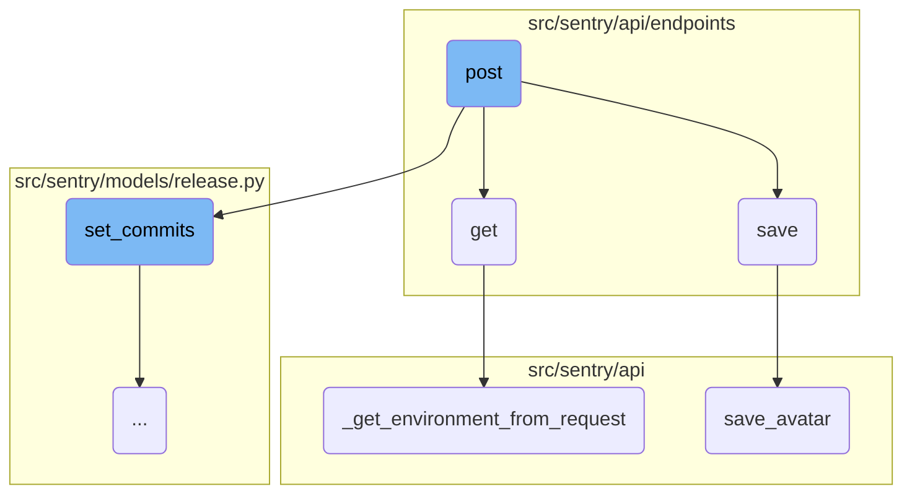

This document explains the <SwmToken path="src/sentry/api/endpoints/project_releases.py" pos="82:3:3" line-data="    def post(self, request: Request, project) -&gt; Response:">`post`</SwmToken> function, which is responsible for creating a new release for a project. It validates the request data, creates or retrieves a release, associates it with the project, and sets commits if provided. The function ensures that releases are idempotent and records the creation activity.

The <SwmToken path="src/sentry/api/endpoints/project_releases.py" pos="82:3:3" line-data="    def post(self, request: Request, project) -&gt; Response:">`post`</SwmToken> function starts by validating the request data to ensure all necessary information is present. It then either creates a new release or retrieves an existing one. This release is associated with the specified project. If commit data is provided, the function binds these commits to the release, ensuring that any existing commit log is cleared and replaced with the new data. The function also records the creation activity to keep track of changes.

Here is a high level diagram of the flow, showing only the most important functions:

```mermaid
graph TD;
      subgraph src/sentry/api/endpoints
f6d9da3315962d5fa8f62eeb3d9db4de41c1b4fc1b00630430eb869c79bcfeed(post):::mainFlowStyle --> e7e0a0243c1e8121e4e6b9f766a2b7592ddac04041819dc275371e02322ce783(save)
end

subgraph src/sentry/api/endpoints
f6d9da3315962d5fa8f62eeb3d9db4de41c1b4fc1b00630430eb869c79bcfeed(post):::mainFlowStyle --> 47cdb746c738c42f0336348e2573958ecc57f71d41a1a8d06dd801fa594360a2(get)
end

subgraph src/sentry/models
f6d9da3315962d5fa8f62eeb3d9db4de41c1b4fc1b00630430eb869c79bcfeed(post):::mainFlowStyle --> dddc69f3d3ede7642e1df63dd019dafef1105ec2be932c667b286f062e73744e(set_commits):::mainFlowStyle
end

subgraph src/sentry/models
dddc69f3d3ede7642e1df63dd019dafef1105ec2be932c667b286f062e73744e(set_commits):::mainFlowStyle --> 79037f0d346a0dfdb7052158de2cb4e57b48da307a949ca8dd862880d9a3a1c3(remove_group_from_inbox):::mainFlowStyle
end

subgraph src/sentry/models
79037f0d346a0dfdb7052158de2cb4e57b48da307a949ca8dd862880d9a3a1c3(remove_group_from_inbox):::mainFlowStyle --> b48d8e567c3071c40fb0a41cd3b4749edf659e57d1580c2cd7d686738dd2fa86(delete):::mainFlowStyle
end

subgraph src/sentry/models
b48d8e567c3071c40fb0a41cd3b4749edf659e57d1580c2cd7d686738dd2fa86(delete):::mainFlowStyle --> e428c3061e6be3bd5b6c2e853ddbf5de95dd22c84bdedc018937dc5f1548a2c3(save):::mainFlowStyle
end

subgraph src/sentry/utils
e428c3061e6be3bd5b6c2e853ddbf5de95dd22c84bdedc018937dc5f1548a2c3(save):::mainFlowStyle --> 030e147ffbd5089d45f3f5c3cde160cce5267b0806f5be94cc547a79b391d895(save_with_snowflake_id):::mainFlowStyle
end

subgraph src/sentry/utils
030e147ffbd5089d45f3f5c3cde160cce5267b0806f5be94cc547a79b391d895(save_with_snowflake_id):::mainFlowStyle --> 0b4d5d2efa041316eec36438537e6e9380a9cfbb3f3463557ca623bd4da1edd8(generate_snowflake_id):::mainFlowStyle
end

subgraph src/sentry/utils
0b4d5d2efa041316eec36438537e6e9380a9cfbb3f3463557ca623bd4da1edd8(generate_snowflake_id):::mainFlowStyle --> 138a96d4d3b8056e25f811bb93f0cf2580b835c87ccaed0af63c7280f05c19a8(get_sequence_value_from_redis):::mainFlowStyle
end

subgraph src/sentry/utils
138a96d4d3b8056e25f811bb93f0cf2580b835c87ccaed0af63c7280f05c19a8(get_sequence_value_from_redis):::mainFlowStyle --> 411e09b2a8fb05fb965aa689da087a4eb0afb53a22d1a0177a8dfd222ea23bac(incr):::mainFlowStyle
end

subgraph src/sentry/api/client.py
411e09b2a8fb05fb965aa689da087a4eb0afb53a22d1a0177a8dfd222ea23bac(incr):::mainFlowStyle --> 560768831e5caae094d399ce451ab0489318662774e26c007cf59ac610285662(put):::mainFlowStyle
end

subgraph src/sentry/api/client.py
560768831e5caae094d399ce451ab0489318662774e26c007cf59ac610285662(put):::mainFlowStyle --> f9a76a621506843e728c753bbfd65f5dee5fa0fc21993c46938d555bf01dd967(request):::mainFlowStyle
end


      classDef mainFlowStyle color:#000000,fill:#7CB9F4
classDef rootsStyle color:#000000,fill:#00FFF4
classDef Style1 color:#000000,fill:#00FFAA
classDef Style2 color:#000000,fill:#FFFF00
classDef Style3 color:#000000,fill:#AA7CB9

%% Swimm:
%% graph TD;
%%       subgraph <SwmPath>[src/sentry/api/endpoints/](src/sentry/api/endpoints/)</SwmPath>
%% f6d9da3315962d5fa8f62eeb3d9db4de41c1b4fc1b00630430eb869c79bcfeed(post):::mainFlowStyle --> e7e0a0243c1e8121e4e6b9f766a2b7592ddac04041819dc275371e02322ce783(save)
%% end
%% 
%% subgraph <SwmPath>[src/sentry/api/endpoints/](src/sentry/api/endpoints/)</SwmPath>
%% f6d9da3315962d5fa8f62eeb3d9db4de41c1b4fc1b00630430eb869c79bcfeed(post):::mainFlowStyle --> 47cdb746c738c42f0336348e2573958ecc57f71d41a1a8d06dd801fa594360a2(get)
%% end
%% 
%% subgraph <SwmPath>[src/sentry/models/](src/sentry/models/)</SwmPath>
%% f6d9da3315962d5fa8f62eeb3d9db4de41c1b4fc1b00630430eb869c79bcfeed(post):::mainFlowStyle --> dddc69f3d3ede7642e1df63dd019dafef1105ec2be932c667b286f062e73744e(set_commits):::mainFlowStyle
%% end
%% 
%% subgraph <SwmPath>[src/sentry/models/](src/sentry/models/)</SwmPath>
%% dddc69f3d3ede7642e1df63dd019dafef1105ec2be932c667b286f062e73744e(set_commits):::mainFlowStyle --> 79037f0d346a0dfdb7052158de2cb4e57b48da307a949ca8dd862880d9a3a1c3(remove_group_from_inbox):::mainFlowStyle
%% end
%% 
%% subgraph <SwmPath>[src/sentry/models/](src/sentry/models/)</SwmPath>
%% 79037f0d346a0dfdb7052158de2cb4e57b48da307a949ca8dd862880d9a3a1c3(remove_group_from_inbox):::mainFlowStyle --> b48d8e567c3071c40fb0a41cd3b4749edf659e57d1580c2cd7d686738dd2fa86(delete):::mainFlowStyle
%% end
%% 
%% subgraph <SwmPath>[src/sentry/models/](src/sentry/models/)</SwmPath>
%% b48d8e567c3071c40fb0a41cd3b4749edf659e57d1580c2cd7d686738dd2fa86(delete):::mainFlowStyle --> e428c3061e6be3bd5b6c2e853ddbf5de95dd22c84bdedc018937dc5f1548a2c3(save):::mainFlowStyle
%% end
%% 
%% subgraph <SwmPath>[src/sentry/utils/](src/sentry/utils/)</SwmPath>
%% e428c3061e6be3bd5b6c2e853ddbf5de95dd22c84bdedc018937dc5f1548a2c3(save):::mainFlowStyle --> 030e147ffbd5089d45f3f5c3cde160cce5267b0806f5be94cc547a79b391d895(save_with_snowflake_id):::mainFlowStyle
%% end
%% 
%% subgraph <SwmPath>[src/sentry/utils/](src/sentry/utils/)</SwmPath>
%% 030e147ffbd5089d45f3f5c3cde160cce5267b0806f5be94cc547a79b391d895(save_with_snowflake_id):::mainFlowStyle --> 0b4d5d2efa041316eec36438537e6e9380a9cfbb3f3463557ca623bd4da1edd8(generate_snowflake_id):::mainFlowStyle
%% end
%% 
%% subgraph <SwmPath>[src/sentry/utils/](src/sentry/utils/)</SwmPath>
%% 0b4d5d2efa041316eec36438537e6e9380a9cfbb3f3463557ca623bd4da1edd8(generate_snowflake_id):::mainFlowStyle --> 138a96d4d3b8056e25f811bb93f0cf2580b835c87ccaed0af63c7280f05c19a8(get_sequence_value_from_redis):::mainFlowStyle
%% end
%% 
%% subgraph <SwmPath>[src/sentry/utils/](src/sentry/utils/)</SwmPath>
%% 138a96d4d3b8056e25f811bb93f0cf2580b835c87ccaed0af63c7280f05c19a8(get_sequence_value_from_redis):::mainFlowStyle --> 411e09b2a8fb05fb965aa689da087a4eb0afb53a22d1a0177a8dfd222ea23bac(incr):::mainFlowStyle
%% end
%% 
%% subgraph <SwmPath>[src/sentry/api/client.py](src/sentry/api/client.py)</SwmPath>
%% 411e09b2a8fb05fb965aa689da087a4eb0afb53a22d1a0177a8dfd222ea23bac(incr):::mainFlowStyle --> 560768831e5caae094d399ce451ab0489318662774e26c007cf59ac610285662(put):::mainFlowStyle
%% end
%% 
%% subgraph <SwmPath>[src/sentry/api/client.py](src/sentry/api/client.py)</SwmPath>
%% 560768831e5caae094d399ce451ab0489318662774e26c007cf59ac610285662(put):::mainFlowStyle --> f9a76a621506843e728c753bbfd65f5dee5fa0fc21993c46938d555bf01dd967(request):::mainFlowStyle
%% end
%% 
%% 
%%       classDef mainFlowStyle color:#000000,fill:#7CB9F4
%% classDef rootsStyle color:#000000,fill:#00FFF4
%% classDef Style1 color:#000000,fill:#00FFAA
%% classDef Style2 color:#000000,fill:#FFFF00
%% classDef Style3 color:#000000,fill:#AA7CB9
```



# Flow drill down

First, we'll zoom into this section of the flow:



<SwmSnippet path="/src/sentry/api/endpoints/project_releases.py" line="82">

---

## Creating and Associating a New Release

The <SwmToken path="src/sentry/api/endpoints/project_releases.py" pos="82:3:3" line-data="    def post(self, request: Request, project) -&gt; Response:">`post`</SwmToken> function handles the creation of a new release for a project. It validates the request data, creates or retrieves a release, associates it with the project, and sets commits if provided. This function ensures that releases are idempotent and records the creation activity.

```````````````````````````````````python
    def post(self, request: Request, project) -> Response:
        """
        Create a New Release for a Project
        ``````````````````````````````````

        Create a new release and/or associate a project with a release.
        Release versions that are the same across multiple projects
        within an Organization will be treated as the same release in Sentry.

        Releases are used by Sentry to improve its error reporting abilities
        by correlating first seen events with the release that might have
        introduced the problem.

        Releases are also necessary for sourcemaps and other debug features
        that require manual upload for functioning well.

        :pparam string organization_id_or_slug: the id or slug of the organization the
                                          release belongs to.
        :pparam string project_id_or_slug: the id or slug of the project to create a
                                     release for.
        :param string version: a version identifier for this release.  Can
```````````````````````````````````

---

</SwmSnippet>

<SwmSnippet path="/src/sentry/api/endpoints/organization_details.py" line="462">

---

## Saving Organization Details

The <SwmToken path="src/sentry/api/endpoints/organization_details.py" pos="462:3:3" line-data="    def save(self):">`save`</SwmToken> function updates the organization details based on the validated data. It handles various organization options, flags, and avatar updates. This function ensures that any changes to the organization are tracked and saved appropriately.

```python
    def save(self):
        from sentry import features

        org = self.context["organization"]
        changed_data = {}
        if not hasattr(org, "__data"):
            update_tracked_data(org)

        data = self.validated_data

        for key, option, type_, default_value in ORG_OPTIONS:
            if key not in data:
                continue
            try:
                option_inst = OrganizationOption.objects.get(organization=org, key=option)
                update_tracked_data(option_inst)
            except OrganizationOption.DoesNotExist:
                OrganizationOption.objects.set_value(
                    organization=org, key=option, value=type_(data[key])
                )

```

---

</SwmSnippet>

<SwmSnippet path="/src/sentry/api/endpoints/project_releases.py" line="38">

---

## Retrieving Project Releases

The <SwmToken path="src/sentry/api/endpoints/project_releases.py" pos="38:3:3" line-data="    def get(self, request: Request, project) -&gt; Response:">`get`</SwmToken> function retrieves a list of releases for a given project. It filters the releases based on the project and optional query parameters, and paginates the results for efficient retrieval.

``````````````````````````python
    def get(self, request: Request, project) -> Response:
        """
        List a Project's Releases
        `````````````````````````

        Retrieve a list of releases for a given project.

        :pparam string organization_id_or_slug: the id or slug of the organization the
                                          release belongs to.
        :pparam string project_id_or_slug: the id or slug of the project to list the
                                     releases of.
        :qparam string query: this parameter can be used to create a
                              "starts with" filter for the version.
        """
        query = request.GET.get("query")
        try:
            environment = self._get_environment_from_request(request, project.organization_id)
        except Environment.DoesNotExist:
            queryset = Release.objects.none()
            environment = None
        else:
``````````````````````````

---

</SwmSnippet>

<SwmSnippet path="/src/sentry/api/base.py" line="619">

---

### Getting Environment from Request

The <SwmToken path="src/sentry/api/base.py" pos="619:3:3" line-data="    def _get_environment_from_request(self, request: Request, organization_id):">`_get_environment_from_request`</SwmToken> function retrieves the environment parameter from the request and caches it. This function is used to filter releases based on the specified environment.

```python
    def _get_environment_from_request(self, request: Request, organization_id):
        if not hasattr(request, "_cached_environment"):
            environment_param = request.GET.get("environment")
            if environment_param is None:
                environment = None
            else:
                environment = Environment.get_for_organization_id(
                    name=environment_param, organization_id=organization_id
                )

            request._cached_environment = environment

        return request._cached_environment
```

---

</SwmSnippet>

<SwmSnippet path="/src/sentry/api/bases/avatar.py" line="73">

---

## Saving Avatar

The <SwmToken path="src/sentry/api/bases/avatar.py" pos="73:3:3" line-data="    def save_avatar(self, obj: Any, serializer: serializers.Serializer, **kwargs: Any) -&gt; AvatarT:">`save_avatar`</SwmToken> function saves the avatar for an organization or user. It validates the avatar data and saves it with the appropriate filename and color.

```python
    def save_avatar(self, obj: Any, serializer: serializers.Serializer, **kwargs: Any) -> AvatarT:
        result = serializer.validated_data

        return self.model.save_avatar(
            relation={self.object_type: obj},
            type=result["avatar_type"],
            avatar=result.get("avatar_photo"),
            filename=self.get_avatar_filename(obj),
            color=result.get("color"),
        )
```

---

</SwmSnippet>

Now, lets zoom into this section of the flow:

```mermaid
graph TD;
      subgraph src/sentry/models
dddc69f3d3ede7642e1df63dd019dafef1105ec2be932c667b286f062e73744e(set_commits):::mainFlowStyle --> 79037f0d346a0dfdb7052158de2cb4e57b48da307a949ca8dd862880d9a3a1c3(remove_group_from_inbox):::mainFlowStyle
end

subgraph src/sentry/models
79037f0d346a0dfdb7052158de2cb4e57b48da307a949ca8dd862880d9a3a1c3(remove_group_from_inbox):::mainFlowStyle --> b48d8e567c3071c40fb0a41cd3b4749edf659e57d1580c2cd7d686738dd2fa86(delete):::mainFlowStyle
end

subgraph src/sentry/models
b48d8e567c3071c40fb0a41cd3b4749edf659e57d1580c2cd7d686738dd2fa86(delete):::mainFlowStyle --> e428c3061e6be3bd5b6c2e853ddbf5de95dd22c84bdedc018937dc5f1548a2c3(save):::mainFlowStyle
end

subgraph src/sentry/utils
e428c3061e6be3bd5b6c2e853ddbf5de95dd22c84bdedc018937dc5f1548a2c3(save):::mainFlowStyle --> 030e147ffbd5089d45f3f5c3cde160cce5267b0806f5be94cc547a79b391d895(save_with_snowflake_id):::mainFlowStyle
end

subgraph src/sentry/utils
030e147ffbd5089d45f3f5c3cde160cce5267b0806f5be94cc547a79b391d895(save_with_snowflake_id):::mainFlowStyle --> 0b4d5d2efa041316eec36438537e6e9380a9cfbb3f3463557ca623bd4da1edd8(generate_snowflake_id):::mainFlowStyle
end

subgraph src/sentry/utils
0b4d5d2efa041316eec36438537e6e9380a9cfbb3f3463557ca623bd4da1edd8(generate_snowflake_id):::mainFlowStyle --> 138a96d4d3b8056e25f811bb93f0cf2580b835c87ccaed0af63c7280f05c19a8(get_sequence_value_from_redis):::mainFlowStyle
end

subgraph src/sentry/utils
138a96d4d3b8056e25f811bb93f0cf2580b835c87ccaed0af63c7280f05c19a8(get_sequence_value_from_redis):::mainFlowStyle --> 411e09b2a8fb05fb965aa689da087a4eb0afb53a22d1a0177a8dfd222ea23bac(incr):::mainFlowStyle
end

subgraph src/sentry/api/client.py
411e09b2a8fb05fb965aa689da087a4eb0afb53a22d1a0177a8dfd222ea23bac(incr):::mainFlowStyle --> 560768831e5caae094d399ce451ab0489318662774e26c007cf59ac610285662(put):::mainFlowStyle
end

subgraph src/sentry/api/client.py
560768831e5caae094d399ce451ab0489318662774e26c007cf59ac610285662(put):::mainFlowStyle --> f9a76a621506843e728c753bbfd65f5dee5fa0fc21993c46938d555bf01dd967(request):::mainFlowStyle
end


      classDef mainFlowStyle color:#000000,fill:#7CB9F4
classDef rootsStyle color:#000000,fill:#00FFF4
classDef Style1 color:#000000,fill:#00FFAA
classDef Style2 color:#000000,fill:#FFFF00
classDef Style3 color:#000000,fill:#AA7CB9

%% Swimm:
%% graph TD;
%%       subgraph <SwmPath>[src/sentry/models/](src/sentry/models/)</SwmPath>
%% dddc69f3d3ede7642e1df63dd019dafef1105ec2be932c667b286f062e73744e(set_commits):::mainFlowStyle --> 79037f0d346a0dfdb7052158de2cb4e57b48da307a949ca8dd862880d9a3a1c3(remove_group_from_inbox):::mainFlowStyle
%% end
%% 
%% subgraph <SwmPath>[src/sentry/models/](src/sentry/models/)</SwmPath>
%% 79037f0d346a0dfdb7052158de2cb4e57b48da307a949ca8dd862880d9a3a1c3(remove_group_from_inbox):::mainFlowStyle --> b48d8e567c3071c40fb0a41cd3b4749edf659e57d1580c2cd7d686738dd2fa86(delete):::mainFlowStyle
%% end
%% 
%% subgraph <SwmPath>[src/sentry/models/](src/sentry/models/)</SwmPath>
%% b48d8e567c3071c40fb0a41cd3b4749edf659e57d1580c2cd7d686738dd2fa86(delete):::mainFlowStyle --> e428c3061e6be3bd5b6c2e853ddbf5de95dd22c84bdedc018937dc5f1548a2c3(save):::mainFlowStyle
%% end
%% 
%% subgraph <SwmPath>[src/sentry/utils/](src/sentry/utils/)</SwmPath>
%% e428c3061e6be3bd5b6c2e853ddbf5de95dd22c84bdedc018937dc5f1548a2c3(save):::mainFlowStyle --> 030e147ffbd5089d45f3f5c3cde160cce5267b0806f5be94cc547a79b391d895(save_with_snowflake_id):::mainFlowStyle
%% end
%% 
%% subgraph <SwmPath>[src/sentry/utils/](src/sentry/utils/)</SwmPath>
%% 030e147ffbd5089d45f3f5c3cde160cce5267b0806f5be94cc547a79b391d895(save_with_snowflake_id):::mainFlowStyle --> 0b4d5d2efa041316eec36438537e6e9380a9cfbb3f3463557ca623bd4da1edd8(generate_snowflake_id):::mainFlowStyle
%% end
%% 
%% subgraph <SwmPath>[src/sentry/utils/](src/sentry/utils/)</SwmPath>
%% 0b4d5d2efa041316eec36438537e6e9380a9cfbb3f3463557ca623bd4da1edd8(generate_snowflake_id):::mainFlowStyle --> 138a96d4d3b8056e25f811bb93f0cf2580b835c87ccaed0af63c7280f05c19a8(get_sequence_value_from_redis):::mainFlowStyle
%% end
%% 
%% subgraph <SwmPath>[src/sentry/utils/](src/sentry/utils/)</SwmPath>
%% 138a96d4d3b8056e25f811bb93f0cf2580b835c87ccaed0af63c7280f05c19a8(get_sequence_value_from_redis):::mainFlowStyle --> 411e09b2a8fb05fb965aa689da087a4eb0afb53a22d1a0177a8dfd222ea23bac(incr):::mainFlowStyle
%% end
%% 
%% subgraph <SwmPath>[src/sentry/api/client.py](src/sentry/api/client.py)</SwmPath>
%% 411e09b2a8fb05fb965aa689da087a4eb0afb53a22d1a0177a8dfd222ea23bac(incr):::mainFlowStyle --> 560768831e5caae094d399ce451ab0489318662774e26c007cf59ac610285662(put):::mainFlowStyle
%% end
%% 
%% subgraph <SwmPath>[src/sentry/api/client.py](src/sentry/api/client.py)</SwmPath>
%% 560768831e5caae094d399ce451ab0489318662774e26c007cf59ac610285662(put):::mainFlowStyle --> f9a76a621506843e728c753bbfd65f5dee5fa0fc21993c46938d555bf01dd967(request):::mainFlowStyle
%% end
%% 
%% 
%%       classDef mainFlowStyle color:#000000,fill:#7CB9F4
%% classDef rootsStyle color:#000000,fill:#00FFF4
%% classDef Style1 color:#000000,fill:#00FFAA
%% classDef Style2 color:#000000,fill:#FFFF00
%% classDef Style3 color:#000000,fill:#AA7CB9
```



<SwmSnippet path="/src/sentry/models/release.py" line="655">

---

## Binding commits to a release

The function <SwmToken path="src/sentry/models/release.py" pos="655:3:3" line-data="    def set_commits(self, commit_list):">`set_commits`</SwmToken> binds a list of commits to a release. It clears any existing commit log and replaces it with the provided commits.

```python
    def set_commits(self, commit_list):
        """
        Bind a list of commits to this release.

        This will clear any existing commit log and replace it with the given
        commits.
        """
```

---

</SwmSnippet>

<SwmSnippet path="/src/sentry/models/release.py" line="663">

---

### Sorting and filtering commits

The commit list is sorted in reverse order based on the timestamp, and commits that should be ignored are filtered out.

```python
        # Sort commit list in reverse order
        commit_list.sort(key=lambda commit: commit.get("timestamp", 0), reverse=True)

        # TODO(dcramer): this function could use some cleanup/refactoring as it's a bit unwieldy
        from sentry.integrations.tasks.kick_off_status_syncs import kick_off_status_syncs
        from sentry.models.commit import Commit
        from sentry.models.group import Group, GroupStatus
        from sentry.models.grouplink import GroupLink
        from sentry.models.groupresolution import GroupResolution
        from sentry.models.pullrequest import PullRequest
        from sentry.models.releasecommit import ReleaseCommit
        from sentry.models.releaseheadcommit import ReleaseHeadCommit
        from sentry.models.repository import Repository
        from sentry.plugins.providers.repository import RepositoryProvider

        # todo(meredith): implement for IntegrationRepositoryProvider
        commit_list = [
            c
            for c in commit_list
            if not RepositoryProvider.should_ignore_commit(c.get("message", ""))
        ]
```

---

</SwmSnippet>

<SwmSnippet path="/src/sentry/models/release.py" line="684">

---

### Acquiring lock and deleting existing commits

A lock is acquired to prevent concurrent modifications, and existing commits related to the release are deleted.

```python
        lock_key = type(self).get_lock_key(self.organization_id, self.id)
        lock = locks.get(lock_key, duration=10, name="release_set_commits")
        if lock.locked():
            # Signal failure to the consumer rapidly. This aims to prevent the number
            # of timeouts and prevent web worker exhaustion when customers create
            # the same release rapidly for different projects.
            raise ReleaseCommitError
        with TimedRetryPolicy(10)(lock.acquire):
            start = time()
            with (
                atomic_transaction(using=router.db_for_write(type(self))),
                in_test_hide_transaction_boundary(),
            ):
                # TODO(dcramer): would be good to optimize the logic to avoid these
                # deletes but not overly important
                ReleaseCommit.objects.filter(release=self).delete()
```

---

</SwmSnippet>

<SwmSnippet path="/src/sentry/models/release.py" line="700">

---

### Processing commit data

The function processes each commit, creating or updating commit records, and associating them with the release.

```python

                authors = {}
                repos = {}
                commit_author_by_commit = {}
                head_commit_by_repo: dict[int, int] = {}
                latest_commit = None
                for idx, data in enumerate(commit_list):
                    repo_name = data.get("repository") or f"organization-{self.organization_id}"
                    if repo_name not in repos:
                        repo = (
                            Repository.objects.filter(
                                organization_id=self.organization_id,
                                name=repo_name,
                                status=ObjectStatus.ACTIVE,
                            )
                            .order_by("-pk")
                            .first()
                        )

                        if repo is None:
                            repo = Repository.objects.create(
```

---

</SwmSnippet>

<SwmSnippet path="/src/sentry/models/release.py" line="812">

---

### Updating release metadata

The release metadata is updated with the commit count, authors, and the ID of the last commit.

```python
                self.update(
                    commit_count=len(commit_list),
                    authors=[
                        str(a_id)
                        for a_id in ReleaseCommit.objects.filter(
                            release=self, commit__author_id__isnull=False
                        )
                        .values_list("commit__author_id", flat=True)
                        .distinct()
                    ],
                    last_commit_id=latest_commit.id if latest_commit else None,
                )
                metrics.timing("release.set_commits.duration", time() - start)

```

---

</SwmSnippet>

<SwmSnippet path="/src/sentry/models/release.py" line="839">

---

### Resolving groups

The function resolves groups linked to the commits by updating their status and removing them from the inbox.

```python
        release_commits = list(
            ReleaseCommit.objects.filter(release=self)
            .select_related("commit")
            .values("commit_id", "commit__key")
        )

        commit_resolutions = list(
            GroupLink.objects.filter(
                linked_type=GroupLink.LinkedType.commit,
                linked_id__in=[rc["commit_id"] for rc in release_commits],
            ).values_list("group_id", "linked_id")
        )

        commit_group_authors = [
            (cr[0], commit_author_by_commit.get(cr[1])) for cr in commit_resolutions  # group_id
        ]

        pr_ids_by_merge_commit = list(
            PullRequest.objects.filter(
                merge_commit_sha__in=[rc["commit__key"] for rc in release_commits],
                organization_id=self.organization_id,
```

---

</SwmSnippet>

&nbsp;

*This is an auto-generated document by Swimm AI 🌊 and has not yet been verified by a human*

<SwmMeta version="3.0.0" repo-id="Z2l0aHViJTNBJTNBc2VudHJ5LWRlbW8tMSUzQSUzQVN3aW1tLURlbW8=" repo-name="sentry-demo-1" doc-type="flows"><sup>Powered by [Swimm](/)</sup></SwmMeta>
