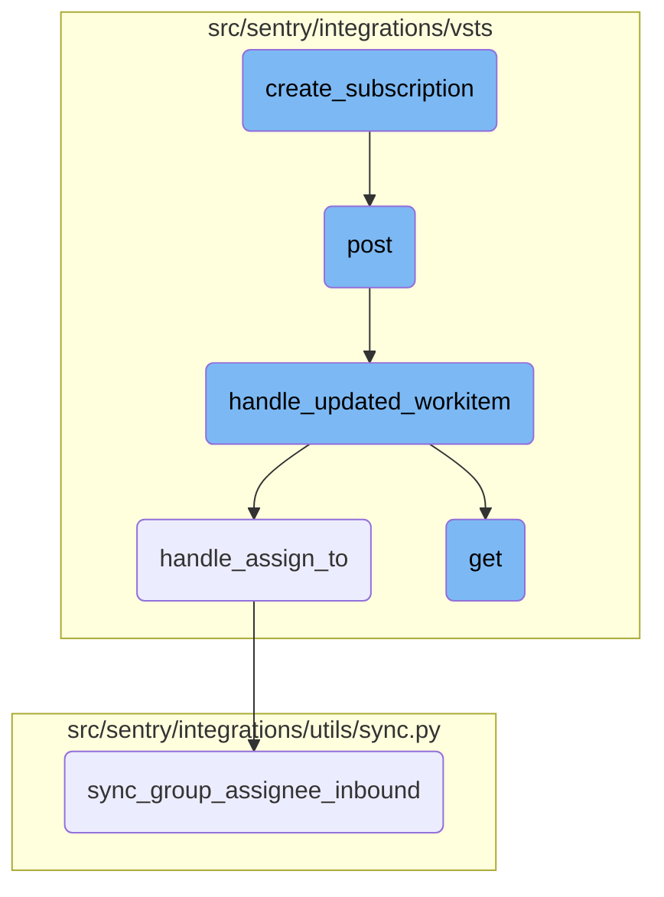

In this document, we will explain the process of creating a subscription for work item updates and handling the subsequent webhook events. The process involves setting up a webhook, processing incoming requests, handling updated work items, and syncing assignee information.

The flow starts with creating a subscription that sets up a webhook for work item updates. When an update occurs, a POST request is sent to the webhook URL. This request is processed to extract the event type and verify the webhook secret. If the event type is <SwmToken path="src/sentry/integrations/vsts/client.py" pos="124:7:9" line-data="                &quot;eventType&quot;: &quot;workitem.updated&quot;,">`workitem.updated`</SwmToken>, the updated work item data is handled to extract necessary information like work item ID, project ID, and assigned user. Finally, the assignee information is synced with Sentry.

# Flow drill down



<SwmSnippet path="/src/sentry/integrations/vsts/client.py" line="119">

---

## Creating a Subscription

The <SwmToken path="src/sentry/integrations/vsts/client.py" pos="119:3:3" line-data="    def create_subscription(self, shared_secret: str) -&gt; Response:">`create_subscription`</SwmToken> function sets up a webhook subscription for work item updates in VSTS. It sends a POST request to the VSTS API with details about the event type, consumer, and the URL to be called when the event occurs.

```python
    def create_subscription(self, shared_secret: str) -> Response:
        return self.post(
            VstsApiPath.subscriptions.format(instance=self.base_url),
            data={
                "publisherId": "tfs",
                "eventType": "workitem.updated",
                "resourceVersion": "1.0",
                "consumerId": "webHooks",
                "consumerActionId": "httpRequest",
                "consumerInputs": {
                    "url": absolute_uri("/extensions/vsts/issue-updated/"),
                    "resourceDetailsToSend": "all",
                    "httpHeaders": f"shared-secret:{shared_secret}",
                },
            },
        )
```

---

</SwmSnippet>

<SwmSnippet path="/src/sentry/integrations/vsts/webhooks.py" line="43">

---

## Handling the POST Request

The <SwmToken path="src/sentry/integrations/vsts/webhooks.py" pos="43:3:3" line-data="    def post(self, request: Request, *args: Any, **kwargs: Any) -&gt; Response:">`post`</SwmToken> function processes incoming webhook requests. It extracts the event type and external ID from the request data, verifies the webhook secret, and calls <SwmToken path="src/sentry/integrations/vsts/webhooks.py" pos="151:2:2" line-data="def handle_updated_workitem(data: Mapping[str, Any], integration: RpcIntegration) -&gt; None:">`handle_updated_workitem`</SwmToken> if the event type is <SwmToken path="src/sentry/integrations/vsts/webhooks.py" pos="52:31:33" line-data="        # https://docs.microsoft.com/en-us/azure/devops/service-hooks/events?view=azure-devops#workitem.updated">`workitem.updated`</SwmToken>.

```python
    def post(self, request: Request, *args: Any, **kwargs: Any) -> Response:
        try:
            data = request.data
            event_type = data["eventType"]
            external_id = get_vsts_external_id(data=request.data)
        except Exception as e:
            logger.info("vsts.invalid-webhook-payload", extra={"error": str(e)})
            return self.respond(status=status.HTTP_400_BAD_REQUEST)

        # https://docs.microsoft.com/en-us/azure/devops/service-hooks/events?view=azure-devops#workitem.updated
        if event_type == "workitem.updated":
            integration = integration_service.get_integration(
                provider=PROVIDER_KEY, external_id=external_id
            )
            if integration is None:
                logger.info(
                    "vsts.integration-in-webhook-payload-does-not-exist",
                    extra={"external_id": external_id, "event_type": event_type},
                )
                return self.respond(
                    {"detail": "Integration does not exist."}, status=status.HTTP_400_BAD_REQUEST
```

---

</SwmSnippet>

<SwmSnippet path="/src/sentry/integrations/vsts/webhooks.py" line="151">

---

## Handling Updated Work Item

The <SwmToken path="src/sentry/integrations/vsts/webhooks.py" pos="151:2:2" line-data="def handle_updated_workitem(data: Mapping[str, Any], integration: RpcIntegration) -&gt; None:">`handle_updated_workitem`</SwmToken> function processes the data from an updated work item event. It extracts necessary information such as the work item ID, project ID, assigned user, and status change. It then calls <SwmToken path="src/sentry/integrations/vsts/webhooks.py" pos="89:2:2" line-data="def handle_assign_to(">`handle_assign_to`</SwmToken> to sync the assignee and <SwmToken path="src/sentry/integrations/vsts/webhooks.py" pos="124:2:2" line-data="def handle_status_change(">`handle_status_change`</SwmToken> to update the status.

```python
def handle_updated_workitem(data: Mapping[str, Any], integration: RpcIntegration) -> None:
    project: str | None = None
    try:
        external_issue_key = data["resource"]["workItemId"]
    except KeyError as e:
        logger.info(
            "vsts.updating-workitem-does-not-have-necessary-information",
            extra={"error": str(e), "integration_id": integration.id},
        )
        return

    try:
        project = data["resourceContainers"]["project"]["id"]
    except KeyError as e:
        logger.info(
            "vsts.updating-workitem-does-not-have-necessary-information",
            extra={"error": str(e), "integration_id": integration.id},
        )

    try:
        assigned_to = data["resource"]["fields"].get("System.AssignedTo")
```

---

</SwmSnippet>

<SwmSnippet path="/src/sentry/integrations/vsts/webhooks.py" line="89">

---

### Syncing Group Assignee

The <SwmToken path="src/sentry/integrations/vsts/webhooks.py" pos="89:2:2" line-data="def handle_assign_to(">`handle_assign_to`</SwmToken> function handles the assignment of a work item to a user. It parses the email of the assigned user and calls <SwmToken path="src/sentry/integrations/utils/sync.py" pos="64:2:2" line-data="def sync_group_assignee_inbound(">`sync_group_assignee_inbound`</SwmToken> to sync the assignee information with Sentry.

```python
def handle_assign_to(
    integration: RpcIntegration,
    external_issue_key: str | None,
    assigned_to: Mapping[str, str] | None,
) -> None:
    if not assigned_to:
        return

    email: str | None = None
    assign = False

    new_value = assigned_to.get("newValue")
    if new_value is not None:
        email = parse_email(new_value)
        if not email:
            logger.info(
                "vsts.failed-to-parse-email-in-handle-assign-to",
                extra={
                    "error": "parse_error",
                    "integration_id": integration.id,
                    "assigned_to_values": assigned_to,
```

---

</SwmSnippet>

<SwmSnippet path="/src/sentry/integrations/vsts/search.py" line="23">

---

## Fetching Integration Data

The <SwmToken path="src/sentry/integrations/vsts/search.py" pos="23:3:3" line-data="    def get(">`get`</SwmToken> function retrieves integration data based on the provided request parameters. It fetches the integration object, validates the request parameters, and performs a search for external issues if the field is <SwmToken path="src/sentry/integrations/vsts/search.py" pos="45:8:8" line-data="        if field == &quot;externalIssue&quot;:">`externalIssue`</SwmToken>.

```python
    def get(
        self, request: Request, organization: RpcOrganization, integration_id: int, **kwds: Any
    ) -> Response:
        try:
            integration = Integration.objects.get(
                organizationintegration__organization_id=coerce_id_from(organization),
                id=integration_id,
                provider="vsts",
            )
        except Integration.DoesNotExist:
            return Response(status=404)

        field = request.GET.get("field")
        query = request.GET.get("query")
        if field is None:
            return Response({"detail": "field is a required parameter"}, status=400)
        if not query:
            return Response({"detail": "query is a required parameter"}, status=400)

        installation = integration.get_installation(organization.id)
        assert isinstance(installation, VstsIntegration), installation
```

---

</SwmSnippet>

<SwmSnippet path="/src/sentry/integrations/utils/sync.py" line="64">

---

### Syncing Group Assignee Inbound

The <SwmToken path="src/sentry/integrations/utils/sync.py" pos="64:2:2" line-data="def sync_group_assignee_inbound(">`sync_group_assignee_inbound`</SwmToken> function assigns linked groups to matching users based on the provided email and external issue key. It checks project membership and updates the group assignee information accordingly.

```python
def sync_group_assignee_inbound(
    integration: RpcIntegration,
    email: str | None,
    external_issue_key: str,
    assign: bool = True,
) -> Sequence[Group]:
    """
    Given an integration, user email address and an external issue key,
    assign linked groups to matching users. Checks project membership.
    Returns a list of groups that were successfully assigned.
    """

    logger = logging.getLogger(f"sentry.integrations.{integration.provider}")

    orgs_with_sync_enabled = where_should_sync(integration, "inbound_assignee")
    affected_groups = Group.objects.get_groups_by_external_issue(
        integration,
        orgs_with_sync_enabled,
        external_issue_key,
    )
    log_context = {
```

---

</SwmSnippet>

&nbsp;

*This is an auto-generated document by Swimm AI 🌊 and has not yet been verified by a human*

<SwmMeta version="3.0.0" repo-id="Z2l0aHViJTNBJTNBc2VudHJ5LWRlbW8tMSUzQSUzQVN3aW1tLURlbW8=" repo-name="sentry-demo-1" doc-type="flows"><sup>Powered by [Swimm](/)</sup></SwmMeta>
