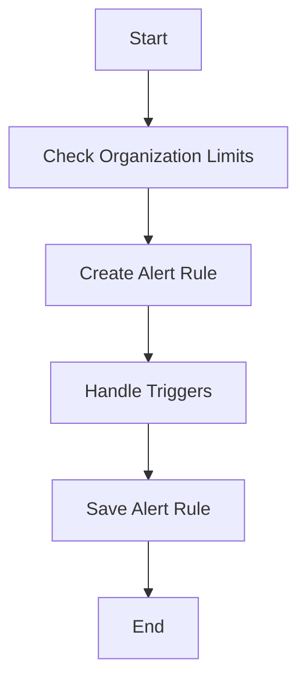

The process of creating alert rules involves several steps to ensure that the rules are set up correctly and efficiently. This document will cover:

1. Checking organization limits
2. Creating the alert rule
3. Handling triggers
4. Saving the alert rule

Technical document: <SwmLink doc-title="Creating Alert Rules">[Creating Alert Rules](/.swm/creating-alert-rules.zn6siko8.sw.md)</SwmLink>

# [Checking Organization Limits](https://app.swimm.io/repos/Z2l0aHViJTNBJTNBc2VudHJ5LWRlbW8tMSUzQSUzQVN3aW1tLURlbW8=/docs/zn6siko8#creating-alert-rules)

Before creating an alert rule, we need to ensure that the organization has not exceeded the maximum number of allowed metric alerts. This is done by counting the active, creating, and updating metric alerts for the organization. If the count exceeds the allowed limit, an error is raised, preventing the creation of new alert rules. This step ensures that the system remains performant and that organizations do not overuse resources.

# [Creating the Alert Rule](https://app.swimm.io/repos/Z2l0aHViJTNBJTNBc2VudHJ5LWRlbW8tMSUzQSUzQVN3aW1tLURlbW8=/docs/zn6siko8#creating-alert-rules)

Once the organization limits are verified, the next step is to create the alert rule. This involves configuring various parameters such as the organization, projects, name, query, and other settings that define the conditions under which the alert should be triggered. The alert rule is then created and stored in the database. This step is crucial as it sets up the monitoring conditions that will be used to detect issues in the application.

# [Handling Triggers](https://app.swimm.io/repos/Z2l0aHViJTNBJTNBc2VudHJ5LWRlbW8tMSUzQSUzQVN3aW1tLURlbW8=/docs/zn6siko8#handling-triggers)

After creating the alert rule, the associated triggers need to be managed. Triggers define the specific conditions that, when met, will activate the alert. The process involves deleting any triggers that are not present in the incoming data and processing each trigger to either update existing ones or create new ones. This ensures that the alert rule is always up-to-date with the latest conditions specified by the user.

# [Saving the Alert Rule](https://app.swimm.io/repos/Z2l0aHViJTNBJTNBc2VudHJ5LWRlbW8tMSUzQSUzQVN3aW1tLURlbW8=/docs/zn6siko8#saving-alert-rules)

The final step in the process is saving the alert rule. This involves normalizing the event data, updating project configurations, and handling any duplicate events. The event data is then saved into the database, ensuring that all related models are updated accordingly. This step is essential to ensure that the alert rule is properly stored and can be used to monitor the specified conditions effectively.

&nbsp;

*This is an auto-generated document by Swimm AI 🌊 and has not yet been verified by a human*

<SwmMeta version="3.0.0" repo-id="Z2l0aHViJTNBJTNBc2VudHJ5LWRlbW8tMSUzQSUzQVN3aW1tLURlbW8=" repo-name="sentry-demo-1" doc-type="product-flows">Powered by [Swimm](/)</SwmMeta>
