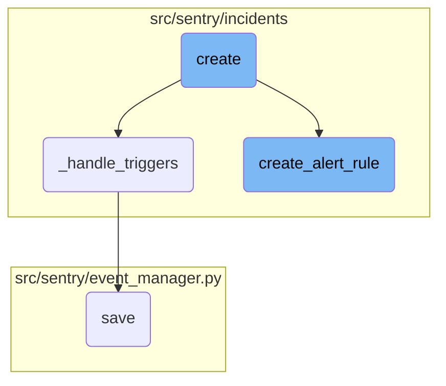

In this document, we will explain the process of creating an alert rule. The process involves several steps including validating input parameters, creating necessary database entries, and setting up the alert rule to monitor specified conditions.

The flow starts by checking if the organization has exceeded the maximum number of allowed metric alerts. If not, it proceeds to create the alert rule by calling the <SwmToken path="src/sentry/incidents/serializers/alert_rule.py" pos="497:5:5" line-data="                alert_rule = create_alert_rule(">`create_alert_rule`</SwmToken> function. This function takes various parameters such as organization, projects, name, query, and more to configure the alert rule. After creating the alert rule, it handles the associated triggers by calling the <SwmToken path="src/sentry/incidents/serializers/alert_rule.py" pos="541:3:3" line-data="    def _handle_triggers(self, alert_rule, triggers):">`_handle_triggers`</SwmToken> function. This function manages the triggers by deleting any that are not present in the incoming data and processing each trigger, either updating existing ones or creating new ones. Finally, the event data is saved into the database, ensuring that all related models are updated accordingly.

# Flow drill down



<SwmSnippet path="/src/sentry/incidents/serializers/alert_rule.py" line="541">

---

## Handling Triggers

The <SwmToken path="src/sentry/incidents/serializers/alert_rule.py" pos="541:3:3" line-data="    def _handle_triggers(self, alert_rule, triggers):">`_handle_triggers`</SwmToken> function manages the triggers associated with an alert rule. It first deletes any triggers that are not present in the incoming data. Then, it processes each trigger, either updating existing ones or creating new ones. If there are any validation errors during this process, they are raised appropriately.

```python
    def _handle_triggers(self, alert_rule, triggers):
        channel_lookup_timeout_error = None
        if triggers is not None:
            # Delete triggers we don't have present in the incoming data
            trigger_ids = [x["id"] for x in triggers if "id" in x]
            triggers_to_delete = AlertRuleTrigger.objects.filter(alert_rule=alert_rule).exclude(
                id__in=trigger_ids
            )
            for trigger in triggers_to_delete:
                delete_alert_rule_trigger(trigger)

            for trigger_data in triggers:
                if "id" in trigger_data:
                    trigger_instance = AlertRuleTrigger.objects.get(
                        alert_rule=alert_rule, id=trigger_data["id"]
                    )
                else:
                    trigger_instance = None

                trigger_serializer = AlertRuleTriggerSerializer(
                    context={
```

---

</SwmSnippet>

<SwmSnippet path="/src/sentry/incidents/logic.py" line="507">

---

## Creating Alert Rules

The <SwmToken path="src/sentry/incidents/logic.py" pos="507:2:2" line-data="def create_alert_rule(">`create_alert_rule`</SwmToken> function is responsible for creating an alert rule for an organization. It takes various parameters such as organization, projects, name, query, and more to configure the alert rule. The function validates the input parameters, creates the necessary database entries, and sets up the alert rule to monitor specified conditions. If any errors occur during this process, they are handled and appropriate messages are raised.

```python
def create_alert_rule(
    organization,
    projects,
    name,
    query,
    aggregate,
    time_window,
    threshold_type,
    threshold_period,
    owner: Actor | None = None,
    resolve_threshold=None,
    environment=None,
    include_all_projects=False,
    excluded_projects=None,
    query_type: SnubaQuery.Type = SnubaQuery.Type.ERROR,
    dataset=Dataset.Events,
    user=None,
    event_types=None,
    comparison_delta: int | None = None,
    monitor_type: AlertRuleMonitorTypeInt = AlertRuleMonitorTypeInt.CONTINUOUS,
    activation_condition: AlertRuleActivationConditionType | None = None,
```

---

</SwmSnippet>

<SwmSnippet path="/src/sentry/event_manager.py" line="448">

---

### Saving Alert Rules

The <SwmToken path="src/sentry/event_manager.py" pos="448:3:3" line-data="    def save(">`save`</SwmToken> function in <SwmPath>[src/sentry/event_manager.py](src/sentry/event_manager.py)</SwmPath> is responsible for saving the event data into the database and ensuring that all related models are updated accordingly. This includes normalizing the event data, updating project configurations, and handling any duplicate events.

```python
    def save(
        self,
        project_id: int | None,
        raw: bool = False,
        assume_normalized: bool = False,
        start_time: float | None = None,
        cache_key: str | None = None,
        skip_send_first_transaction: bool = False,
        has_attachments: bool = False,
    ) -> Event:
        """
        After normalizing and processing an event, save adjacent models such as
        releases and environments to postgres and write the event into
        eventstream. From there it will be picked up by Snuba and
        post-processing.

        We re-insert events with duplicate IDs into Snuba, which is responsible
        for deduplicating events. Since deduplication in Snuba is on the primary
        key (based on event ID, project ID and day), events with same IDs are only
        deduplicated if their timestamps fall on the same day. The latest event
        always wins and overwrites the value of events received earlier in that day.
```

---

</SwmSnippet>

<SwmSnippet path="/src/sentry/incidents/serializers/alert_rule.py" line="480">

---

## Creating Alert Rules

The <SwmToken path="src/sentry/incidents/serializers/alert_rule.py" pos="480:3:3" line-data="    def create(self, validated_data):">`create`</SwmToken> function in <SwmPath>[src/sentry/incidents/serializers/alert_rule.py](src/sentry/incidents/serializers/alert_rule.py)</SwmPath> is the entry point for creating an alert rule. It first checks if the organization has exceeded the maximum number of allowed metric alerts. If not, it proceeds to create the alert rule by calling <SwmToken path="src/sentry/incidents/serializers/alert_rule.py" pos="497:5:5" line-data="                alert_rule = create_alert_rule(">`create_alert_rule`</SwmToken> and then handles the associated triggers by calling <SwmToken path="src/sentry/incidents/serializers/alert_rule.py" pos="541:3:3" line-data="    def _handle_triggers(self, alert_rule, triggers):">`_handle_triggers`</SwmToken>.

```python
    def create(self, validated_data):
        org_subscription_count = QuerySubscription.objects.filter(
            project__organization_id=self.context["organization"].id,
            status__in=(
                QuerySubscription.Status.ACTIVE.value,
                QuerySubscription.Status.CREATING.value,
                QuerySubscription.Status.UPDATING.value,
            ),
        ).count()

        if org_subscription_count >= settings.MAX_QUERY_SUBSCRIPTIONS_PER_ORG:
            raise serializers.ValidationError(
                f"You may not exceed {settings.MAX_QUERY_SUBSCRIPTIONS_PER_ORG} metric alerts per organization"
            )
        with transaction.atomic(router.db_for_write(AlertRule)):
            triggers = validated_data.pop("triggers")
            try:
                alert_rule = create_alert_rule(
                    user=self.context.get("user", None),
                    organization=self.context["organization"],
                    ip_address=self.context.get("ip_address"),
```

---

</SwmSnippet>

&nbsp;

*This is an auto-generated document by Swimm AI 🌊 and has not yet been verified by a human*

<SwmMeta version="3.0.0" repo-id="Z2l0aHViJTNBJTNBc2VudHJ5LWRlbW8tMSUzQSUzQVN3aW1tLURlbW8=" repo-name="sentry-demo-1" doc-type="flows"><sup>Powered by [Swimm](/)</sup></SwmMeta>
