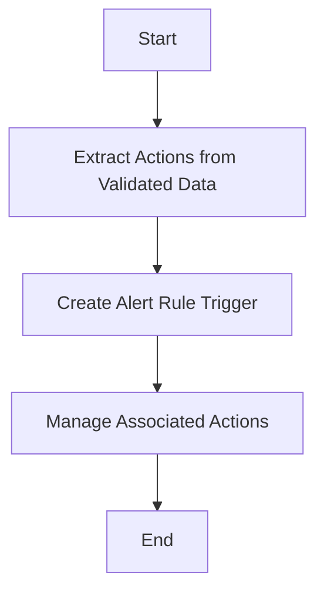

This document will cover the process of creating an alert rule trigger. We'll cover:

1. Extracting actions from validated data
2. Creating the alert rule trigger
3. Managing associated actions

Technical document: <SwmLink doc-title="Creating an Alert Rule Trigger">[Creating an Alert Rule Trigger](/.swm/creating-an-alert-rule-trigger.mvbodav2.sw.md)</SwmLink>

# [Extracting Actions from Validated Data](https://app.swimm.io/repos/Z2l0aHViJTNBJTNBc2VudHJ5LWRlbW8tMSUzQSUzQVN3aW1tLURlbW8=/docs/mvbodav2#creating-alert-rule-triggers)

The first step in creating an alert rule trigger is to extract actions from the validated data. This involves identifying any actions that need to be taken when the alert rule is triggered. These actions are typically specified by the user when they create or update an alert rule. Extracting these actions ensures that we have all the necessary information to proceed with creating the alert rule trigger.

# [Creating the Alert Rule Trigger](https://app.swimm.io/repos/Z2l0aHViJTNBJTNBc2VudHJ5LWRlbW8tMSUzQSUzQVN3aW1tLURlbW8=/docs/mvbodav2#creating-alert-rule-triggers)

Once the actions have been extracted, the next step is to create the alert rule trigger. This involves using the extracted data to set up the trigger. The alert rule trigger is a mechanism that monitors specific conditions or thresholds defined by the user. When these conditions are met, the trigger activates and initiates the associated actions. This step is crucial as it ensures that the alert rule is properly configured to monitor the desired conditions.

# [Managing Associated Actions](https://app.swimm.io/repos/Z2l0aHViJTNBJTNBc2VudHJ5LWRlbW8tMSUzQSUzQVN3aW1tLURlbW8=/docs/mvbodav2#handling-actions-for-alert-rule-triggers)

After the alert rule trigger has been created, the final step is to manage the associated actions. This involves updating or creating new actions as necessary. If there are any actions that are no longer relevant, they are deleted. The system then iterates over the provided actions, updating existing ones or creating new ones as needed. This step also includes handling validation and potential errors to ensure that all actions are correctly configured and ready to be executed when the alert rule is triggered.

&nbsp;

*This is an auto-generated document by Swimm AI 🌊 and has not yet been verified by a human*

<SwmMeta version="3.0.0" repo-id="Z2l0aHViJTNBJTNBc2VudHJ5LWRlbW8tMSUzQSUzQVN3aW1tLURlbW8=" repo-name="sentry-demo-1" doc-type="product-flows">Powered by [Swimm](/)</SwmMeta>
