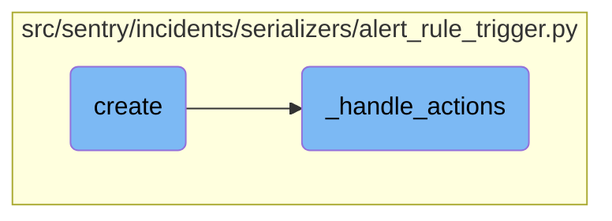

In this document, we will explain the process of creating an alert rule trigger. The process involves extracting actions from validated data, creating the alert rule trigger, and managing the associated actions.

The flow starts by extracting actions from the validated data. Then, it creates the alert rule trigger using the extracted data. After the trigger is created, it handles the associated actions by updating or creating new actions as necessary.

# Flow drill down



<SwmSnippet path="/src/sentry/incidents/serializers/alert_rule_trigger.py" line="40">

---

## Creating Alert Rule Triggers

The <SwmToken path="src/sentry/incidents/serializers/alert_rule_trigger.py" pos="40:3:3" line-data="    def create(self, validated_data):">`create`</SwmToken> function is responsible for creating an alert rule trigger. It extracts the actions from the validated data and then calls <SwmToken path="src/sentry/incidents/serializers/alert_rule_trigger.py" pos="43:5:5" line-data="            alert_rule_trigger = create_alert_rule_trigger(">`create_alert_rule_trigger`</SwmToken> to create the trigger. After creating the trigger, it calls <SwmToken path="src/sentry/incidents/serializers/alert_rule_trigger.py" pos="46:3:3" line-data="            self._handle_actions(alert_rule_trigger, actions)">`_handle_actions`</SwmToken> to manage the associated actions.

```python
    def create(self, validated_data):
        try:
            actions = validated_data.pop("actions", None)
            alert_rule_trigger = create_alert_rule_trigger(
                alert_rule=self.context["alert_rule"], **validated_data
            )
            self._handle_actions(alert_rule_trigger, actions)

            return alert_rule_trigger
        except forms.ValidationError as e:
            # if we fail in create_alert_rule_trigger, then only one message is ever returned
            raise serializers.ValidationError(e.error_list[0].message)
        except AlertRuleTriggerLabelAlreadyUsedError:
            raise serializers.ValidationError("This label is already in use for this alert rule")
```

---

</SwmSnippet>

<SwmSnippet path="/src/sentry/incidents/serializers/alert_rule_trigger.py" line="69">

---

## Handling Actions for Alert Rule Triggers

The <SwmToken path="src/sentry/incidents/serializers/alert_rule_trigger.py" pos="69:3:3" line-data="    def _handle_actions(self, alert_rule_trigger, actions):">`_handle_actions`</SwmToken> function manages the actions associated with an alert rule trigger. It first deletes any actions that are not present in the updated data. Then, it iterates over the provided actions, updating or creating new actions as necessary. The function also handles validation and potential errors, such as <SwmToken path="src/sentry/incidents/serializers/alert_rule_trigger.py" pos="8:1:1" line-data="    ChannelLookupTimeoutError,">`ChannelLookupTimeoutError`</SwmToken>.

```python
    def _handle_actions(self, alert_rule_trigger, actions):
        channel_lookup_timeout_error = None
        if actions is not None:
            # Delete actions we don't have present in the updated data.
            action_ids = [x["id"] for x in actions if "id" in x]
            actions_to_delete = AlertRuleTriggerAction.objects.filter(
                alert_rule_trigger=alert_rule_trigger
            ).exclude(id__in=action_ids)
            for action in actions_to_delete:
                delete_alert_rule_trigger_action(action)

            for action_data in actions:
                action_data = rewrite_trigger_action_fields(action_data)
                if "id" in action_data:
                    action_instance = AlertRuleTriggerAction.objects.get(
                        alert_rule_trigger=alert_rule_trigger, id=action_data["id"]
                    )
                else:
                    action_instance = None

                action_serializer = AlertRuleTriggerActionSerializer(
```

---

</SwmSnippet>

# Where is this flow used?

This flow is used multiple times in the codebase as represented in the following diagram:

(Note - these are only some of the entry points of this flow)

```mermaid
graph TD;
      subgraph src/sentry/incidents
c9d1dea802e3f82c6d936ce5a724b36abf3277c63763527f0378f9ca337dfaee(handle_snuba_query_update):::rootsStyle --> cbd86f4033e27fec43fa7d8fd0ccb20fd0aab7d9a94337f8f7b2fcc9435b7b46(process_update)
end

subgraph src/sentry/incidents
cbd86f4033e27fec43fa7d8fd0ccb20fd0aab7d9a94337f8f7b2fcc9435b7b46(process_update) --> 6bd26975d248e96b52df4ed3319306e7c9ef381049a7769c0692b44d2f8589d5(trigger_alert_threshold)
end

subgraph src/sentry/incidents
6bd26975d248e96b52df4ed3319306e7c9ef381049a7769c0692b44d2f8589d5(trigger_alert_threshold) --> 803b71ae718bd2f5f17fb0becab9e16a40aa9915c4016a7272925a8e77de9436(create_incident)
end

subgraph src/sentry/incidents
803b71ae718bd2f5f17fb0becab9e16a40aa9915c4016a7272925a8e77de9436(create_incident) --> 3d3372c9ba8b72c81622e85e94c61a6b1c8c8166dee7c2ba3bde07dba9f8aee7(create_incident_activity)
end

subgraph src/sentry/incidents/serializers
3d3372c9ba8b72c81622e85e94c61a6b1c8c8166dee7c2ba3bde07dba9f8aee7(create_incident_activity) --> 1e1cb398de04140375fe38cf061bc16fcaf4bb0a8b605e4cd48e1e622e417456(create):::mainFlowStyle
end

subgraph src/sentry/utils/mockdata/core.py
227eaee48f790cb276fab7c3bb5c4aed07dc34a153c81931559b3ec413b1cb32(main):::rootsStyle --> b2697e2f3fe02b7fbae9a189f9df5d08eeba145a18941b89c2753a2a94414bf5(create_metric_alert_rule)
end

subgraph src/sentry/incidents
b2697e2f3fe02b7fbae9a189f9df5d08eeba145a18941b89c2753a2a94414bf5(create_metric_alert_rule) --> 803b71ae718bd2f5f17fb0becab9e16a40aa9915c4016a7272925a8e77de9436(create_incident)
end

subgraph src/sentry/incidents
9865f7ba5d55fc3791619230fe3ce4238f4ffd42a81dfc0f9e1f70d200b898f0(update):::rootsStyle --> c8983c536375ccf1ca345d7b55fe45bad9670194277041a6012cfdb25f1fca8a(update_alert_rule)
end

subgraph src/sentry/incidents
c8983c536375ccf1ca345d7b55fe45bad9670194277041a6012cfdb25f1fca8a(update_alert_rule) --> 7a031b1eee688c53e198bc19713a363db4375f592fff8093838714af922c5473(snapshot_alert_rule)
end

subgraph src/sentry/incidents/serializers
7a031b1eee688c53e198bc19713a363db4375f592fff8093838714af922c5473(snapshot_alert_rule) --> 1e1cb398de04140375fe38cf061bc16fcaf4bb0a8b605e4cd48e1e622e417456(create):::mainFlowStyle
end

subgraph src/sentry/incidents
9834f79b7365b7a2686fcb739c8b4ce9c2365e44bca45f55ca541506d724b28a(create):::rootsStyle --> 84bf78faf60c4c34dd52053b68c7cdd26a5748932df0481a53b3be7620a28b37(create_alert_rule)
end

subgraph src/sentry/incidents/serializers
84bf78faf60c4c34dd52053b68c7cdd26a5748932df0481a53b3be7620a28b37(create_alert_rule) --> 1e1cb398de04140375fe38cf061bc16fcaf4bb0a8b605e4cd48e1e622e417456(create):::mainFlowStyle
end

subgraph src/sentry/incidents
a8e02a827a5696ba849adbd39852b4c4204666c005e5f80c697f5c41cf1e394c(auto_resolve_snapshot_incidents):::rootsStyle --> 922d429168c38719843b1204b783654ae39d4b7d1654118db9c37e44d24275de(update_incident_status)
end

subgraph src/sentry/incidents
922d429168c38719843b1204b783654ae39d4b7d1654118db9c37e44d24275de(update_incident_status) --> 3d3372c9ba8b72c81622e85e94c61a6b1c8c8166dee7c2ba3bde07dba9f8aee7(create_incident_activity)
end


      classDef mainFlowStyle color:#000000,fill:#7CB9F4
classDef rootsStyle color:#000000,fill:#00FFF4
classDef Style1 color:#000000,fill:#00FFAA
classDef Style2 color:#000000,fill:#FFFF00
classDef Style3 color:#000000,fill:#AA7CB9

%% Swimm:
%% graph TD;
%%       subgraph <SwmPath>[src/sentry/incidents/](src/sentry/incidents/)</SwmPath>
%% c9d1dea802e3f82c6d936ce5a724b36abf3277c63763527f0378f9ca337dfaee(handle_snuba_query_update):::rootsStyle --> cbd86f4033e27fec43fa7d8fd0ccb20fd0aab7d9a94337f8f7b2fcc9435b7b46(process_update)
%% end
%% 
%% subgraph <SwmPath>[src/sentry/incidents/](src/sentry/incidents/)</SwmPath>
%% cbd86f4033e27fec43fa7d8fd0ccb20fd0aab7d9a94337f8f7b2fcc9435b7b46(process_update) --> 6bd26975d248e96b52df4ed3319306e7c9ef381049a7769c0692b44d2f8589d5(trigger_alert_threshold)
%% end
%% 
%% subgraph <SwmPath>[src/sentry/incidents/](src/sentry/incidents/)</SwmPath>
%% 6bd26975d248e96b52df4ed3319306e7c9ef381049a7769c0692b44d2f8589d5(trigger_alert_threshold) --> 803b71ae718bd2f5f17fb0becab9e16a40aa9915c4016a7272925a8e77de9436(create_incident)
%% end
%% 
%% subgraph <SwmPath>[src/sentry/incidents/](src/sentry/incidents/)</SwmPath>
%% 803b71ae718bd2f5f17fb0becab9e16a40aa9915c4016a7272925a8e77de9436(create_incident) --> 3d3372c9ba8b72c81622e85e94c61a6b1c8c8166dee7c2ba3bde07dba9f8aee7(create_incident_activity)
%% end
%% 
%% subgraph <SwmPath>[src/sentry/incidents/serializers/](src/sentry/incidents/serializers/)</SwmPath>
%% 3d3372c9ba8b72c81622e85e94c61a6b1c8c8166dee7c2ba3bde07dba9f8aee7(create_incident_activity) --> 1e1cb398de04140375fe38cf061bc16fcaf4bb0a8b605e4cd48e1e622e417456(create):::mainFlowStyle
%% end
%% 
%% subgraph <SwmPath>[src/sentry/utils/mockdata/core.py](src/sentry/utils/mockdata/core.py)</SwmPath>
%% 227eaee48f790cb276fab7c3bb5c4aed07dc34a153c81931559b3ec413b1cb32(main):::rootsStyle --> b2697e2f3fe02b7fbae9a189f9df5d08eeba145a18941b89c2753a2a94414bf5(create_metric_alert_rule)
%% end
%% 
%% subgraph <SwmPath>[src/sentry/incidents/](src/sentry/incidents/)</SwmPath>
%% b2697e2f3fe02b7fbae9a189f9df5d08eeba145a18941b89c2753a2a94414bf5(create_metric_alert_rule) --> 803b71ae718bd2f5f17fb0becab9e16a40aa9915c4016a7272925a8e77de9436(create_incident)
%% end
%% 
%% subgraph <SwmPath>[src/sentry/incidents/](src/sentry/incidents/)</SwmPath>
%% 9865f7ba5d55fc3791619230fe3ce4238f4ffd42a81dfc0f9e1f70d200b898f0(update):::rootsStyle --> c8983c536375ccf1ca345d7b55fe45bad9670194277041a6012cfdb25f1fca8a(update_alert_rule)
%% end
%% 
%% subgraph <SwmPath>[src/sentry/incidents/](src/sentry/incidents/)</SwmPath>
%% c8983c536375ccf1ca345d7b55fe45bad9670194277041a6012cfdb25f1fca8a(update_alert_rule) --> 7a031b1eee688c53e198bc19713a363db4375f592fff8093838714af922c5473(snapshot_alert_rule)
%% end
%% 
%% subgraph <SwmPath>[src/sentry/incidents/serializers/](src/sentry/incidents/serializers/)</SwmPath>
%% 7a031b1eee688c53e198bc19713a363db4375f592fff8093838714af922c5473(snapshot_alert_rule) --> 1e1cb398de04140375fe38cf061bc16fcaf4bb0a8b605e4cd48e1e622e417456(create):::mainFlowStyle
%% end
%% 
%% subgraph <SwmPath>[src/sentry/incidents/](src/sentry/incidents/)</SwmPath>
%% 9834f79b7365b7a2686fcb739c8b4ce9c2365e44bca45f55ca541506d724b28a(create):::rootsStyle --> 84bf78faf60c4c34dd52053b68c7cdd26a5748932df0481a53b3be7620a28b37(create_alert_rule)
%% end
%% 
%% subgraph <SwmPath>[src/sentry/incidents/serializers/](src/sentry/incidents/serializers/)</SwmPath>
%% 84bf78faf60c4c34dd52053b68c7cdd26a5748932df0481a53b3be7620a28b37(create_alert_rule) --> 1e1cb398de04140375fe38cf061bc16fcaf4bb0a8b605e4cd48e1e622e417456(create):::mainFlowStyle
%% end
%% 
%% subgraph <SwmPath>[src/sentry/incidents/](src/sentry/incidents/)</SwmPath>
%% a8e02a827a5696ba849adbd39852b4c4204666c005e5f80c697f5c41cf1e394c(auto_resolve_snapshot_incidents):::rootsStyle --> 922d429168c38719843b1204b783654ae39d4b7d1654118db9c37e44d24275de(update_incident_status)
%% end
%% 
%% subgraph <SwmPath>[src/sentry/incidents/](src/sentry/incidents/)</SwmPath>
%% 922d429168c38719843b1204b783654ae39d4b7d1654118db9c37e44d24275de(update_incident_status) --> 3d3372c9ba8b72c81622e85e94c61a6b1c8c8166dee7c2ba3bde07dba9f8aee7(create_incident_activity)
%% end
%% 
%% 
%%       classDef mainFlowStyle color:#000000,fill:#7CB9F4
%% classDef rootsStyle color:#000000,fill:#00FFF4
%% classDef Style1 color:#000000,fill:#00FFAA
%% classDef Style2 color:#000000,fill:#FFFF00
%% classDef Style3 color:#000000,fill:#AA7CB9
```



&nbsp;

*This is an auto-generated document by Swimm AI 🌊 and has not yet been verified by a human*

<SwmMeta version="3.0.0" repo-id="Z2l0aHViJTNBJTNBc2VudHJ5LWRlbW8tMSUzQSUzQVN3aW1tLURlbW8=" repo-name="sentry-demo-1" doc-type="flows"><sup>Powered by [Swimm](/)</sup></SwmMeta>
