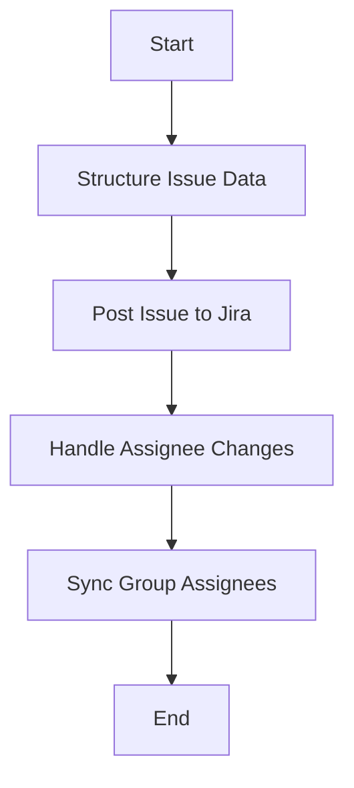

This document will cover the process of creating an issue in Jira using Sentry. We'll cover:

1. Structuring the issue data
2. Posting the issue to Jira
3. Handling assignee changes
4. Synchronizing group assignees.

Technical document: <SwmLink doc-title="Creating an Issue in Jira">[Creating an Issue in Jira](/.swm/creating-an-issue-in-jira.p2vkfepz.sw.md)</SwmLink>

# [Structuring the Issue Data](https://app.swimm.io/repos/Z2l0aHViJTNBJTNBc2VudHJ5LWRlbW8tMSUzQSUzQVN3aW1tLURlbW8=/docs/p2vkfepz#creating-an-issue)

The process begins by structuring the issue data into a dictionary format. This structured data includes all necessary fields required by Jira to create an issue. The data is organized to ensure that Jira can interpret and process it correctly.

# [Posting the Issue to Jira](https://app.swimm.io/repos/Z2l0aHViJTNBJTNBc2VudHJ5LWRlbW8tMSUzQSUzQVN3aW1tLURlbW8=/docs/p2vkfepz#posting-the-issue)

Once the issue data is structured, it is posted to Jira using a specific URL. This step involves sending the structured data to Jira's API endpoint responsible for issue creation. The system ensures that the data is transmitted securely and that Jira acknowledges the receipt of the issue data.

# [Handling Assignee Changes](https://app.swimm.io/repos/Z2l0aHViJTNBJTNBc2VudHJ5LWRlbW8tMSUzQSUzQVN3aW1tLURlbW8=/docs/p2vkfepz#handling-assignee-change)

After the issue is created, any changes to the assignee are managed. The system checks if the assignee field has changed in the issue's changelog. If the assignee is removed, the group assignee is deassigned. If a new assignee is added, their email is retrieved, and the group assignee is updated accordingly. This ensures that the correct person is assigned to the issue and that all relevant parties are informed of the change.

# [Synchronizing Group Assignees](https://app.swimm.io/repos/Z2l0aHViJTNBJTNBc2VudHJ5LWRlbW8tMSUzQSUzQVN3aW1tLURlbW8=/docs/p2vkfepz#sync_group_assignee_inbound)

The final step involves synchronizing the group assignee with external systems. This ensures that the assignee information is consistent across all platforms and that any changes are reflected in real-time. The system checks for any affected groups linked to the external issue key and updates the assignee information accordingly. If no groups are affected, it logs this information and returns an empty list.

&nbsp;

*This is an auto-generated document by Swimm AI 🌊 and has not yet been verified by a human*

<SwmMeta version="3.0.0" repo-id="Z2l0aHViJTNBJTNBc2VudHJ5LWRlbW8tMSUzQSUzQVN3aW1tLURlbW8=" repo-name="sentry-demo-1" doc-type="product-flows">Powered by [Swimm](/)</SwmMeta>
