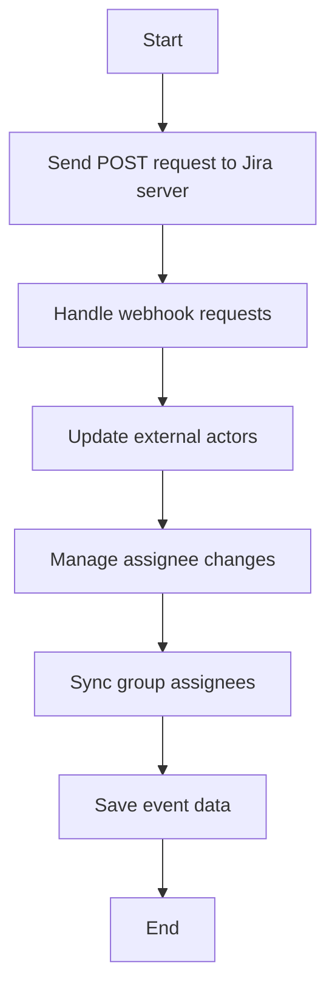

This document will cover the process of creating an issue in the system. We'll cover:

1. Sending a POST request to the Jira server
2. Handling webhook requests
3. Updating external actors
4. Managing assignee changes
5. Syncing group assignees
6. Saving event data.

Technical document: <SwmLink doc-title="Creating an Issue Flow">[Creating an Issue Flow](/.swm/creating-an-issue-flow.w0ayawja.sw.md)</SwmLink>

# [Sending a POST request to the Jira server](https://app.swimm.io/repos/Z2l0aHViJTNBJTNBc2VudHJ5LWRlbW8tMSUzQSUzQVN3aW1tLURlbW8=/docs/w0ayawja#creating-an-issue)

The process begins by sending a POST request to the Jira server with the issue data. This step involves packaging the issue details into a format that Jira can understand and then sending it to Jira's API endpoint. This ensures that the issue is created in Jira with all the necessary information.

# [Handling webhook requests](https://app.swimm.io/repos/Z2l0aHViJTNBJTNBc2VudHJ5LWRlbW8tMSUzQSUzQVN3aW1tLURlbW8=/docs/w0ayawja#handling-webhook-requests)

Once the issue is created, Jira sends a webhook request back to our system. This request contains information about the newly created issue. Our system needs to validate this request to ensure it is legitimate. After validation, the data from the webhook is processed to update our records and trigger any necessary follow-up actions.

# [Updating external actors](https://app.swimm.io/repos/Z2l0aHViJTNBJTNBc2VudHJ5LWRlbW8tMSUzQSUzQVN3aW1tLURlbW8=/docs/w0ayawja#updating-external-actor)

If the issue involves external actors (e.g., users or systems outside of our platform), we need to update their records to reflect the new issue. This step ensures that all relevant external parties are informed about the issue and can take appropriate action. The system checks the type of external actor and updates their information accordingly.

# [Managing assignee changes](https://app.swimm.io/repos/Z2l0aHViJTNBJTNBc2VudHJ5LWRlbW8tMSUzQSUzQVN3aW1tLURlbW8=/docs/w0ayawja#handling-assignee-change)

If the issue's assignee changes, this step handles updating the assignee information. The system checks if the assignee field in the issue data has changed. If it has, the system updates the assignee information and triggers any necessary actions related to the change, such as notifying the new assignee.

# [Syncing group assignees](https://app.swimm.io/repos/Z2l0aHViJTNBJTNBc2VudHJ5LWRlbW8tMSUzQSUzQVN3aW1tLURlbW8=/docs/w0ayawja#syncing-group-assignee)

This step ensures that the correct users are associated with the relevant groups based on the issue data. If the assignee has changed, the system updates the group assignments to reflect this change. This ensures that the right people are assigned to the right tasks and can collaborate effectively.

# [Saving event data](https://app.swimm.io/repos/Z2l0aHViJTNBJTNBc2VudHJ5LWRlbW8tMSUzQSUzQVN3aW1tLURlbW8=/docs/w0ayawja#saving-event-data)

Finally, the system saves the event data to the database. This involves normalizing and processing the data to ensure it is in the correct format. The system then saves the data and triggers any post-processing steps, such as updating counters and frequencies. This ensures that all relevant information is stored and can be accessed later for reporting and analysis.

&nbsp;

*This is an auto-generated document by Swimm AI 🌊 and has not yet been verified by a human*

<SwmMeta version="3.0.0" repo-id="Z2l0aHViJTNBJTNBc2VudHJ5LWRlbW8tMSUzQSUzQVN3aW1tLURlbW8=" repo-name="sentry-demo-1" doc-type="product-flows">Powered by [Swimm](/)</SwmMeta>
