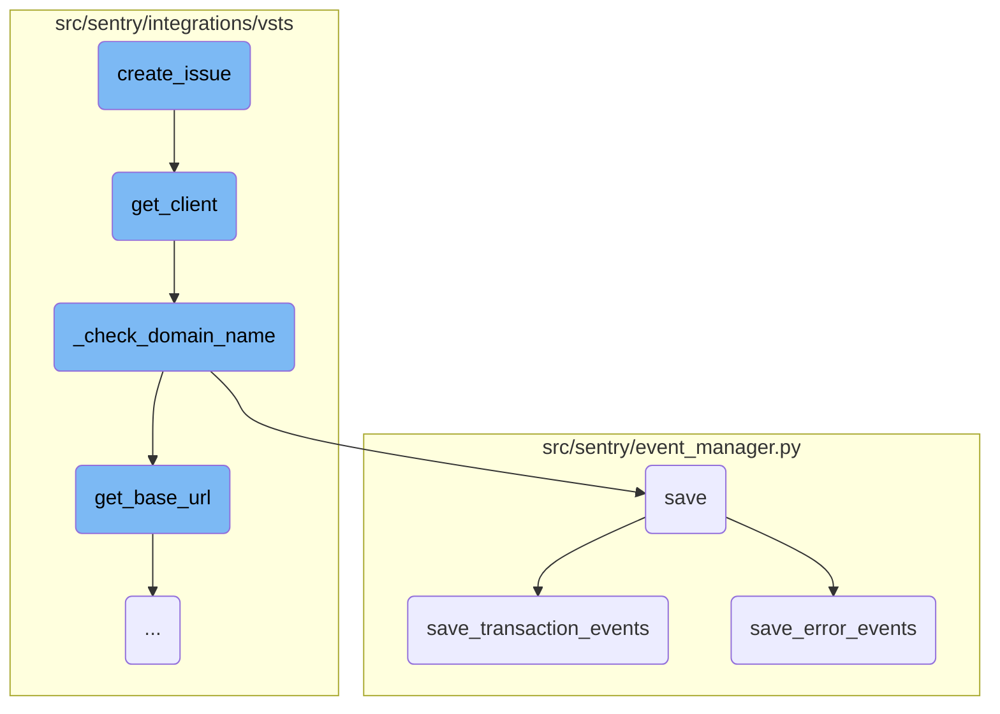
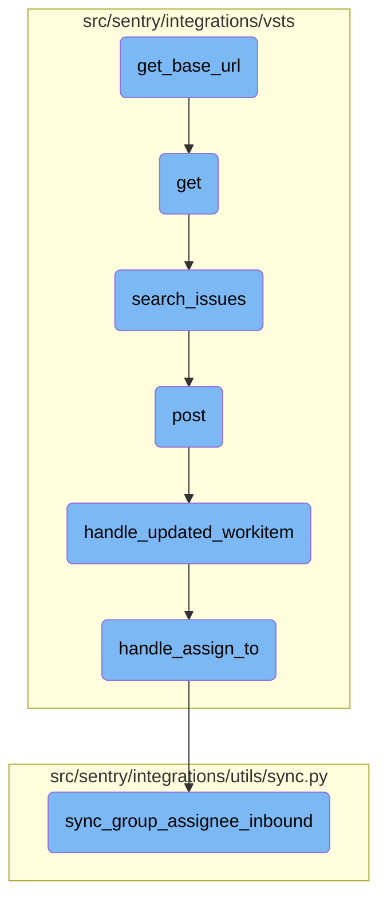

In this document, we will explain the process of creating an issue in Azure <SwmToken path="src/sentry/integrations/vsts/issues.py" pos="175:8:8" line-data="            raise ValueError(&quot;Azure DevOps expects project&quot;)">`DevOps`</SwmToken> using the <SwmToken path="src/sentry/integrations/vsts/issues.py" pos="169:3:3" line-data="    def create_issue(self, data: Mapping[str, str], **kwargs: Any) -&gt; Mapping[str, Any]:">`create_issue`</SwmToken> function. This process involves several steps, including retrieving the project ID, obtaining a client instance, and creating a work item.

The flow starts with retrieving the project ID from the provided data. If the project ID is not found, an error is raised. Next, the <SwmToken path="src/sentry/integrations/vsts/issues.py" pos="177:7:7" line-data="        client = self.get_client()">`get_client`</SwmToken> function is used to obtain a client instance. The function then extracts the title, description, and work item type from the data. Using the client, it attempts to create a work item with the extracted information. If successful, it returns a dictionary containing the issue ID, title, description, and metadata.

Here is a high level diagram of the flow, showing only the most important functions:

```mermaid
graph TD;
      subgraph src/sentry/integrations/vsts
3f635c051f5f191d8407f6894853371e8f254b5c18b4b9b367cd0d6168768b2d(create_issue):::mainFlowStyle --> 0929df67669e089b92a784392a4caa0c21baeadfd85263fa34c49a09c193b3d1(get_client):::mainFlowStyle
end

subgraph src/sentry/integrations/vsts
0929df67669e089b92a784392a4caa0c21baeadfd85263fa34c49a09c193b3d1(get_client):::mainFlowStyle --> 7f10adeb955518d0b9ce9a18ae73cf60c8e87d6b2b7bc87f5b2addc217981d21(_check_domain_name):::mainFlowStyle
end

subgraph src/sentry/event_manager.py
7f10adeb955518d0b9ce9a18ae73cf60c8e87d6b2b7bc87f5b2addc217981d21(_check_domain_name):::mainFlowStyle --> 5086692df24257d76a0adf892eba843feac14033d92b4a32022b125d5a725f9b(save)
end

subgraph src/sentry/integrations/vsts
7f10adeb955518d0b9ce9a18ae73cf60c8e87d6b2b7bc87f5b2addc217981d21(_check_domain_name):::mainFlowStyle --> 3a40802301e1642b0a2d0ce06ddee674da6a7fd8353ad71b1c436be19e6563d6(get_base_url):::mainFlowStyle
end

subgraph src/sentry/integrations/vsts
3a40802301e1642b0a2d0ce06ddee674da6a7fd8353ad71b1c436be19e6563d6(get_base_url):::mainFlowStyle --> c9f1b6abd5b86b248deafac3aa63eb8d055350bf49cbe100c54a0d94ee13361a(get):::mainFlowStyle
end

subgraph src/sentry/integrations/vsts
c9f1b6abd5b86b248deafac3aa63eb8d055350bf49cbe100c54a0d94ee13361a(get):::mainFlowStyle --> fc4a2a7e5f1b5a9d6230778920f9b62f4b7f3caa80ebd97c89444e007895b382(search_issues):::mainFlowStyle
end

subgraph src/sentry/integrations/vsts
fc4a2a7e5f1b5a9d6230778920f9b62f4b7f3caa80ebd97c89444e007895b382(search_issues):::mainFlowStyle --> a0445eff32744589c21cfe40b46d7b4346893653994134be4a340aaaf32b3f6d(post):::mainFlowStyle
end

subgraph src/sentry/integrations/vsts
a0445eff32744589c21cfe40b46d7b4346893653994134be4a340aaaf32b3f6d(post):::mainFlowStyle --> 66e049c83c1ca3a7a23933e320651f77196243d817b62c1a401dfd7205f9a929(handle_updated_workitem):::mainFlowStyle
end

subgraph src/sentry/integrations/vsts
66e049c83c1ca3a7a23933e320651f77196243d817b62c1a401dfd7205f9a929(handle_updated_workitem):::mainFlowStyle --> 66c307c65db74ab637ed0ed1623cc34d22110f0911938f86a52ccb8f5e8009dd(handle_assign_to):::mainFlowStyle
end

subgraph src/sentry/integrations/utils/sync.py
66c307c65db74ab637ed0ed1623cc34d22110f0911938f86a52ccb8f5e8009dd(handle_assign_to):::mainFlowStyle --> dd6f2c6555a3ad00a0aed3ab34055c7026063e3a2a74b2537fcf2a1223ffa577(sync_group_assignee_inbound):::mainFlowStyle
end


      classDef mainFlowStyle color:#000000,fill:#7CB9F4
classDef rootsStyle color:#000000,fill:#00FFF4
classDef Style1 color:#000000,fill:#00FFAA
classDef Style2 color:#000000,fill:#FFFF00
classDef Style3 color:#000000,fill:#AA7CB9

%% Swimm:
%% graph TD;
%%       subgraph <SwmPath>[src/sentry/integrations/vsts/](src/sentry/integrations/vsts/)</SwmPath>
%% 3f635c051f5f191d8407f6894853371e8f254b5c18b4b9b367cd0d6168768b2d(create_issue):::mainFlowStyle --> 0929df67669e089b92a784392a4caa0c21baeadfd85263fa34c49a09c193b3d1(get_client):::mainFlowStyle
%% end
%% 
%% subgraph <SwmPath>[src/sentry/integrations/vsts/](src/sentry/integrations/vsts/)</SwmPath>
%% 0929df67669e089b92a784392a4caa0c21baeadfd85263fa34c49a09c193b3d1(get_client):::mainFlowStyle --> 7f10adeb955518d0b9ce9a18ae73cf60c8e87d6b2b7bc87f5b2addc217981d21(_check_domain_name):::mainFlowStyle
%% end
%% 
%% subgraph <SwmPath>[src/sentry/event_manager.py](src/sentry/event_manager.py)</SwmPath>
%% 7f10adeb955518d0b9ce9a18ae73cf60c8e87d6b2b7bc87f5b2addc217981d21(_check_domain_name):::mainFlowStyle --> 5086692df24257d76a0adf892eba843feac14033d92b4a32022b125d5a725f9b(save)
%% end
%% 
%% subgraph <SwmPath>[src/sentry/integrations/vsts/](src/sentry/integrations/vsts/)</SwmPath>
%% 7f10adeb955518d0b9ce9a18ae73cf60c8e87d6b2b7bc87f5b2addc217981d21(_check_domain_name):::mainFlowStyle --> 3a40802301e1642b0a2d0ce06ddee674da6a7fd8353ad71b1c436be19e6563d6(get_base_url):::mainFlowStyle
%% end
%% 
%% subgraph <SwmPath>[src/sentry/integrations/vsts/](src/sentry/integrations/vsts/)</SwmPath>
%% 3a40802301e1642b0a2d0ce06ddee674da6a7fd8353ad71b1c436be19e6563d6(get_base_url):::mainFlowStyle --> c9f1b6abd5b86b248deafac3aa63eb8d055350bf49cbe100c54a0d94ee13361a(get):::mainFlowStyle
%% end
%% 
%% subgraph <SwmPath>[src/sentry/integrations/vsts/](src/sentry/integrations/vsts/)</SwmPath>
%% c9f1b6abd5b86b248deafac3aa63eb8d055350bf49cbe100c54a0d94ee13361a(get):::mainFlowStyle --> fc4a2a7e5f1b5a9d6230778920f9b62f4b7f3caa80ebd97c89444e007895b382(search_issues):::mainFlowStyle
%% end
%% 
%% subgraph <SwmPath>[src/sentry/integrations/vsts/](src/sentry/integrations/vsts/)</SwmPath>
%% fc4a2a7e5f1b5a9d6230778920f9b62f4b7f3caa80ebd97c89444e007895b382(search_issues):::mainFlowStyle --> a0445eff32744589c21cfe40b46d7b4346893653994134be4a340aaaf32b3f6d(post):::mainFlowStyle
%% end
%% 
%% subgraph <SwmPath>[src/sentry/integrations/vsts/](src/sentry/integrations/vsts/)</SwmPath>
%% a0445eff32744589c21cfe40b46d7b4346893653994134be4a340aaaf32b3f6d(post):::mainFlowStyle --> 66e049c83c1ca3a7a23933e320651f77196243d817b62c1a401dfd7205f9a929(handle_updated_workitem):::mainFlowStyle
%% end
%% 
%% subgraph <SwmPath>[src/sentry/integrations/vsts/](src/sentry/integrations/vsts/)</SwmPath>
%% 66e049c83c1ca3a7a23933e320651f77196243d817b62c1a401dfd7205f9a929(handle_updated_workitem):::mainFlowStyle --> 66c307c65db74ab637ed0ed1623cc34d22110f0911938f86a52ccb8f5e8009dd(handle_assign_to):::mainFlowStyle
%% end
%% 
%% subgraph <SwmPath>[src/sentry/integrations/utils/sync.py](src/sentry/integrations/utils/sync.py)</SwmPath>
%% 66c307c65db74ab637ed0ed1623cc34d22110f0911938f86a52ccb8f5e8009dd(handle_assign_to):::mainFlowStyle --> dd6f2c6555a3ad00a0aed3ab34055c7026063e3a2a74b2537fcf2a1223ffa577(sync_group_assignee_inbound):::mainFlowStyle
%% end
%% 
%% 
%%       classDef mainFlowStyle color:#000000,fill:#7CB9F4
%% classDef rootsStyle color:#000000,fill:#00FFF4
%% classDef Style1 color:#000000,fill:#00FFAA
%% classDef Style2 color:#000000,fill:#FFFF00
%% classDef Style3 color:#000000,fill:#AA7CB9
```



# Flow drill down

First, we'll zoom into this section of the flow:



<SwmSnippet path="/src/sentry/integrations/vsts/issues.py" line="169">

---

## Creating an Issue

The <SwmToken path="src/sentry/integrations/vsts/issues.py" pos="169:3:3" line-data="    def create_issue(self, data: Mapping[str, str], **kwargs: Any) -&gt; Mapping[str, Any]:">`create_issue`</SwmToken> function is responsible for creating an issue on the remote service, in this case, Azure <SwmToken path="src/sentry/integrations/vsts/issues.py" pos="175:8:8" line-data="            raise ValueError(&quot;Azure DevOps expects project&quot;)">`DevOps`</SwmToken>. It first retrieves the project ID from the provided data and raises an error if it is not found. Then, it uses the <SwmToken path="src/sentry/integrations/vsts/issues.py" pos="177:7:7" line-data="        client = self.get_client()">`get_client`</SwmToken> function to obtain a client instance. The function proceeds to extract the title, description, and work item type from the data and attempts to create a work item using the client. If successful, it returns a dictionary containing the issue ID, title, description, and metadata.

```python
    def create_issue(self, data: Mapping[str, str], **kwargs: Any) -> Mapping[str, Any]:
        """
        Creates the issue on the remote service and returns an issue ID.
        """
        project_id = data.get("project")
        if project_id is None:
            raise ValueError("Azure DevOps expects project")

        client = self.get_client()

        title = data["title"]
        description = data["description"]
        item_type = data["work_item_type"]

        try:
            created_item = client.create_work_item(
                project=project_id,
                item_type=item_type,
                title=title,
                # Descriptions cannot easily be seen. So, a comment will be added as well.
                description=markdown(description),
```

---

</SwmSnippet>

<SwmSnippet path="/src/sentry/integrations/vsts/integration.py" line="134">

---

## Getting the Client

The <SwmToken path="src/sentry/integrations/vsts/integration.py" pos="134:3:3" line-data="    def get_client(self) -&gt; VstsApiClient:">`get_client`</SwmToken> function is used to obtain an instance of <SwmToken path="src/sentry/integrations/vsts/integration.py" pos="134:10:10" line-data="    def get_client(self) -&gt; VstsApiClient:">`VstsApiClient`</SwmToken>. It first checks the current silo mode and retrieves the default identity if necessary. It then calls the <SwmToken path="src/sentry/integrations/vsts/integration.py" pos="139:3:3" line-data="            self._check_domain_name(self.default_identity)">`_check_domain_name`</SwmToken> function to ensure the domain name is correctly set. Finally, it returns a new <SwmToken path="src/sentry/integrations/vsts/integration.py" pos="134:10:10" line-data="    def get_client(self) -&gt; VstsApiClient:">`VstsApiClient`</SwmToken> instance configured with the base URL, <SwmToken path="src/sentry/integrations/vsts/integration.py" pos="519:16:16" line-data="                    &quot;Please ensure third-party app access via OAuth is enabled \n&quot;">`OAuth`</SwmToken> redirect URL, organization integration ID, and identity ID.

```python
    def get_client(self) -> VstsApiClient:
        base_url = self.instance
        if SiloMode.get_current_mode() != SiloMode.REGION:
            if self.default_identity is None:
                self.default_identity = self.get_default_identity()
            self._check_domain_name(self.default_identity)

        if self.org_integration is None:
            raise Exception("self.org_integration is not defined")
        if self.org_integration.default_auth_id is None:
            raise Exception("self.org_integration.default_auth_id is not defined")
        return VstsApiClient(
            base_url=base_url,
            oauth_redirect_url=VstsIntegrationProvider.oauth_redirect_url,
            org_integration_id=self.org_integration.id,
            identity_id=self.org_integration.default_auth_id,
        )
```

---

</SwmSnippet>

<SwmSnippet path="/src/sentry/integrations/vsts/integration.py" line="358">

---

### Checking Domain Name

The <SwmToken path="src/sentry/integrations/vsts/integration.py" pos="358:3:3" line-data="    def _check_domain_name(self, default_identity: RpcIdentity) -&gt; None:">`_check_domain_name`</SwmToken> function ensures that the domain name in the model's metadata is correctly formatted. If the domain name does not match the expected pattern, it retrieves the base URL using the <SwmToken path="src/sentry/integrations/vsts/integration.py" pos="362:7:7" line-data="        base_url = VstsIntegrationProvider.get_base_url(">`get_base_url`</SwmToken> function and updates the model's metadata with the correct domain name before saving the model.

```python
    def _check_domain_name(self, default_identity: RpcIdentity) -> None:
        if re.match("^https://.+/$", self.model.metadata["domain_name"]):
            return

        base_url = VstsIntegrationProvider.get_base_url(
            default_identity.data["access_token"], self.model.external_id
        )
        self.model.metadata["domain_name"] = base_url
        self.model.save()
```

---

</SwmSnippet>

<SwmSnippet path="/src/sentry/event_manager.py" line="448">

---

## Saving Events

The <SwmToken path="src/sentry/event_manager.py" pos="448:3:3" line-data="    def save(">`save`</SwmToken> function is responsible for normalizing and processing an event before saving it to the database and event stream. It first normalizes the event data if necessary and retrieves the project from the cache. Depending on the event type, it delegates the saving process to either <SwmToken path="src/sentry/event_manager.py" pos="3040:2:2" line-data="def save_transaction_events(jobs: Sequence[Job], projects: ProjectsMapping) -&gt; Sequence[Job]:">`save_transaction_events`</SwmToken> or <SwmToken path="src/sentry/event_manager.py" pos="517:5:5" line-data="            jobs = save_generic_events([job], projects)">`save_generic_events`</SwmToken>. The function also handles various <SwmToken path="src/sentry/event_manager.py" pos="462:1:3" line-data="        post-processing.">`post-processing`</SwmToken> tasks such as sending signals for the first transaction or insight span received.

```python
    def save(
        self,
        project_id: int | None,
        raw: bool = False,
        assume_normalized: bool = False,
        start_time: float | None = None,
        cache_key: str | None = None,
        skip_send_first_transaction: bool = False,
        has_attachments: bool = False,
    ) -> Event:
        """
        After normalizing and processing an event, save adjacent models such as
        releases and environments to postgres and write the event into
        eventstream. From there it will be picked up by Snuba and
        post-processing.

        We re-insert events with duplicate IDs into Snuba, which is responsible
        for deduplicating events. Since deduplication in Snuba is on the primary
        key (based on event ID, project ID and day), events with same IDs are only
        deduplicated if their timestamps fall on the same day. The latest event
        always wins and overwrites the value of events received earlier in that day.
```

---

</SwmSnippet>

<SwmSnippet path="/src/sentry/event_manager.py" line="3040">

---

### Saving Transaction Events

The <SwmToken path="src/sentry/event_manager.py" pos="3040:2:2" line-data="def save_transaction_events(jobs: Sequence[Job], projects: ProjectsMapping) -&gt; Sequence[Job]:">`save_transaction_events`</SwmToken> function handles the saving of transaction events. It performs several tasks such as creating or retrieving releases, event users, and environments, deriving plugin and interface tags, calculating span grouping, and materializing metadata. It then saves the events to the nodestore and inserts them into the event stream. Finally, it tracks the accepted outcomes and sends occurrences to the platform.

```python
def save_transaction_events(jobs: Sequence[Job], projects: ProjectsMapping) -> Sequence[Job]:
    organization_ids = {project.organization_id for project in projects.values()}
    organizations = {o.id: o for o in Organization.objects.get_many_from_cache(organization_ids)}

    for project in projects.values():
        try:
            project.set_cached_field_value("organization", organizations[project.organization_id])
        except KeyError:
            continue

    set_measurement(measurement_name="jobs", value=len(jobs))
    set_measurement(measurement_name="projects", value=len(projects))

    _get_or_create_release_many(jobs, projects)
    _get_event_user_many(jobs, projects)
    _derive_plugin_tags_many(jobs, projects)
    _derive_interface_tags_many(jobs)
    _calculate_span_grouping(jobs, projects)
    _materialize_metadata_many(jobs)
    _get_or_create_environment_many(jobs, projects)
    _get_or_create_release_associated_models(jobs, projects)
```

---

</SwmSnippet>

<SwmSnippet path="/src/sentry/event_manager.py" line="544">

---

### Saving Error Events

The <SwmToken path="src/sentry/event_manager.py" pos="544:3:3" line-data="    def save_error_events(">`save_error_events`</SwmToken> function handles the saving of error events. It performs similar tasks to <SwmToken path="src/sentry/event_manager.py" pos="3040:2:2" line-data="def save_transaction_events(jobs: Sequence[Job], projects: ProjectsMapping) -&gt; Sequence[Job]:">`save_transaction_events`</SwmToken>, such as creating or retrieving releases, event users, and environments, deriving plugin and interface tags, and materializing event metrics. Additionally, it handles attachments, assigns events to groups, and updates various metrics. The function ensures that all necessary signals are emitted and that the event data is correctly saved to the database and event stream.

```python
    def save_error_events(
        self,
        project: Project,
        job: Job,
        projects: ProjectsMapping,
        metric_tags: MutableTags,
        raw: bool = False,
        cache_key: str | None = None,
        has_attachments: bool = False,
    ) -> Event:
        jobs = [job]

        if is_sample_event(job):
            logger.info(
                "save_error_events: processing sample event",
                extra={
                    "event.id": job["event"].event_id,
                    "project_id": project.id,
                    "sample_event": True,
                },
            )
```

---

</SwmSnippet>

Now, lets zoom into this section of the flow:



<SwmSnippet path="/src/sentry/integrations/vsts/integration.py" line="542">

---

## Retrieving the base URL

The function <SwmToken path="src/sentry/integrations/vsts/integration.py" pos="554:8:8" line-data="        logger.info(&quot;vsts.get_base_url&quot;, extra={&quot;responseCode&quot;: response.status_code})">`get_base_url`</SwmToken> constructs the URL for the VSTS account lookup using the provided <SwmToken path="src/sentry/integrations/vsts/integration.py" pos="542:11:11" line-data="        url = VstsIntegrationProvider.VSTS_ACCOUNT_LOOKUP_URL % account_id">`account_id`</SwmToken>. It then makes an HTTP GET request to this URL with the <SwmToken path="src/sentry/integrations/vsts/integration.py" pos="548:11:11" line-data="                    &quot;Authorization&quot;: f&quot;Bearer {access_token}&quot;,">`access_token`</SwmToken> in the authorization header. If the response status is 200, it extracts and returns the <SwmToken path="src/sentry/integrations/vsts/integration.py" pos="552:10:10" line-data="            return response.json()[&quot;locationUrl&quot;]">`locationUrl`</SwmToken> from the JSON response. Otherwise, it logs the response status code and returns `None`.

```python
        url = VstsIntegrationProvider.VSTS_ACCOUNT_LOOKUP_URL % account_id
        with http.build_session() as session:
            response = session.get(
                url,
                headers={
                    "Content-Type": "application/json",
                    "Authorization": f"Bearer {access_token}",
                },
            )
        if response.status_code == 200:
            return response.json()["locationUrl"]

        logger.info("vsts.get_base_url", extra={"responseCode": response.status_code})
        return None
```

---

</SwmSnippet>

&nbsp;

*This is an auto-generated document by Swimm AI 🌊 and has not yet been verified by a human*

<SwmMeta version="3.0.0" repo-id="Z2l0aHViJTNBJTNBc2VudHJ5LWRlbW8tMSUzQSUzQVN3aW1tLURlbW8=" repo-name="sentry-demo-1" doc-type="flows"><sup>Powered by [Swimm](/)</sup></SwmMeta>
